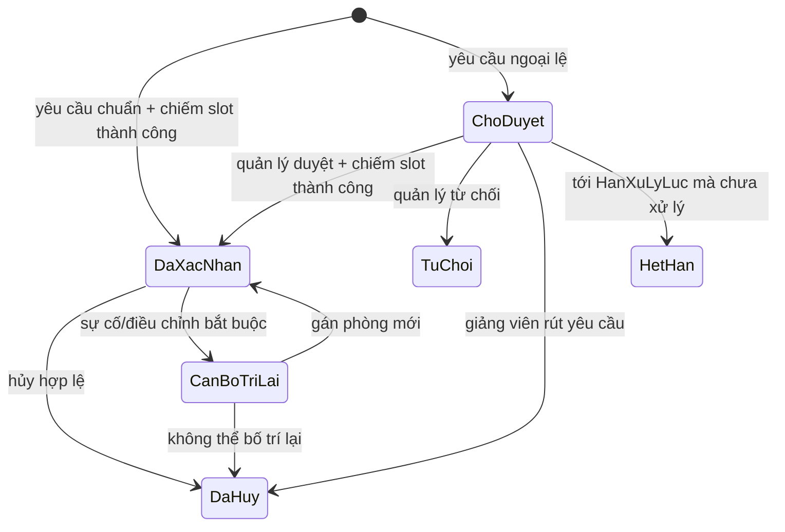
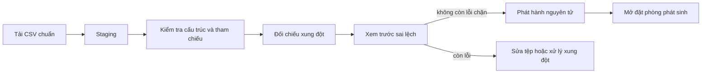

# HỆ THỐNG ĐĂNG KÝ VÀ QUẢN LÝ SỬ DỤNG PHÒNG HỌC

## ĐẶC TẢ VÀ PHÂN TÍCH YÊU CẦU — v0.2

> Trạng thái: bản đặc tả nghiệp vụ đã chốt hướng cho MVP; các dữ kiện thực tế còn cần xác minh được liệt kê tại Mục 12.
>
> Phạm vi: mô hình thí điểm cho Khoa Công nghệ Thông tin và Khoa Ngôn ngữ Anh; quản lý lịch chiếm dụng phòng, lịch chính thức và nhu cầu dùng phòng phát sinh.
>
> Ngoài phạm vi MVP: tự sinh thời khóa biểu từ chương trình đào tạo, tự chọn ngày/tiết cho lớp học, email/SMS/Zalo, QR check-in, IoT khóa cửa và quy trình duyệt nhiều cấp.

# 1. MỤC TIÊU VÀ RANH GIỚI HỆ THỐNG

## 1.1. Bài toán cần giải quyết

Hệ thống cung cấp một nguồn dữ liệu thống nhất về việc phòng nào đang được sử dụng, cho phép giảng viên chủ động tìm phòng và giảm việc người quản lý phải duyệt thủ công mọi yêu cầu. Hệ thống phải đồng thời:

- bảo vệ lịch học, lịch thi và sự kiện chính thức;
- không cho hai nguồn cùng chiếm một phòng tại cùng một ngày và tiết;
- tự xác nhận yêu cầu thông thường nếu thỏa toàn bộ chính sách;
- chuyển yêu cầu ngoại lệ cho người quản lý quyết định;
- lưu được người thực hiện, lý do và lịch sử thay đổi;
- không công bố một phòng là “trống” nếu dữ liệu chiếm dụng của phòng đó chưa đầy đủ.

## 1.2. Quyết định nghiệp vụ trung tâm: mô hình lai

Không chọn mô hình “mọi yêu cầu đều phải duyệt” vì tạo nút thắt ở người quản lý. Cũng không chọn mô hình “thấy phòng trống là xác nhận” vì phòng trống chỉ là một trong nhiều điều kiện về quyền sử dụng, sức chứa, thiết bị, thời hạn, mục đích và phạm vi đơn vị.

| Phương án | Kết luận | Lý do chính |
|---|---|---|
| Mọi booking đều chờ quản lý | Không chọn | tắc nghẽn, phụ thuộc con người, phản hồi chậm |
| Cứ trống phòng là xác nhận | Không đủ an toàn | bỏ qua quyền, mục đích, sức chứa, thiết bị, lịch nền và dữ liệu thiếu |
| Tự xác nhận theo policy + duyệt ngoại lệ | **Chọn cho MVP** | giảm tải nhưng vẫn giữ kiểm soát ở case rủi ro |
| Mỗi giảng viên import rồi FCFS xếp lịch | Để ngoài MVP | đây là bài toán xếp thời khóa biểu/room assignment; FCFS không bảo đảm nghiệm tốt |

MVP sử dụng mô hình lai:

1. **Yêu cầu chuẩn**: hệ thống kiểm tra chính sách và chiếm slot trong cùng một giao dịch. Thành công thì phiếu đi thẳng tới `DaXacNhan`.
2. **Yêu cầu ngoại lệ**: phiếu ở `ChoDuyet`; người quản lý xem lý do và quyết định. Phiếu chờ **không giữ chỗ**. Khi duyệt, hệ thống kiểm tra lại và chiếm slot nguyên tử.
3. **Lịch chính thức**: chỉ nguồn có thẩm quyền được kiểm tra và phát hành. Giảng viên không được nhập dữ liệu trực tiếp để tự nhận phòng dưới danh nghĩa “lịch chính thức”.

Vai trò người quản lý vì vậy chuyển từ “duyệt từng lượt đặt” sang “quản trị chính sách, dữ liệu chính thức và xử lý ngoại lệ”.

## 1.3. Phạm vi tổ chức

Thí điểm chỉ quản lý đầy đủ dữ liệu đào tạo của:

- Khoa Công nghệ Thông tin, gồm ba ngành/chương trình: Công nghệ thông tin, Khoa học máy tính, Hệ thống thông tin quản lý;
- Khoa Ngôn ngữ Anh, gồm ngành/chương trình Ngôn ngữ Anh;
- các khóa tuyển sinh `K65`, `K66`, `K67`, `K68`.

`K65`–`K68` là **khóa tuyển sinh**, không phải “năm 1–4” cố định. Quan hệ K65 = năm 4, K66 = năm 3, K67 = năm 2, K68 = năm 1 chỉ có ý nghĩa tại một năm học/học kỳ cụ thể và không được hard-code vĩnh viễn.

## 1.4. Phạm vi kho phòng và nguyên tắc bao phủ dữ liệu

Dữ kiện ban đầu gồm tám giảng đường `G1`–`G8` và một tòa dùng cho thực hành/tiếng Anh, đồng thời có văn phòng khoa. Chưa đủ thông tin để kết luận `G1`–`G8` là tám tòa hay tám phòng độc lập.

Hệ thống phân biệt:

- **Tòa/khu vực**: vị trí vật lý;
- **Phòng**: không gian có thể xếp lịch;
- **đơn vị quản lý phòng**: không nhất thiết là khoa của người sử dụng;
- **mức bao phủ lịch theo phòng và học kỳ/khoảng ngày**: `DayDu`, `ChuaDayDu` hoặc `CanXacNhanLai`; chỉ `DayDu` cho phép availability/booking.

Chỉ phòng có danh mục vật lý và bản ghi bao phủ `DayDu` tại **đúng ngày đang tra cứu** mới được trả về là phòng trống. Không được dùng một cờ “đầy đủ” vĩnh viễn ở cấp phòng. Nếu `G1`–`G8` là tài sản dùng chung toàn trường nhưng hệ thống chỉ biết lịch của hai khoa, phải nhập thêm busy-slot có `PhamViNguon=NgoaiPhamVi`. Nếu không có dữ liệu đó, phòng dùng chung không được bật tự động đặt.

Thiếu coverage là điều kiện chặn, không phải ngoại lệ để người quản lý duyệt vượt. Hệ thống có thể ghi nhận nhu cầu ở một module tương lai, nhưng MVP không tạo hoặc duyệt booking cho phòng/ngày chưa được xác nhận bao phủ.

Văn phòng trong tòa không tham gia tìm/xếp phòng trừ khi được khai báo rõ là không gian dạy học có thể đặt.

## 1.5. Nguồn dữ liệu và mức thẩm quyền

| Nguồn | Ý nghĩa | Có trực tiếp chiếm phòng? | Chủ thể phát hành |
|---|---|---:|---|
| Lịch chính thức | Lịch học, thi, sự kiện đã được chốt | Có | Người quản lý lịch/phòng trong phạm vi MVP |
| Lịch ngoài phạm vi | Busy-slot tối thiểu của đơn vị khác | Có; chỉ đọc đối với giảng viên và quy trình booking nội bộ | Steward của nguồn bên ngoài |
| Đặt phòng phát sinh | Dạy bù, hướng dẫn, seminar, hoạt động hợp lệ | Có khi `DaXacNhan` | Hệ thống hoặc người quản lý |
| Khóa phòng | Bảo trì, sự cố, đóng phòng | Có | Người quản lý phòng |
| Chương trình đào tạo PDF | Danh mục/khung học phần | Không | Tài liệu đào tạo |
| Nhu cầu giảng dạy | Đầu vào cho bài toán xếp lịch tương lai | Không trong MVP | Đơn vị đào tạo/giảng viên đề xuất |

Bốn tệp `qldtCnttChuan.pdf`, `qldtHtttql.pdf`, `qldtKhmt.pdf`, `qldtNna.pdf` chỉ có thể hỗ trợ tạo danh mục chương trình và học phần. Chúng không đủ để sinh thời khóa biểu hoặc phân phòng vì còn thiếu lớp học phần, sĩ số, phân công giảng viên, tuần học, loại buổi, thời gian rảnh, ngày nghỉ và yêu cầu phòng.

## 1.6. Thuật ngữ

| Thuật ngữ | Nghĩa trong tài liệu |
|---|---|
| Slot | một tài nguyên tại một ngày và một tiết |
| Occurrence | một buổi lịch cụ thể vào một ngày, không phải mẫu lặp |
| Batch/snapshot | toàn bộ ảnh chụp lịch của một `NguonLich` trong một học kỳ |
| Staging | vùng kiểm tra trước publish, chưa chiếm tài nguyên |
| Coverage | bằng chứng dữ liệu occupancy của một phòng/khoảng ngày đã đủ |
| Scope | phạm vi đơn vị/tòa/phòng/nguồn mà actor được thao tác |
| Policy | bộ quy tắc có version dùng phân loại auto/manual/reject |
| Báo không sử dụng | tên nghiệp vụ/UI của entity kỹ thuật `YeuCauGiaiPhongLich` |

# 2. MÔ HÌNH THỜI GIAN

## 2.1. Nguyên tắc

- Người dùng đặt theo **tiết**, không nhập giờ tùy ý.
- Một yêu cầu chỉ gồm các tiết liên tiếp trong cùng một buổi. MVP không hỗ trợ khoảng cắt qua hai buổi; người dùng phải tách thành các phiếu riêng.
- Xung đột được xác định theo `(Phòng, Ngày, Tiết)`; không dựa vào so sánh chuỗi giờ.
- Danh mục tiết phải có phiên bản/ngày hiệu lực để đổi lịch chuông mà không làm sai lịch sử.
- Thời gian nghiệp vụ dùng múi giờ `Asia/Ho_Chi_Minh`; mọi instant/audit timestamp lưu UTC và chuyển đổi khi hiển thị.

## 2.2. Hồ sơ lịch chuông tạm thời

Bảng người dùng cung cấp hiện có 13 tiết:

| Tiết | Khoảng hiển thị/chiếm dụng tạm thời | Buổi | Ghi chú nguồn |
|---:|---|---|---|
| 1 | 07:00–07:50 | Sáng | có chuyển tiết |
| 2 | 07:50–08:40 | Sáng | có chuyển tiết |
| 3 | 08:40–09:50 | Sáng | nguồn ghi nghỉ dài sau tiết 3 |
| 4 | 09:50–10:40 | Sáng | có chuyển tiết |
| 5 | 10:40–11:30 | Sáng | hết buổi sáng |
| 6 | 13:00–13:50 | Chiều | có chuyển tiết |
| 7 | 13:50–14:40 | Chiều | có chuyển tiết |
| 8 | 14:40–15:50 | Chiều | nguồn ghi nghỉ dài sau tiết 8 |
| 9 | 15:50–16:40 | Chiều | có chuyển tiết |
| 10 | 16:40–17:30 | Chiều | hết buổi chiều |
| 11 | 18:30–19:20 | Tối | có chuyển tiết |
| 12 | 19:20–20:10 | Tối | có chuyển tiết |
| 13 | 20:10–21:00 | Tối | hết buổi tối |

Các dữ kiện “14 tiết/ngày”, “mỗi tiết học 45 phút”, “nghỉ 15 phút sau tiết 3 và tiết 8” không khớp bảng trên: bảng chỉ có 13 tiết; đa số khoảng dài 50 phút; tiết 3 và 8 dài 70 phút. Trong MVP, hệ thống dùng số thứ tự tiết làm đơn vị xung đột và coi bảng trên là **khoảng chiếm dụng tạm thời**, chưa diễn giải là giờ dạy thực. Không tạo tiết 14 giả định. Trước khi seed chính thức phải xác nhận lại ba dữ kiện này.

# 3. TÁC NHÂN VÀ PHÂN QUYỀN

## 3.1. Giảng viên

- xem lịch và tìm phòng trong phạm vi được phép;
- tạo yêu cầu đặt phòng;
- nhận xác nhận tự động hoặc theo dõi yêu cầu ngoại lệ;
- xem/hủy phiếu của mình theo chính sách;
- báo không sử dụng một buổi thuộc lịch chính thức mà mình được phân công;
- xem thông báo.

## 3.2. Người quản lý phòng/lịch

Trong MVP, vai trò này chủ đích gộp nhiệm vụ đầu mối lịch và cơ sở vật chất:

- import, kiểm tra và phát hành lịch chính thức;
- xử lý yêu cầu ngoại lệ;
- xác nhận yêu cầu trả phòng của lịch chính thức;
- khóa/mở khóa phòng và xử lý sự cố;
- quản lý chính sách sử dụng theo đơn vị/phòng;
- xem lịch tổng hợp và báo cáo.

Nếu triển khai thật, có thể tách thành `QuanLyLich`, `NguoiDuyet` và `CoSoVatChat` mà không đổi dữ liệu lõi.

## 3.3. Quản trị hệ thống

- quản lý tài khoản, vai trò, đơn vị;
- quản lý danh mục tòa/phòng/thiết bị;
- cấu hình danh mục tiết và chính sách;
- xem audit log và báo cáo tổng hợp.

## 3.4. Quyền theo phạm vi

Quyền không chỉ dựa vào role. Mọi thao tác còn phải kiểm tra:

- đơn vị của người dùng;
- đơn vị quản lý và chính sách truy cập của phòng;
- phạm vi quản lý được gán cho người quản lý;
- mức bao phủ dữ liệu của phòng;
- trạng thái tài khoản, phòng và học kỳ.

Một tài khoản có thể đồng thời mang nhiều role, ví dụ vừa `GiangVien` vừa `QuanLyPhongLich`. Quyền là hợp của các role nhưng mọi action quản lý vẫn bị giới hạn bởi scope; role quản lý không làm mất ownership/quyền giảng viên của cùng tài khoản.

Quyền kiểm tra/phát hành/rollback theo nguồn lịch đến từ assignment `NguonLichSteward`, không phải cứ có role quản lý là được thao tác mọi feed. Tài khoản steward vẫn phải có role nghiệp vụ phù hợp và assignment còn hiệu lực trên đúng nguồn.

# 4. CHÍNH SÁCH ĐẶT PHÒNG LAI

## 4.1. Điều kiện để tự xác nhận

Một yêu cầu chỉ được xử lý `TuDong` khi **tất cả** điều kiện sau đúng:

1. người gửi là giảng viên đang hoạt động và thuộc phạm vi thí điểm;
2. học kỳ/phạm vi ngày đã phát hành lịch nền và đang mở đặt phòng;
3. ngày không ở quá khứ, nằm trong giới hạn đặt trước được cấu hình;
4. các tiết liên tiếp, cùng buổi và trong giờ hoạt động;
5. mục đích thuộc danh mục chuẩn được cho phép tự động;
6. phòng là phòng dùng chung/phòng thường, đang hoạt động, có dữ liệu bao phủ đầy đủ cho ngày yêu cầu và cho phép đơn vị đó sử dụng;
7. số người không vượt sức chứa; thiết bị khả dụng đáp ứng yêu cầu;
8. thời lượng và số phiếu đang hoạt động không vượt hạn mức, đồng thời đáp ứng thời gian báo trước tối thiểu;
9. giảng viên và lớp học phần (nếu có) không có lịch chính thức hoặc booking đã xác nhận khác trùng thời gian;
10. không tồn tại slot phòng do lịch chính thức, lịch ngoài phạm vi, booking khác hoặc khóa phòng chiếm.

Việc “dạy bù” chỉ được tự động nếu chính sách đơn vị cho phép và phiếu tham chiếu lớp học phần/đợt điều chỉnh hợp lệ. Nếu cần đánh giá lý do hoặc chưa đủ dữ liệu đối chiếu, yêu cầu đi theo ngoại lệ.

## 4.2. Các trường hợp ngoại lệ tối thiểu

- phòng chuyên dụng, phòng hạn chế hoặc tài sản do đơn vị khác quản lý;
- yêu cầu liên khoa/ngoài phạm vi quyền thông thường;
- ngoài khung tự động nhưng vẫn tương ứng với các `KhungTiet` hợp lệ trong một buổi;
- gửi quá sát giờ, vượt thời lượng hoặc hạn mức;
- sự kiện, kỳ thi, hoạt động đông người hoặc yêu cầu thiết bị đặc biệt;
- dạy bù/đổi phòng cần xác minh nhưng không có tham chiếu hợp lệ;

Nhiều ngày, lặp định kỳ, tiết cắt qua hai buổi hoặc giờ không có trong danh mục là `UNSUPPORTED` trong MVP, không phải ngoại lệ có thể duyệt. Người dùng phải tách thành từng phiếu hợp lệ. Xung đột hoặc thay đổi lịch đã xác nhận đi qua workflow hủy/giải phóng/bố trí lại riêng, không đi vào hàng chờ ngoại lệ thông thường.

Yêu cầu ngoại lệ có `LyDoCanDuyet`, `MucDoUuTien` và phiên bản chính sách đã phân loại nó.

## 4.3. Nguyên tắc ưu tiên và FCFS

- Lịch chính thức phải được phát hành trước khi mở đặt phát sinh. “Ưu tiên” không có nghĩa được âm thầm ghi đè booking đã xác nhận.
- Với các yêu cầu tự động cùng mức, unique-key arbitration tại CSDL chỉ cho một giao dịch chiếm đủ slot. Kết quả thường tương ứng giao dịch commit được trước nhưng **không cam kết FCFS công bằng theo thời điểm request đến**; nếu cần hàng đợi công bằng phải thiết kế queue riêng.
- Với hàng chờ ngoại lệ, giao diện sắp theo mức ưu tiên nghiệp vụ rồi thời điểm tiếp nhận. Người quản lý có thể quyết định khác thứ tự nhưng phải ghi lý do.
- Yêu cầu `ChoDuyet` không giữ chỗ. Giao diện phải cảnh báo điều này. Khi duyệt luôn kiểm tra lại; nếu phòng đã mất thì phiếu bị từ chối kèm các gợi ý để giảng viên tạo phiếu mới. Người quản lý không âm thầm đổi phòng trên phiếu chờ.
- Booking đã `DaXacNhan` không bị một yêu cầu đến sau cướp chỗ. Chỉ quy trình sự cố/điều chỉnh có audit mới được thay đổi nó.

## 4.4. Vòng đời phiếu đặt phòng



`DaQuaGio`/“đã kết thúc theo kế hoạch” là trạng thái hiển thị suy ra từ ngày/tiết, không lưu thành `HoanThanh` vì MVP chưa có check-in để biết phòng thực sự đã được dùng.

`HanXuLyLuc` được snapshot khi tạo phiếu theo policy (không muộn hơn thời điểm bắt đầu), nên policy đổi sau đó không làm deadline của phiếu cũ trôi theo.

## 4.5. Hủy phiếu

- `ChoDuyet`: giảng viên được rút; không có slot để giải phóng.
- `DaXacNhan`: được hủy trước thời điểm bắt đầu và phải ghi lý do; cập nhật phiếu và xóa slot trong cùng transaction.
- Sau thời điểm bắt đầu: API hủy thông thường từ chối; chỉ quy trình sự cố khẩn đã đặc tả được phép can thiệp và phải có audit.
- `TuChoi`, `DaHuy`, `HetHan`: trạng thái kết thúc.
- Không sửa trực tiếp phòng/ngày/tiết của phiếu đã gửi; hủy và tạo mới hoặc dùng quy trình bố trí lại.

# 5. LỊCH CHÍNH THỨC VÀ THAY ĐỔI BUỔI HỌC

## 5.1. Quy trình phát hành lịch chính thức



- Upload và kiểm tra không làm thay đổi lịch đang dùng.
- Chỉ phát hành khi toàn bộ file qua các lỗi chặn.
- Phát hành là all-or-nothing theo batch: lịch và slot cùng thành công hoặc cùng rollback.
- Không `DELETE` lịch đã phát hành. Sửa bằng batch thay thế có preview diff và audit.
- Import lại cùng nội dung phải idempotent, không sinh bản ghi trùng.
- Phát hành một tệp không tự động chứng minh dữ liệu phòng đã đầy đủ. Người quản lý phải xác nhận rõ phạm vi phòng/ngày và các nguồn nội bộ/ngoài phạm vi đã đủ; khi đó hệ thống mới tạo coverage `DayDu` cho phạm vi đó.
- Thay đổi danh sách/trạng thái/phạm vi nguồn được coi là bắt buộc, hoặc kích hoạt lại một phòng, làm coverage liên quan về `CanXacNhanLai`; không tái sử dụng xác nhận cũ một cách ngầm định.
- Trong MVP, mỗi batch là **full snapshot của một nguồn lịch trong một học kỳ**. Lần đầu dùng chế độ `Moi`; các lần sửa thay thế toàn bộ snapshot đang active của cùng nguồn/học kỳ. Không hỗ trợ patch một vài dòng ngầm định.
- `NguonLich` là feed/đầu mối cung cấp và có thể tổng hợp nhiều đơn vị; `MaDonVi` trên từng dòng là đơn vị sở hữu hoạt động, không bắt buộc trùng mã feed.

## 5.2. Giảng viên báo không sử dụng buổi chính thức

Mỗi occurrence `LichHoc` nội bộ đủ điều kiện dùng workflow này có đúng một `GiangVienPhuTrach`. Chỉ giảng viên phụ trách occurrence đó (hoặc người quản lý đúng scope) được báo không sử dụng; việc chỉ cùng nằm trong danh sách đồng giảng của lớp là chưa đủ. Lịch thi, sự kiện và busy-slot ngoài phạm vi không có giảng viên phụ trách thì không hiển thị action này. Hệ thống tạo yêu cầu `BaoKhongSuDung`, không xóa lịch gốc. Trong MVP, người quản lý xác nhận vì hành động này làm phòng trở thành tài nguyên có thể đặt lại.

Khi xác nhận:

1. khóa occurrence lịch liên quan;
2. chuyển occurrence sang `DaGiaiPhong` và lưu lý do/người/thời gian;
3. xóa slot tương ứng trong cùng transaction;
4. tạo thông báo và audit.

Nếu sau đó muốn khôi phục, phải kiểm tra slot lại; không được tự động lấy lại phòng đã cấp cho người khác.

## 5.3. Không cho giảng viên tự import “lịch chính thức”

Tệp cá nhân của giảng viên có thể là dữ liệu đề xuất hoặc thời gian bận trong giai đoạn mở rộng, nhưng không phải nguồn sự thật để chiếm phòng. Lý do:

- thiếu kiểm chứng phân công giảng dạy;
- dễ lặp/trùng giữa giảng viên đồng giảng;
- không chứa đủ dữ liệu lớp, sĩ số, thiết bị và học kỳ;
- thứ tự nộp không phản ánh ưu tiên đào tạo;
- thuật toán tham lam FCFS có thể dùng hết phòng linh hoạt và làm các lớp cần phòng chuyên dụng không còn nghiệm.

# 6. KHÓA PHÒNG VÀ SỰ CỐ

## 6.1. Khóa có kế hoạch

Nếu khoảng cần khóa đang có slot, hệ thống từ chối tạo khóa. Người quản lý phải di chuyển/hủy các lịch liên quan trước, sau đó mới kích hoạt khóa. MVP không cho hai bản ghi khóa phòng đang hoạt động chồng cùng phòng/ngày/tiết; phải kết thúc hoặc sửa phạm vi bản ghi hiện có qua quy trình preview riêng.

## 6.2. Sự cố khẩn cấp

Sự cố vật lý có thể làm phòng không an toàn dù đang có lịch. Luồng khẩn cấp phải:

1. hiển thị toàn bộ lịch/booking bị ảnh hưởng;
2. tạo bản ghi sự cố với mức độ, lý do và người thực hiện;
3. trong transaction, với các source chưa bắt đầu, giải phóng **room slot** cũ nhưng giữ lecturer/class slot, chuyển booking phát sinh sang `CanBoTriLai`, đánh dấu occurrence chính thức cần xử lý và chiếm room slot khóa phòng;
4. gửi thông báo cho giảng viên/người quản lý liên quan;
5. cho phép gán phòng thay thế bằng kiểm tra nguyên tử;
6. lưu đầy đủ audit trước/sau.

Không âm thầm hủy booking và không ghi đè trực tiếp một slot đã tồn tại. MVP không viết lại occurrence/booking đã bắt đầu: nếu sự cố xảy ra giữa buổi, hệ thống ghi nhận/notify và chuyển phòng sang `TamNgung` ngay, còn slot khóa có hiệu lực từ ranh giới sau khi source đang chạy kết thúc; sơ tán tức thời thuộc quy trình vận hành tại chỗ. Nếu khoảng đã có một khóa phòng active, phải cập nhật/kết thúc bản ghi đó qua preview, không tạo closure chồng lồng nhau.

# 7. HỢP ĐỒNG CSV LỊCH CHÍNH THỨC v1

## 7.1. Quy tắc tệp

- tên mẫu: `lich_chinh_thuc_v1.csv`;
- mã hóa UTF-8, chấp nhận BOM;
- dấu phân cách: dấu phẩy `,`;
- quy tắc quote theo RFC 4180; giá trị có dấu phẩy/xuống dòng phải đặt trong dấu `"`;
- chấp nhận xuống dòng CRLF hoặc LF; không chấp nhận tự đổi sang delimiter `;`;
- dòng đầu là header đúng tên và đúng thứ tự;
- ô rỗng biểu thị thiếu dữ liệu; chuỗi `NULL` không có nghĩa đặc biệt;
- mã có khoảng trắng đầu/cuối bị báo lỗi thay vì được âm thầm sửa;
- một dòng tương ứng **một occurrence vào một ngày cụ thể**; không diễn giải lặp theo tuần;
- người upload chọn `NguonLich` và học kỳ trước; mọi dòng phải có cùng `NamHoc/HocKy` khớp metadata batch, còn `MaDonVi` có thể khác với feed tổng hợp;
- ngày theo ISO `YYYY-MM-DD`;
- dòng trống được bỏ qua; không cho cột lạ;
- hard guard tạm thời cho upload: tối đa 10 MiB và 50.000 dòng; đây chưa phải năng lực publish đã benchmark và phải hạ theo tải thử nghiệm của MVP;
- tệp lịch lặp/nhu cầu chưa có phòng phải dùng schema khác trong giai đoạn mở rộng.

## 7.2. Header bắt buộc

```text
SchemaVersion,MaDongNguon,NamHoc,HocKy,Ngay,MaPhong,TietBatDau,TietKetThuc,PhamViNguon,LoaiHoatDong,MaDonVi,MaDoiTuongDaoTao,MaKhoaHoc,MaHocPhan,TenHoatDong,MaLopHocPhan,MaGiangVienPhuTrach,SiSo,LoaiBuoi,MaHoSoPhong,GhiChu
```

Ví dụ cú pháp minh họa (toàn bộ mã có prefix `DEMO_`, không phải dữ liệu thật):

```csv
1,DEMO_0001,2026-2027,1,2026-10-05,DEMO_P01,1,3,NoiBo,LichHoc,DEMO_CNTT,DEMO_DTDT,K68,DEMO_HP,"Học phần minh họa",DEMO_LHP,DEMO_GV,40,LyThuyet,DEMO_HS_PHONG,"Dữ liệu minh họa"
```

## 7.3. Từ điển cột

| Cột | Bắt buộc | Định dạng/quy tắc |
|---|---:|---|
| `SchemaVersion` | Có | Luôn là `1` |
| `MaDongNguon` | Có | Mã ổn định, duy nhất trong `NguonLich` + học kỳ của snapshot active; dùng nhận diện occurrence xuyên các lần thay thế |
| `NamHoc` | Có | `YYYY-YYYY`, ví dụ `2026-2027` |
| `HocKy` | Có | `1`, `2` hoặc `He` |
| `Ngay` | Có | `YYYY-MM-DD`, nằm trong học kỳ |
| `MaPhong` | Có | Phải tồn tại, hoạt động và cho phép nguồn lịch sử dụng; import lịch nền không yêu cầu coverage có sẵn |
| `TietBatDau` | Có | Số thứ tự tiết trong phiên bản lịch chuông có hiệu lực |
| `TietKetThuc` | Có | Không nhỏ hơn tiết bắt đầu, cùng buổi |
| `PhamViNguon` | Có | `NoiBo` hoặc `NgoaiPhamVi`; đây là provenance, không phải loại hoạt động |
| `LoaiHoatDong` | Có | `LichHoc`, `LichThi`, `SuKien`; `KhongRo` chỉ được dùng với nguồn ngoài phạm vi |
| `MaDonVi` | Có | Mã đơn vị sở hữu hoạt động; một feed tổng hợp có thể chứa nhiều mã đơn vị |
| `MaDoiTuongDaoTao` | Điều kiện | Mã trung lập cho ngành/chuyên ngành/chương trình chính; lớp ghép lấy đầy đủ đối tượng từ catalog lớp |
| `MaKhoaHoc` | Điều kiện | `K65`–`K68` cho đối tượng chính; để trống cho sự kiện không gắn khóa |
| `MaHocPhan` | Điều kiện | Bắt buộc cho `LichHoc`/`LichThi`; nếu có `MaLopHocPhan` thì phải khớp catalog lớp |
| `TenHoatDong` | Có | Tên học phần/kỳ thi/sự kiện, tối đa 200 ký tự |
| `MaLopHocPhan` | Điều kiện | Bắt buộc cho `LichHoc`; là nguồn authoritative để đối chiếu học phần/ngành/khóa; mismatch là lỗi chặn |
| `MaGiangVienPhuTrach` | Điều kiện | Bắt buộc với lịch học; đúng một người phụ trách occurrence và phải thuộc phân công lớp |
| `SiSo` | Điều kiện | Bắt buộc với nguồn nội bộ `LichHoc`/`LichThi`/`SuKien`; không vượt sức chứa. Nguồn ngoài phạm vi có thể để trống và bỏ kiểm tra capacity |
| `LoaiBuoi` | Có | Nguồn nội bộ: `LyThuyet`, `ThucHanh`, `NgoaiNgu`, `Thi`, `SuKien`; nguồn ngoài có thể `KhongRo` |
| `MaHoSoPhong` | Điều kiện | Mã profile yêu cầu loại phòng/thiết bị; bắt buộc nếu hoạt động cần tài nguyên chuyên dụng |
| `GhiChu` | Không | Tối đa 500 ký tự |

Ma trận bắt buộc theo loại dòng (các cột không nêu vẫn tuân quy tắc chung ở trên):

| `PhamViNguon` + `LoaiHoatDong` | `MaDoiTuongDaoTao` | `MaKhoaHoc` | `MaHocPhan` | `MaLopHocPhan` | `MaGiangVienPhuTrach` | `SiSo` | `LoaiBuoi` |
|---|---:|---:|---:|---:|---:|---:|---:|
| `NoiBo` + `LichHoc` | Bắt buộc | Bắt buộc | Bắt buộc | Bắt buộc | Bắt buộc | Bắt buộc | Bắt buộc |
| `NoiBo` + `LichThi` | Bắt buộc | Bắt buộc | Bắt buộc | Không | Không | Bắt buộc | Bắt buộc (`Thi`) |
| `NoiBo` + `SuKien` | Không | Không | Không | Không | Không | Bắt buộc | Bắt buộc (`SuKien`) |
| `NgoaiPhamVi` + loại hợp lệ | Không | Không | Không | Không | Không | Không | Bắt buộc; được dùng `KhongRo` |

Với `NoiBo + LichHoc`, `MaDoiTuongDaoTao` và `MaKhoaHoc` là đối tượng chính để trao đổi dữ liệu; catalog `LopHocPhanDoiTuong` vẫn là nguồn đầy đủ cho lớp ghép. Hai giá trị phải khớp một dòng đối tượng của lớp. Với `LichThi` không gắn lớp, hai mã được lưu trực tiếp trên occurrence để không mất ngữ nghĩa sau publish.

Quan hệ `LoaiHoatDong`–`LoaiBuoi` của nguồn nội bộ cũng là lỗi chặn: `LichHoc` chỉ nhận `LyThuyet|ThucHanh|NgoaiNgu`, `LichThi` nhận `Thi`, và `SuKien` nhận `SuKien`.

## 7.4. Lỗi và kết quả kiểm tra

Mỗi lỗi phải có:

```text
SoDong,TenCot,MaLoi,GiaTri,ThongDiep
```

Nhóm lỗi chặn gồm: sai header/schema, sai định dạng, mã tham chiếu không tồn tại, trùng `MaDongNguon`, trùng phòng, trùng lịch giảng viên/lớp, sai sức chứa/loại phòng, ngày ngoài học kỳ và xung đột với slot đang phát hành.

Preview trả tổng dòng hợp lệ, lỗi, cảnh báo, slot thêm/xóa/thay đổi và booking bị ảnh hưởng. Cảnh báo không chặn phải được người phát hành xác nhận rõ.

# 8. DANH SÁCH YÊU CẦU CHỨC NĂNG

## 8.1. Giảng viên

| Mã | Chức năng | Kết quả chính |
|---|---|---|
| GV-01 | Tra cứu phòng trống | Chỉ trả phòng hợp lệ và có dữ liệu bao phủ đầy đủ |
| GV-02 | Tạo yêu cầu đặt phòng | Tự xác nhận hoặc phân loại ngoại lệ |
| GV-03 | Xem phiếu của tôi | Thấy trạng thái, nguồn xác nhận, lý do và lịch sử |
| GV-04 | Hủy/rút phiếu | Giải phóng slot nguyên tử nếu đã xác nhận |
| GV-05 | Báo không sử dụng buổi chính thức | Tạo yêu cầu gắn đúng occurrence |
| GV-06 | Xem thông báo | Chỉ xem thông báo của tài khoản hiện tại |

## 8.2. Người quản lý phòng/lịch

| Mã | Chức năng | Kết quả chính |
|---|---|---|
| QL-01 | Xem lịch tổng hợp | Lịch chính thức, ngoài phạm vi, booking và khóa phòng |
| QL-02 | Xử lý ngoại lệ | Duyệt/từ chối có lý do, kiểm tra lại slot |
| QL-03 | Preview/phát hành CSV | Batch all-or-nothing, có lỗi theo dòng |
| QL-04 | Thay thế/rollback batch | Giữ lịch sử, preview tác động, không hard-delete |
| QL-05 | Xử lý báo không sử dụng | Giải phóng occurrence đúng thẩm quyền |
| QL-06 | Khóa/mở khóa phòng | Tách luồng kế hoạch và khẩn cấp |
| QL-07 | Bố trí lại sau sự cố | Gán phòng mới hoặc hủy có lý do |
| QL-08 | Xem báo cáo | Báo cáo sử dụng theo kế hoạch và SLA xử lý ngoại lệ |
| QL-09 | Quản lý nguồn lịch và coverage | Full snapshot theo feed/học kỳ; xác nhận/invalidate coverage có căn cứ |
| QL-10 | Quản lý reference đào tạo | Học kỳ, ngày hoạt động, học phần, lớp và phân công phục vụ validate |

## 8.3. Admin

| Mã | Chức năng | Kết quả chính |
|---|---|---|
| AD-01 | Quản lý đơn vị/tòa/phòng | Không xóa vật lý dữ liệu đã có lịch sử |
| AD-02 | Quản lý thiết bị | Số lượng tổng và số lượng khả dụng |
| AD-03 | Quản lý tài khoản/phạm vi | Role + scope, khóa/mở khóa |
| AD-04 | Quản lý lịch chuông/chính sách | Có phiên bản và ngày hiệu lực |
| AD-05 | Xem audit log | Không sửa/xóa từ giao diện |
| AD-06 | Quản lý catalog nghiệp vụ | Mục đích đặt, hồ sơ phòng/thiết bị và nguồn lịch theo đúng thẩm quyền |

# 9. BIỂU MẪU CHÍNH

## 9.1. Tra cứu và đặt phòng

Đầu vào: ngày, tiết bắt đầu/kết thúc, số người, mục đích có cấu trúc, lớp học phần/tham chiếu liên quan, loại phòng, thiết bị.

Kết quả tìm kiếm phải hiển thị: mã phòng, tòa, loại, sức chứa, thiết bị khả dụng, đơn vị quản lý và nhãn `Có thể tự xác nhận` hoặc `Cần duyệt ngoại lệ`.

Trước khi gửi, giao diện hiển thị kết quả phân loại và lý do. Sau khi gửi:

- `DaXacNhan`: cung cấp mã phiếu ngay;
- `ChoDuyet`: cảnh báo rõ “yêu cầu chưa giữ phòng”.

## 9.2. Hàng chờ ngoại lệ

| Mã phiếu | Giảng viên/đơn vị | Phòng/ngày/tiết | Mục đích | Lý do ngoại lệ | Mức ưu tiên | Trạng thái phòng hiện tại |
|---|---|---|---|---|---:|---|

Từ chối, quyết định khác thứ tự gợi ý hoặc hủy hành chính đều bắt buộc lý do.

## 9.3. Import lịch

Màn hình gồm ba bước: chọn tệp → preview lỗi/diff/xung đột → xác nhận phát hành. Không có nút phát hành nếu còn lỗi chặn. Cho phép tải báo cáo lỗi CSV.

## 9.4. Báo cáo

- tỷ lệ chiếm dụng theo kế hoạch = số slot đã chiếm / số slot có thể vận hành trong phạm vi lọc;
- view mặc định loại trừ ngày nghỉ, ngoài lịch chuông và slot khóa phòng khỏi mẫu số; view công suất gộp (nếu có) giữ mẫu số gốc nhưng báo khóa phòng thành chỉ số “không khả dụng” riêng, không cộng vào sử dụng;
- tách lịch chính thức, booking phát sinh, lịch ngoài phạm vi;
- không gọi là “sử dụng thực tế” khi chưa có check-in;
- theo dõi số yêu cầu tự xác nhận, ngoại lệ, thời gian xử lý và số lần bố trí lại.

# 10. YÊU CẦU PHI CHỨC NĂNG

| Nhóm | Yêu cầu chấp nhận |
|---|---|
| Toàn vẹn | Hai request đồng thời không thể cùng chiếm một phòng, giảng viên hoặc lớp tại cùng ngày/tiết; retry cùng idempotency key không nhân đôi mutation |
| Tính đúng | Phòng có dữ liệu không đầy đủ không bao giờ được quảng bá là trống |
| Hiệu năng | Mục tiêu tạm thời: tra cứu ≤ 2 giây, tạo/xác nhận/hủy ≤ 3 giây trên bộ dữ liệu và tải đồng thời phải được ghi lại trong kịch bản benchmark; chưa phải cam kết production |
| Bảo mật | Hash mật khẩu an toàn, prepared statement, CSRF, session an toàn, kiểm tra role + scope ở backend |
| Audit | Lưu actor, action, entity, correlation/batch, before/after, IP và thời điểm cho hành động quan trọng |
| Khả dụng | Lỗi một bước trong transaction không để lại phiếu/slot mồ côi |
| Riêng tư | Lịch cá nhân chỉ hiển thị chi tiết cho role/scope phù hợp; người không có quyền chi tiết chỉ thấy trạng thái bận nếu được phép tra cứu |
| Dễ dùng | Responsive; không chỉ dùng màu để biểu thị nguồn/trạng thái |
| Vận hành | Production dùng HTTPS, backup có thử phục hồi, log lỗi và giám sát; XAMPP chỉ dùng local/demo |
| Thời gian | Nghiệp vụ theo `Asia/Ho_Chi_Minh`; định dạng ngày/giờ nhất quán |

# 11. PHẠM VI MVP VÀ HƯỚNG MỞ RỘNG

## 11.1. MVP

- tài khoản, role + scope theo đơn vị;
- danh mục tòa/phòng/thiết bị và mức bao phủ dữ liệu;
- lịch chuông, học kỳ, ngày hoạt động/nghỉ theo phiên bản;
- reference tối thiểu: khóa, đối tượng đào tạo, học phần, lớp học phần và phân công;
- catalog mục đích, hồ sơ yêu cầu phòng và policy có version;
- quản lý nguồn lịch và xác nhận/invalidate coverage;
- import/preview/phát hành lịch chính thức CSV v1;
- nhập busy-slot ngoài phạm vi cho phòng dùng chung;
- lịch tổng hợp và tra cứu phòng trống;
- đặt phòng lai: tự xác nhận + duyệt ngoại lệ;
- hủy, báo không sử dụng buổi chính thức;
- khóa phòng kế hoạch và sự cố khẩn;
- thông báo nội bộ, audit, báo cáo theo kế hoạch.

## 11.2. Giai đoạn mở rộng: xếp phòng hàng loạt

Nếu muốn hệ thống nhận lịch của nhiều giảng viên rồi xếp phòng, đầu vào phải được gọi là `NhuCauGiangDay`, chưa phải `LichChinhThuc`. Nên giới hạn bước đầu ở bài toán **đã có ngày/tiết, chỉ thiếu phòng**.

Ràng buộc cứng tối thiểu:

- phòng, giảng viên và lớp không trùng;
- đủ sức chứa, loại phòng, thiết bị;
- phòng hoạt động và thuộc phạm vi được dùng;
- tôn trọng ngày nghỉ, tuần học và lịch đã khóa.

Mục tiêu mềm có thể gồm giảm đổi tòa, giảm khoảng trống, ưu tiên phòng của đơn vị và sử dụng phòng hiệu quả. Thuật toán nên dùng constraint programming/matching; FCFS chỉ là tie-break cuối cùng, không phải thuật toán chính. Mỗi lần chạy phải có snapshot đầu vào, phiên bản thuật toán, danh sách không xếp được, bước review và thao tác publish của người có thẩm quyền.

Giảng viên có thể gửi thời gian bận/nhu cầu vào staging; không được chiếm phòng trực tiếp.

# 12. DỮ KIỆN CẦN XÁC MINH TRƯỚC KHI SEED DỮ LIỆU

Các điểm dưới đây không làm thay đổi hướng kiến trúc nhưng chặn việc tạo dữ liệu thật:

1. Trường có 13 hay 14 tiết; giờ dạy thực của từng tiết và thời lượng nghỉ chính xác.
2. `G1`–`G8` là mã tòa/giảng đường hay mã tám phòng độc lập.
3. Danh mục phòng, mã chính thức, sức chứa, loại phòng, thiết bị, đơn vị quản lý của `G1`–`G8` và tòa thực hành/tiếng Anh.
4. Đơn vị nào có thẩm quyền phát hành CSV lịch chính thức và phạm vi quản lý của từng tài khoản.
5. Cần cung cấp bốn PDF chương trình đào tạo để trích đúng mã/tên học phần và metadata “áp dụng cho/từ khóa nào”; bốn file chưa chắc đã đủ mọi version của K65–K68 và hiện chưa có trong workspace.
6. CNTT/KHMT/HTTTQL là ngành, chuyên ngành hay chương trình/track; cần mã chính thức trước khi chọn loại entity để seed.
7. Nếu dùng phòng chung toàn trường, cần busy-slot tối thiểu của đơn vị ngoài hai khoa và định danh feed/steward cung cấp.

Mọi dữ liệu sinh khi các điều kiện liên quan chưa được xác minh phải gắn nhãn `DuLieuGiaLap`, không trình bày như dữ liệu chính thức của trường.
