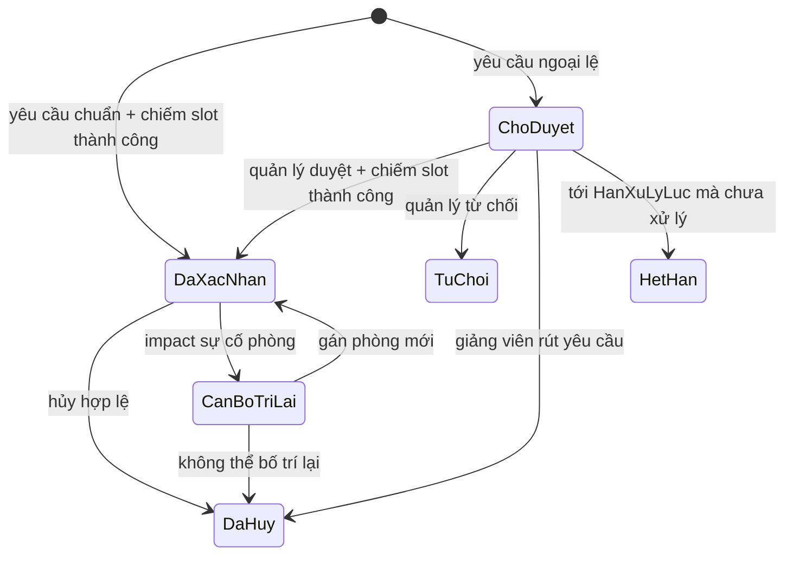
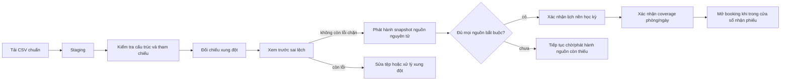

# HỆ THỐNG ĐĂNG KÝ VÀ QUẢN LÝ SỬ DỤNG PHÒNG HỌC

## ĐẶC TẢ VÀ PHÂN TÍCH YÊU CẦU — v0.3

> Trạng thái: bản đặc tả nghiệp vụ đã chốt hướng cho MVP; các dữ kiện thực tế còn cần xác minh được liệt kê tại Mục 12.
>
> Phạm vi: mô hình thí điểm cho Khoa Công nghệ Thông tin và Khoa Ngôn ngữ Anh; quản lý lịch chiếm dụng phòng, lịch chính thức và nhu cầu dùng phòng phát sinh.
>
> Ngoài phạm vi MVP: tự sinh thời khóa biểu từ chương trình đào tạo, tự chọn ngày/tiết cho lớp học, email/SMS/Zalo, QR check-in, IoT khóa cửa, mượn/điều phối thiết bị di động, quy trình duyệt nhiều cấp và tài khoản/đặt phòng cho sinh viên hoặc khách ngoài trường.

# 1. MỤC TIÊU VÀ RANH GIỚI HỆ THỐNG

## 1.1. Bài toán cần giải quyết

Hệ thống cung cấp một nguồn dữ liệu thống nhất về việc phòng nào đang được sử dụng, cho phép giảng viên chủ động tìm phòng và giảm việc người quản lý phải duyệt thủ công mọi yêu cầu. Hệ thống phải đồng thời:

- bảo vệ lịch học, lịch thi và sự kiện chính thức;
- không cho hai nguồn cùng chiếm một phòng tại cùng một ngày và tiết;
- tự xác nhận yêu cầu thông thường nếu thỏa toàn bộ chính sách;
- chuyển yêu cầu ngoại lệ cho người quản lý quyết định;
- lưu được người thực hiện, lý do và lịch sử thay đổi;
- không công bố một phòng là “trống” nếu dữ liệu chiếm dụng của phòng đó chưa đầy đủ.

## 1.2. Quyết định nghiệp vụ trung tâm: mô hình lai

Không chọn mô hình “mọi yêu cầu đều phải duyệt” vì tạo nút thắt ở người quản lý. Cũng không chọn mô hình “thấy phòng trống là xác nhận” vì phòng trống chỉ là một trong nhiều điều kiện về quyền sử dụng, sức chứa, thiết bị, thời hạn, mục đích và phạm vi đơn vị.

| Phương án | Kết luận | Lý do chính |
|---|---|---|
| Mọi booking đều chờ quản lý | Không chọn | tắc nghẽn, phụ thuộc con người, phản hồi chậm |
| Cứ trống phòng là xác nhận | Không đủ an toàn | bỏ qua quyền, mục đích, sức chứa, thiết bị, lịch nền và dữ liệu thiếu |
| Tự xác nhận theo policy + duyệt ngoại lệ | **Chọn cho MVP** | giảm tải nhưng vẫn giữ kiểm soát ở case rủi ro |
| Mỗi giảng viên import rồi FCFS xếp lịch | Để ngoài MVP | đây là bài toán xếp thời khóa biểu/room assignment; FCFS không bảo đảm nghiệm tốt |

MVP sử dụng mô hình lai:

1. **Yêu cầu chuẩn**: hệ thống kiểm tra chính sách và chiếm slot trong cùng một giao dịch. Thành công thì phiếu đi thẳng tới `DaXacNhan`.
2. **Yêu cầu ngoại lệ**: phiếu ở `ChoDuyet`; người quản lý xem lý do và quyết định. Phiếu chờ **không giữ chỗ**. Khi duyệt, hệ thống kiểm tra lại và chiếm slot nguyên tử.
3. **Lịch chính thức**: chỉ nguồn có thẩm quyền được kiểm tra và phát hành. Giảng viên không được nhập dữ liệu trực tiếp để tự nhận phòng dưới danh nghĩa “lịch chính thức”.

Vai trò người quản lý vì vậy chuyển từ “duyệt từng lượt đặt” sang “quản trị chính sách, dữ liệu chính thức và xử lý ngoại lệ”.

## 1.3. Phạm vi tổ chức

Thí điểm chỉ quản lý đầy đủ dữ liệu đào tạo của:

- Khoa Công nghệ Thông tin, gồm ba ngành/chương trình: Công nghệ thông tin, Khoa học máy tính, Hệ thống thông tin quản lý;
- Khoa Ngôn ngữ Anh, gồm ngành/chương trình Ngôn ngữ Anh;
- các khóa tuyển sinh `K65`, `K66`, `K67`, `K68`.

`K65`–`K68` là **khóa tuyển sinh**, không phải “năm 1–4” cố định. Quan hệ K65 = năm 4, K66 = năm 3, K67 = năm 2, K68 = năm 1 chỉ có ý nghĩa tại một năm học/học kỳ cụ thể và không được hard-code vĩnh viễn.

“Chỉ hai khoa” nghĩa là hệ thống chỉ quản lý đầy đủ catalog đào tạo, lớp, phân công và giảng viên đặt phòng của hai khoa này. Membership đơn vị đào tạo pilot phải là cấu hình typed, không được suy ra từ việc một dòng `DonVi` tồn tại. Nếu phòng dùng chung cần busy-slot của đơn vị khác, có thể tạo identity `DonVi` tối thiểu cho owner/provenance/allowlist; việc đó không kéo chương trình đào tạo, role giảng viên hoặc quyền đặt phòng của đơn vị ấy vào MVP. Tài khoản Admin/QL trung tâm có thể tồn tại theo scope được cấp, nhưng không nhờ vậy trở thành giảng viên pilot. Không tự đặt mã đơn vị ngoài pilot: feed phải cung cấp mã authoritative.

## 1.4. Phạm vi kho phòng và nguyên tắc bao phủ dữ liệu

Dữ kiện ban đầu gồm tám giảng đường `G1`–`G8` và một tòa dùng cho thực hành/tiếng Anh, đồng thời có văn phòng khoa. Chưa đủ thông tin để kết luận `G1`–`G8` là tám tòa hay tám phòng độc lập.

Hệ thống phân biệt:

- **Tòa/khu vực**: vị trí vật lý;
- **Phòng**: không gian có thể xếp lịch;
- **đơn vị quản lý phòng**: không nhất thiết là khoa của người sử dụng;
- **mức bao phủ lịch theo phòng và học kỳ/khoảng ngày**: `DayDu`, `ChuaDayDu` hoặc `CanXacNhanLai`; chỉ `DayDu` cho phép availability/booking.

Chỉ phòng có danh mục vật lý và bản ghi bao phủ `DayDu` tại **đúng ngày đang tra cứu** mới được trả về là phòng trống. Không được dùng một cờ “đầy đủ” vĩnh viễn ở cấp phòng. Nếu `G1`–`G8` là tài sản dùng chung toàn trường nhưng hệ thống chỉ biết lịch của hai khoa, phải nhập thêm busy-slot có `PhamViNguon=NgoaiPhamVi`. Nếu không có dữ liệu đó, phòng dùng chung không được bật tự động đặt.

Một khoảng coverage chỉ được gắn với **một tập nguồn bắt buộc không đổi**. Vì activation dùng khoảng ngày bao gồm hai đầu `TuNgay..DenNgay`, khi khoảng xác nhận cắt qua activation của bất kỳ nguồn nào, hệ thống phải tự chia tại `TuNgay` và ngày kế tiếp `DenNgay`; không được dùng một tập batch căn cứ duy nhất cho các ngày vốn kỳ vọng nguồn khác nhau.

Đối với một phòng được phép đặt, mọi nguồn đang được phép khai occupancy vào phòng đó đều phải nằm trong tập nguồn bắt buộc của coverage. Không được cấu hình một feed là “tùy chọn” rồi vẫn cho feed đó chiếm phòng auto-bookable, vì khi feed chưa phát hành hệ thống không có bằng chứng rằng phòng thực sự trống.

Thiếu coverage là điều kiện chặn, không phải ngoại lệ để người quản lý duyệt vượt. Hệ thống có thể ghi nhận nhu cầu ở một module tương lai, nhưng MVP không tạo hoặc duyệt booking cho phòng/ngày chưa được xác nhận bao phủ.

Mọi action **mở thêm khả dụng** — mở lại ngày nghỉ, hủy đóng cục bộ, hủy/kết thúc sớm khóa phòng, kết thúc sự cố, kích hoạt lại phòng hoặc đổi `ChoPhepDat=false→true` — đều làm coverage của phòng–ngày liên quan thành `CanXacNhanLai`. Các nguồn lịch được kỳ vọng phải phát hành lại full snapshot dưới phiên bản reference mới, kể cả snapshot header-only xác nhận “không có lịch”, rồi coverage mới được trở lại `DayDu`. Không dùng sự vắng mặt của dòng trong snapshot đã tạo lúc ngày/slot còn bị đóng để kết luận phòng trống sau khi mở.

Văn phòng trong tòa không tham gia tìm/xếp phòng trừ khi được khai báo rõ là không gian dạy học có thể đặt.

## 1.5. Nguồn dữ liệu và mức thẩm quyền

| Nguồn | Ý nghĩa | Có trực tiếp chiếm phòng? | Chủ thể phát hành |
|---|---|---:|---|
| Lịch chính thức | Lịch học, thi, sự kiện đã được chốt | Có | Người quản lý có assignment/capability steward trên đúng nguồn |
| Lịch ngoài phạm vi | Busy-slot tối thiểu của đơn vị khác | Có; chỉ đọc đối với giảng viên và quy trình booking nội bộ | Steward của nguồn bên ngoài |
| Đặt phòng phát sinh | Dạy bù, hướng dẫn, seminar, hoạt động hợp lệ | Có khi `DaXacNhan` | Hệ thống hoặc người quản lý |
| Khóa phòng | Bảo trì, sự cố, đóng phòng | Có | Người quản lý phòng |
| Chương trình đào tạo PDF | Danh mục/khung học phần | Không | Tài liệu đào tạo |
| Nhu cầu giảng dạy | Đầu vào cho bài toán xếp lịch tương lai | Không trong MVP | Đơn vị đào tạo/giảng viên đề xuất |

Bốn tệp `qldtCnttChuan.pdf`, `qldtHtttql.pdf`, `qldtKhmt.pdf`, `qldtNna.pdf` chỉ có thể hỗ trợ tạo danh mục chương trình và học phần. Chúng không đủ để sinh thời khóa biểu hoặc phân phòng vì còn thiếu lớp học phần, sĩ số, phân công giảng viên, tuần học, loại buổi, thời gian rảnh, ngày nghỉ và yêu cầu phòng.

## 1.6. Thuật ngữ

| Thuật ngữ | Nghĩa trong tài liệu |
|---|---|
| Slot | một tài nguyên tại một ngày và một tiết |
| Occurrence | một buổi lịch cụ thể vào một ngày, không phải mẫu lặp |
| Batch/snapshot | toàn bộ occurrence của một `NguonLich`–học kỳ trong phạm vi activation `TuNgay..DenNgay`; không mặc nhiên là toàn học kỳ nếu nguồn cutover giữa kỳ |
| Staging | vùng kiểm tra trước publish, chưa chiếm tài nguyên |
| Coverage | bằng chứng dữ liệu occupancy của một phòng/khoảng ngày đã đủ |
| Scope | phạm vi đơn vị/tòa/phòng/nguồn mà actor được thao tác |
| Policy | bộ quy tắc có version dùng phân loại auto/manual/reject |
| Báo không sử dụng | tên nghiệp vụ/UI của entity kỹ thuật `YeuCauGiaiPhongLich` |

# 2. MÔ HÌNH THỜI GIAN

## 2.1. Nguyên tắc

- Người dùng đặt theo **tiết**, không nhập giờ tùy ý.
- Một yêu cầu chỉ gồm các tiết liên tiếp trong cùng một buổi. MVP không hỗ trợ khoảng cắt qua hai buổi; người dùng phải tách thành các phiếu riêng.
- Xung đột được xác định theo `(Phòng, Ngày, Tiết)`; không dựa vào so sánh chuỗi giờ.
- MVP không cộng một `buffer_minutes` tùy ý cho từng phiếu. Toàn bộ thời gian học/chuyển tiết cần bảo vệ phải nằm trong khung tiết đã được nhà trường xác minh; hai hoạt động ở hai tiết kế tiếp là hợp lệ nếu không dùng chung cùng số tiết.
- Danh mục tiết phải có phiên bản/ngày hiệu lực để đổi lịch chuông mà không làm sai lịch sử.
- Thời gian nghiệp vụ dùng múi giờ `Asia/Ho_Chi_Minh`; mọi instant/audit timestamp lưu UTC và chuyển đổi khi hiển thị.

## 2.2. Hồ sơ lịch chuông tạm thời

Bảng người dùng cung cấp hiện có 13 tiết:

| Tiết | Khoảng hiển thị/chiếm dụng tạm thời | Buổi | Ghi chú nguồn |
|---:|---|---|---|
| 1 | 07:00–07:50 | Sáng | có chuyển tiết |
| 2 | 07:50–08:40 | Sáng | có chuyển tiết |
| 3 | 08:40–09:50 | Sáng | nguồn ghi nghỉ dài sau tiết 3 |
| 4 | 09:50–10:40 | Sáng | có chuyển tiết |
| 5 | 10:40–11:30 | Sáng | hết buổi sáng |
| 6 | 13:00–13:50 | Chiều | có chuyển tiết |
| 7 | 13:50–14:40 | Chiều | có chuyển tiết |
| 8 | 14:40–15:50 | Chiều | nguồn ghi nghỉ dài sau tiết 8 |
| 9 | 15:50–16:40 | Chiều | có chuyển tiết |
| 10 | 16:40–17:30 | Chiều | hết buổi chiều |
| 11 | 18:30–19:20 | Tối | có chuyển tiết |
| 12 | 19:20–20:10 | Tối | có chuyển tiết |
| 13 | 20:10–21:00 | Tối | hết buổi tối |

Các dữ kiện “14 tiết/ngày”, “mỗi tiết học 45 phút”, “nghỉ 15 phút sau tiết 3 và tiết 8” không khớp bảng trên: bảng chỉ có 13 tiết; đa số khoảng dài 50 phút; tiết 3 và 8 dài 70 phút. Trong MVP, hệ thống dùng số thứ tự tiết làm đơn vị xung đột và coi bảng trên là **khoảng chiếm dụng tạm thời**, chưa diễn giải là giờ dạy thực. Không tạo tiết 14 giả định. Trước khi seed chính thức phải xác nhận lại ba dữ kiện này.

# 3. TÁC NHÂN VÀ PHÂN QUYỀN

## 3.1. Giảng viên

- xem lịch và tìm phòng trong phạm vi được phép;
- tạo yêu cầu đặt phòng;
- nhận xác nhận tự động hoặc theo dõi yêu cầu ngoại lệ;
- xem/hủy phiếu của mình theo chính sách;
- báo không sử dụng một buổi thuộc lịch chính thức mà mình được phân công;
- xem thông báo.

## 3.2. Người quản lý phòng/lịch

Trong MVP, vai trò này chủ đích gộp nhiệm vụ đầu mối lịch và cơ sở vật chất:

- import, kiểm tra và phát hành lịch chính thức;
- xử lý yêu cầu ngoại lệ;
- xác nhận yêu cầu trả phòng của lịch chính thức;
- khóa/mở khóa phòng và xử lý sự cố;
- quản lý chính sách sử dụng theo đơn vị/phòng;
- quản lý danh mục nghiệp vụ trong đúng scope khi endpoint/capability được giao; quyền này không tự phát sinh chỉ từ role;
- xem lịch tổng hợp và báo cáo.

Nếu triển khai thật, có thể tách thành `QuanLyLich`, `NguoiDuyet` và `CoSoVatChat` mà không đổi dữ liệu lõi.

## 3.3. Quản trị hệ thống

- quản lý tài khoản, vai trò, đơn vị;
- quản lý danh mục tòa/phòng/thiết bị;
- cấu hình danh mục tiết và chính sách;
- xem audit log và báo cáo tổng hợp.

Admin được quản trị danh mục/bootstrap ở các endpoint ghi rõ `Admin`, nhưng không vì vậy mà có quyền duyệt booking, xác nhận coverage hoặc phát hành lịch chính thức. Muốn làm nghiệp vụ quản lý, tài khoản Admin phải đồng thời có role `QuanLyPhongLich`, scope và capability nguồn tương ứng.

## 3.4. Quyền theo phạm vi

Quyền không chỉ dựa vào role. Mọi thao tác còn phải kiểm tra:

- đơn vị của người dùng;
- đơn vị quản lý và chính sách truy cập của phòng;
- phạm vi quản lý được gán cho người quản lý;
- mức bao phủ dữ liệu của phòng;
- trạng thái tài khoản, phòng và học kỳ.

Một tài khoản có thể đồng thời mang nhiều role, ví dụ vừa `GiangVien` vừa `QuanLyPhongLich`. Quyền là hợp của các role nhưng mọi action quản lý vẫn bị giới hạn bởi scope; role quản lý không làm mất ownership/quyền giảng viên của cùng tài khoản.

MVP không có role sinh viên/khách và không có API lịch công khai. Mọi màn tra cứu/đặt phòng đều yêu cầu tài khoản thuộc ba role đã đặc tả; nếu sau này cần công bố lịch, phải thiết kế view chỉ lộ busy/free và chính sách riêng tư riêng, không mở thẳng endpoint nội bộ.

Quyền kiểm tra/phát hành/rollback theo nguồn lịch đến từ assignment `NguonLichSteward`, không phải cứ có role quản lý là được thao tác mọi feed. Tài khoản steward vẫn phải có role nghiệp vụ phù hợp và assignment còn hiệu lực trên đúng nguồn.

Phạm vi được xét theo **tài nguyên của action**, không theo đơn vị của người gửi một cách suy diễn. Duyệt/từ chối/hủy hành chính một booking đòi hỏi phạm vi bao phủ phòng đích (phòng, tòa chứa phòng hoặc đơn vị quản lý phòng); quản lý khoa của người xin không mặc nhiên được duyệt phòng do đơn vị khác quản lý. Quản trị dữ liệu đào tạo dùng scope đơn vị chủ quản của entity; lịch chuông/học kỳ toàn pilot dùng scope toàn pilot. Thay đổi occurrence chính thức đòi hỏi capability steward tương ứng; đóng phòng đòi hỏi phạm vi trên phòng, và bố trí lại còn phải bao phủ cả phòng cũ lẫn phòng mới. Tạo nguồn và gán steward ban đầu là Admin-only để ngăn tự nâng quyền. MVP dùng một cấp quyết định; đồng duyệt liên đơn vị nếu nhà trường yêu cầu là phần mở rộng chính sách sau này.

# 4. CHÍNH SÁCH ĐẶT PHÒNG LAI

## 4.1. Điều kiện để tự xác nhận

Trước khi phân loại `TuDong` hay `NgoaiLe`, hệ thống phải áp dụng các hard guard chung. Mục đích có `BatBuocLopHocPhan=true` nhưng thiếu lớp bị từ chối; mọi phiếu có lớp nhưng người gửi không có phân công hiệu lực trên đúng lớp cũng bị từ chối. Hai trường hợp này không được hạ thành phiếu chờ chỉ vì mục đích có `ChoPhepTuDong=false` hoặc còn một lý do manual khác.

Một yêu cầu chỉ được xử lý `TuDong` khi **tất cả** điều kiện sau đúng:

1. người gửi là giảng viên đang hoạt động, thuộc đơn vị đào tạo nằm trong tập pilot được cấu hình rõ;
2. học kỳ/phạm vi ngày đã phát hành lịch nền và đang mở đặt phòng;
3. thời điểm bắt đầu của tiết đầu tiên còn ở tương lai theo giờ CSDL và nằm trong giới hạn đặt trước được cấu hình;
4. các tiết liên tiếp, cùng buổi và trong giờ hoạt động;
5. mục đích thuộc danh mục chuẩn được cho phép tự động;
6. phòng đang hoạt động, `ChoPhepDat=true`, có dữ liệu bao phủ đầy đủ cho ngày yêu cầu và quyền sử dụng hiệu lực của đơn vị là `TuDong`; loại phòng vẫn phải thuộc hồ sơ yêu cầu;
7. số người không vượt sức chứa; thiết bị khả dụng đáp ứng yêu cầu;
8. thời lượng và số phiếu đang hoạt động không vượt hạn mức, đồng thời đáp ứng thời gian báo trước tối thiểu;
9. nếu mục đích có `BatBuocLopHocPhan=true` thì phiếu phải gắn lớp; mọi phiếu có gắn lớp đều đòi người gửi có phân công giảng dạy còn hiệu lực trên lớp đó;
10. giảng viên và lớp học phần (nếu có) không có lịch chính thức hoặc booking đã xác nhận khác trùng thời gian;
11. không tồn tại slot phòng do lịch chính thức, lịch ngoài phạm vi, booking khác hoặc khóa phòng chiếm.

Quyền dùng phòng và phân công giảng dạy đều là reference có hiệu lực, bất biến theo version và được snapshot khi gửi/duyệt. Rule quyền phòng ban hành sau không hồi tố hủy booking đã xác nhận, nhưng phiếu đang chờ phải recheck; ngược lại, không được kết thúc phân công nếu việc đó làm booking/lịch current trong tương lai mất căn cứ — phải xử lý các source đó trước qua đúng workflow.

Trong MVP, mục đích “dạy bù” **luôn** đi theo ngoại lệ để người quản lý đánh giá lý do; phiếu phải gắn lớp học phần và có mô tả căn cứ sau khi trim, tối đa 500 ký tự. Thiếu lớp hoặc thiếu mô tả là lỗi chặn, không phải lý do để tạo phiếu chờ. Không giả định một `LopHocPhanID` tự nó chứng minh đã được phép dạy bù. Tự động hóa dạy bù chỉ được xem xét ở phiên bản sau khi có entity đợt điều chỉnh/occurrence nguồn và quy tắc thẩm quyền rõ.

## 4.2. Các trường hợp ngoại lệ tối thiểu

- phòng chuyên dụng/hạn chế hoặc tài sản do đơn vị khác quản lý khi quyền sử dụng hiệu lực được cấu hình `CanDuyet`;
- yêu cầu dùng phòng ngoài đơn vị chỉ đi manual khi `QuyenSuDungPhong` hiệu lực là `CanDuyet`; nếu rule là `TuDong` thì tính “liên khoa” tự nó không tạo ngoại lệ, còn `Cam` là hard reject;
- ngoài ngưỡng tự động có thể xem xét (ví dụ sát giờ/vượt số tiết policy) nhưng vẫn ở tương lai, không vượt `MaxAdvanceDays` và tương ứng với các `KhungTiet` hợp lệ trong một buổi;
- gửi quá sát giờ, vượt thời lượng hoặc **active quota** khi policy cho phép quản lý override; nếu kết quả cuối sẽ vào hàng chờ thì đạt `MaxPendingRequestsPerUser` là hard reject. Quota pending không chặn một yêu cầu vẫn đủ điều kiện tự xác nhận vì yêu cầu đó không tạo phiếu chờ;
- sau khi đạt mọi hard guard, mục đích có `ChoPhepTuDong=false` đi manual với lý do có cấu trúc; sự kiện, kỳ thi, hoạt động đông người hoặc yêu cầu thiết bị đặc biệt chỉ đi manual khi mã mục đích/quyền phòng được cấu hình như vậy, không suy diễn một ngưỡng “đông người” chưa có trong policy;
- `DAY_BU` là booking mới luôn cần đánh giá lý do; tham chiếu lớp hợp lệ chỉ chứng minh quan hệ giảng dạy, không thay cho quyết định. “Đổi phòng” không phải mã mục đích booking trong MVP: đổi phòng occurrence chính thức đi qua full replacement của source, còn booking đã xác nhận phải hủy/tạo mới trừ khi đang ở workflow sự cố;

Nhiều ngày, lặp định kỳ, tiết cắt qua hai buổi hoặc giờ không có trong danh mục nhận `UNSUPPORTED_REQUEST_SHAPE` trong MVP, không phải ngoại lệ có thể duyệt. Yêu cầu vượt `MaxAdvanceDays` cũng bị từ chối thay vì tạo một hàng chờ quá xa; gửi sát giờ hoặc vượt số tiết tối đa mới là ngoại lệ manual có mã lý do. Người dùng phải tách thành từng phiếu hợp lệ. Xung đột hoặc thay đổi lịch đã xác nhận đi qua workflow hủy/giải phóng/bố trí lại riêng, không đi vào hàng chờ ngoại lệ thông thường.

Yêu cầu ngoại lệ có `LyDoPhanLoaiJSON`, `MucDoUuTien` và phiên bản chính sách đã phân loại nó.

Trạng thái `NgungTaoMoi` của một mục đích chỉ chặn phiếu gửi **sau** thời điểm ngừng. Phiếu `ChoDuyet` đã được nhận hợp lệ giữ snapshot mục đích và vẫn được quyết định; nếu nhà trường muốn dừng cả phiếu đang chờ thì phải hủy hành chính có lý do, audit và thông báo, không để lần recheck âm thầm đổi thành lỗi catalog.

## 4.3. Nguyên tắc ưu tiên và FCFS

- Lịch chính thức phải được phát hành trước khi mở đặt phát sinh. “Ưu tiên” không có nghĩa được âm thầm ghi đè booking đã xác nhận.
- Với các yêu cầu tự động cùng mức, unique-key arbitration tại CSDL chỉ cho một giao dịch chiếm đủ slot. Kết quả thường tương ứng giao dịch commit được trước nhưng **không cam kết FCFS công bằng theo thời điểm request đến**; nếu cần hàng đợi công bằng phải thiết kế queue riêng.
- Với hàng chờ ngoại lệ, giao diện sắp theo mức ưu tiên nghiệp vụ rồi thời điểm tiếp nhận. Đây là thứ tự gợi ý, không phải một khóa hàng đợi; mọi quyết định duyệt/từ chối của người quản lý đều phải ghi lý do nên trường hợp xử lý khác thứ tự vẫn truy được trách nhiệm mà không cần suy đoán một tập so sánh mơ hồ.
- Yêu cầu `ChoDuyet` không giữ chỗ. Giao diện phải cảnh báo điều này. Khi duyệt luôn kiểm tra lại; nếu phòng đã mất thì phiếu bị từ chối kèm các gợi ý để giảng viên tạo phiếu mới. Người quản lý không âm thầm đổi phòng trên phiếu chờ.
- Booking đã `DaXacNhan` không bị một yêu cầu đến sau cướp chỗ. Trong MVP, chỉ workflow sự cố phòng có `AnhHuongSuCo` và audit mới được đưa nó sang `CanBoTriLai`; điều chỉnh thông thường phải hủy rồi tạo phiếu mới.

## 4.4. Vòng đời phiếu đặt phòng



`DaQuaGio`/“đã kết thúc theo kế hoạch” là trạng thái hiển thị suy ra từ ngày/tiết, không lưu thành `HoanThanh` vì MVP chưa có check-in để biết phòng thực sự đã được dùng.

`HanXuLyLuc` được snapshot khi tạo phiếu theo policy: `min(CreatedAt + ManualReviewTTLMinutes, thời điểm bắt đầu)` tính bằng đồng hồ CSDL và lưu UTC. Vì vậy policy đổi sau đó không làm deadline của phiếu cũ trôi theo. Với mọi action trên phiếu `ChoDuyet` (duyệt, từ chối hoặc rút), transaction phải kiểm tra deadline sau khi khóa phiếu; nếu `DB_NOW() >= HanXuLyLuc` thì kết quả duy nhất là `HetHan`, không được chuyển sang một trạng thái kết thúc khác chỉ vì scheduler chạy trễ.

## 4.5. Hủy phiếu

- `ChoDuyet`: giảng viên được rút trước `HanXuLyLuc`; không có slot để giải phóng. Từ đúng deadline, request rút/từ chối/duyệt đều fallback thành `HetHan`.
- `DaXacNhan`: được hủy trước thời điểm bắt đầu và phải ghi lý do; cập nhật phiếu và xóa slot trong cùng transaction.
- Sau thời điểm bắt đầu: API hủy thông thường từ chối; chỉ quy trình sự cố khẩn đã đặc tả được phép can thiệp và phải có audit.
- `TuChoi`, `DaHuy`, `HetHan`: trạng thái kết thúc.
- Không sửa trực tiếp phòng/ngày/tiết của phiếu đã gửi; hủy và tạo mới hoặc dùng quy trình bố trí lại.

# 5. LỊCH CHÍNH THỨC VÀ THAY ĐỔI BUỔI HỌC

## 5.1. Quy trình phát hành lịch chính thức



- Upload và kiểm tra không làm thay đổi lịch đang dùng.
- Chỉ phát hành khi toàn bộ file qua các lỗi chặn.
- Phát hành là all-or-nothing theo batch: lịch và slot cùng thành công hoặc cùng rollback.
- Không `DELETE` lịch đã phát hành. Sửa bằng batch thay thế có preview diff và audit.
- Import lại cùng ngữ nghĩa chỉ là no-op khi snapshot current đã thỏa mọi marker tái xác nhận và preview không chứa quyết định vận hành; nếu reference marker đã tăng do mở thêm khả dụng thì cùng CSV vẫn phải phát hành acknowledgment replacement, nhưng không được sinh occurrence trùng.
- Phát hành một tệp không tự động chứng minh dữ liệu phòng đã đầy đủ. Người quản lý phải xác nhận rõ phạm vi phòng/ngày và các nguồn nội bộ/ngoài phạm vi đã đủ; khi đó hệ thống mới tạo coverage `DayDu` cho phạm vi đó.
- Mỗi nguồn được kích hoạt theo học kỳ, có allowlist đơn vị và phạm vi tòa/phòng có kiểu rõ ràng. Thay đổi danh sách nguồn bắt buộc, trạng thái/phạm vi nguồn hoặc kích hoạt lại một phòng đều làm coverage giao với phạm vi đó về `CanXacNhanLai`; không tái sử dụng xác nhận cũ một cách ngầm định.
- Sau khi một scope/đơn vị/khoảng activation đã được occurrence current sử dụng, không được thu hẹp cấu hình khiến cả dòng quá khứ rơi ra ngoài phạm vi; full snapshot phải tiếp tục biểu diễn lịch sử. Chỉ mapping chưa dùng mới được xóa, hoặc tạo cấu hình nguồn–học kỳ mới cho kỳ sau.
- Trong MVP, mỗi batch là **full snapshot của một nguồn–học kỳ trong đúng activation `TuNgay..DenNgay`**. Lần đầu dùng chế độ `Moi`; các lần sửa thay thế toàn bộ snapshot đang active của cùng nguồn/học kỳ trong phạm vi đó. Không hỗ trợ patch một vài dòng ngầm định.
- `TuNgay` của activation là cutover cho import thường. Snapshot đầu tiên phải được phát hành trước tiết có thể sử dụng đầu tiên từ ngày đó; nếu đưa hệ thống vào sau cutover và cần nhận lịch đã bắt đầu, phải chạy migration lịch sử có đối soát thay vì dùng CSV thường để tự khai quá khứ.
- `NguonLich` là feed/đầu mối cung cấp và có thể tổng hợp nhiều đơn vị; `MaDonVi` trên từng dòng là đơn vị sở hữu hoạt động, không bắt buộc trùng mã feed nhưng phải thuộc allowlist của nguồn trong học kỳ. `PhamViNguon` của dòng phải khớp provenance cố định của feed, và `MaPhong` phải nằm trong phạm vi phòng/tòa đã đăng ký cho feed.

## 5.2. Giảng viên báo không sử dụng buổi chính thức

Mỗi occurrence `LichHoc` nội bộ đủ điều kiện dùng workflow này có đúng một `GiangVienPhuTrach`. Chỉ giảng viên phụ trách occurrence đó (hoặc steward của nguồn có capability thay đổi lịch) được báo không sử dụng; việc chỉ cùng nằm trong danh sách đồng giảng của lớp là chưa đủ. Lịch thi, sự kiện và busy-slot ngoài phạm vi không có giảng viên phụ trách thì không hiển thị action này. Hệ thống tạo `YeuCauGiaiPhongLich`, không xóa lịch gốc. Trong MVP, steward có thẩm quyền xác nhận vì hành động này làm phòng trở thành tài nguyên có thể đặt lại.

Khi tạo, service đọc không khóa để khám phá nguồn/tài nguyên rồi trong transaction khóa học kỳ → ngày lịch → current pointer của nguồn → actor/giảng viên → lớp → phòng → quyền hiện hành → occurrence. Sau khi đủ lock mới lấy thời gian CSDL, recheck actor còn quyền, pointer vẫn trỏ đúng batch, occurrence còn current/chưa bắt đầu và chưa có yêu cầu active; transaction chỉ tạo `YeuCauGiaiPhongLich`, chưa giải phóng slot.

Khi xác nhận, transaction đi lại cùng thứ tự rồi khóa thêm request. Chỉ sau khi recheck request còn chờ và chưa tới hạn, hệ thống mới giải phóng toàn bộ room/lecturer/class slot áp dụng, chuyển occurrence sang `DaGiaiPhong`, lưu lý do/người/thời gian, tạo thông báo và audit. Không khóa occurrence trước rồi mới chờ pointer/resource mutex; tạo và xác nhận đều khóa/recheck quyền trong transaction để thu hồi quyền đồng thời không lọt qua.

Yêu cầu chưa xử lý tự hết hạn đúng thời điểm occurrence bắt đầu; occurrence vẫn `HoatDong`, không giải phóng slot nên không có gì phải khôi phục. Action khôi phục chỉ dành cho occurrence current đã được xác nhận giải phóng và đang ở `DaGiaiPhong`: action phải chạy trước thời điểm bắt đầu, kiểm tra rồi chiếm lại toàn bộ slot; không được tự động lấy lại phòng đã cấp cho người khác.

## 5.3. Không cho giảng viên tự import “lịch chính thức”

Tệp cá nhân của giảng viên có thể là dữ liệu đề xuất hoặc thời gian bận trong giai đoạn mở rộng, nhưng không phải nguồn sự thật để chiếm phòng. Lý do:

- thiếu kiểm chứng phân công giảng dạy;
- dễ lặp/trùng giữa giảng viên đồng giảng;
- không chứa đủ dữ liệu lớp, sĩ số, thiết bị và học kỳ;
- thứ tự nộp không phản ánh ưu tiên đào tạo;
- thuật toán tham lam FCFS có thể dùng hết phòng linh hoạt và làm các lớp cần phòng chuyên dụng không còn nghiệm.

# 6. KHÓA PHÒNG VÀ SỰ CỐ

## 6.1. Khóa có kế hoạch

Nếu khoảng cần khóa đang có slot, hệ thống từ chối tạo khóa. Người quản lý phải di chuyển/hủy các lịch liên quan trước, sau đó mới kích hoạt khóa. MVP không cho hai bản ghi khóa phòng đang hoạt động chồng cùng phòng/ngày/tiết và coi phạm vi phòng/ngày/tiết là bất biến sau khi kích hoạt. Khóa chưa bắt đầu chỉ có thể hủy toàn bộ; khóa đã bắt đầu chỉ có thể kết thúc sớm toàn bộ phần tương lai. Khoảng bổ sung không giao phải tạo bản ghi mới và chạy lại kiểm tra tác động, không sửa scope bản ghi active.

Ngừng sử dụng vĩnh viễn một phòng cũng là action preview/commit: bị chặn khi còn source tương lai và không được tự xóa slot. `TamNgung` chỉ do workflow sự cố quản lý; generic update không được dùng để né xử lý ảnh hưởng. Kích hoạt lại phải xác minh inventory, ghi lịch sử trạng thái và làm coverage liên quan cần xác nhận lại. Giảm sức chứa, loại phòng hoặc thiết bị cũng phải preview impact; nếu còn busy-slot ngoài phạm vi opaque thì hệ thống phải fail-closed vì thiếu dữ liệu chứng minh thay đổi an toàn, không được coi “không biết yêu cầu” là “không có yêu cầu”.

## 6.2. Sự cố khẩn cấp

Sự cố vật lý có thể làm phòng không an toàn dù đang có lịch. Luồng khẩn cấp phải:

1. hiển thị toàn bộ lịch/booking bị ảnh hưởng;
2. tạo bản ghi sự cố với mức độ, lý do và người thực hiện;
3. trong transaction, với các source chưa bắt đầu, giải phóng **room slot** cũ nhưng giữ lecturer/class slot, chuyển booking phát sinh sang `CanBoTriLai`, đánh dấu occurrence chính thức cần xử lý và chiếm room slot khóa phòng;
4. gửi thông báo cho giảng viên/người quản lý liên quan;
5. cho phép gán phòng thay thế bằng kiểm tra nguyên tử;
6. lưu đầy đủ audit trước/sau.

Không âm thầm hủy booking và không ghi đè trực tiếp một slot đã tồn tại. MVP không viết lại occurrence/booking đã bắt đầu: nếu sự cố xảy ra giữa buổi, hệ thống ghi nhận/notify và chuyển phòng sang `TamNgung` ngay, còn slot khóa có hiệu lực từ ranh giới sau khi source đang chạy kết thúc; sơ tán tức thời thuộc quy trình vận hành tại chỗ. Nếu khoảng đã có một khóa phòng active thì không được tạo closure chồng lồng hoặc sửa scope của nó; kết thúc sớm chỉ hợp lệ sau khi các impact đã giải quyết, còn khoảng bổ sung không giao phải đi qua một preview/sự cố mới đầy đủ.

Các impact `CanBoTriLai` chưa được xử lý sẽ được job đối soát tại thời điểm bắt đầu: nguồn nội bộ bị hủy có lý do `MISSED_REALLOCATION_DEADLINE`, giải phóng ledger còn giữ và thông báo; nguồn ngoài phạm vi không bị hệ thống nội bộ tự hủy mà được đánh dấu quá hạn và escalated tới steward.

Nguồn ngoài phạm vi thiếu sĩ số/profile là busy-slot opaque nên người quản lý nội bộ không được tự chọn phòng thay thế. Trước deadline, steward chỉ có thể giải quyết bằng full replacement đã preview: muốn move phải bổ sung đủ requirement authoritative để hệ thống kiểm phòng; nếu vẫn opaque thì chỉ được cancel/remove occurrence. Quyết định incident và publish diễn ra nguyên tử.

# 7. HỢP ĐỒNG CSV LỊCH CHÍNH THỨC v1

## 7.1. Quy tắc tệp

- tên mẫu: `lich_chinh_thuc_v1.csv`;
- mã hóa UTF-8, chấp nhận BOM;
- dấu phân cách: dấu phẩy `,`;
- quy tắc quote theo RFC 4180; giá trị có dấu phẩy/xuống dòng phải đặt trong dấu `"`;
- chấp nhận xuống dòng CRLF hoặc LF; không chấp nhận tự đổi sang delimiter `;`;
- dòng đầu là header đúng tên và đúng thứ tự;
- ô rỗng biểu thị thiếu dữ liệu; chuỗi `NULL` không có nghĩa đặc biệt;
- mã có khoảng trắng đầu/cuối bị báo lỗi thay vì được âm thầm sửa;
- một dòng tương ứng **một occurrence vào một ngày cụ thể**; không diễn giải lặp theo tuần;
- người upload chọn `NguonLich` và học kỳ trước; activation nguồn–học kỳ phải đang hoạt động, mọi dòng phải có cùng `NamHoc/HocKy` khớp metadata batch, còn `MaDonVi` có thể khác với feed tổng hợp nhưng phải thuộc allowlist;
- ngày theo ISO `YYYY-MM-DD`;
- dòng trống được bỏ qua; không cho cột lạ;
- tệp chỉ có header được phép để công bố full snapshot rỗng của một nguồn–học kỳ; đây là xác nhận có thẩm quyền rằng nguồn không có occurrence trong đúng activation `TuNgay..DenNgay`, không phải lỗi “không có dữ liệu”;
- hard guard tạm thời cho upload: tối đa 10 MiB và 50.000 dòng; đây chưa phải năng lực publish đã benchmark và phải hạ theo tải thử nghiệm của MVP;
- tệp lịch lặp/nhu cầu chưa có phòng phải dùng schema khác trong giai đoạn mở rộng.

## 7.2. Header bắt buộc

```text
SchemaVersion,MaDongNguon,NamHoc,HocKy,Ngay,MaPhong,TietBatDau,TietKetThuc,PhamViNguon,LoaiHoatDong,MaDonVi,MaDoiTuongDaoTao,MaKhoaHoc,MaHocPhan,TenHoatDong,MaLopHocPhan,MaGiangVienPhuTrach,SiSo,LoaiBuoi,MaHoSoPhong,GhiChu
```

Ví dụ cú pháp minh họa (các mã định danh tự đặt dùng prefix `DEMO_`; `K68` là mã cohort người dùng đã nêu nhưng toàn bộ dòng vẫn chỉ là dữ liệu minh họa):

```csv
1,DEMO_0001,2026-2027,1,2026-10-05,DEMO_P01,1,3,NoiBo,LichHoc,DEMO_CNTT,DEMO_DTDT,K68,DEMO_HP,"Học phần minh họa",DEMO_LHP,DEMO_GV,40,LyThuyet,DEMO_HS_PHONG,"Dữ liệu minh họa"
```

## 7.3. Từ điển cột

| Cột | Bắt buộc | Định dạng/quy tắc |
|---|---:|---|
| `SchemaVersion` | Có | Luôn là `1` |
| `MaDongNguon` | Có | Mã ổn định, duy nhất trong `NguonLich` + học kỳ của snapshot active; dùng nhận diện occurrence xuyên các lần thay thế |
| `NamHoc` | Có | `YYYY-YYYY`, ví dụ `2026-2027` |
| `HocKy` | Có | Mã exact của học kỳ đã cấu hình cho `NamHoc` (ví dụ `1`, `2`; chỉ dùng `He` nếu có kỳ hè authoritative), không tự suy diễn |
| `Ngay` | Có | `YYYY-MM-DD`, nằm trong học kỳ |
| `MaPhong` | Có | Phải tồn tại và thuộc typed scope của nguồn; dòng mới/chưa bắt đầu cần phòng đang hoạt động. Dòng quá khứ không đổi fingerprint/ngữ nghĩa được giữ theo snapshot lịch sử dù phòng nay đã ngừng; chỉ metadata ngoài fingerprint như `GhiChu` được đổi có audit. Import lịch nền không yêu cầu coverage có sẵn |
| `TietBatDau` | Có | Số thứ tự tiết trong phiên bản lịch chuông có hiệu lực |
| `TietKetThuc` | Có | Resolve trong cùng phiên bản lịch chuông; `ThuTu` không nhỏ hơn tiết bắt đầu, cùng buổi. Không so sánh trực tiếp giá trị `SoTiet` |
| `PhamViNguon` | Có | `NoiBo` hoặc `NgoaiPhamVi`; đây là provenance, không phải loại hoạt động |
| `LoaiHoatDong` | Có | `LichHoc`, `LichThi`, `SuKien`; `KhongRo` chỉ được dùng với nguồn ngoài phạm vi |
| `MaDonVi` | Có | Mã đơn vị sở hữu hoạt động; một feed tổng hợp có thể chứa nhiều mã đơn vị |
| `MaDoiTuongDaoTao` | Điều kiện | Bắt buộc với nguồn nội bộ `LichHoc`/`LichThi`; mã trung lập cho ngành/chuyên ngành/chương trình chính, còn lớp ghép lấy đầy đủ đối tượng từ catalog lớp; để trống với sự kiện và nguồn ngoài phạm vi |
| `MaKhoaHoc` | Điều kiện | Bắt buộc với nguồn nội bộ `LichHoc`/`LichThi`; mã cohort phải tồn tại trong catalog, dữ liệu pilot ban đầu dự kiến `K65`–`K68` nhưng không hard-code thành enum; để trống với sự kiện và nguồn ngoài phạm vi |
| `MaHocPhan` | Điều kiện | Bắt buộc với nguồn nội bộ `LichHoc`/`LichThi`; nếu có `MaLopHocPhan` thì phải khớp catalog lớp; để trống với sự kiện và nguồn ngoài phạm vi |
| `TenHoatDong` | Có | Tên học phần/kỳ thi/sự kiện, tối đa 200 ký tự |
| `MaLopHocPhan` | Điều kiện | Bắt buộc cho lịch học nội bộ, tùy chọn cho lịch thi nội bộ; khi có là nguồn authoritative để đối chiếu học phần/đối tượng đào tạo/khóa và cấp class ledger; để trống với sự kiện và nguồn ngoài phạm vi |
| `MaGiangVienPhuTrach` | Điều kiện | Bắt buộc và chỉ được gửi với lịch học nội bộ; đúng một người phụ trách occurrence và phải thuộc phân công lớp; các loại dòng khác để trống |
| `SiSo` | Điều kiện | Bắt buộc với nguồn nội bộ `LichHoc`/`LichThi`/`SuKien`; không vượt sức chứa. Nguồn ngoài phạm vi có thể để trống, khi đó occurrence là opaque và hệ thống không tuyên bố đã kiểm tra capacity; nếu muốn non-opaque phải có sĩ số dương cùng profile đầy đủ |
| `LoaiBuoi` | Có | Nguồn nội bộ: `LyThuyet`, `ThucHanh`, `NgoaiNgu`, `Thi`, `SuKien`; nguồn ngoài có thể `KhongRo` |
| `MaHoSoPhong` | Điều kiện | Mã định danh profile yêu cầu loại phòng/thiết bị; tại `Ngay` phải resolve đúng một phiên bản đã phát hành. Nếu trống, nguồn nội bộ phải resolve đúng một profile mặc định theo `LoaiBuoi`; nguồn ngoài chỉ non-opaque khi đồng thời có sĩ số dương + profile đầy đủ, thiếu bất kỳ chiều sức chứa/loại/thiết bị nào đều lưu opaque |
| `GhiChu` | Không | Tối đa 500 ký tự |

Ma trận bắt buộc theo loại dòng (các cột không nêu vẫn tuân quy tắc chung ở trên):

| `PhamViNguon` + `LoaiHoatDong` | `MaDoiTuongDaoTao` | `MaKhoaHoc` | `MaHocPhan` | `MaLopHocPhan` | `MaGiangVienPhuTrach` | `SiSo` | `LoaiBuoi` |
|---|---:|---:|---:|---:|---:|---:|---:|
| `NoiBo` + `LichHoc` | Bắt buộc | Bắt buộc | Bắt buộc | Bắt buộc | Bắt buộc | Bắt buộc | Bắt buộc |
| `NoiBo` + `LichThi` | Bắt buộc | Bắt buộc | Bắt buộc | Tùy chọn | Để trống | Bắt buộc | Bắt buộc (`Thi`) |
| `NoiBo` + `SuKien` | Để trống | Để trống | Để trống | Để trống | Để trống | Bắt buộc | Bắt buộc (`SuKien`) |
| `NgoaiPhamVi` + loại hợp lệ | Để trống | Để trống | Để trống | Để trống | Để trống | Tùy chọn; cần số dương để non-opaque | Bắt buộc; được dùng `KhongRo` |

Trong ma trận, `Để trống` là cấm gửi giá trị; vi phạm là lỗi chặn `FIELD_NOT_ALLOWED`, còn `Tùy chọn` thật sự cho phép ô rỗng hoặc giá trị hợp lệ. Với `NoiBo + LichHoc`, `MaDoiTuongDaoTao` và `MaKhoaHoc` là đối tượng chính để trao đổi dữ liệu; catalog `LopHocPhanDoiTuong` vẫn là nguồn đầy đủ cho lớp ghép. Hai giá trị phải khớp một dòng đối tượng của lớp. Mã lớp được tra theo đúng học kỳ + `MaDonVi` + `MaLopHocPhan`; mã học phần/đối tượng đào tạo được tra trong đúng `MaDonVi`, còn `MaKhoaHoc` là mã duy nhất trong pilot. Mỗi mã phải resolve đúng một bản ghi. Khi có lớp, `MaDonVi` bắt buộc khớp đơn vị chủ quản của lớp; lịch thi không có lớp phải dùng đơn vị chủ quản của học phần. Sai owner hoặc dữ liệu dư thừa không khớp là lỗi chặn, không được tự chọn một bản ghi gần đúng. Với `NoiBo + LichThi` không gắn lớp, hai mã được lưu trực tiếp trên occurrence để không mất ngữ nghĩa sau publish, nhưng MVP chỉ bảo vệ xung đột phòng; không tuyên bố đã phát hiện trùng lịch người học nếu chưa có mã nhóm/lớp ổn định. Preview phải cảnh báo điều này và steward xác nhận. Nếu có `MaLopHocPhan`, hệ thống cấp class ledger như lịch học.

Quan hệ `LoaiHoatDong`–`LoaiBuoi` của nguồn nội bộ cũng là lỗi chặn: `LichHoc` chỉ nhận `LyThuyet|ThucHanh|NgoaiNgu`, `LichThi` nhận `Thi`, và `SuKien` nhận `SuKien`. Với nguồn ngoài phạm vi, `KhongRo` được phép ở một hoặc cả hai trường để biểu diễn busy-slot thiếu chi tiết; nếu **cả hai** đều là giá trị đã biết thì vẫn phải theo đúng ba cặp tương thích trên, nếu không toàn batch bị chặn.

Phiên bản hồ sơ đã resolve cùng tập yêu cầu loại phòng/sức chứa/thiết bị được snapshot vào occurrence khi publish. Phiên bản published là bất biến; thay đổi catalog tạo version mới, không làm lịch/booking cũ đổi nghĩa. Nếu `MaHoSoPhong` trống, mỗi `LoaiBuoi` nội bộ phải có đúng một mapping mặc định hiệu lực tại ngày occurrence; thiếu hoặc chồng mapping là lỗi chặn.

## 7.4. Lỗi và kết quả kiểm tra

Mỗi lỗi phải có:

```text
SoDong,TenCot,MaLoi,GiaTri,ThongDiep
```

Nhóm lỗi chặn gồm: sai header/schema, thiếu trường hoặc gửi trường bị cấm, sai định dạng, mã tham chiếu không tồn tại hoặc không resolve duy nhất, sai đơn vị chủ quản, trùng `MaDongNguon`, trùng phòng, trùng lịch giảng viên/lớp, sai sức chứa/loại phòng, ngày ngoài học kỳ và xung đột với slot đang phát hành.

Preview trả tổng dòng hợp lệ, lỗi, cảnh báo, slot thêm/xóa/thay đổi và booking bị ảnh hưởng. Dòng có đơn vị/phòng/provenance ngoài phạm vi nguồn là lỗi chặn. Cảnh báo không chặn phải được người phát hành xác nhận rõ.

# 8. DANH SÁCH YÊU CẦU CHỨC NĂNG

## 8.1. Giảng viên

| Mã | Chức năng | Kết quả chính |
|---|---|---|
| GV-01 | Tra cứu phòng trống | Chỉ trả phòng hợp lệ và có dữ liệu bao phủ đầy đủ |
| GV-02 | Tạo yêu cầu đặt phòng | Tự xác nhận hoặc phân loại ngoại lệ |
| GV-03 | Xem phiếu của tôi | Thấy trạng thái, nguồn xác nhận, lý do và lịch sử |
| GV-04 | Hủy/rút phiếu | Giải phóng slot nguyên tử nếu đã xác nhận |
| GV-05 | Báo không sử dụng buổi chính thức | Tạo yêu cầu gắn đúng occurrence |
| GV-06 | Xem thông báo | Chỉ xem thông báo của tài khoản hiện tại |

## 8.2. Người quản lý phòng/lịch

| Mã | Chức năng | Kết quả chính |
|---|---|---|
| QL-01 | Xem lịch tổng hợp | Lịch chính thức, ngoài phạm vi, booking và khóa phòng |
| QL-02 | Xử lý ngoại lệ | Duyệt/từ chối có lý do, kiểm tra lại slot |
| QL-03 | Preview/phát hành CSV | Batch all-or-nothing, có lỗi theo dòng |
| QL-04 | Thay thế/rollback batch | Giữ lịch sử, preview tác động, không hard-delete |
| QL-05 | Xử lý báo không sử dụng | Giải phóng occurrence đúng thẩm quyền |
| QL-06 | Khóa/mở khóa phòng | Tách luồng kế hoạch và khẩn cấp |
| QL-07 | Bố trí lại sau sự cố | Gán phòng mới hoặc hủy có lý do |
| QL-08 | Xem báo cáo | Báo cáo sử dụng theo kế hoạch và SLA xử lý ngoại lệ |
| QL-09 | Quản lý nguồn lịch và coverage | Activation, allowlist đơn vị, phạm vi phòng có kiểu; full snapshot và coverage có căn cứ |
| QL-10 | Quản lý reference đào tạo | Học kỳ, ngày hoạt động, học phần, lớp và phân công phục vụ validate |

## 8.3. Admin

| Mã | Chức năng | Kết quả chính |
|---|---|---|
| AD-01 | Quản lý đơn vị/tòa/phòng | Không xóa vật lý dữ liệu đã có lịch sử |
| AD-02 | Quản lý thiết bị | Số lượng tổng/khả dụng; giảm năng lực phải preview ảnh hưởng |
| AD-03 | Quản lý tài khoản/phạm vi | Role + scope; ngừng/chuyển đơn vị hoặc thu hồi role giảng viên có preview nguồn tương lai, không hard-delete |
| AD-04 | Quản lý lịch chuông/chính sách | Có phiên bản và ngày hiệu lực |
| AD-05 | Xem audit log | Không sửa/xóa từ giao diện |
| AD-06 | Quản lý catalog nghiệp vụ | Mục đích đặt, hồ sơ phòng/thiết bị immutable theo version và nguồn lịch đúng thẩm quyền |

# 9. BIỂU MẪU CHÍNH

## 9.1. Tra cứu và đặt phòng

Đầu vào: ngày, tiết bắt đầu/kết thúc, số người, mục đích có cấu trúc, lớp học phần/tham chiếu liên quan, hồ sơ yêu cầu phòng và thiết bị bổ sung. UI hiển thị tên hồ sơ cùng loại phòng/sức chứa tối thiểu/thiết bị; client gửi mã identity ổn định, server tự resolve phiên bản hiệu lực và merge thiết bị theo số lượng lớn nhất từng loại, không cho client tự gửi ID version/snapshot.

Kết quả tìm kiếm phải hiển thị: mã phòng, tòa, loại, sức chứa, thiết bị khả dụng, đơn vị quản lý và nhãn `Có thể tự xác nhận` hoặc `Cần duyệt ngoại lệ`.

Trước khi gửi, giao diện hiển thị kết quả phân loại và lý do. Sau khi gửi:

- `DaXacNhan`: cung cấp mã phiếu ngay;
- `ChoDuyet`: cảnh báo rõ “yêu cầu chưa giữ phòng”.

## 9.2. Hàng chờ ngoại lệ

| Mã phiếu | Giảng viên/đơn vị | Phòng/ngày/tiết | Mục đích | Lý do ngoại lệ | Mức ưu tiên | Trạng thái phòng hiện tại |
|---|---|---|---|---|---:|---|

Duyệt, từ chối và hủy hành chính bởi người quản lý đều bắt buộc lý do; thứ tự hiển thị chỉ là gợi ý.

## 9.3. Import lịch

Màn hình gồm ba bước: chọn tệp → preview lỗi/diff/xung đột → xác nhận phát hành. Không có nút phát hành nếu còn lỗi chặn. Cho phép tải báo cáo lỗi CSV.

## 9.4. Báo cáo

- tỷ lệ chiếm dụng theo kế hoạch = số slot đã chiếm / số slot có thể vận hành, nhưng chỉ trên room-date có coverage `DayDu`;
- luôn hiển thị tỷ lệ bao phủ dữ liệu; phần thiếu coverage mang nhãn “không đủ dữ liệu”, không được tính như 0% sử dụng;
- view mặc định loại trừ ngày nghỉ, ngoài lịch chuông và slot khóa phòng khỏi mẫu số; view công suất gộp (nếu có) giữ mẫu số gốc nhưng báo khóa phòng thành chỉ số “không khả dụng” riêng, không cộng vào sử dụng;
- tách lịch chính thức, booking phát sinh, lịch ngoài phạm vi;
- không gọi là “sử dụng thực tế” khi chưa có check-in;
- theo dõi số yêu cầu tự xác nhận, ngoại lệ, thời gian xử lý và số lần bố trí lại.

# 10. YÊU CẦU PHI CHỨC NĂNG

| Nhóm | Yêu cầu chấp nhận |
|---|---|
| Toàn vẹn | Hai request đồng thời không thể cùng chiếm một phòng, giảng viên hoặc lớp tại cùng ngày/tiết; retry cùng idempotency key không nhân đôi mutation |
| Tính đúng | Phòng có dữ liệu không đầy đủ không bao giờ được quảng bá là trống |
| Hiệu năng | Mục tiêu tạm thời: tra cứu ≤ 2 giây, tạo/xác nhận/hủy ≤ 3 giây trên bộ dữ liệu và tải đồng thời phải được ghi lại trong kịch bản benchmark; chưa phải cam kết production |
| Bảo mật | Hash mật khẩu an toàn, prepared statement, CSRF, session an toàn, kiểm tra role + scope ở backend |
| Audit | Lưu actor, action, entity, correlation/batch, before/after, IP và thời điểm cho hành động quan trọng |
| Khả dụng | Lỗi một bước trong transaction không để lại phiếu/slot mồ côi |
| Riêng tư | Lịch cá nhân chỉ hiển thị chi tiết cho role/scope phù hợp; người không có quyền chi tiết chỉ thấy trạng thái bận nếu được phép tra cứu |
| Dễ dùng | Responsive; không chỉ dùng màu để biểu thị nguồn/trạng thái |
| Vận hành | Production dùng HTTPS, backup có thử phục hồi, log lỗi và giám sát; XAMPP chỉ dùng local/demo |
| Thời gian | Nghiệp vụ theo `Asia/Ho_Chi_Minh`; định dạng ngày/giờ nhất quán |

# 11. PHẠM VI MVP VÀ HƯỚNG MỞ RỘNG

## 11.1. MVP

- tài khoản, nhiều role; scope quản lý theo toàn pilot/đơn vị/tòa/phòng và capability theo nguồn lịch;
- danh mục tòa/phòng/thiết bị và mức bao phủ dữ liệu;
- lịch chuông, học kỳ, ngày hoạt động/nghỉ theo phiên bản;
- reference tối thiểu: khóa, đối tượng đào tạo, học phần, lớp học phần và phân công;
- catalog mục đích, hồ sơ yêu cầu phòng và policy có version;
- quản lý nguồn lịch và xác nhận/invalidate coverage;
- import/preview/phát hành lịch chính thức CSV v1;
- nhập busy-slot ngoài phạm vi cho phòng dùng chung;
- lịch tổng hợp và tra cứu phòng trống;
- đặt phòng lai: tự xác nhận + duyệt ngoại lệ;
- hủy, báo không sử dụng buổi chính thức;
- khóa phòng kế hoạch và sự cố khẩn;
- thông báo nội bộ, audit, báo cáo theo kế hoạch.

## 11.2. Giai đoạn mở rộng: xếp phòng hàng loạt

Nếu muốn hệ thống nhận lịch của nhiều giảng viên rồi xếp phòng, đầu vào phải được gọi là `NhuCauGiangDay`, chưa phải `LichChinhThuc`. Nên giới hạn bước đầu ở bài toán **đã có ngày/tiết, chỉ thiếu phòng**.

Ràng buộc cứng tối thiểu:

- phòng, giảng viên và lớp không trùng;
- đủ sức chứa, loại phòng, thiết bị;
- phòng hoạt động và thuộc phạm vi được dùng;
- tôn trọng ngày nghỉ, tuần học và lịch đã khóa.

Mục tiêu mềm có thể gồm giảm đổi tòa, giảm khoảng trống, ưu tiên phòng của đơn vị và sử dụng phòng hiệu quả. Thuật toán nên dùng constraint programming/matching; FCFS chỉ là tie-break cuối cùng, không phải thuật toán chính. Mỗi lần chạy phải có snapshot đầu vào, phiên bản thuật toán, danh sách không xếp được, bước review và thao tác publish của người có thẩm quyền.

Giảng viên có thể gửi thời gian bận/nhu cầu vào staging; không được chiếm phòng trực tiếp.

# 12. DỮ KIỆN CẦN XÁC MINH TRƯỚC KHI SEED DỮ LIỆU

Các điểm dưới đây không làm thay đổi hướng kiến trúc nhưng chặn việc tạo dữ liệu thật:

1. Trường có 13 hay 14 tiết; giờ dạy thực của từng tiết và thời lượng nghỉ chính xác.
2. `G1`–`G8` là mã tòa/giảng đường hay mã tám phòng độc lập.
3. Danh mục phòng, mã chính thức, sức chứa, loại phòng, thiết bị, đơn vị quản lý của `G1`–`G8` và tòa thực hành/tiếng Anh.
4. Đơn vị nào có thẩm quyền phát hành CSV lịch chính thức và phạm vi quản lý của từng tài khoản.
5. Cần cung cấp bốn PDF chương trình đào tạo để trích đúng mã/tên học phần và metadata “áp dụng cho/từ khóa nào”; bốn file chưa chắc đã đủ mọi version của K65–K68 và hiện chưa có trong workspace.
6. CNTT/KHMT/HTTTQL là ngành, chuyên ngành hay chương trình/track; cần mã chính thức trước khi chọn loại entity để seed.
7. Nếu dùng phòng chung toàn trường, cần busy-slot tối thiểu của đơn vị ngoài hai khoa và định danh feed/steward cung cấp.
8. Giá trị chính thức cho thời gian báo trước, số ngày đặt trước, số tiết/phiếu, active/pending quota và `ManualReviewTTLMinutes`; tài liệu chỉ chốt cơ chế, không tự bịa con số.
9. Nhà trường có yêu cầu đồng duyệt liên đơn vị hay chấp nhận mô hình MVP một cấp do người quản lý phòng quyết định.
10. Mapping cụ thể nguồn–học kỳ–đơn vị–tòa/phòng nào là bắt buộc để xác nhận coverage.
11. Ngày cutover của pilot; nếu cần backfill occurrence đã bắt đầu trước snapshot đầu tiên thì phải cung cấp dữ liệu lịch sử/inventory để migration đối soát, không đi qua import thường.

Mọi dữ liệu sinh khi các điều kiện liên quan chưa được xác minh phải gắn nhãn `DuLieuGiaLap`, không trình bày như dữ liệu chính thức của trường.
