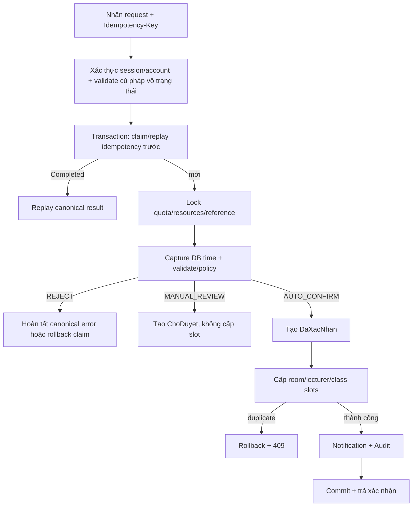

# HỆ THỐNG ĐĂNG KÝ VÀ QUẢN LÝ SỬ DỤNG PHÒNG HỌC

## ĐẶC TẢ THIẾT KẾ CHI TIẾT — v0.3

> Tài liệu này hiện thực hóa các quyết định nghiệp vụ trong `DESCRIPTION_ROOM_BOOKING_DRAFT.md`.
>
> Stack MVP dự kiến: PHP 8.2+, MySQL 8+/InnoDB, Apache; XAMPP chỉ dùng local/demo.
>
> Kiến trúc: Modular Monolith theo feature, giao dịch CSDL là ranh giới bảo vệ tính nhất quán.

# 1. QUYẾT ĐỊNH KIẾN TRÚC

## 1.1. Các quyết định đã chốt

| Mã | Quyết định | Hệ quả thiết kế |
|---|---|---|
| ADR-01 | Đặt phòng theo mô hình lai | `PolicyService` phân loại `TuDong` hoặc `NgoaiLe`; không còn luồng mọi phiếu đều chờ duyệt |
| ADR-02 | Một tiết là đơn vị chiếm dụng | Mọi nguồn phải tạo các room/lecturer/class ledger áp dụng |
| ADR-03 | CSDL là lớp phân xử xung đột cuối cùng | PK các ledger theo `(ResourceID, Ngay, SoTiet)`; duplicate key làm rollback toàn giao dịch |
| ADR-04 | Lịch chính thức phát hành theo batch | Upload → staging → preview → publish all-or-nothing; không import nửa file |
| ADR-05 | Giảng viên không tự phát hành lịch chính thức | Dữ liệu cá nhân chỉ có thể là đề xuất/nhu cầu ở giai đoạn sau |
| ADR-06 | Pilot chỉ cam kết phòng có dữ liệu bao phủ đầy đủ | Phòng thiếu busy-slot của đơn vị ngoài phạm vi không được coi là trống |
| ADR-07 | Không lưu `HoanThanh` trong MVP | “Đang diễn ra/đã qua giờ” được suy ra; chưa có check-in để chứng minh sử dụng thực tế |
| ADR-08 | Không hard-delete lịch sử nghiệp vụ | Dùng trạng thái, batch thay thế/rollback và audit |

## 1.2. Bất biến hệ thống

1. Tại một `(PhongID/GiangVienID/LopHocPhanID, Ngay, SoTiet)` chỉ có tối đa một nguồn chiếm dụng hoạt động trong ledger tương ứng.
2. Booking chỉ ở `DaXacNhan` khi có đủ room/lecturer/class slots áp dụng cho toàn khoảng tiết.
3. Booking `ChoDuyet` không có resource slot và không giữ chỗ.
4. `SlotPhong` luôn chỉ tới đúng một nguồn và loại nguồn phải khớp khóa ngoại đó.
5. Không trả phòng là “trống” nếu không resolve đúng một `BaoPhuLichPhong` hiện hành ở `DayDu` bao phủ ngày được hỏi.
6. Không mở đặt phát sinh cho một phạm vi ngày trước khi lịch nền tương ứng được phát hành.
7. Thay đổi lịch/khóa phòng/booking và các slot liên quan phải cùng transaction.
8. Không dùng ID tiết để suy ra thứ tự; luôn dùng `KhungTiet.ThuTu` trong cùng phiên bản lịch chuông.
9. Lịch chính thức current chỉ được xác định bởi `SnapshotLichHienHanh`; batch status không phải nguồn sự thật thay thế.
10. Mọi booking và occurrence không opaque đã xác nhận giữ requirement snapshot immutable; occurrence ngoài phạm vi opaque mang cờ explicit và bộ profile/snapshot cùng `NULL`, không được diễn giải `NULL` thành “không có yêu cầu”.
11. Publish/rollback chỉ dùng đúng pointer, reference, operational state và quyết định đã nằm trong preview hash; worker không tự đưa ra quyết định mới.
12. Mọi dòng lịch current phải nằm trong activation, allowlist đơn vị, typed room scope và provenance của nguồn–học kỳ; nếu có placement override thì cả `PhongIDTheoNguon` lẫn `PhongHienTaiID` đều phải thuộc room scope.
13. Một interval coverage chỉ bao phủ các ngày có cùng tập nguồn bắt buộc và phải có đúng một căn cứ immutable cho từng nguồn trong tập đó; interval cắt qua activation boundary bắt buộc được chia.
14. Mọi mutation có actor phải khóa tài khoản cùng grant role/scope/capability áp dụng và recheck quyền trong transaction; kết quả kiểm tra trước transaction chỉ dùng để khám phá, không cấp quyền commit.

## 1.3. Sơ đồ tổng thể

```text
Browser
  │ HTTPS + Session + CSRF
  ▼
Route → Middleware(role + scope) → Controller
  │
  ▼
Application Services
  ├─ Policy / Classification
  ├─ Availability / Allocation
  ├─ Booking / Exception Queue
  ├─ Schedule Import / Publish
  ├─ Official-occurrence Change
  ├─ Room Closure / Incident
  └─ Notification / Audit / Report
  │
  ▼
Repositories → MySQL 8 / InnoDB
                ├─ transaction
                ├─ PK/UNIQUE/FK/CHECK
                └─ Resource-slot ledgers
```

## 1.4. Module

| Module | Trách nhiệm | Không được làm |
|---|---|---|
| Identity & Organization | tài khoản, role, đơn vị, scope | tự quyết quyền chỉ ở giao diện |
| Facilities | tòa, phòng, thiết bị, quyền dùng phòng | suy đoán phòng con từ mã tòa |
| Academic Reference | học kỳ, khóa, đối tượng/chương trình đào tạo, lớp học phần | coi PDF CTĐT là thời khóa biểu |
| Time & Calendar | lịch chuông, ngày nghỉ, cửa sổ mở đặt | hard-code K65 = năm 4 |
| Schedule Import | staging, validate, diff, publish, replace | ghi trực tiếp từng dòng vào lịch hoạt động |
| Booking | search, classify, auto-confirm, manual exception | check-then-insert ngoài transaction |
| Room Incident | khóa có kế hoạch, sự cố, bố trí lại | âm thầm xóa booking/lịch |
| Notification & Audit | inbox và dấu vết bất biến | nhận audit trực tiếp từ client |
| Reports | số liệu theo kế hoạch, SLA | gọi là sử dụng thực tế khi chưa check-in |

## 1.5. Cấu trúc dự án dự kiến

```text
project/
├── public/
├── src/
│   ├── config/
│   ├── middleware/
│   ├── modules/
│   │   ├── identity/
│   │   ├── organization/
│   │   ├── facilities/
│   │   ├── academic/
│   │   ├── schedules/
│   │   ├── bookings/
│   │   ├── incidents/
│   │   ├── notifications/
│   │   └── reports/
│   └── shared/
├── database/
├── tests/
├── DESCRIPTION_ROOM_BOOKING_DRAFT.md
└── DESIGN_ROOM_BOOKING_DRAFT.md
```

# 2. THIẾT KẾ DỮ LIỆU

## 2.1. Nhóm thực thể

| Nhóm | Bảng chính |
|---|---|
| Danh tính/tổ chức | `Role`, `DonVi`, `DonViDaoTaoPilot`, `User`, `UserRole`, `PhamViQuanLy` |
| Cơ sở vật chất | `ToaNha`, `Phong`, `LichSuTrangThaiPhong`, `BaoPhuLichPhong`, `BaoPhuLichCanCu`, `QuyenSuDungPhong`, `ThietBi`, `PhongThietBi`, `HoSoYeuCauPhong`, `PhienBanHoSoYeuCauPhong`, `HoSoYeuCauThietBi`, `MacDinhHoSoTheoLoaiBuoi` |
| Thời gian | `MutexLichPilot`, `PhienBanLichChuong`, `KhungTiet`, `NamHocHocKy`, `LichNgay`, `NgayKhongHoatDong` |
| Đào tạo | `KhoaHoc`, `DoiTuongDaoTao`, `ChuongTrinhDaoTao`, `ChuongTrinhApDung`, `HocPhan`, `ChuongTrinhHocPhan`, `LopHocPhan`, `LopHocPhanDoiTuong`, `PhanCongGiangDay` |
| Import/lịch | `NguonLich`, `NguonLichHocKy`, `NguonLichDonVi`, `PhamViPhongNguonLich`, `NguonLichSteward`, `SnapshotLichHienHanh`, `DotImportLich`, `TacVuPhatHanhLich`, `PhienXemTruocRollback`, `DongImportLich`, `LichChinhThuc`, `YeuCauGiaiPhongLich` |
| Booking | `MucDichDatPhong`, `ChinhSachDatPhong`, `BoChinhSachVersion`, `PhieuDatPhong`, `YeuCauThietBi`, `SlotPhong`, `SlotGiangVien`, `SlotLopHocPhan` |
| Sự cố | `PhongBiKhoa`, `AnhHuongSuCo` |
| Hệ thống | `ThongBao`, `NhatKyHeThong`, `IdempotencyRequest`, `PhienBanDanhMuc` |

Quy ước range toàn mô hình: khoảng hiệu lực instant dùng nửa mở `[HieuLucTu, HieuLucDen)` với `HieuLucDen=NULL` là vô hạn; khoảng ngày `TuNgay..DenNgay` là bao gồm cả hai đầu; khoảng tiết bao gồm cả `TietBatDau` và `TietKetThuc` theo `ThuTu`. Mọi phép kiểm tra overlap/publish successor phải dùng cùng quy ước này.

Ký hiệu `DB_NOW()` trong một quyết định nghiệp vụ là instant UTC lấy từ CSDL **sau khi đã có toàn bộ lock quyết định**, không phải đồng hồ web server/client; service lưu nó thành `DecisionNow` và dùng cùng giá trị cho mọi guard/timestamp của transition. Riêng fencing lease dùng `DB_NOW_FRESH()` lấy ngay tại câu lệnh CAS cuối vì đó là bằng chứng lease còn sống tại thời điểm commit, không tái dùng `DecisionNow`. Job/race luôn recheck dưới lock thay vì dùng thời gian từ preview.

`StartAt` và `EndAt` không phải cột giờ tự do từ client: chúng được suy ra từ `Ngay` + `GioBatDau` của tiết đầu/`GioKetThuc` của tiết cuối trong `Asia/Ho_Chi_Minh`, rồi chuyển thành instant UTC để so với `DB_NOW()`. Khoảng hoạt động là nửa mở `[StartAt, EndAt)`; xung đột vẫn được phân xử bằng ledger số tiết canonical.

## 2.2. Quan hệ lõi

```mermaid
erDiagram
    DonVi ||--o| DonViDaoTaoPilot : eligible
    DonVi ||--o{ User : belongs
    Role ||--o{ UserRole : grants
    User ||--o{ UserRole : has
    User ||--o{ PhamViQuanLy : has
    DonVi ||--o{ Phong : manages
    ToaNha ||--o{ Phong : contains
    Phong ||--o{ LichSuTrangThaiPhong : state_history
    Phong ||--o{ BaoPhuLichPhong : covered
    NamHocHocKy ||--o{ BaoPhuLichPhong : scopes
    Phong ||--o{ QuyenSuDungPhong : governed
    DonVi o|--o{ QuyenSuDungPhong : accesses
    Phong ||--o{ PhongThietBi : contains
    ThietBi ||--o{ PhongThietBi : typed
    HoSoYeuCauPhong ||--o{ PhienBanHoSoYeuCauPhong : versions
    PhienBanHoSoYeuCauPhong ||--o{ HoSoYeuCauThietBi : requires
    PhienBanHoSoYeuCauPhong ||--o{ MacDinhHoSoTheoLoaiBuoi : default_for

    PhienBanLichChuong ||--o{ KhungTiet : defines
    NamHocHocKy }o--|| PhienBanLichChuong : uses
    NamHocHocKy ||--o{ LichNgay : contains
    DonVi ||--o{ DoiTuongDaoTao : owns
    DoiTuongDaoTao ||--o{ ChuongTrinhDaoTao : versions
    KhoaHoc ||--o{ ChuongTrinhApDung : cohort
    ChuongTrinhDaoTao ||--o{ ChuongTrinhApDung : applies_to
    HocPhan ||--o{ ChuongTrinhHocPhan : included
    ChuongTrinhDaoTao ||--o{ ChuongTrinhHocPhan : contains
    HocPhan ||--o{ LopHocPhan : opened_as
    NamHocHocKy ||--o{ LopHocPhan : offered_in
    LopHocPhan ||--o{ LopHocPhanDoiTuong : targets
    DoiTuongDaoTao ||--o{ LopHocPhanDoiTuong : target
    KhoaHoc ||--o{ LopHocPhanDoiTuong : cohort
    LopHocPhan ||--o{ PhanCongGiangDay : assigned
    User ||--o{ PhanCongGiangDay : teaches

    NguonLich ||--o{ DotImportLich : provides
    NguonLich ||--o{ NguonLichHocKy : activated
    NamHocHocKy ||--o{ NguonLichHocKy : enables
    NguonLichHocKy ||--o{ NguonLichDonVi : allows_unit
    NguonLichHocKy ||--o{ PhamViPhongNguonLich : covers_room
    DonVi ||--o{ NguonLichDonVi : permitted
    ToaNha ||--o{ PhamViPhongNguonLich : scoped_building
    Phong ||--o{ PhamViPhongNguonLich : scoped_room
    NguonLich ||--o{ NguonLichSteward : authorizes
    User ||--o{ NguonLichSteward : assigned
    NamHocHocKy ||--o{ SnapshotLichHienHanh : scopes
    NguonLich ||--o{ SnapshotLichHienHanh : current
    DotImportLich ||--o{ DongImportLich : stages
    DotImportLich ||--o{ TacVuPhatHanhLich : queued_as
    DotImportLich ||--o{ PhienXemTruocRollback : previewed_for
    DotImportLich ||--o{ LichChinhThuc : publishes
    Phong ||--o{ LichChinhThuc : scheduled
    LichChinhThuc ||--o{ YeuCauGiaiPhongLich : change_request

    User ||--o{ PhieuDatPhong : creates
    MucDichDatPhong ||--o{ PhieuDatPhong : classifies
    Phong ||--o{ PhieuDatPhong : requested
    PhieuDatPhong ||--o{ YeuCauThietBi : needs
    Phong ||--o{ PhongBiKhoa : blocked

    Phong ||--o{ SlotPhong : occupied
    KhungTiet ||--o{ SlotPhong : period
    LichChinhThuc o|--o{ SlotPhong : source
    PhieuDatPhong o|--o{ SlotPhong : source
    PhongBiKhoa o|--o{ SlotPhong : source
    User ||--o{ SlotGiangVien : occupied
    LopHocPhan ||--o{ SlotLopHocPhan : occupied
```



## 2.3. Danh tính và phạm vi

### `Role`

Catalog MVP gồm `GiangVien`, `QuanLyPhongLich`, `Admin`. `QuanLyPhongLich` chủ đích là role nghiệp vụ gộp trong pilot; tài liệu không giả định thêm các capability “facility/emergency/học vụ” chưa có entity. Quyền trên entity cụ thể vẫn cần ownership, `PhamViQuanLy` hoặc capability typed của `NguonLichSteward`. Không dùng một cột role duy nhất trên `User`.

Không có role sinh viên/khách hoặc anonymous schedule API trong MVP. Mọi endpoint tra cứu nghiệp vụ ngoài login yêu cầu authenticated user thuộc catalog role; public busy/free view nếu cần là module riêng với privacy projection, không tái sử dụng response nội bộ.

### `DonVi`

| Cột | Kiểu/ràng buộc | Ý nghĩa |
|---|---|---|
| `DonViID` | INT PK | định danh |
| `MaDonVi` | VARCHAR(30) UNIQUE NOT NULL | mã chính thức; chưa tự đặt khi chưa có nguồn |
| `TenDonVi` | VARCHAR(150) NOT NULL | tên hiển thị |
| `LoaiDonVi` | VARCHAR(30) CHECK | `Khoa`, `PhongBan`, `Khac` |
| `Version` | BIGINT NOT NULL | optimistic lock cho metadata và mutex policy |

Hai khoa thí điểm là hai dòng `DonVi`; không lưu dưới dạng chuỗi tự do trong `User`. Để nhập busy-slot của phòng dùng chung, catalog có thể có thêm identity đơn vị ngoài pilot với mã authoritative và metadata tối thiểu, nhưng không tạo user/catalog đào tạo/quyền booking cho đơn vị đó chỉ vì nó xuất hiện trong provenance. MVP không đặt cờ trạng thái nghiệp vụ trên đơn vị: một cờ như vậy rất dễ tạo trạng thái nửa sống khi user, quyền phòng, source allowlist và policy vẫn còn hiệu lực. `MaDonVi` bất biến; sau lần đầu được tham chiếu, `LoaiDonVi` cũng bị đóng băng và generic update chỉ được đổi tên hiển thị. Đơn vị đã được tham chiếu không hard-delete. Sáp nhập, đổi loại hoặc ngừng một đơn vị là migration có impact tới toàn bộ các tham chiếu nói trên và nằm ngoài MVP, không được mô phỏng bằng generic `PUT`.

### `DonViDaoTaoPilot`

Tập membership typed có `DonViID` PK/FK, `ChoPhepCatalogDaoTao`, `ChoPhepGiangVienDatPhong`, `Version` và audit người cấu hình. Trong MVP chỉ hai khoa đã nêu có hai cờ `true`; một identity đơn vị tồn tại để làm owner phòng/provenance/allowlist không tự nằm trong tập này. Chỉ đơn vị có cờ tương ứng mới được làm owner catalog đào tạo nội bộ, nhận role `GiangVien`, xuất hiện trong phân công nội bộ hoặc tạo booking. Admin/QL trung tâm có thể thuộc đơn vị vận hành khác và nhận scope/capability explicit, nhưng không nhờ vậy có quyền giảng viên. Membership bị đóng băng sau khi có academic reference, role giảng viên, assignment, booking hoặc batch nội bộ tham chiếu; thay đổi sau đó là migration có impact ngoài MVP.

### `User`

Các cột lõi: `UserID`, `MaNguoiDung`, `Username`, `PasswordHash`, `FullName`, `Email`, `DonViID`, `TrangThai` (`HoatDong|DaKhoa|NgungHoatDong`), `Version`, `FailedLoginCount`, `LockedUntil`, `CreatedAt`, `UpdatedAt`.

- `Username`, `MaNguoiDung` là unique.
- `LockedUntil` dùng cho khóa tạm do đăng nhập sai; `TrangThai=DaKhoa` là khóa hành chính.
- Không lưu mật khẩu, token hoặc password hash vào audit before/after.

`MaNguoiDung` là business key dùng trong CSV nên bất biến sau lần đầu được phân công, booking hoặc occurrence tham chiếu; generic update chỉ nhận metadata hiển thị/liên hệ, không nhận `MaNguoiDung` hoặc `Username`. Đổi login identity cần workflow bảo mật riêng ngoài MVP, không được đồng thời đổi mã giảng viên. Không hard-delete user. Đổi `DonViID` hoặc chuyển vĩnh viễn sang `NgungHoatDong` là action preview/commit: khóa user, liệt kê booking `ChoDuyet`, booking `DaXacNhan|CanBoTriLai` có `EndAt > DB_NOW()`, phân công đã phát hành còn hiệu lực/tương lai và occurrence current `HoatDong|CanBoTriLai` do user phụ trách có `EndAt > DB_NOW()`, rồi chặn cho tới khi các dependency đó được rút/chuyển/hủy đúng workflow. Booking/occurrence terminal chỉ giữ lịch sử FK và không tự chặn. Nếu user có/được gán role `GiangVien`, đơn vị đích còn phải có `DonViDaoTaoPilot.ChoPhepGiangVienDatPhong=true`. `DaKhoa`/`LockedUntil` chỉ chặn đăng nhập, không tự hủy lịch vì khóa bảo mật có thể tạm thời. Commit tăng `Version` và ghi audit; riêng `NgungHoatDong` kết thúc role/scope/steward assignment còn hiệu lực. Đổi đơn vị không âm thầm xóa assignment explicit: preview buộc admin xác nhận giữ hoặc kết thúc từng assignment. Lịch sử vẫn giữ FK tới user.

### `UserRole`

Dùng `UserRoleID` làm PK; mỗi dòng là một lần cấp `(UserID, RoleID)` với khoảng hiệu lực nửa mở `[HieuLucTu,HieuLucDen)`, người gán, trạng thái và audit. Không dùng `(UserID,RoleID)` làm PK vì một role có thể bị thu hồi rồi được cấp lại mà vẫn phải giữ đủ lịch sử. Các khoảng active của cùng cặp không được chồng nhau. Generic grant/revoke khóa actor + target `User` theo PK; riêng grant/kích hoạt `GiangVien` khóa tiếp `DonVi`/`DonViDaoTaoPilot` của target theo reference order; sau đó mới khóa grant xác thực của actor cùng các grant target liên quan theo ID. Dưới các lock đó service recheck actor còn quyền, membership (nếu áp dụng) và overlap trước khi đóng grant cũ hoặc tạo dòng mới; không sửa lại biên quá khứ. Grant `GiangVien` hard-reject nếu đơn vị target không có `ChoPhepGiangVienDatPhong=true`; submit booking và publish phân công vẫn recheck invariant này để không tin cấu hình cũ. Một tài khoản có thể đồng thời là giảng viên và người quản lý; permission là hợp role nhưng action quản lý vẫn phải qua `PhamViQuanLy`.

Thu hồi `GiangVien` không phải generic revoke tức thời. Admin phải tạo preview immutable liệt kê mọi `PhanCongGiangDay` đã phát hành còn hiệu lực/tương lai, booking `ChoDuyet` và booking `DaXacNhan|CanBoTriLai` có `EndAt > DB_NOW()`, cùng occurrence current do user phụ trách đang ở `HoatDong|CanBoTriLai` và có `EndAt > DB_NOW()`. Occurrence `DaGiaiPhong|DaHuy` không còn phụ thuộc eligibility để giữ tài nguyên nên không chặn chỉ vì giờ dự kiến chưa tới. Preview và commit dùng cùng lock prefix: actor Admin + target `User` theo PK → lớp/phòng theo PK → `PhienBanDanhMuc` → actor `UserRole` và grant `GiangVien` của target → các reference/source liên quan; sau đó recheck actor còn Admin, target/version, preview hash và impact set. Nếu còn bất kỳ dependency nào thì trả `ROLE_REVOCATION_HAS_FUTURE_IMPACT`. Phân công phải kết thúc và phiếu/occurrence phải được rút, hủy hoặc chuyển đúng workflow trước, không grandfather role eligibility mơ hồ. Race với submit booking, publish assignment hoặc publish occurrence được phân xử bằng cùng mutex target `User`; commit revoke chỉ đóng grant khi impact set đã rỗng, đồng thời tăng `PhienBanDanhMuc.Version` để mọi import preview dựa trên eligibility cũ thành stale. Lịch sử đã kết thúc vẫn giữ FK/snapshot, còn quyền đọc sau revoke tuân privacy hiện hành; `/auth/me` và logout vẫn dùng được như quy ước API.

### `PhamViQuanLy`

Mỗi grant có `PhamViQuanLyID` PK và gán một người quản lý cho toàn pilot, `DonViID`, `ToaNhaID` hoặc `PhongID`; mỗi dòng có `LoaiPhamVi` (`ToanPilot|DonVi|ToaNha|Phong`), **đúng FK tương ứng** khác `NULL` (scope toàn pilot không có FK), `HieuLucTu/HieuLucDen`, trạng thái và người cấp. Cùng user có thể được thu hồi rồi cấp lại cùng exact scope bằng dòng mới; các khoảng active của cùng exact scope không được chồng nhau. Grant/revoke khóa actor + target `User` theo PK, rồi actor `UserRole` → các dòng scope target liên quan; dưới lock mới recheck actor còn Admin và overlap. Nhiều dòng của cùng user được hợp theo phép OR. `coversPilot(actor)` đòi role `QuanLyPhongLich` + scope `ToanPilot` còn hiệu lực. Predicate `coversRoom(actor, room)` đòi role đó và một scope toàn pilot, trỏ thẳng tới phòng, tới tòa chứa phòng, hoặc tới `room.DonViQuanLyID`; không dùng đơn vị của người gửi booking để suy ra quyền trên phòng. Khi tạo phòng chưa có ID, `coversNewRoom(actor, toa, ownerUnit)` đúng nếu actor có scope toàn pilot, tòa đích hoặc đơn vị quản lý đích. `coversAcademicUnit(actor, unit)` đòi role đó và scope toàn pilot hoặc đúng `DonViID` chủ quản của entity.

Alias quyền API là predicate chứ không phải role mới: “QL facility/QL room/QL emergency” = `QuanLyPhongLich + coversRoom`; “QL dữ liệu đào tạo” = `QuanLyPhongLich + coversAcademicUnit`; “QL lịch toàn pilot” = `QuanLyPhongLich + coversPilot`. `Admin` có thể bootstrap các assignment này. Tạo feed và gán/revoke steward là Admin-only trong MVP để một steward không tự nâng quyền; sau bootstrap, thao tác trên feed còn bắt buộc capability `NguonLichSteward` đúng loại.

Authorization theo action, không dùng một phép OR mơ hồ qua mọi entity liên quan:

- duyệt/từ chối/hủy hành chính booking: `coversRoom` trên phòng của phiếu; chủ phiếu chỉ được rút/hủy phiếu của mình;
- tạo/kết thúc khóa hoặc sự cố: role `QuanLyPhongLich` + `coversRoom` trên phòng bị khóa;
- bố trí lại: phải `coversRoom` cả phòng cũ lẫn phòng đích; nếu là occurrence chính thức còn phải có capability steward trên nguồn;
- publish/rollback/giải phóng/khôi phục occurrence chính thức: dùng capability `NguonLichSteward` tương ứng, không dùng scope của khoa người yêu cầu thay thế;
- xác nhận coverage nhiều phòng: actor phải `coversRoom` với **mọi** phòng trong request.

MVP dùng một cấp phê duyệt. Quy trình đồng duyệt giữa đơn vị người xin và đơn vị sở hữu phòng, nếu được yêu cầu bởi quy chế thật, phải được đặc tả như workflow riêng thay vì nới lỏng predicate trên.

## 2.4. Cơ sở vật chất

### `ToaNha`

`ToaNhaID`, `MaToa` unique, `TenToa`, `DiaDiem`, `Version`; `MaToa` bất biến sau khi có phòng/scope tham chiếu. MVP không đặt một cờ allocation `TrangThai` ở tòa để tránh trạng thái “tòa ngừng nhưng phòng con vẫn hoạt động”. Đóng tòa theo ngày/tiết dùng `NgayKhongHoatDong` scope tòa; đóng khẩn cấp phải tạo incident cho từng phòng con (bulk coordinator ngoài MVP); ngừng vĩnh viễn phải preview rồi chuyển từng `Phong` sang `NgungSuDung`. Metadata tòa không được dùng để né các workflow này. Không seed `G1`–`G8` vào bảng cho đến khi xác nhận đó là mã tòa thay vì mã phòng.

### `Phong`

| Cột | Kiểu/ràng buộc | Ý nghĩa |
|---|---|---|
| `PhongID` | INT PK AUTO_INCREMENT | |
| `ToaNhaID` | INT FK NULL | null nếu mô hình thực tế là phòng độc lập |
| `MaPhong` | VARCHAR(30) UNIQUE NOT NULL | mã tài nguyên dùng trong CSV |
| `TenPhong` | VARCHAR(100) | |
| `DonViQuanLyID` | INT FK NOT NULL | không nhất thiết là khoa dùng phòng |
| `LoaiKhongGian` | VARCHAR(30) | `PhongThuong`, `PhongMay`, `NgoaiNgu`, `ChuyenDung`, `VanPhong`... |
| `SucChua` | INT NULL | nếu `ChoPhepDat=true` thì bắt buộc > 0; không gian không đặt được có thể null |
| `ChoPhepDat` | BOOLEAN NOT NULL | văn phòng mặc định false |
| `TrangThai` | VARCHAR(20) CHECK | `HoatDong`, `TamNgung`, `NgungSuDung` |
| `Version` | BIGINT NOT NULL | tăng sau mỗi thay đổi để chống ghi đè và khôi phục trạng thái cũ sai |
| `CreatedAt`, `UpdatedAt` | DATETIME | |

Nếu mã phòng chỉ duy nhất trong một tòa thì thay unique toàn cục bằng `UNIQUE(ToaNhaID, MaPhongNoiBo)` và tạo `MaPhong` canonical để dùng trong CSV.

`MaPhong`, `ToaNhaID` và `DonViQuanLyID` quyết định lần lượt CSV identity, typed source scope và `coversRoom`; cả ba bất biến sau lần đầu phòng được source/coverage/quyền/booking tham chiếu. Generic update chỉ được sửa `TenPhong` và metadata hiển thị không ảnh hưởng allocation; đổi một trong ba trường semantic phải qua migration/alias có preview và đối soát toàn bộ tham chiếu, nằm ngoài MVP. Generic update cũng không được tùy ý đổi trạng thái. `HoatDong→NgungSuDung` là action preview/commit: transaction khóa phòng, recheck mọi source/slot có `EndAt > DB_NOW()` và **chặn** nếu còn đối tượng chưa được thay thế/hủy; không tự xóa ledger, còn ledger chỉ thuộc quá khứ được giữ làm lịch sử. `TamNgung` chỉ được tạo/kết thúc qua workflow sự cố. `TamNgung→NgungSuDung` chỉ hợp lệ sau khi mọi incident, closure và impact chưa kết thúc đã xử lý. Trường hợp cần đóng ngay phải dùng workflow khẩn cấp thay vì lách qua update danh mục.

`NgungSuDung→HoatDong` là action admin có xác minh inventory; `TamNgung→HoatDong` chỉ qua kết thúc sự cố có version guard hoặc recovery override được audit sau khi không còn closure/impact active. Action khám phá source liên quan trước, rồi trong transaction khóa term/calendar → các current pointer theo ID → phòng, recheck tập nguồn và mới đổi trạng thái. Mọi lần kích hoạt cùng transaction phải ghi `LichSuTrangThaiPhong`, tăng `Phong.Version` và `PhienBanDanhMuc.Version`, nâng marker tái xác nhận trên các pointer liên quan, invalidate coverage về `CanXacNhanLai` với `MinReferenceVersion` mới; không tự khôi phục hay bố trí lại source cũ.

### `LichSuTrangThaiPhong`

Lưu các khoảng không chồng nhau `(PhongID, TrangThai, HieuLucTu, HieuLucDen, LyDo, ActorID, PhongBiKhoaID?)`. `Phong.TrangThai` là cache trạng thái hiện tại; mọi mutation phải đóng khoảng cũ, mở khoảng mới và tăng `Phong.Version` trong cùng transaction. Báo cáo lịch sử dùng bảng này hợp với `PhongBiKhoa`, không suy diễn trạng thái quá khứ từ giá trị current hoặc audit text.

### `BaoPhuLichPhong`

Xác nhận hệ thống có đủ occupancy để kết luận phòng trống trong một khoảng thời gian: `BaoPhuID`, `PhongID`, `HocKyID`, `TuNgay`, `DenNgay`, `TrangThai` (`DayDu`, `ChuaDayDu`, `CanXacNhanLai`), `VongDoi` (`HienHanh|BiThayThe`), `MinReferenceVersion`, `Version`, `XacNhanBy`, `XacNhanAt`, `BiThayTheAt`. `TuNgay/DenNgay` bắt buộc nằm trong học kỳ và `TuNgay <= DenNgay`. Các interval `HienHanh` của cùng `(PhongID,HocKyID)` **không được chồng nhau ở bất kỳ trạng thái nào**; khi confirm/invalidate một phần khoảng, service dưới room mutex đánh dấu interval cũ `BiThayThe` rồi tạo các đoạn hiện hành không chồng nhau. Lịch sử không tham gia availability. Tập nguồn kỳ vọng cho từng phòng/ngày là mọi source + `NguonLichHocKy` cùng active, ngày nằm trong activation `TuNgay..DenNgay`, có `PhamViPhongNguonLich` khớp và `BatBuocChoBaoPhu=true`. Một row coverage chỉ được bao trùm một khoảng mà tập nguồn kỳ vọng **không đổi**: confirm/invalidate phải chia request tại mọi biên `NguonLichHocKy.TuNgay` và ngày ngay sau `DenNgay` của nguồn khớp phòng, tạo các maximal interval có cùng tập nguồn; không còn giả định “tối đa ba đoạn” nếu đồng thời gặp nhiều biên activation. `BaoPhuLichCanCu(BaoPhuID, HocKyID, NguonLichID, DotImportID, PointerVersionSnapshot)` phải chứa đúng toàn bộ tập của interval đó, kể cả snapshot header-only chứng minh nguồn không có occurrence. Composite FK buộc `DotImportID` thuộc đúng học kỳ + nguồn; `PointerVersionSnapshot` chỉ là giá trị audit/optimistic evidence đã chụp, **không** là FK tới row pointer mutable. Nếu cần FK cho từng version pointer ở tương lai, phải có bảng pointer-history append-only riêng.

Xác nhận coverage và mutation cấu hình nguồn dùng chung mutex/protocol: khám phá ID không khóa, rồi transaction khóa `NamHocHocKy` → toàn bộ source pointer liên quan theo ID → actor `User` → các phòng theo ID → `PhienBanDanhMuc` → các `UserRole`/`PhamViQuanLy` áp dụng và `NguonLichSteward` nếu action cấu hình nguồn cần capability → config/coverage rows. Dưới các lock đó, service recheck account, role, `coversRoom` với **mọi** phòng của request hoặc capability `ChoQuanLyCauHinh` tương ứng, rồi recompute **toàn bộ** tập nguồn kỳ vọng và recheck range chồng nhau trước khi ghi. Confirm dựng mọi activation boundary trước, chia request thành maximal interval có tập nguồn giống nhau và ghi `BaoPhuLichCanCu` riêng cho từng interval trong cùng transaction. Vì source-config commit cũng phải lấy term mutex trước khi thêm/bớt required source, nó không thể chen một nguồn mới giữa lúc confirm tạo row `DayDu`; room mutex ngăn hai confirm khoảng chồng nhau cùng tạo căn cứ mâu thuẫn. Thiếu current snapshot của bất kỳ nguồn bắt buộc nào thì không thể thành `DayDu`. Ngoài ra, mỗi current batch làm căn cứ phải có `ReferenceVersion >= MinReferenceVersion` và `>= SnapshotLichHienHanh.MinAcceptedReferenceVersion`; điều này buộc đúng source xác nhận lại sau khi một khoảng trước đây bị đóng được mở ra, thay vì suy diễn “không có dòng” từ snapshot đã validate lúc khoảng đó còn bị cấm. Mọi publish/replace/rollback làm đổi căn cứ, thay đổi activation/allowlist/phạm vi nguồn, hoặc action mở thêm khả dụng đều version-split và chuyển đúng interval hiện hành giao nhau sang `CanXacNhanLai` trong cùng transaction, đồng thời nâng cả `MinReferenceVersion` lẫn marker pointer của các source liên quan khi có thay đổi reference. Availability phải resolve **đúng một** interval `HienHanh+DayDu` bao phủ ngày được hỏi; zero hoặc multiple là fail-closed `COVERAGE_INCOMPLETE/COVERAGE_STATE_CORRUPT`.

### `QuyenSuDungPhong`

Có `QuyenID` PK, `PhongID`, `LoaiPhamVi` (`MacDinh|DonVi`), `DonViID?`, `MucQuyen` (`TuDong`, `CanDuyet`, `Cam`), `HieuLucTu`, `HieuLucDen`, trạng thái `Nhap|DaPhatHanh|NgungApDung`, `Version` và người ban hành. `CHECK` bắt scope `MacDinh` không có đơn vị, scope `DonVi` có đúng một đơn vị. Mỗi phòng bắt buộc có một rule mặc định đã phát hành; rule đơn vị nếu có được ưu tiên hơn mặc định. Các khoảng đã phát hành của cùng exact scope không được chồng nhau; publish khóa `Phong` rồi mutex exact scope và recheck overlap.

Chọn version hiệu lực tại thời điểm bắt đầu sử dụng được yêu cầu, không phải tùy ý theo thời điểm submit. `Cam` bị loại, `CanDuyet` chỉ cho tạo ngoại lệ, `TuDong` mới được đi tiếp tới các rule auto-confirm khác. Payload đã phát hành là immutable, không hard-delete; thay đổi tạo draft/version mới và successor chỉ được đóng predecessor tại biên tương lai. Booking lưu `QuyenPhongAtSubmitID` và, với phiếu ngoại lệ, `QuyenPhongAtDecisionID` cùng snapshot kết quả. Booking đã `DaXacNhan` được grandfather theo quyết định đã lưu; rule mới chỉ tác động search/request mới và phiếu còn chờ khi recheck. Publish rule và create/approve booking cùng khóa `Phong` trước khi resolve quyền, nên không thể xác nhận theo rule cũ sau khi rule mới đã commit.

### `ThietBi`

Tối thiểu có `ThietBiID`, `MaThietBi` unique, `TenThietBi`, đơn vị tính, `TrangThai` (`HoatDong|NgungTaoMoi`) và `Version`. `MaThietBi` bất biến sau khi inventory/profile tham chiếu. `NgungTaoMoi` chỉ loại identity khỏi draft/form mới; published profile, requirement snapshot và inventory lịch sử vẫn tham chiếu/kiểm tra được. Không hard-delete hoặc dùng trạng thái catalog để âm thầm biến yêu cầu hiện hữu thành không cần thiết.

### `PhongThietBi`

Khóa `(PhongID, ThietBiID)`, gồm `SoLuongTong >= 0`, `SoLuongKhaDung` nằm trong `[0, SoLuongTong]`, `GhiChuTinhTrang`, `UpdatedAt`. Tìm phòng, booking và publish dùng số lượng khả dụng tại lúc kiểm tra lại trong transaction, không dùng số lượng tổng.

MVP coi đây là năng lực gắn với phòng. Thiết bị di động có kho, phiếu mượn và ledger riêng nằm ngoài phạm vi; không giả vờ giải quyết bằng cách trừ số lượng của hai phòng.

Mọi thay đổi làm giảm năng lực allocation của phòng (`SucChua`, `LoaiKhongGian`, `ChoPhepDat`, trạng thái hoặc `SoLuongKhaDung`) phải có impact preview. Commit khóa phòng rồi recheck requirement snapshot của mọi booking/occurrence có `EndAt > DB_NOW()`; nếu có nguồn trở nên không hợp lệ thì generic update bị chặn cho tới khi nguồn được thay thế/hủy, hoặc người quản lý dùng workflow sự cố để đưa chúng vào `CanBoTriLai` và notify. Một occurrence `NgoaiPhamVi` opaque không có snapshot là **không biết**, không phải “không yêu cầu”: mọi capacity/type/device decrease trên phòng nó đang chiếm bị fail-closed với `UNKNOWN_REQUIREMENT_IMPACT` cho tới khi steward bổ sung requirement authoritative qua replacement hoặc xử lý source. Tăng năng lực vẫn tăng `PhienBanDanhMuc`; không mutation nào được làm một source đang xác nhận trở thành vi phạm mà không có workflow. Riêng `ChoPhepDat=false→true` là mở thêm khả dụng và không dùng nhánh chỉ-lock-phòng: sau bước khám phá, commit khóa term/calendar → pointer theo ID → phòng → `PhienBanDanhMuc`/coverage, recheck phòng `HoatDong`, `SucChua>0`, có đúng một quyền mặc định published và đủ typed source mappings bắt buộc, rồi tăng reference/marker pointer và chuyển coverage liên quan sang `CanXacNhanLai`. Phòng chưa xuất hiện trong availability cho tới khi từng nguồn phát hành acknowledgment snapshot và coverage được xác nhận lại.

### `HoSoYeuCauPhong`

Identity ổn định của profile: `HoSoID`, `MaHoSo` unique, tên, `TrangThai` (`HoatDong|NgungTaoMoi`) và `Version`. `MaHoSo` bất biến sau khi có version đầu tiên; chỉ metadata hiển thị/trạng thái được version-guard update. `NgungTaoMoi` không vô hiệu hóa version/snapshot đã phát hành. Nội dung allocation không nằm ở hàng identity để tránh một mã đang được lịch cũ tham chiếu đổi nghĩa.

### `PhienBanHoSoYeuCauPhong`

Gồm `PhienBanHoSoID`, `HoSoID`, `SoPhienBan`, `HieuLucTu`, `HieuLucDen`, `LoaiBuoi`, tập **không rỗng** loại phòng chấp nhận, `SucChuaToiThieu` nullable, `SnapshotHash`, trạng thái `Nhap|DaPhatHanh|NgungApDung`, `Version`; `UNIQUE(HoSoID, SoPhienBan)`. Snapshot profile luôn chứa danh sách thiết bị authoritative đã canonical-sort, kể cả danh sách rỗng. Hai phiên bản đã phát hành của cùng identity không được chồng khoảng hiệu lực. Payload allocation của bản đã phát hành là immutable và không hard-delete; chỉnh sửa tạo draft/version mới. Khi publish successor, transaction được phép đóng `HieuLucDen`/lifecycle của predecessor đúng tại biên successor **chưa tới**, có audit và không sửa payload hay khoảng quá khứ; mọi cách retire khác bị chặn nếu làm thay đổi resolution của ngày đã qua/đang diễn ra. `HoSoYeuCauThietBi(PhienBanHoSoID, ThietBiID, SoLuongToiThieu)` tham chiếu phiên bản, không tham chiếu identity.

`MacDinhHoSoTheoLoaiBuoi` gồm `MacDinhID`, `LoaiBuoi`, `PhienBanHoSoID`, `HieuLucTu/HieuLucDen`, trạng thái và `Version`; các khoảng published của cùng `LoaiBuoi` không chồng nhau và FK chỉ được trỏ tới version published có cùng loại. Payload mapping published là immutable; publish successor chỉ được đóng predecessor tại biên tương lai trong cùng transaction. Cả publish profile version và publish default mapping đều khóa theo thứ tự duy nhất `PhienBanDanhMuc → HoSoYeuCauPhong identity/exact-scope rows`, rồi recheck overlap; không có nhánh giữ identity trước rồi chờ version mutex. Với dòng nội bộ, `MaHoSoPhong` resolve đúng một phiên bản đã phát hành hiệu lực tại `Ngay`; nếu mã trống thì mapping mặc định cũng phải resolve đúng một phiên bản. Zero/multiple match là lỗi chặn, không âm thầm dùng catalog hiện tại. Publish một version/mapping mới tăng `PhienBanDanhMuc.Version`. Mỗi occurrence/booking lưu cả FK phiên bản và requirement snapshot JSON/hash, nên no-op import, lịch sử và bố trí lại không bị đổi nghĩa khi catalog về sau thay đổi. Nguồn ngoài phạm vi thiếu chi tiết có thể không resolve profile và được coi là opaque busy-slot.

Sức chứa snapshot tối thiểu bằng `max(SiSo hoặc SoNguoi, PhienBanHoSo.SucChuaToiThieu nếu có)`. Với booking, thiết bị bổ sung do người dùng chọn được merge theo từng `ThietBiID` bằng `max(SoLuongTheoProfile, SoLuongBoSung)`, không cộng đôi; client không được mở rộng tập loại phòng ngoài profile. Tập loại phòng và map thiết bị kết quả được canonical-sort trước khi băm. Cùng công thức được dùng ở import, booking, approval và reallocation.

## 2.5. Thời gian và học kỳ

### `MutexLichPilot`

Một hàng ổn định `(PilotID=1, Version)` dùng làm transaction mutex cho mutation có predicate xuyên nhiều học kỳ, đặc biệt tạo/đổi range học kỳ. Nó không phải cấu hình nghiệp vụ và không được dùng thay `PhienBanDanhMuc`; mục đích là cho hai transaction insert/update các term khác ID vẫn tranh cùng một row trước khi kiểm tra interval overlap. Khi mở rộng nhiều cơ sở, mỗi pilot/campus có một row riêng và mọi key thời gian phải thêm scope tương ứng.

### `PhienBanLichChuong`

`PhienBanID`, `MaPhienBan` unique, `Ten`, `HieuLucTu`, `HieuLucDen`, `TrangThai`, `NguonDuLieu`. `MaPhienBan` bất biến sau publish/tham chiếu. Không được chuyển profile sang `DaPhatHanh` hoặc gắn vào học kỳ mở đặt nếu còn bất kỳ `KhungTiet.DaXacMinh=false`.

### `KhungTiet`

| Cột | Kiểu/ràng buộc |
|---|---|
| `KhungTietID` | INT PK |
| `PhienBanID` | FK NOT NULL |
| `SoTiet` | SMALLINT NOT NULL |
| `ThuTu` | SMALLINT NOT NULL |
| `Buoi` | `Sang`, `Chieu`, `Toi` |
| `GioBatDau` | TIME NOT NULL |
| `GioKetThuc` | TIME NOT NULL |
| `DaXacMinh` | BOOLEAN NOT NULL DEFAULT FALSE |

Ràng buộc hàng: `UNIQUE(PhienBanID, SoTiet)`, `UNIQUE(PhienBanID, ThuTu)`, `GioBatDau < GioKetThuc`. Validator publish còn phải duyệt từng `Buoi` theo `ThuTu`: `GioBatDau` và `GioKetThuc` tăng đơn điệu, đồng thời `previous.GioKetThuc <= next.GioBatDau`; profile có tiết đảo thứ tự hoặc chồng thời gian không được phát hành. Khoảng đặt hợp lệ được lấy bằng `ThuTu BETWEEN`, đồng thời tất cả tiết phải cùng `PhienBanID` và cùng `Buoi`.

Không có buffer tùy ý ở `PhieuDatPhong`; khung tiết canonical phải bao gồm cả thời gian chuyển/dọn cần bảo vệ. Nếu quy định buffer thay đổi, tạo phiên bản lịch chuông mới thay vì nới khoảng của từng request theo cách làm lệch ledger số tiết.

### `NamHocHocKy`

Gồm `HocKyID`, `NamHoc`, `HocKy`, `NgayBatDau`, `NgayKetThuc`, `PhienBanLichChuongID`, `TrangThaiLichNen` (`ChuaDayDu`, `DaPhatHanh`, `CanXacNhanLai`), `YeuCauReferenceVersionNen` nullable, `MoDatPhongTu`, `DongDatPhongLuc`, `Version`; `UNIQUE(NamHoc, HocKy)` là khóa canonical của một kỳ trong pilot một cơ sở và là cách CSV resolve `HocKyID`. Hai instant mở/đóng bắt buộc khác `NULL` và `MoDatPhongTu < DongDatPhongLuc`; `MoDatPhongTu <= DB_NOW() < DongDatPhongLuc` là cửa sổ **nhận phiếu mới**. Đóng cửa sổ không tự hết hạn phiếu đã nhận, vì chúng dùng `HanXuLyLuc`. MVP giả định một học kỳ dùng đúng một phiên bản lịch chuông và không đổi giữa kỳ; các khoảng học kỳ không được chồng ngày. Tạo/đổi range kỳ khóa `MutexLichPilot` trước các term row, recheck unique + interval overlap rồi mới commit; MySQL `CHECK` không tự bảo vệ invariant nhiều hàng này. `TrangThaiLichNen=DaPhatHanh` chỉ được đặt bằng action preview/confirm khóa học kỳ rồi mọi source pointer bắt buộc theo ID, recheck mỗi nguồn có current full snapshot kể cả snapshot rỗng/header-only; nếu có `YeuCauReferenceVersionNen`, batch hiện hành của từng nguồn đó còn phải có `ReferenceVersion` không nhỏ hơn marker. Generic update không nhận trường trạng thái này. Thay đổi activation/trạng thái/phạm vi nguồn bắt buộc hạ trạng thái và coverage giao nhau trong cùng transaction. Đây vẫn chỉ là điều kiện cần, còn coverage phòng/ngày là guard cuối cho auto-confirm.

Sau khi học kỳ có current snapshot, booking hoặc closure, cấm đổi `PhienBanLichChuongID`, ngày bắt đầu/kết thúc theo generic update. Muốn đổi phải dùng migration/calendar-change workflow có preview toàn bộ ảnh hưởng; workflow đó ngoài MVP. Các trường metadata không ảnh hưởng allocation vẫn dùng optimistic version.

### `LichNgay`

Ánh xạ canonical `Ngay` → `HocKyID`, `TrangThai` (`HoatDong`, `Nghi`) cho pilot một cơ sở. Phiên bản lịch chuông **chỉ** được suy ra từ `NamHocHocKy.PhienBanLichChuongID`, không lưu lặp trên `LichNgay`. `Ngay` là unique trong phạm vi pilot, vì vậy mọi allocation cùng ngày resolve cùng một học kỳ và profile. Nếu sau này nhiều cơ sở hoặc thay lịch chuông giữa kỳ thì phải version lại key/mô hình, không thêm cột trùng nguồn sự thật một cách ngầm định.

Đổi `HoatDong↔Nghi` là action có preview và lock term/calendar. Nếu ngày còn occurrence, booking hoặc closure, mutation bị chặn; phải xử lý các source qua đúng workflow trước. Không được đổi calendar để vô hiệu hóa ngầm một lịch đã xác nhận. Riêng `Nghi→HoatDong` là mở thêm khả dụng: sau khi khám phá tập nguồn/phòng, transaction khóa term/calendar → source pointer → phòng theo ID, recheck tập đó, tăng `PhienBanDanhMuc.Version`, đặt `TrangThaiLichNen=CanXacNhanLai`, nâng `YeuCauReferenceVersionNen` và các marker pointer, rồi chuyển mọi coverage giao ngày sang `CanXacNhanLai` với `MinReferenceVersion` mới. Mỗi nguồn bắt buộc phải validate/phát hành lại full snapshot dưới reference mới, kể cả file header-only, trước khi baseline và coverage được xác nhận lại.

### `NgayKhongHoatDong`

Chỉ lưu ngày/khung tiết đóng cục bộ theo tòa **hoặc** phòng; đúng một scope FK khác `NULL`. Ngày nghỉ toàn trường dùng nguồn chuẩn `LichNgay.TrangThai=Nghi`, không ghi lặp ở đây. Cả ngày nghỉ toàn trường lẫn đóng cục bộ đều là hard reject đối với booking; muốn mở lại phải qua action quản trị lịch/cơ sở vật chất có preview, quyền riêng và audit, không phải “duyệt ngoại lệ” của một phiếu đặt phòng.

Đóng cục bộ có kế hoạch bị chặn nếu giao source đã xác nhận; phải dời/hủy source trước. Transaction tạo mới khóa term/calendar rồi toàn bộ room mutex bị ảnh hưởng theo ID tăng dần và recheck ledger, nên booking/publish đồng thời không thể chen vào sau preview. Hủy/mở lại một đóng cục bộ là mở thêm khả dụng: sau bước khám phá không khóa, transaction theo term/calendar → source pointer → phòng → catalog/coverage, recheck tập nguồn, tăng `PhienBanDanhMuc.Version`, nâng marker pointer, invalidate coverage của mọi phòng–ngày bị mở với `MinReferenceVersion` mới và yêu cầu các source trong tập coverage phát hành lại snapshot trước khi xác nhận `DayDu`. Tình huống khẩn cấp dùng workflow sự cố để tạo impact/notification, không insert trực tiếp `NgayKhongHoatDong` nhằm né ledger.

## 2.6. Dữ liệu đào tạo

- `KhoaHoc`: `MaKhoaHoc` unique toàn pilot (dữ liệu ban đầu dự kiến `K65`–`K68`, không phải enum schema), năm tuyển sinh nếu đã xác minh, `Version`; mã/năm semantic bất biến sau first reference.
- `DoiTuongDaoTao`: `MaDoiTuongDaoTao`, tên trung lập cho CNTT/KHMT/HTTTQL/NNA, thuộc `DonVi` có `ChoPhepCatalogDaoTao=true`, có `LoaiDoiTuong` (`Nganh`, `ChuyenNganh`, `ChuongTrinh`) và `Version`; `UNIQUE(DonViID, MaDoiTuongDaoTao)`. Chỉ chốt loại và mã sau khi đọc metadata chính thức; mã/owner/loại bất biến sau first reference.
- `ChuongTrinhDaoTao`: version theo đối tượng đào tạo, ngày hiệu lực và tệp nguồn.
- `ChuongTrinhApDung`: many-to-many chương trình–khóa, có `ApDungTu/Den`; dùng khi một PDF/version áp dụng nhiều cohort thay vì nhân bản chương trình.
- `HocPhan`: `MaHocPhan`, tên, `DonViChuQuanID` có `ChoPhepCatalogDaoTao=true`, số tín chỉ/thuộc tính chỉ nhập khi đọc được nguồn thật; `UNIQUE(DonViChuQuanID, MaHocPhan)` và mã + owner là semantic core.
- `ChuongTrinhHocPhan`: liên kết chương trình–học phần và học kỳ gợi ý.
- `LopHocPhan`: bắt buộc tham chiếu `HocPhanID`, `HocKyID`, `DonViChuQuanID`, có `MaLopHocPhan`, sĩ số kế hoạch, trạng thái và `Version`; `UNIQUE(HocKyID, DonViChuQuanID, MaLopHocPhan)`. Owner mặc định phải khớp owner học phần; ngoại lệ đồng sở hữu cần mapping typed ngoài MVP chứ không dùng chuỗi tự do.
- `LopHocPhanDoiTuong`: khóa `(LopHocPhanID, DoiTuongDaoTaoID, KhoaHocID)`, cho phép một lớp ghép nhiều đối tượng/khóa; một dòng có thể được đánh dấu đối tượng chính để báo cáo.
- `PhanCongGiangDay`: assignment versioned many-to-many lớp học phần–giảng viên, gồm `PhanCongID`, vai trò chính/phụ, `HieuLucTu/HieuLucDen`, trạng thái `Nhap|DaPhatHanh|NgungApDung` và `Version`. Giảng viên phải đang hoạt động, có role `GiangVien` và thuộc đơn vị có `ChoPhepGiangVienDatPhong=true`. Các khoảng đã phát hành của cùng lớp–giảng viên không chồng nhau, kể cả khác vai trò; vai trò là payload của version chứ không tạo hai assignment đồng thời. Payload đã phát hành là immutable và không hard-delete. Validation vì vậy phải resolve đúng một assignment hiệu lực tại thời điểm sử dụng được yêu cầu, rồi booking/occurrence lưu `PhanCongID` cùng version/hash snapshot.

Kết thúc hoặc thay phân công dùng preview/commit, không dùng generic update. Commit khóa giảng viên → lớp → `PhienBanDanhMuc` → assignment theo protocol, tăng `PhienBanDanhMuc.Version` và chặn nếu biên hiệu lực mới làm bất kỳ booking `DaXacNhan|CanBoTriLai` hoặc occurrence current `HoatDong|CanBoTriLai` có `EndAt > DB_NOW()` mất phân công. Các source đó phải được hủy/chuyển giảng viên qua đúng workflow trước; phiếu `ChoDuyet` được liệt kê/cảnh báo và sẽ recheck ở decision. Occurrence `DaGiaiPhong|DaHuy` không chặn kết thúc assignment, nhưng action khôi phục `DaGiaiPhong` bắt buộc recheck eligibility + phân công hiện hành. Nhờ vậy không có assignment bị sửa sau lưng một lịch tương lai đang giữ hoặc chờ bố trí tài nguyên.

Semantic core của `KhoaHoc`, `DoiTuongDaoTao`, `HocPhan` (`MaHocPhan`, owner), `LopHocPhan` (`MaLopHocPhan`, học kỳ, học phần, owner) và tập `LopHocPhanDoiTuong` bị đóng băng sau lần đầu được chương trình, assignment published, booking hoặc batch lịch tham chiếu. Generic update khi đó chỉ sửa metadata hiển thị an toàn; đổi mã/owner/loại/core hoặc xóa mapping trả `ACADEMIC_REFERENCE_FROZEN`, còn hiệu chỉnh thật phải tạo identity mới hoặc migration có đối soát ngoài MVP. Mỗi row/set có optimistic `Version`; riêng allocation/import dùng canonical semantic hash/version chỉ từ các trường có thể đổi kết quả validate. Metadata hiển thị hợp lệ tăng row `Version` nhưng không tăng `PhienBanDanhMuc.Version` và không đổi semantic hash; thay đổi semantic hợp lệ mới tăng cả hai. CSV resolve học kỳ bằng `(NamHoc,HocKy)`, đơn vị bằng `MaDonVi`, lớp bằng `(HocKyID,DonViID,MaLopHocPhan)`, học phần bằng `(DonViID,MaHocPhan)`, đối tượng bằng `(DonViID,MaDoiTuongDaoTao)` và khóa bằng `MaKhoaHoc`; mọi kết quả phải đúng một row, zero/multiple là lỗi chặn. `DonViID` resolve từ `MaDonVi` của `NoiBo+LichHoc` hoặc dòng có lớp phải bằng `LopHocPhan.DonViChuQuanID`; lịch thi không có lớp phải bằng `HocPhan.DonViChuQuanID`. Backend dùng owner này cho `coversAcademicUnit`, không suy ra quyền từ đơn vị tài khoản actor.

Các business key trao đổi ra ngoài gồm `MaDonVi`, `MaToa`, `MaPhong`, `MaThietBi`, `MaNguoiDung`, `MaNguonLich`, `MaHoSo`, `MaPhienBan`, `MaMucDich` và các mã học thuật nêu trên phải có unique key đúng scope và bất biến sau first reference. `MaDongNguon` là ngoại lệ: đó là key của một dòng do source quản lý trong phạm vi snapshot, không phải identity catalog toàn hệ thống. Đổi business key thật cần alias/migration có đối soát ngoài MVP, không dùng generic `PUT`.

Không tạo dữ liệu học phần từ tên file PDF. Bốn PDF phải được cung cấp và trích dẫn nguồn trước khi seed.

Quy ước thời gian hiệu lực: mọi range dùng khoảng nửa mở `[HieuLucTu,HieuLucDen)`, trong đó `HieuLucDen=NULL` nghĩa là chưa định trước điểm kết thúc. Policy chọn tại `DB_NOW()` rồi snapshot; quyền dùng phòng, profile/default mapping và phân công chọn tại thời điểm bắt đầu occurrence/booking; role, stewardship và scope quản lý chọn tại lúc actor thực hiện action. Mọi recheck transaction dùng cùng quy ước, tránh chỗ dùng “hôm nay”, chỗ dùng ngày diễn ra.

## 2.7. Import và lịch chính thức

### `NguonLich`

Định danh feed/đầu mối cung cấp: `NguonLichID`, `MaNguonLich` unique, tên, `PhamViNguonCoDinh` (`NoiBo|NgoaiPhamVi`), trạng thái và `Version`. `PhamViNguon` trên mọi dòng CSV phải khớp provenance này; nếu một bên cung cấp cả hai loại thì tạo hai nguồn, không cho đổi enum từng dòng để né validation. `PhamViNguonCoDinh` bất biến sau batch đầu tiên; không được deactivate identity nếu bất kỳ current snapshot nào còn occurrence, kể cả quá khứ. Identity/config lịch sử được giữ nguyên; muốn ngừng quyền ghi thì kết thúc steward assignment, còn feed kế nhiệm dùng identity mới. Steward nằm ở assignment riêng, không phải một chuỗi/cột quyền đơn.

### `NguonLichHocKy`

Activation có khóa `(NguonLichID, HocKyID)`, `TuNgay`, `DenNgay`, `BatBuocChoLichNen`, `TrangThai` và `Version`; khoảng ngày phải nằm trong học kỳ. `TuNgay` đồng thời là ngày cutover của scope import thường: batch `CheDo=Moi` phải publish trước `StartAt` allocatable đầu tiên kể từ ngày này và không được chứa occurrence sớm hơn; nếu source được onboard sau biên đó thì cần historical migration thay vì file đầu tiên tự tuyên bố đầy đủ. `SnapshotLichHienHanh` chỉ được tạo cho activation này. Tắt/bật hoặc đổi khoảng/required là mutation có impact preview, tăng `PhienBanDanhMuc.Version`, hạ `TrangThaiLichNen` khi liên quan và invalidate coverage giao nhau. Sau khi đã có current snapshot, không được shrink khoảng hoặc deactivate nếu **bất kỳ** occurrence current nào, kể cả quá khứ, sẽ ra ngoài activation; full snapshot cần giữ các dòng quá khứ bất biến. Có thể mở rộng khoảng tương lai hoặc đổi cờ required qua preview; mở `TuNgay` lùi qua một `StartAt` đã bắt đầu cũng đi historical migration gate. Cấu hình sai đã được dùng phải được giữ như bằng chứng lịch sử và sửa bằng source–học kỳ mới ở kỳ sau, không tạo trạng thái mà replacement không thể biểu diễn.

### `NguonLichDonVi`

Allowlist `(NguonLichID, HocKyID, DonViID)` cho đơn vị mà feed tổng hợp được phép khai. `MaDonVi` của từng dòng vẫn là đơn vị sở hữu hoạt động và phải nằm trong allowlist; một feed có thể có nhiều dòng allowlist, nhưng không dùng feed thay cho đơn vị. Nguồn `NoiBo` chỉ được allowlist đơn vị có `ChoPhepCatalogDaoTao=true`; nguồn `NgoaiPhamVi` có thể dùng identity authoritative ngoài tập pilot. Không được gỡ đơn vị khi **bất kỳ** occurrence trong snapshot current, kể cả quá khứ, dùng đơn vị đó; có thể gỡ mapping chưa từng được dùng.

### `PhamViPhongNguonLich`

Phạm vi `(NguonLichID, HocKyID, ToaNhaID?, PhongID?, BatBuocChoBaoPhu)` với `CHECK` đúng một trong `ToaNhaID/PhongID` khác `NULL`. Hợp các dòng là tập phòng feed được phép khai; không tái sử dụng `QuyenSuDungPhong` vì quyền cấp lịch chính thức khác quyền đặt phát sinh. Validator hard-reject `MaPhong` ngoài tập này và ngày ngoài khoảng activation. Nếu scope tòa và scope phòng cùng match thì `BatBuocChoBaoPhu` phải giống nhau; service/constraint không cho hai mapping tạo kết quả required mâu thuẫn. Với mọi phòng `ChoPhepDat=true`, **mọi** source active được phép khai occupancy vào phòng đó bắt buộc có mapping `BatBuocChoBaoPhu=true`; `false` chỉ dành cho supplemental/reporting scope trên phòng không auto-bookable và không được dùng làm bằng chứng đầy đủ. Chuyển phòng sang `ChoPhepDat=true` bị chặn cho tới khi invariant typed mapping/activation này đạt; chính action bật cờ sẽ nâng marker và làm coverage stale, nên current acknowledgment snapshots + coverage `DayDu` chỉ được hoàn tất **sau** commit trước khi availability mở. Tập nguồn bắt buộc của coverage phòng/ngày được suy ra từ source/activation active, ngày thuộc activation, mapping khớp và `BatBuocChoBaoPhu=true`. Mọi thay đổi mapping đi qua preview/commit và invalidate chính xác các coverage giao nhau; không được thu hẹp nếu **bất kỳ** row current, kể cả quá khứ, có `PhongIDTheoNguon` hoặc `PhongHienTaiID` sẽ bị loại. Mapping chưa từng dùng có thể xóa; cờ coverage required có thể version-change mà không đổi allowlist.

Đổi `PhamViNguonCoDinh` không được phép khi nguồn đã có batch; phải tạo nguồn mới. Mọi commit semantic của activation/allowlist/room scope tăng `PhienBanDanhMuc.Version`, tuân cùng thứ tự `NamHocHocKy` → pointer → actor → phòng → `PhienBanDanhMuc` → authorization/config/coverage của protocol coverage-confirm, recheck current rows và invalidate coverage giao nhau trong chính transaction; nếu nguồn liên quan tới lịch nền bắt buộc thì đồng thời hạ `TrangThaiLichNen=CanXacNhanLai`. Mở rộng activation/allowlist/scope hoặc thêm nguồn kỳ vọng làm current snapshot cũ không còn đủ để chứng minh “không có dòng”, vì vậy còn phải nâng marker pointer/reference và yêu cầu acknowledgment replacement; thu hẹp chỉ được phép sau impact guard và vẫn phải xác nhận lại coverage theo tập nguồn mới. Mọi guard trên được recheck trong commit, không chỉ hiển thị ở preview, nên cấu hình nguồn không thể làm lịch current trở thành dữ liệu ngoài chính phạm vi của nó hoặc đua với một xác nhận coverage mới.

### `NguonLichSteward`

Assignment có `NguonLichStewardID` PK; mỗi dòng gắn `(NguonLichID, UserID)`, `HieuLucTu/HieuLucDen`, trạng thái và các quyền typed `ChoKiemTra` (upload/staging/preview), `ChoPhatHanh`, `ChoRollback`, `ChoQuanLyCauHinh`, `ChoXuLyThayDoiLich`, `ChoXuLySuCoNgoaiPhamVi`. Không dùng cặp nguồn–user làm PK vì cần giữ các lần cấp lại; các khoảng active của cùng cặp không được chồng nhau. Đổi capability phải kết thúc grant hiện hành và tạo successor đã audit, không sửa ngược lịch sử; grant/revoke khóa actor Admin + target `User` theo PK, rồi actor `UserRole` → các assignment target cùng nguồn theo ID, recheck quyền/overlap dưới lock để cùng barrier với action nghiệp vụ. “Steward” không phải role toàn cục thứ tư: backend yêu cầu đồng thời role quản lý phù hợp **và** assignment nguồn còn hiệu lực. Admin kỹ thuật hoặc một steward có capability khác không mặc nhiên được publish, rollback, đổi cấu hình hay thay đổi occurrence.

### `SnapshotLichHienHanh`

Khóa `(HocKyID, NguonLichID)` đồng thời là composite FK tới `NguonLichHocKy`, có `CurrentDotImportID` nullable, `MinAcceptedReferenceVersion BIGINT NOT NULL DEFAULT 0`, `Version`, `UpdatedAt`. Dòng được tạo sẵn khi bật nguồn cho học kỳ, kể cả chưa có snapshot, để hai lần publish đầu tiên vẫn lock cùng một mutex. Đây là con trỏ duy nhất xác định full snapshot đang hiệu lực và phải lock khi preview cuối/publish/replace/rollback. Mọi action mở thêm khả dụng xác định tập nguồn kỳ vọng rồi, dưới lock term/calendar → pointer theo ID → resource, nâng `MinAcceptedReferenceVersion` của từng source liên quan bằng reference version mới; đây là marker tổng hợp để no-op không nuốt mất yêu cầu tái xác nhận cục bộ. Mọi mutation của `CurrentDotImportID` **hoặc** `MinAcceptedReferenceVersion` phải tăng `Version=Version+1` trong cùng transaction; chỉ no-op thực sự không đổi cả pointer lẫn marker mới không tăng version.

### `DotImportLich`

| Cột | Ý nghĩa |
|---|---|
| `DotImportID` | PK |
| `HocKyID`, `NguonLichID` | composite FK tới activation; scope full snapshot |
| `TenTepGoc`, `KichThuocByte`, `FileSha256`, `CanonicalHash`, `SemanticHash` | integrity, nội dung chuẩn hóa và ngữ nghĩa đã resolve |
| `SchemaVersion` | hiện là `1` |
| `CheDo` | `Moi`, `ThayThe` |
| `DotBiThayTheID` | đúng snapshot current tại lúc tạo preview |
| `ExpectedSnapshotVersion` | version của current pointer tại lúc preview |
| `ExpectedOperationalHash` | SHA-256 của state vận hành/dependency current đã dùng để preview |
| `ReferenceVersion` | BIGINT monotonic copy từ `PhienBanDanhMuc.Version` dùng cho preview |
| `PreviewHash` | hash của candidate + diff + warning + pointer/reference/operational input đã cho người dùng xem |
| `QuyetDinhDiffJSON`, `QuyetDinhBy`, `QuyetDinhAt` | quyết định typed đã validate cho diff hoặc placement override; nằm trong preview hash |
| `CanhBaoChapNhanBy`, `CanhBaoChapNhanAt` | NULL nếu chưa xác nhận warning |
| `TrangThai` | `DangTai`, `CoLoi`, `CanKiemTraLai`, `SanSang`, `ChoPhatHanh`, `DangPhatHanh`, `DaPhatHanh`, `KhongThayDoi`, `BiThayThe`, `DaRollback` |
| `ResolvedToDotImportID` | FK NULL; batch current mà một publish no-op được quy về |
| `Version` | BIGINT NOT NULL; optimistic/source recheck |
| `TongDong`, `SoHopLe`, `SoLoi`, `SoCanhBao` | thống kê |
| `NguoiTaiID`, `NguoiPhatHanhID`, timestamps | trách nhiệm |

`FileSha256` băm byte gốc. `CanonicalHash` băm `SchemaVersion + HocKyID + NguonLichID` và các cell đã parse/normalize, sắp ổn định theo `MaDongNguon`; filename, BOM, newline và thứ tự dòng không làm đổi hash. `SemanticHash` băm thêm mọi reference immutable đã resolve cho từng dòng, tối thiểu stable ID + **semantic version/hash** của hồ sơ phòng/default mapping, lớp, phân công, phòng và lịch chuông. Không dùng optimistic row `Version` của metadata hiển thị làm semantic input: đổi `TenPhong`, tên lớp hoặc tên người dùng không được biến cùng lịch thành replacement; capacity/type/equipment, owner/core, assignment hay profile thay đổi thì phải đổi semantic input. Quy tắc normalize/resolve phải được version theo schema. Các hash không unique trên mọi batch: cùng file phải được phép upload lại sau batch lỗi/rollback. Chỉ khi `SemanticHash` bằng snapshot current, preview không có operational decision **và** current batch đã thỏa mọi `YeuCauReferenceVersionNen/MinReferenceVersion` liên quan mới trả no-op/idempotent; nếu đang có yêu cầu tái xác nhận do mở thêm khả dụng, cùng dữ liệu vẫn phải validate rồi phát hành một acknowledgment replacement với `ReferenceVersion` mới. Cùng CSV nhưng reference hiệu lực khác cũng là replacement cần preview, không bị bỏ qua. `CheDo=Moi` chỉ hợp lệ khi scope chưa có current; mọi sửa đổi sau đó là full replacement của activation `TuNgay..DenNgay`, không phải delta.

Với key có `StartAt <= DB_NOW()` đã tồn tại trong snapshot current, candidate replacement bắt buộc giữ nguyên mọi source field thuộc fingerprint và tái dùng các ID cùng requirement/assignment snapshot frozen của occurrence current khi tính semantic row; chỉ metadata đã định nghĩa ngoài fingerprint như `GhiChu` mới được hiệu chỉnh có audit. Không re-resolve dòng đó bằng trạng thái/inventory **hiện tại** rồi làm lịch sử đổi nghĩa. Vì vậy phòng nay `NgungSuDung` vẫn có thể xuất hiện ở dòng quá khứ không đổi. Ngược lại, pipeline thường không nhận một dòng đã bắt đầu hoàn toàn mới trong snapshot đầu tiên hoặc key mới của replacement, vì hệ thống không có bằng chứng lịch sử về trạng thái phòng/inventory/assignment; trả `HISTORICAL_BOOTSTRAP_REQUIRES_MIGRATION`. Backfill phải qua migration có nguồn đối soát, audit và cutover riêng; activation mới nên bắt đầu tại ngày cutover nếu không backfill.

Các FK lặp scope phải được bảo vệ ở CSDL, không chỉ ở service: `UNIQUE(DotImportID, HocKyID, NguonLichID)` trên batch; composite FK tương ứng từ `LichChinhThuc` và `SnapshotLichHienHanh.CurrentDotImportID`. `DotBiThayTheID` và `ResolvedToDotImportID` cũng phải cùng `HocKyID/NguonLichID` (composite FK hoặc constraint tương đương). Không thể trỏ snapshot của nguồn/học kỳ A sang batch B.

Publish batch không tự tạo coverage `DayDu`. Sau khi các snapshot cần thiết đã phát hành, người quản lý xác nhận coverage cho phòng/khoảng ngày. `BaoPhuLichCanCu(BaoPhuID, HocKyID, NguonLichID, DotImportID, PointerVersionSnapshot)` lưu chính xác từng nguồn, immutable batch và pointer version quan sát làm căn cứ; composite FK chỉ trỏ tới batch/scope immutable, còn pointer version là audit value. Mọi publish/replace/rollback làm đổi một căn cứ đều vô hiệu hóa coverage liên quan trong cùng transaction; phải xác nhận lại trước khi availability mở.

### `TacVuPhatHanhLich`

Job bền vững cho publish bất đồng bộ: `TacVuID`, `DotImportID`, `IdempotencyRequestID`, trạng thái `ChoChay|DangChay|ThanhCong|ThatBai`, `AttemptCount`, `LeaseOwner`, `LeaseToken`, `LeaseUntil`, lỗi cuối và timestamps. Generated key/partial-key tương đương bảo đảm mỗi batch chỉ có tối đa một job active (`ChoChay|DangChay`). Endpoint publish hoàn tất idempotency ở mức **enqueue** và trả cùng `TacVuID` khi retry; worker không claim lại idempotency HTTP. Lease hết hạn cho phép reconciliation đưa job về hàng đợi an toàn. Claim/renew/finalize đều dùng CAS trên `(TacVuID, TrangThai, LeaseToken, LeaseUntil)`; worker cũ không thể ghi kết quả sau khi job được cấp lease mới.

### `PhienXemTruocRollback`

Lưu `RollbackPreviewID`, scope nguồn/học kỳ, current/prior batch ID + pointer version, `ReferenceVersion`, `ExpectedCurrentOperationalHash`, `ExpectedPriorOperationalHash`, mapping/decision JSON đã validate, `PreviewHash`, người tạo, `ExpiresAt`, `ConsumedAt` và `TrangThaiTao` (`DangTao|SanSang`). Hash/mapping/expiry chỉ được hoàn chỉnh ở `SanSang`; transaction tạo có thể insert `DangTao` tại đúng lock tier nhưng bắt buộc chuyển `SanSang` trước commit, lỗi thì rollback nên không để row `DangTao` nhìn thấy bên ngoài. Hai operational hash và toàn bộ mapping/decision phải nằm trong `PreviewHash`. Rollback request chỉ nhận preview `SanSang` và phải gửi ID + hash; preview chỉ dùng một lần, hết hạn hoặc stale thì phải tạo lại.

### `DongImportLich`

Lưu staging: `DotImportID`, `SoDong`, các trường CSV v1 đã parse, `DuLieuGocJSON`, `TrangThaiKiemTra`, `DanhSachLoiJSON`. PK/UNIQUE là `(DotImportID, SoDong)` để giữ được mọi dòng kể cả dòng lỗi; `(DotImportID, MaDongNguon)` chỉ là index thường. Validator phát hiện các dòng trùng key và gắn `SOURCE_ROW_DUPLICATE` lên từng `SoDong` liên quan, không để unique constraint làm mất bằng chứng lỗi. Bảng này không tham gia availability.

### `LichChinhThuc`

| Cột | Kiểu/ràng buộc |
|---|---|
| `LichChinhThucID` | BIGINT PK |
| `DotImportID`, `NguonLichID` | FK NOT NULL |
| `LichChinhThucTruocID` | self-FK NULL; lineage cùng source key qua replacement |
| `MaDongNguon` | VARCHAR(100) NOT NULL; identity ổn định trong nguồn/học kỳ |
| `HocKyID`, `DonViID` | FK NOT NULL |
| `DoiTuongDaoTaoID`, `KhoaHocID` | FK NULL; giữ giá trị chính từ CSV khi không thể suy ra duy nhất từ lớp |
| `HocPhanID`, `LopHocPhanID` | FK NULL theo loại hoạt động |
| `GiangVienPhuTrachID` | FK NULL; bắt buộc cho lịch học nội bộ |
| `PhanCongGiangDayID`, `PhanCongVersionSnapshot`, `PhanCongSnapshotHash` | FK/version/hash NULL; bắt buộc với `NoiBo+LichHoc` |
| `PhongIDTheoNguon`, `PhongHienTaiID`, `Ngay` | FK/FK/DATE NOT NULL; ban đầu bằng nhau, room override chỉ đổi cột hiện tại |
| `TietBatDauID`, `TietKetThucID` | FK NOT NULL |
| `PhamViNguon` | `NoiBo`, `NgoaiPhamVi` |
| `LoaiHoatDong` | `LichHoc`, `LichThi`, `SuKien`, `KhongRo` |
| `LoaiBuoi` | NOT NULL; nguồn ngoài chưa rõ dùng `KhongRo` theo contract CSV |
| `YeuCauPhongOpaque` | BOOLEAN NOT NULL do server suy ra; chỉ được true với `PhamViNguon=NgoaiPhamVi` |
| `PhienBanHoSoID` | FK NULL; null chỉ ở occurrence ngoài phạm vi opaque |
| `YeuCauPhongSnapshotJSON`, `YeuCauPhongSnapshotHash` | JSON/hash NULL theo cùng điều kiện với opaque |
| `TenHoatDong`, `SiSo`, `GhiChu` | nội dung |
| `TrangThaiNghiepVu` | `HoatDong`, `DaGiaiPhong`, `CanBoTriLai`, `DaHuy` |
| `ReleasedBy`, `ReleasedAt`, `LyDoThayDoi` | lịch sử giải phóng |
| `Version` | BIGINT NOT NULL; tăng sau mọi mutation nghiệp vụ |

`UNIQUE(DotImportID, MaDongNguon)`. `CHECK` yêu cầu `LoaiBuoi NOT NULL`. Nội bộ luôn non-opaque, có `SiSo > 0`, profile và snapshot đầy đủ. Nguồn ngoài chỉ được server gắn `YeuCauPhongOpaque=false` khi đồng thời có `SiSo > 0`, resolve đúng một profile published, tập loại phòng không rỗng và snapshot capacity/type/equipment authoritative (equipment được phép là tập rỗng explicit); thiếu **bất kỳ** chiều allocation-critical nào đều thành opaque. Nếu non-opaque thì `SiSo > 0` cùng profile + snapshot JSON/hash đều khác `NULL`; nếu opaque thì `SiSo`, profile và hai trường snapshot đều `NULL`, provenance bắt buộc là `NgoaiPhamVi`. Giá trị partial do source gửi chỉ được giữ ở `DongImportLich.DuLieuGocJSON` để audit, không copy sang cột authoritative rồi vô tình dùng làm bằng chứng an toàn. Với `NoiBo+LichHoc`, `LopHocPhanID`, `GiangVienPhuTrachID` và cả ba trường snapshot phân công đều bắt buộc. `NoiBo+LichThi` được có `LopHocPhanID` nhưng `GiangVienPhuTrachID` cùng bộ snapshot phân công phải `NULL`; `SuKien` và `NgoaiPhamVi` còn phải để trống các FK học thuật theo ma trận CSV. `CHECK` cùng hàng và validator cùng ép quy tắc này. `PhongIDTheoNguon` là payload immutable của batch; `PhongHienTaiID` là placement vận hành và chỉ khác nó sau workflow sự cố/bố trí lại có impact. Ledger luôn dùng phòng hiện tại. Hiệu lực phiên bản không nằm trong `TrangThaiNghiepVu`: một occurrence chỉ là current khi batch của nó đúng bằng `SnapshotLichHienHanh.CurrentDotImportID`. Occurrence có room/lecturer/class slot khi và chỉ khi nó current và trạng thái nghiệp vụ yêu cầu giữ tài nguyên.

Replacement diff theo `MaDongNguon` và đánh giá world-state sau khi loại slot của chính `DotBiThayTheID`; dòng giữ nguyên không tự conflict với batch cũ. Fingerprint nghiệp vụ gồm ngày/tiết/`PhongIDTheoNguon`, đơn vị, đối tượng/khóa, học phần/lớp, giảng viên phụ trách, `PhanCongSnapshotHash`, loại hoạt động/buổi, sĩ số, cờ opaque, `YeuCauPhongSnapshotHash` và tên hoạt động đã chuẩn hóa (không gồm ghi chú thuần túy). State vận hành chỉ được carry-forward khi cả source key **và fingerprint** không đổi; khi đó placement override `PhongHienTaiID` cũng được giữ. Nếu candidate đổi source room thành phòng override hoặc phòng khác, preview phải có quyết định incident rõ để reset/chuyển override nguyên tử. Key `DaGiaiPhong`/`DaHuy` đổi fingerprint hoặc key đang `CanBoTriLai`/có sự cố buộc preview yêu cầu quyết định rõ; không tự hồi sinh hay tự carry. Không san phẳng state occurrence thành `BiThayThe`.

Request giải phóng và incident đã kết thúc vẫn gắn occurrence lịch sử ban đầu, không re-parent sang row của batch mới. UI/audit lần theo `LichChinhThucTruocID` để hiển thị lineage; state carry-forward trên occurrence mới không được tạo bản sao giả của request/impact cũ.

Operational hash được stream SHA-256 theo thứ tự khóa cố định, không dùng `GROUP_CONCAT`: toàn bộ occurrence bị ảnh hưởng theo PK, mỗi tuple gồm ID/source key/`Version`/state/fingerprint/**`PhongHienTaiID`**; tiếp theo mọi `YeuCauGiaiPhongLich` active và `AnhHuongSuCo` chưa giải quyết **gắn các occurrence đó** theo PK với ID/`Version`/state/incident. Empty set có biểu diễn canonical. Mọi insert hoặc transition của release request/incident impact gắn occurrence — kể cả rút, từ chối, hết hạn, overdue hoặc terminal mà occurrence không đổi state — phải khóa và tăng `LichChinhThuc.Version` cha trong cùng transaction. Impact gắn booking tương tự tăng `PhieuDatPhong.Version` cha nhưng không bị trộn vào operational hash của batch lịch; occupancy booking vẫn được core revalidate riêng. Vì vậy dependency của occurrence từng xuất hiện rồi biến khỏi tập active vẫn làm tuple occurrence đổi; vòng A→B→A không thể quay về operational hash cũ. Preview tính và lưu hash; publish/rollback khóa rồi tính lại. Mismatch trả stale trước khi carry/apply quyết định. Việc tạo dependency luôn khóa đúng source cha trước khi insert, nên không có phantom chen vào giữa lần quét dưới lock và commit.

### `YeuCauGiaiPhongLich`

Liên kết một `LichChinhThucID` current với người gửi, lý do, minh chứng tùy chọn, trạng thái `ChoXacNhan|DaXacNhan|TuChoi|DaHuy|HetHan`, `HanXuLyLuc` bằng thời điểm bắt đầu occurrence, người xử lý, `Version` và timestamps; index `(TrangThai, HanXuLyLuc)`. Generated column `ActiveOccurrenceID = IF(TrangThai='ChoXacNhan', LichChinhThucID, NULL)` có UNIQUE để mỗi occurrence tối đa một yêu cầu active. Chỉ occurrence current `NoiBo+LichHoc` có `GiangVienPhuTrachID` mới dùng workflow này; người tạo phải chính giảng viên phụ trách hoặc steward có `ChoXuLyThayDoiLich`. `LichThi`, `SuKien` và nguồn `NgoaiPhamVi` không đi qua workflow dù payload lỗi có mã giảng viên. Tạo yêu cầu claim idempotency rồi khám phá source trước; transaction khóa term/calendar → `SnapshotLichHienHanh` của đúng nguồn → actor và giảng viên theo ID → lớp → phòng → authorization reference → occurrence. Chỉ insert sau khi lấy `DecisionNow` và recheck pointer vẫn trỏ batch chứa occurrence, actor còn quyền, occurrence current với `DecisionNow < StartAt` và chưa có active request. Insert và mọi transition request đều tăng cả `YeuCauGiaiPhongLich.Version` lẫn occurrence cha để operational hash ghi nhận dependency.

## 2.8. Booking và chính sách

### `MucDichDatPhong`

Danh mục có `MaMucDich` unique, tên, `ChoPhepTuDong`, `MucDoUuTien`, `BatBuocLopHocPhan`, trạng thái `HoatDong|NgungTaoMoi` và `Version`. Mã cùng ba trường phân loại là semantic core, bất biến sau booking đầu tiên; thay đổi nghĩa phải tạo purpose identity mới. `BatBuocLopHocPhan=true` là hard guard chung: request thiếu lớp nhận `PURPOSE_CLASS_REQUIRED` trước bước auto/manual, còn khi có lớp luôn phải qua assignment validator. `NgungTaoMoi` chỉ hard-reject **request mới** bằng `CATALOG_ITEM_INACTIVE`; phiếu `ChoDuyet` đã nhận giữ purpose snapshot và không bị lần duyệt sau âm thầm vô hiệu hóa, muốn dừng phải dùng hủy hành chính có lý do/audit/notification. Mọi mục đích hoạt động có `ChoPhepTuDong=false` tạo `MANUAL_REVIEW/PURPOSE_REVIEW`, không chỉ riêng dạy bù. Booking lưu `MucDichID`, priority và lý do phân loại snapshot nên lịch sử không trôi theo tên hiển thị. Nội dung tự do chỉ là phần giải thích, không dùng thay cho mã mục đích. Mã hệ thống `DAY_BU` có invariant server-side `ChoPhepTuDong=false` và `BatBuocLopHocPhan=true`, đồng thời dùng reason chuyên biệt `DAY_BU_REVIEW`; admin không thể bật auto bằng sửa catalog. `DAY_BU` còn bắt buộc `MoTaMucDich` sau khi trim dài 1–500 ký tự, nếu thiếu trả `PURPOSE_JUSTIFICATION_REQUIRED`; assignment của người gửi vẫn phải còn hiệu lực.

### `ChinhSachDatPhong`

Mỗi rule có `ChinhSachID`, `LoaiPhamVi` (`Global|DonVi|Phong`), `DonViID?`, `PhongID?`, `HieuLucTu/HieuLucDen`, trạng thái, `Version` và các giá trị typed: `MinLeadMinutes`, `MaxAdvanceDays`, `MaxPeriodsPerRequest`, `MaxActiveBookingsPerUser`, `MaxPendingRequestsPerUser`, `ManualReviewTTLMinutes`, `ChoPhepQuanLyVuotQuota`. `CHECK` bắt đúng cấu hình scope: global không có FK, đơn vị có đúng `DonViID`, phòng có đúng `PhongID`; mọi minute/day/quota không âm, `MaxPeriodsPerRequest > 0`, `ManualReviewTTLMinutes > 0`. Global đã phát hành phải khai đủ mọi giá trị; rule đơn vị/phòng được để từng trường `NULL` để kế thừa nhưng giá trị khai phải đạt constraint. Các khoảng đã phát hành cùng một exact scope không được chồng nhau. Publish khóa mutex xác định (`PhienBanDanhMuc` cho global, hàng `DonVi` cho unit, hàng `Phong` cho room), rồi recheck overlap dưới cùng transaction. Payload rule đã phát hành là immutable; sửa tạo version mới. Publish successor có thể atomically đóng predecessor tại biên hiệu lực tương lai, nhưng không được viết lại giá trị/hiệu lực quá khứ.

`DonViID` của policy đơn vị là đơn vị của người đặt được snapshot vào phiếu, không phải đơn vị quản lý phòng; quyền sở hữu/truy cập phòng đã do `QuyenSuDungPhong` và `coversRoom` xử lý. Cả submit lẫn decision dùng `PhieuDatPhong.DonViSnapshotID`, nên chuyển công tác giữa lúc chờ không làm scope policy trôi ngầm. Precedence cố định: phòng đích > đơn vị người đặt > global; mỗi trường lấy từ rule hiệu lực tại `DecisionNow` cụ thể nhất có giá trị, thiếu global bắt buộc là lỗi cấu hình fail-closed. Evaluator đã khóa room resource phải lấy `FOR SHARE` trên các mutex policy áp dụng theo thứ tự global (`PhienBanDanhMuc`) → unit (`DonVi`) rồi khóa các rule; publisher lấy `FOR UPDATE` trên đúng mutex scope. Global/unit publisher không được giữ mutex đó rồi quay lại khóa room. Nhờ vậy nhiều evaluator vẫn đọc đồng thời, còn publish policy không thể chen giữa resolve và commit. Sau lần publish global đầu tiên, current global không được có `HieuLucDen` nếu successor không được publish cùng transaction tại đúng biên; không retire rule global cuối khi còn học kỳ mở hoặc phiếu chờ. Vì vậy pending đã được nhận luôn resolve được `PolicyAtDecisionID`; `POLICY_CONFIGURATION_MISSING` chỉ xuất hiện ở bootstrap/cửa sổ đã đóng, không buộc manager tạo FK giả. Đây là per-field overlay có chủ ý, không phải chọn ngẫu nhiên một row. MVP luôn cấm một phiếu cắt qua hai buổi; không tạo cờ cấu hình không thể thực thi. Không dùng bảng key-value không kiểu.

### `BoChinhSachVersion`

Snapshot merge immutable gồm `BoChinhSachVersionID`, canonical hash, toàn bộ giá trị typed sau merge, danh sách `ChinhSachID/Version` nguồn theo thứ tự precedence và `CreatedAt`. Hàng này không sửa/xóa; `PhieuDatPhong.PolicyAtSubmitID/PolicyAtDecisionID` tham chiếu nó. Với ngoại lệ, `CreatedAt` được gán bằng `DB_NOW()` của transaction và `HanXuLyLuc = min(CreatedAt + ManualReviewTTLMinutes, StartAt)`, lưu UTC. Scheduled expiry và mọi action terminal đều dùng DB time + snapshot này, không tính lại từ policy hiện hành.

### `PhieuDatPhong`

| Cột | Kiểu/ràng buộc | Ý nghĩa |
|---|---|---|
| `PhieuDatPhongID` | BIGINT PK | |
| `MaDatPhong` | VARCHAR(30) UNIQUE | mã hiển thị |
| `GiangVienID`, `DonViSnapshotID` | FK NOT NULL | người tạo + đơn vị tại lúc tạo |
| `PhongID`, `NgaySuDung` | FK/DATE NOT NULL | |
| `TietBatDauID`, `TietKetThucID` | FK NOT NULL | |
| `MucDichID`, `MoTaMucDich` | FK/VARCHAR(500) | mô tả được trim; bắt buộc 1–500 ký tự với `DAY_BU`, tùy chọn với mục đích khác |
| `LopHocPhanID` | FK NULL | tham chiếu nếu có |
| `PhanCongAtSubmitID/Version/Hash` | FK/version/hash NULL | bắt buộc khi có lớp; assignment đã resolve lúc gửi |
| `PhanCongAtDecisionID/Version/Hash` | FK/version/hash NULL | bắt buộc khi duyệt ngoại lệ có lớp; auto dùng submit snapshot |
| `PhienBanHoSoID` | FK NOT NULL | phiên bản profile đã resolve từ `MaHoSoPhong` ổn định lúc gửi |
| `YeuCauPhongSnapshotJSON`, `YeuCauPhongSnapshotHash` | JSON/hash NOT NULL | loại phòng chấp nhận + yêu cầu bắt buộc đã đóng băng |
| `SoNguoi` | INT CHECK > 0 | |
| `KieuXuLy` | `TuDong`, `NgoaiLe` | kết quả phân loại |
| `PolicyAtSubmitID` | FK NOT NULL | policy snapshot khi gửi |
| `PolicyAtDecisionID` | FK NULL | snapshot khi quyết định ngoại lệ |
| `QuyenPhongAtSubmitID`, `QuyenPhongAtSubmitJSON` | FK/JSON NOT NULL | exact scope, mức quyền và version lúc gửi |
| `QuyenPhongAtDecisionID`, `QuyenPhongAtDecisionJSON` | FK/JSON NULL | snapshot khi duyệt ngoại lệ; auto dùng submit snapshot |
| `MoDatPhongTuSnapshot`, `DongDatPhongLucSnapshot` | DATETIME NOT NULL | bằng chứng request được nhận trong cửa sổ nào |
| `LyDoPhanLoaiJSON` | JSON | mảng mã lý do có cấu trúc |
| `MucDoUuTien` | SMALLINT | số lớn hơn được xếp trước; snapshot từ policy/mục đích |
| `TrangThai` | xem state machine | |
| `NguonXacNhan` | `HeThong`, `NguoiQuanLy`, NULL | chỉ có khi xác nhận |
| `NguoiXuLyID`, `LyDoQuyetDinh`, `LyDoTuChoi`, `LyDoHuy` | nullable theo state | mọi duyệt/từ chối/hủy hành chính bởi QL bắt buộc đúng trường lý do; chủ phiếu hủy cũng phải có `LyDoHuy` |
| `QuotaOverride`, `PolicyChangeAcknowledged` | BOOLEAN NOT NULL DEFAULT FALSE | bằng chứng quyết định explicit; chỉ service được đặt |
| `KiemTraQuyetDinhJSON` | JSON NULL | kết quả recheck khi manager duyệt/từ chối, kể cả lỗi không resolve được FK decision |
| `HanXuLyLuc` | DATETIME NULL | ngoại lệ bắt buộc có deadline trước/đúng giờ bắt đầu; tự động bắt buộc `NULL` bằng `CHECK` theo `KieuXuLy` |
| `Version` | BIGINT NOT NULL | tăng sau mọi transition/update |
| timestamps | tạo/xác nhận/hủy/hết hạn | |

Trạng thái hợp lệ: `ChoDuyet`, `DaXacNhan`, `TuChoi`, `DaHuy`, `HetHan`, `CanBoTriLai`.

Client gửi mã identity `MaHoSoPhong`, không gửi `PhienBanHoSoID`; server resolve đúng một version published hiệu lực tại thời điểm sử dụng rồi snapshot. `MucDichID`, `MoTaMucDich`, lớp, profile và requirement của phiếu là immutable sau submit; muốn đổi phải hủy/tạo mới. Booking ad-hoc không profile nằm ngoài MVP; yêu cầu thiết bị bổ sung vẫn được lưu ở `YeuCauThietBi`.

Ma trận nullability/state bắt buộc:

| Trường snapshot/decision | Auto | Ngoại lệ chờ/hết hạn hoặc rút trước duyệt | Ngoại lệ manager `TuChoi` | Ngoại lệ đã từng xác nhận (`XacNhanAt != NULL`, kể cả sau đó cần bố trí lại/hủy) |
|---|---|---|---|---|
| profile + requirement submit | bắt buộc | bắt buộc | bắt buộc | bắt buộc |
| policy/access submit | bắt buộc | bắt buộc | bắt buộc | bắt buộc |
| assignment submit | bắt buộc iff có lớp | bắt buộc iff có lớp | bắt buộc iff có lớp | bắt buộc iff có lớp |
| `PolicyAtDecisionID`, `KiemTraQuyetDinhJSON` | `NULL` | `NULL` | bắt buộc | bắt buộc |
| access decision | `NULL` | `NULL` | nullable; lỗi `Cam` nằm trong JSON | bắt buộc |
| assignment decision | `NULL` | `NULL` | nullable; mismatch nằm trong JSON | bắt buộc iff có lớp |
| `NguonXacNhan` | `HeThong` nếu đã xác nhận | `NULL` | `NULL` | `NguoiQuanLy` |

`CHECK`/service guard dùng `KieuXuLy`, `TrangThai`, `XacNhanAt` và `LopHocPhanID` để ép ma trận này; không suy luận chỉ từ trạng thái cuối vì `DaHuy` có thể xảy ra trước hoặc sau xác nhận. Service còn xác minh assignment thuộc đúng lớp + `GiangVienID` và bao phủ thời điểm bắt đầu sử dụng; mọi ID/version/hash đã resolve được lưu trong snapshot/audit. Chúng **không** được trộn vào idempotency `RequestHash`, vốn chỉ băm canonical command do client gửi, để retry cùng lệnh không biến thành key-reused khi catalog thay đổi.

Index tối thiểu: `(TrangThai, HanXuLyLuc)` cho expiry queue, `(GiangVienID, TrangThai, NgaySuDung)` cho quota/lịch cá nhân, `(PhongID, NgaySuDung)` cho impact query.

`MaxActiveBookingsPerUser` đếm các phiếu `DaXacNhan|CanBoTriLai` chưa qua thời điểm kết thúc; `ChoDuyet` dùng hạn mức riêng `MaxPendingRequestsPerUser`. Tạo/rút/expire/duyệt/hủy và mọi transition làm đổi một trong hai tập đều khóa cùng dòng `User` trước khi đếm lại. Vượt active quota chỉ được duyệt nếu policy cho phép override và người quản lý gửi cờ + lý do rõ; các lần duyệt đồng thời được serialize nên mỗi người thấy số đếm sau quyết định trước.

`MaxPendingRequestsPerUser` là admission guard cứng **chỉ với candidate cuối cùng sẽ vào `ChoDuyet`**: đạt ngưỡng thì candidate manual bị `PENDING_QUOTA_EXCEEDED`, kể cả nó có lý do ngoại lệ khác. Request vẫn đủ điều kiện `AUTO_CONFIRM` không làm tăng pending và không bị quota pending chặn; nó chỉ chịu active quota. Nếu vượt active quota làm decision chuyển sang manual thì sau bước phân loại đó mới áp pending guard. Không có “pending override” trong MVP; người quản lý phải xử lý/rút/hết hạn phiếu cũ trước.

### `YeuCauThietBi`

Khóa `(PhieuDatPhongID, ThietBiID)`, `SoLuongToiThieu > 0`. Trong MVP mọi thiết bị được chọn đều là bắt buộc, không có khái niệm “ưu tiên có”. Các dòng này cùng `YeuCauPhongSnapshotHash` là yêu cầu immutable của phiếu; profile catalog đổi sau đó không làm phiếu cũ đổi nghĩa. Tạo/duyệt/bố trí lại đều kiểm tra phòng đích với snapshot và các dòng thiết bị này.

## 2.9. Resource-slot ledgers

### `SlotPhong`

| Cột | Ràng buộc |
|---|---|
| `PhongID` | PK(1), FK |
| `Ngay` | PK(2) |
| `SoTiet` | PK(3); snapshot số tiết canonical của ngày |
| `KhungTietID` | FK NOT NULL; truy vết profile/giờ |
| `LoaiNguon` | CHECK `LichChinhThuc`, `DatPhong`, `KhoaPhong` |
| `LichChinhThucID` | FK NULL |
| `PhieuDatPhongID` | FK NULL |
| `PhongBiKhoaID` | FK NULL |
| `CreatedAt` | NOT NULL |

CSDL phải có `CHECK` bảo đảm đúng một trong ba FK nguồn khác `NULL` và khớp `LoaiNguon`. Lịch `PhamViNguon=NgoaiPhamVi` vẫn dùng source slot `LichChinhThuc`. `LichNgay` + service bảo đảm `KhungTietID` thuộc profile canonical của `Ngay` và có đúng `SoTiet`; PK dùng `SoTiet` để một profile sai ID cũng không tạo được hai occupancy cùng số tiết.

### `SlotGiangVien`

PK `(GiangVienID, Ngay, SoTiet)`, có `KhungTietID`, `LoaiNguon` (`LichChinhThuc|DatPhong`) và đúng một FK nguồn tương ứng. Mọi lịch/booking có giảng viên phụ trách phải cấp ledger này trong cùng transaction với room slot.

### `SlotLopHocPhan`

PK `(LopHocPhanID, Ngay, SoTiet)`, có `KhungTietID`, `LoaiNguon` và source FK như trên. Chỉ tạo khi occurrence/booking gắn lớp học phần. Bảng này bảo vệ lớp khỏi hai hoạt động đồng thời, kể cả ở hai phòng khác nhau.

Hai ledger này cũng có `CHECK` đúng một source FK, `LoaiNguon` khớp và FK `RESTRICT`; không cascade âm thầm.

Invariant theo trạng thái:

- booking `DaXacNhan`: đủ room + lecturer + class slots tương ứng;
- booking `CanBoTriLai`: không có room slot nhưng giữ lecturer/class slots;
- booking `ChoDuyet`, `TuChoi`, `DaHuy`, `HetHan`: không có slot nào;
- occurrence current `HoatDong`: đủ các slot áp dụng; `CanBoTriLai` giữ lecturer/class nhưng không giữ room; `DaGiaiPhong`/`DaHuy` không có slot;
- `PhongBiKhoa=HoatDong`: giữ đúng toàn bộ room slot của scope bất biến; `DaHuy` không còn slot; `DaKetThuc` chỉ giữ các slot đã bắt đầu không muộn hơn `KetThucAt` làm lịch sử;
- state và toàn bộ ledger liên quan luôn đổi trong một transaction.

Chính sách xóa FK là `RESTRICT`; service phải giải phóng slot trong transaction trước khi chuyển trạng thái nguồn. Không cascade âm thầm.

## 2.10. Khóa phòng và ảnh hưởng sự cố

### `PhongBiKhoa`

Gồm phòng, `TuNgay/DenNgayDuKien`, tiết, loại `KeHoach|KhanCap`, lý do, mức độ, `TrangThai` (`Nhap`, `HoatDong`, `DaKetThuc`, `DaHuy`), `KetThucAt`, `TrangThaiPhongTruoc`, `PhongVersionSauKhiTamNgung`, `Version`, người tạo/kết thúc/hủy và timestamps. Một bản ghi có nhiều room slot sau khi kích hoạt. Scope phòng/ngày/tiết bất biến ngay khi chuyển sang `HoatDong`; MVP không cho hai closure active chồng nhau và không hỗ trợ mở rộng/thu hẹp một closure active. Khóa chưa bắt đầu có thể hủy toàn bộ; khóa đã bắt đầu chỉ có thể kết thúc sớm toàn bộ phần tương lai. Muốn bổ sung một khoảng không giao nhau phải tạo closure mới; với sự cố khẩn cấp, closure mới vẫn phải chạy đầy đủ preview/impact pipeline, không được chỉ chèn thêm slot. MVP bắt buộc mốc kết thúc dự kiến; sự cố chưa biết thời hạn thực đồng thời chuyển `Phong.TrangThai=TamNgung` để chặn booking mới và phải được đánh giá lại trước mốc dự kiến bằng một closure kế tiếp nếu cần. Khi kết thúc chỉ khôi phục `TrangThaiPhongTruoc` nếu phòng vẫn `TamNgung` và `Phong.Version` đúng bằng version lưu sau lúc closure đổi trạng thái; mọi thay đổi quản trị xen giữa làm mất quyền tự khôi phục. Với `DaKetThuc`, scope gốc cùng `KetThucAt` là căn cứ canonical để suy ra chính xác slot lịch sử được giữ; không sửa scope gốc sau transition.

### `AnhHuongSuCo`

Lưu `PhongBiKhoaID` bắt buộc và từng `LichChinhThucID` hoặc `PhieuDatPhongID` bị ảnh hưởng, phòng cũ, trạng thái trước sự cố, `HanBoTriLaiLuc` bằng thời điểm source bắt đầu, kết quả `ChoBoTriLai|DaChuyen|DaHuy|ChoNguonNgoaiXuLy|QuaHanChoNguonNgoaiXuLy|DangDienRaChiGhiNhan`, phòng mới, `QuyenPhongDichID/QuyenPhongDichSnapshotJSON` nullable, `Version` và người xử lý; có index `(KetQua, HanBoTriLaiLuc)`. Đúng một FK đối tượng phải khác `NULL`; unique theo `(PhongBiKhoaID, loại đối tượng, ID đối tượng)`. Hai cột quyền đích bắt buộc khi move booking và phải null với occurrence chính thức. Với lịch ngoài phạm vi, emergency role chỉ được đặt local operational override vì an toàn vật lý; nội dung, bố trí lại và hủy vẫn chỉ do steward nguồn xử lý. Occurrence opaque không có requirement snapshot nên **không được** move bằng endpoint nội bộ; trước giờ bắt đầu, steward phải publish replacement authoritative có quyết định incident được hash trong preview. Move chỉ hợp lệ nếu candidate bổ sung đủ sĩ số/profile để tạo requirement snapshot và kiểm phòng; nếu vẫn opaque thì chỉ được remove/cancel key. `QuaHanChoNguonNgoaiXuLy` là overdue nhưng **chưa giải quyết**, vẫn ở queue, tiếp tục chặn replacement/rollback và chỉ steward mới được kết thúc/hủy xác nhận; không còn được gán phòng sau deadline. Chỉ `DaChuyen|DaHuy|DangDienRaChiGhiNhan` là terminal đối với điều kiện kết thúc incident. `DangDienRaChiGhiNhan` dành cho source đã bắt đầu: không đổi source/ledger và không xuất hiện trong hàng chờ bố trí lại.

## 2.11. Thông báo, audit và idempotency

- `ThongBao`: kênh in-app duy nhất của MVP, gồm người nhận, loại sự kiện, tiêu đề, nội dung, đối tượng liên quan, `CreatedAt`, `ReadAt`; insert cùng transaction nghiệp vụ để không có trạng thái đã đổi nhưng mất thông báo. Tối thiểu thông báo chủ phiếu khi xác nhận/từ chối/hủy/hết hạn/sự cố; steward đúng nguồn khi có yêu cầu giải phóng, external incident hoặc publish/rollback lỗi; người gửi yêu cầu khi release được xử lý. Hàng chờ quản lý vẫn là nguồn công việc authoritative, không dựa vào việc mọi manager đều nhận một notification cá nhân. Nhắc trước giờ, email/SMS/Zalo nằm ngoài MVP; nếu bổ sung kênh ngoài phải dùng outbox/retry, không gọi API ngoài trong core transaction.
- `NhatKyHeThong`: actor, action, entity, entity ID, `CorrelationID`, `BatchID`, before/after JSON đã lọc bí mật, IP, user-agent, timestamp. Không có API sửa/xóa.
- `IdempotencyRequest`: `UNIQUE(UserID, ActionKey, IdempotencyKey)`, `RequestHash`, `TrangThai` (`Processing`, `Completed`), `ResourceType`, `ResourceID`, canonical result/error tối thiểu, `ExpiresAt`. `ActionKey` là tên action server-side ổn định, không dùng raw URL; `RequestHash` chỉ băm canonical client command sau validation cú pháp vô trạng thái, không chứa ID/version/profile/policy được resolve từ mutable state. Sau khi middleware đã xác thực session và account hiện còn được phép gọi API nghiệp vụ, claim/lock phải xảy ra trước mọi validation/reference lookup có thể thay đổi. Với row `Completed`, service kiểm quyền **đọc canonical result/resource hiện tại** rồi replay mà không tái thực thi hay revalidate quyết định nghiệp vụ; nếu quyền đã bị thu hồi thì trả `403/404` hoặc response đã redacted, giữ nguyên row và tuyệt đối không chạy mutation lại. Một retry vẫn còn quyền đọc không được thất bại vì chính slot nó đã chiếm hoặc vì catalog đã đổi. Cùng key nhưng khác client-command hash bị từ chối; kết quả completed được replay. Không transaction nào được commit với row mới còn `Processing`: nhánh không mutation phải rollback claim, còn mọi nhánh commit mutation — kể cả fallback expiry rồi trả domain error — phải đặt `Completed` cùng canonical result/error. Với lệnh bất đồng bộ, `Completed` nghĩa là đã tạo/nhận diện đúng một job và canonical result chứa job ID, không có nghĩa nghiệp vụ nền đã thành công.
- `PhienBanDanhMuc`: singleton/semantic-reference mutex tăng trong cùng transaction với mọi thay đổi membership đơn vị pilot, eligibility role `GiangVien`, phòng, thiết bị, calendar, academic core, phân công hoặc profile **có thể làm kết quả import khác đi**. Sửa metadata hiển thị chỉ tăng optimistic row `Version`, không tăng singleton này. Preview lưu semantic reference version; publish thấy khác phải trả `PREVIEW_STALE` và yêu cầu preview lại, ngoài việc vẫn revalidate world-state động. Reference mutation cũng tuân resource → version mutex → catalog row; ví dụ sửa lớp khóa lớp trước, sửa thiết bị phòng khóa phòng trước, rồi mới tăng version.

Không cleanup idempotency row ở `Processing`. `Completed` được giữ nguyên ít nhất lâu hơn cửa sổ retry tối đa đã công bố và không ngắn hơn vòng đời mutation có thể bị client gửi lại; giá trị cụ thể phải chốt bằng runbook/retention trước triển khai. Sau `ExpiresAt`, có thể bỏ payload response nặng nhưng phải giữ tombstone tối thiểu `(user, action, key, request hash, resource link)`; server trả `IDEMPOTENCY_KEY_EXPIRED`, không âm thầm coi key cũ là request mới. Resource tạo mới cũng lưu `ClientRequestID`/liên kết idempotency để đối soát lâu dài.

# 3. POLICY ENGINE VÀ AVAILABILITY

## 3.1. Phân loại kết quả kiểm tra

| Nhóm | Ví dụ | Kết quả |
|---|---|---|
| Input không hợp lệ | ngày quá khứ, tiết ngược, số người ≤ 0 | hard reject `400` |
| Ownership/reference sai | gắn lớp nhưng người gửi không có phân công còn hiệu lực | hard reject `403/422 CLASS_ASSIGNMENT_MISMATCH` |
| Thời điểm đã tới | `StartAt <= DB_NOW()` dù ngày local vẫn là hôm nay | hard reject `409 START_TIME_NOT_FUTURE` |
| Bất khả thi/an toàn | phòng ngừng dùng, thiếu coverage ngày, quá sức chứa, thiết bị không đủ, ngày đóng trường | hard reject `409/422` |
| Xung đột occupancy | đã có room/lecturer/class slot tương ứng | hard reject `409` với mã conflict cụ thể |
| Ngoài chính sách có thể xem xét | phòng có quyền hiệu lực `CanDuyet` (kể cả liên khoa nếu được cấu hình vậy), sát giờ, ngoài khung tự động nhưng vẫn là `KhungTiet` hợp lệ; vượt active quota chỉ khi policy cho override | route `ChoDuyet` |
| Đạt toàn bộ chính sách | phòng thường, đúng quyền/hạn mức, đủ dữ liệu | auto-confirm |

Không chuyển dữ liệu sai hoặc điều kiện an toàn thành ngoại lệ để người quản lý “duyệt vượt”.

Ma trận biên policy bắt buộc, mọi phép tính dùng cùng `DB_NOW()` trong transaction:

| Rule/điều kiện | Công thức pass (biên bằng được pass) | Nếu fail |
|---|---|---|
| thời điểm tương lai | `StartAt > DB_NOW()` | `REJECT START_TIME_NOT_FUTURE` |
| `MaxAdvanceDays` | `StartAt <= DB_NOW() + MaxAdvanceDays ngày` | `REJECT ADVANCE_WINDOW_EXCEEDED` |
| `MinLeadMinutes` | `StartAt >= DB_NOW() + MinLeadMinutes phút` | `MANUAL_REVIEW LEAD_TIME_EXCEPTION` |
| `MaxPeriodsPerRequest` | số `KhungTiet` inclusive `<=` giới hạn | `MANUAL_REVIEW DURATION_EXCEPTION` |
| `MaxActiveBookingsPerUser` | active count `<` giới hạn trước khi thêm | nếu `ChoPhepQuanLyVuotQuota=true`: manual; ngược lại `REJECT ACTIVE_QUOTA_EXCEEDED` |
| `MaxPendingRequestsPerUser` | pending count `<` giới hạn trước khi thêm | chỉ kiểm candidate đã thành manual; `REJECT PENDING_QUOTA_EXCEEDED` |
| quyền phòng | `TuDong` / `CanDuyet` / `Cam` | lần lượt tiếp tục auto / manual / reject |
| trạng thái mục đích khi submit | `HoatDong` | `REJECT CATALOG_ITEM_INACTIVE`; không áp hồi tố cho phiếu đã nhận |
| lớp theo mục đích | `BatBuocLopHocPhan=false` hoặc có lớp + assignment hợp lệ | `REJECT PURPOSE_CLASS_REQUIRED` hoặc `CLASS_ASSIGNMENT_MISMATCH` |
| phân loại mục đích | `ChoPhepTuDong=true` | false: `MANUAL_REVIEW PURPOSE_REVIEW` |
| `DAY_BU` | có lớp, assignment và `MoTaMucDich` đã trim dài 1–500 | luôn manual; thiếu mô tả: `REJECT PURPOSE_JUSTIFICATION_REQUIRED` |

`MaxAdvanceDays=0` chỉ cho thời điểm không muộn hơn đúng `DB_NOW()` nhưng hard rule lại yêu cầu tương lai, vì vậy cấu hình global như vậy thực tế đóng nhận phiếu và phải được UI cảnh báo; không âm thầm đổi đơn vị sang “ngày lịch”.

`NgungTaoMoi` là admission status, không phải lệnh hủy hàng loạt. Khi duyệt một phiếu đã vào `ChoDuyet`, service dùng purpose core/priority đã snapshot, vẫn recheck lớp/assignment và các điều kiện an toàn hiện tại nhưng không từ chối chỉ vì catalog purpose sau đó chuyển `NgungTaoMoi`.

## 3.2. Kết quả đánh giá chính sách

`PolicyService` trả một cấu trúc gồm:

- `Decision`: `AUTO_CONFIRM`, `MANUAL_REVIEW`, `REJECT`;
- `PolicySnapshotID` (`BoChinhSachVersion` immutable);
- danh sách mã lý do có thứ tự;
- `PrioritySnapshot`;
- các điều kiện cần recheck trong transaction.

Cùng một request và cùng snapshot dữ liệu phải cho kết quả phân loại xác định. Nội dung lý do hiển thị lấy từ catalog, không hard-code rải rác.

## 3.3. Tra cứu phòng trống

1. Validate shape, purpose và ngày: mục đích phải `HoatDong`; nếu `BatBuocLopHocPhan=true` phải có lớp; `DAY_BU` còn phải có `MoTaMucDich` hợp lệ. Sau đó kiểm học kỳ, phiên bản lịch chuông, `LichNgay=HoatDong`, `TrangThaiLichNen=DaPhatHanh`, `StartAt > DB_NOW()`, `MoDatPhongTu <= DB_NOW() < DongDatPhongLuc` và khoảng tiết; nếu không đạt thì hard reject toàn search thay vì trả danh sách có vẻ đặt được.
2. Chọn phòng hoạt động, `ChoPhepDat=true`, resolve đúng một interval coverage `HienHanh+DayDu` bao phủ ngày yêu cầu; zero/multiple đều loại fail-closed.
3. Loại phòng/tòa có `NgayKhongHoatDong` giao bất kỳ tiết yêu cầu.
4. Lọc sức chứa và `SoLuongKhaDung` của thiết bị.
5. Áp `QuyenSuDungPhong`: loại `Cam`; giữ `CanDuyet` để gắn nhãn ngoại lệ; chỉ `TuDong` có thể tiếp tục auto-confirm.
6. Nếu request gắn lớp, hard-reject khi người gửi không có `PhanCongGiangDay` còn hiệu lực; manager review không được override ownership sai. Cờ `BatBuocLopHocPhan` chỉ ép có lớp, không thay thế bước kiểm phân công này.
7. Recheck người yêu cầu và lớp được chọn (nếu có) không có `SlotGiangVien/SlotLopHocPhan`; nếu trùng, trả hard conflict thay vì gợi ý một phòng không thể đặt.
8. Loại phòng có bất kỳ `SlotPhong.SoTiet` trong tập tiết đã resolve từ `LichNgay`/`ThuTu`.
9. Với từng phòng còn lại, chạy policy để gắn nhãn `TuDong` hoặc `CanDuyet`; mục đích `DAY_BU` luôn là `MANUAL_REVIEW` trong MVP.

Kết quả tra cứu chỉ là ảnh chụp tại thời điểm đọc. Tạo phiếu luôn recheck; không coi kết quả search là khóa giữ phòng.

# 4. GIAO DỊCH VÀ LUỒNG NGHIỆP VỤ

## 4.1. Primitive cấp/giải phóng resource slot

Mọi luồng booking, lịch chính thức và sự cố gọi cùng `AllocationService`:

```text
ALLOCATION_STATE(source, world):
  return a composite projection containing BusinessState, IsCurrentSnapshot,
         immutable resources/placement and closure scope/KetThucAt when applicable

CANONICAL_KEYS(source, allocationState):
  resolve canonical calendar/periods from the locked composite projection
  return the exact set of room/lecturer/class ledger rows that projection must own

ALLOCATE(source, beforeState, proposedState, resourceMode):
  beforeKeys <- CANONICAL_KEYS(source, beforeState)
  afterKeys <- CANONICAL_KEYS(source, proposedState)
  assert beforeKeys is a subset of afterKeys
  insertKeys <- afterKeys - beforeKeys
  assert every insertKey resource type is allowed by resourceMode
  actualBefore <- locking-read every ledger row owned by source across all ledgers
  assert actualBefore == beforeKeys
  insert exactly insertKeys in resource-ID and ThuTu order
  if any INSERT raises duplicate key: abort and rollback the whole transaction
  actualAfter <- locking-read every ledger row owned by source
  assert actualAfter == afterKeys

RELEASE(source, beforeState, proposedState, resourceMode):
  beforeKeys <- CANONICAL_KEYS(source, beforeState)
  afterKeys <- CANONICAL_KEYS(source, proposedState)
  assert afterKeys is a subset of beforeKeys
  deleteKeys <- beforeKeys - afterKeys
  assert every deleteKey resource type is allowed by resourceMode
  actualBefore <- locking-read every ledger row owned by source across all ledgers
  assert actualBefore == beforeKeys
  delete exactly deleteKeys
  assert affected-row count == count(deleteKeys)
  actualAfter <- locking-read every ledger row owned by source
  assert actualAfter == afterKeys
```

`beforeState` và `proposedState` là **allocation state tổng hợp** do server dựng từ world-state đã khóa/recheck, không phải chỉ enum trên source và không phải payload state do client gửi. Với occurrence chính thức, projection bắt buộc chứa `IsCurrentSnapshot`: publish/rollback truyền explicit pointer membership trước/sau dự kiến, không để `CANONICAL_KEYS` tự đọc live pointer giữa transition. Vì vậy occurrence cũ `{HoatDong, IsCurrentSnapshot=true}` chuyển thành `{HoatDong, false}` có delta full→empty, còn occurrence kế nhiệm/đích rollback `{HoatDong, false}` chuyển thành `{HoatDong, true}` có delta empty→full dù hai row cùng mang `TrangThaiNghiepVu=HoatDong`. Projection cũng chứa placement/resource snapshot bất biến và, với closure, scope gốc + `KetThucAt`. Các lời gọi viết ngắn như `DaGiaiPhong → HoatDong` ở phần sau được hiểu là hai projection đầy đủ chỉ khác các trường đã nêu, không phải truyền hai chuỗi enum vào primitive. `FULL` cho phép delta lecturer + class (nếu có) + room; `ROOM_ONLY` chỉ cho phép delta room khi sự cố làm mất phòng nhưng giảng viên/lớp vẫn bận. Caller không được truyền danh sách key tùy ý. “Partial release” chỉ là hệ quả của canonical post-state đã đặc tả, hiện chỉ dùng khi kết thúc sớm toàn bộ một `PhongBiKhoa`: scope gốc bất biến và `KetThucAt=DecisionNow` làm `afterKeys` giữ đúng slot có `StartAt <= DecisionNow`, còn mọi future key bị xóa. Hủy khóa chưa bắt đầu tạo post-state `DaHuy` có tập rỗng. Mở rộng/thu hẹp scope active không tồn tại trong MVP.

Các nguyên tắc bắt buộc:

- Không có luồng nào được viết lịch/booking/khóa phòng mà bỏ qua service ledger tương ứng.
- Chèn theo cùng thứ tự loại tài nguyên, resource ID và `ThuTu` để giảm deadlock.
- Duplicate key được ánh xạ thành `ROOM_CONFLICT`, `LECTURER_CONFLICT` hoặc `CLASS_CONFLICT` và rollback toàn mutation.
- `ALLOCATE/RELEASE` thấy pre-state thiếu/thừa ledger, sai owner, delta ngoài `resourceMode`, affected-row count sai hoặc post-state không đúng `afterKeys` phải rollback toàn transition với `LEDGER_STATE_CORRUPT`; không được che dữ liệu hỏng bằng cách vẫn đổi trạng thái source.
- Deadlock InnoDB có thể retry hữu hạn toàn transaction; mỗi lần retry chạy lại mọi validation nhạy cảm.
- `SELECT ... FOR UPDATE` khóa entity/state/quota; PK ledger mới là lớp phân xử cuối giữa các entity khác nhau.
- `ALLOCATE/RELEASE` giả định caller đã lấy mutex tài nguyên và source theo protocol dưới đây; primitive không được tự lấy lock theo thứ tự khác.

**Thứ tự khóa quy ước** (bỏ qua tầng không dùng): idempotency command → `MutexLichPilot` (chỉ mutation range xuyên term) → `NamHocHocKy` → `LichNgay` → `SnapshotLichHienHanh` (mọi action phụ thuộc current pointer/marker, không chỉ publish/rollback) → `User`/giảng viên → `LopHocPhan` → `Phong` → `PhienBanDanhMuc` → reference/config → nguồn nghiệp vụ → ledger. Không được quay lại tầng trước; trong cùng bảng luôn khóa PK tăng dần.

Sub-order bắt buộc để hai implementation không tự chọn thứ tự khác nhau:

- reference/config: `DonVi`/`DonViDaoTaoPilot` → authorization grant (`UserRole` → `PhamViQuanLy` → `NguonLichSteward`) → mutex/rule policy → quyền phòng → thiết bị/inventory → profile/default mapping → phân công → source activation/allowlist/room-scope → coverage;
- nguồn nghiệp vụ: control row `DotImportLich` theo ID → `PhienXemTruocRollback` → `PhongBiKhoa` → `PhieuDatPhong` → `LichChinhThuc` → `YeuCauGiaiPhongLich` → `AnhHuongSuCo`; batch/control row được khóa trước closure vì worker luôn giữ batch trước khi khám phá incident parent, còn mọi flow incident không được giữ closure rồi quay lại chờ batch;
- nếu cùng loại nguồn có nhiều hàng, khóa PK tăng dần; khi gồm cả booking và occurrence thì booking luôn trước occurrence;
- transaction điều khiển job không giữ domain resource và luôn khóa `DotImportLich` → `TacVuPhatHanhLich`; core transaction chỉ CAS job sau khi đã giữ batch theo đúng chiều này.

Policy snapshot đã tạo là immutable. Với authorization có thể bị thu hồi, transaction khóa actor `User` cùng các `UserRole`/`PhamViQuanLy`/`NguonLichSteward` áp dụng tại tầng reference, rồi recheck ngay trước mutation; thay đổi role/scope/capability cũng phải khóa cùng actor trước assignment để không thể thu hồi chen sau lần kiểm tra quyền.

Với action trên source đã tồn tại, service được đọc không khóa để khám phá ID tài nguyên, sau đó lấy mutex tài nguyên theo thứ tự trên, rồi mới `SELECT ... FOR UPDATE` source và kiểm tra lại state, version cùng toàn bộ ID. Nếu khác snapshot khám phá thì abort/retry từ đầu. Mọi luồng approve/cancel/release/incident tuân protocol này; không được khóa phiếu/occurrence trước rồi mới chờ room ledger. Emergency sau khi giữ room mutex đọc danh sách source ID, khóa source theo ID tăng dần, rồi mới locking-read/recheck ledger; vì mọi mutation phòng đều phải giữ cùng room mutex, affected set không thể bị chen ngang.

## 4.2. Tạo booking



Chi tiết:

1. Middleware xác thực session, account active và quyền gọi endpoint nghiệp vụ; sau validation cú pháp/giới hạn payload không phụ thuộc dữ liệu mutable, tính `RequestHash` từ canonical client command, bắt đầu transaction và **claim** `IdempotencyRequest` bằng `INSERT` vào unique key; chưa resolve profile/policy/slot trước bước này.
2. Nếu key trùng: lock dòng; hash khác → `409 IDEMPOTENCY_KEY_REUSED`; `Completed` → kiểm quyền đọc resource/result hiện tại rồi replay, không chạy lại validation mutable hay mutation; mất quyền trả `403/404` nhưng không biến key thành lệnh mới; `Processing` → chờ hữu hạn hoặc trả `425/409`.
3. Resolve sơ bộ rồi khóa `NamHocHocKy` → `LichNgay` → user → lớp → phòng → các reference/mutex hiệu lực theo thứ tự chuẩn. User phải active, có role `GiangVien` và đơn vị có `DonViDaoTaoPilot.ChoPhepGiangVienDatPhong=true`.
4. Sau khi đủ lock quyết định, lấy một `DB_NOW()` làm `DecisionNow`; recheck `StartAt > DecisionNow`, baseline `DaPhatHanh`, `MoDatPhongTu <= DecisionNow < DongDatPhongLuc`, rồi chạy mọi hard validation. Việc này gồm purpose còn nhận tạo mới, `BatBuocLopHocPhan`, mô tả bắt buộc của `DAY_BU`, resolve đúng version `QuyenSuDungPhong`, phân công hiệu lực tại thời điểm sử dụng trên lớp nếu có, requirement snapshot và `PolicyService` bằng dữ liệu hiện tại. Lưu purpose core/priority/reason, access và assignment submit snapshots; không tin các ID này từ client. Tính decision cuối sau active-quota rule: nếu vượt active quota thì chỉ được chuyển thành manual khi `ChoPhepQuanLyVuotQuota=true`, nếu không hard reject. Chỉ khi decision cuối là manual mới đếm pending và trả `PENDING_QUOTA_EXCEEDED` nếu đã đạt `MaxPendingRequestsPerUser`; auto-confirm không bị pending quota chặn.
5. Nếu ngoại lệ, trong chính transaction đếm/recheck pending quota lần cuối rồi tạo `ChoDuyet`, snapshot hai biên cửa sổ term, đặt `HanXuLyLuc=min(DecisionNow+ManualReviewTTLMinutes, StartAt)` theo policy snapshot và ghi audit/notification; không cấp resource slot.
6. Nếu tự động, tạo `DaXacNhan` với cùng snapshot hai biên cửa sổ; access/assignment submit snapshot là bằng chứng quyết định cuối, rồi cấp tất cả ledger, audit/notification.
7. Cập nhật idempotency `Completed` với resource ID/canonical result rồi commit.
8. Nếu một resource vừa bị giao dịch khác chiếm, rollback mutation và trả lỗi đúng loại; gợi ý phòng chỉ được tính lại sau đó.

HTTP đề xuất: `201 Created` cho `DaXacNhan`, `202 Accepted` cho `ChoDuyet`, `409` khi mất slot tại thời điểm commit.

## 4.3. Duyệt ngoại lệ

Trong một transaction:

1. đọc không khóa phiếu để khám phá ngày, giảng viên, lớp và phòng;
2. lock học kỳ/ngày lịch → actor quản lý và chủ phiếu trong bảng `User` theo PK tăng dần → lớp → phòng → `PhienBanDanhMuc` và các reference, gồm `UserRole`/`PhamViQuanLy`, theo thứ tự chuẩn; dòng chủ phiếu đồng thời là mutex quota;
3. sau khi khóa grants, recheck actor còn active, có role `QuanLyPhongLich` + `coversRoom`; rồi lock `PhieuDatPhong FOR UPDATE`, xác nhận version/ID không đổi và phiếu còn `ChoDuyet`. Scope đơn vị người gửi không đủ; nếu snapshot khám phá đổi thì abort/retry;
4. nếu `DB_NOW() >= HanXuLyLuc` thì chuyển `HetHan`, cập nhật pending quota và không cho duyệt muộn;
5. recheck `TrangThaiLichNen=DaPhatHanh`, đếm lại quota và chạy mọi hard constraint bằng dữ liệu hiện tại, trong đó resolve lại access rule và assignment theo thời điểm sử dụng dưới room/class lock; `Cam` hoặc assignment không còn hợp lệ là hard reject, không có manager override. Purpose core và mô tả immutable vẫn phải thỏa guard đã snapshot, nhưng `NgungTaoMoi` phát sinh **sau submit** không vô hiệu hóa phiếu đã nhận. Lưu `QuyenPhongAtDecision*` và `PhanCongAtDecision*` trước khi xác nhận. Không yêu cầu DB time còn trong cửa sổ nhận phiếu nếu `CreatedAt` của phiếu đã nằm trong cửa sổ được snapshot lúc submit. So `PolicyAtSubmit` với policy hiện hành, lưu `PolicyAtDecision`; nếu đổi đáng kể, gắn `POLICY_CHANGED` để người xử lý xác nhận rõ;
6. nếu vượt quota mà policy cho override, yêu cầu cờ + lý do riêng; quyết định đã được serialize trên user lock;
7. cấp đủ room/lecturer/class slots;
8. yêu cầu `LyDoQuyetDinh` không rỗng, rồi cập nhật `DaXacNhan`, `NguonXacNhan=NguoiQuanLy`, người/lý do quyết định;
9. ghi notification + audit và commit.

Quản lý không được override điều kiện an toàn như coverage, sức chứa, phòng ngừng dùng hoặc thiết bị bắt buộc không khả dụng. Nếu phòng đã mất, hệ thống từ chối phiếu kèm gợi ý để giảng viên tạo phiếu mới; không dùng action `bo-tri-lai` cho `ChoDuyet`.

Nếu recheck dưới resource lock thấy hard conflict/điều kiện an toàn đã mất, transaction chuyển phiếu `TuChoi` với mã `RESOURCE_UNAVAILABLE_AT_DECISION`, notification + audit rồi commit; gợi ý được tính lại sau commit. Duplicate-key bất ngờ ở lớp bảo vệ cuối làm rollback; service re-read trong transaction mới và chỉ chuyển `TuChoi` nếu phiếu vẫn `ChoDuyet` **và** `DB_NOW() < HanXuLyLuc`, ngược lại fallback thành `HetHan` tại/sau deadline.

Từ chối/rút cũng khóa actor và chủ phiếu trong bảng `User` theo PK trước lớp/phòng/reference, khóa `UserRole`/`PhamViQuanLy` áp dụng trước phiếu, rồi recheck actor là chủ hợp lệ hoặc quản lý còn `coversRoom`; dòng chủ phiếu là mutex quota. Quản lý bắt buộc nêu lý do. Sau khi lock, **mọi** action terminal trên `ChoDuyet` dùng cùng fallback deadline: nếu `DB_NOW() >= HanXuLyLuc` thì chuyển `HetHan`, cập nhật quota/audit/notification và trả kết quả expiry; chỉ khi còn trước hạn mới chuyển `TuChoi` hoặc `DaHuy`. Scheduler trễ không được làm cùng một deadline có ba ngữ nghĩa khác nhau.

## 4.4. Hủy và hết hạn

- Hủy `ChoDuyet`: chủ phiếu hoặc quản lý có `coversRoom` khóa actor + chủ phiếu theo PK → lớp/phòng → authorization grants → phiếu; recheck ownership/quyền, trước hạn mới chuyển `DaHuy`, còn tại/sau hạn phải fallback `HetHan`; ghi lý do/audit phù hợp và không có ledger.
- Hủy `DaXacNhan`: trước giờ bắt đầu, đọc source để khám phá tài nguyên, khóa term → calendar → actor + chủ phiếu theo PK → lớp → phòng → authorization grants → source, recheck actor là chủ hợp lệ hoặc quản lý còn `coversRoom`, rồi `RELEASE(source, DaXacNhan, DaHuy, FULL)` và đổi state trong cùng transaction.
- `CanBoTriLai` không đi qua generic cancel. Chỉ action trên `AnhHuongSuCo` được phép khóa term/calendar → current pointer nếu source là occurrence → actor + chủ/source user theo PK → lớp → phòng liên quan → authorization → `PhongBiKhoa` → source → impact → ledger, recheck incident còn `HoatDong`, occurrence vẫn current và actor còn quyền, rồi atomically chuyển cả booking và impact sang `DaHuy`, giải phóng lecturer/class ledger bằng exact before/after transition, cập nhật active quota và ghi lý do/audit. Chủ phiếu được thông báo nhưng không tự bỏ qua incident workflow trong MVP.
- Sau giờ bắt đầu: API hủy thông thường từ chối; chỉ workflow sự cố đã đặc tả được phép can thiệp.
- Scheduled job xử lý `ChoDuyet` có `HanXuLyLuc <= DB_NOW()`, khóa user quota trước từng phiếu; duyệt, từ chối và rút/hủy đều fallback-check deadline trong transaction. GET không âm thầm mutation.
- Phiếu `TuChoi`/`DaHuy` không được mở lại. Người dùng có thể tạo phiếu mới.

## 4.5. Import và phát hành lịch

### Bước 1 — Upload/staging

1. kiểm tra MIME thực tế, phần mở rộng, kích thước;
2. tính SHA-256;
3. tạo `DotImportLich` và parse CSV streaming;
4. lưu dòng staging cùng số dòng và dữ liệu gốc đã chuẩn hóa;
5. không tạo `LichChinhThuc` hoặc bất kỳ resource ledger active nào.

### Bước 2 — Validate/preview

Các lớp kiểm tra:

- file/header/schema/encoding;
- kiểu, độ dài, enum, ngày/tiết;
- mã đơn vị, phòng, học phần, lớp, giảng viên;
- source + activation học kỳ đều active; `PhamViNguon` khớp provenance cố định, ngày trong khoảng activation, đơn vị thuộc allowlist và phòng thuộc typed room scope;
- phân công giảng dạy;
- ngày trong học kỳ, ngày nghỉ, cùng buổi;
- với dòng mới/chưa bắt đầu, resolve đúng một phiên bản hồ sơ phòng/default mapping hiệu lực và snapshot sức chứa/loại phòng/thiết bị; dòng quá khứ hiện hữu chỉ được exact-carry frozen reference, còn past key mới bị chuyển sang migration gate;
- trùng `MaDongNguon` trong file; với replacement, source key được diff với snapshot cũ thay vì coi là duplicate;
- trùng phòng, giảng viên, lớp học phần trong file và lịch active;
- xung đột với booking/khóa phòng.

Preview là immutable snapshot gắn với `PreviewHash`, current snapshot ID/version, `ReferenceVersion` và `ExpectedOperationalHash`. `QuyetDinhDiffJSON` lưu lựa chọn + lý do theo `MaDongNguon` cho state/fingerprint không thể carry tự động và quyết định vận hành typed như `CLEAR_PLACEMENT_OVERRIDE`; dữ liệu này được validate, ký actor/time và nằm trong `PreviewHash`. Reset override chỉ dành cho occurrence nội bộ chưa bắt đầu, actor có `ChoXuLyThayDoiLich`, và target chính là `PhongIDTheoNguon`; core vẫn phải hard-validate target/ledger. Batch chỉ thành `SanSang` khi mọi key bắt buộc đã có quyết định và không có `YeuCauGiaiPhongLich=ChoXacNhan` trên occurrence current bị ảnh hưởng; trường hợp này trả `PENDING_RELEASE_REQUEST` thay vì chuyển request sang snapshot mới ngầm định. Warning acknowledgement cũng lưu actor/time và chính preview hash; sửa candidate, decision hay tạo preview mới làm acknowledgement cũ mất hiệu lực. Nếu catalog/reference hoặc state vận hành đổi, batch bị hạ khỏi `SanSang`; publish trả `409 PREVIEW_STALE` và buộc tạo preview mới. Publish vẫn chạy lại toàn bộ validation có thể thay đổi (không chỉ conflict), nhưng không âm thầm phát hành một kết quả khác preview người dùng đã xác nhận. Revalidate thành công chuyển `CanKiemTraLai|CoLoi → SanSang` bằng preview/version mới.

### Bước 3 — Publish

Validator tính trước tổng số row của cả ba ledger và từ chối nếu vượt `MaxLedgerRowsPerPublish` đã benchmark. Giới hạn upload 50.000 dòng không phải lời hứa rằng một transaction lớn như vậy được hỗ trợ.

**Transaction enqueue của API:**

1. sau validation cú pháp vô trạng thái, claim `IdempotencyRequest` rồi chỉ đọc không khóa để khám phá batch/source; khóa actor `User` → `UserRole` và `NguonLichSteward` áp dụng → candidate `DotImportLich`, sau đó recheck actor còn active, có role QL + `ChoPhatHanh` đúng nguồn và batch còn `SanSang` với `PreviewHash` client vừa gửi. Không được khóa batch trước rồi quay lại chờ actor/grant. Nếu có warning, payload bắt buộc `acknowledgeWarnings=true` và transaction lưu actor/time gắn đúng hash đó;
2. tạo đúng một `TacVuPhatHanhLich=ChoChay`, chuyển batch sang `ChoPhatHanh` trong cùng transaction;
3. hoàn tất idempotency với canonical result `{TacVuID, DotImportID, statusUrl}` rồi commit và trả `202 Accepted`;
4. retry cùng key/hash luôn trả cùng job; key khác cho batch đã có job active trả `409 PUBLISH_ALREADY_QUEUED` cùng ID job hiện có.

Worker **không claim lại idempotency HTTP**. Một transaction ngắn claim lease luôn lock **batch trước, job sau**, chuyển `ChoPhatHanh→DangPhatHanh` và `ChoChay→DangChay`, sinh `LeaseToken`, lưu `LeaseOwner/LeaseUntil`, rồi commit. Reconciliation cũng khóa batch → job; không có nhánh giữ job rồi chờ batch. Worker gia hạn lease bằng CAS trong các mốc an toàn. Core publish dùng transaction mới và token đó; mọi nhánh commit phải finalize job bằng conditional update `WHERE TrangThai='DangChay' AND LeaseToken=? AND LeaseUntil>DB_NOW_FRESH()` lấy thời gian mới ngay tại statement cuối. Nếu affected rows = 0 vì hết lease hoặc đã re-fence thì toàn core transaction phải rollback, kể cả pointer/ledger đã chuẩn bị trong transaction:

1. lock `NamHocHocKy`, rồi `SnapshotLichHienHanh(HocKyID,NguonLichID)`; đọc current batch;
2. nếu `candidate.SemanticHash == current.SemanticHash`, `QuyetDinhDiffJSON` không chứa operational decision, và `current.ReferenceVersion >= max(SnapshotLichHienHanh.MinAcceptedReferenceVersion, NamHocHocKy.YeuCauReferenceVersionNen nếu áp dụng)` trên các hàng đang khóa, đây là candidate cho nhánh no-op: khóa enqueue actor `User`, rồi `PhienBanDanhMuc` + assignment authorization áp dụng, yêu cầu `candidate.ReferenceVersion == PhienBanDanhMuc.Version`, sau đó `SELECT ... FOR UPDATE` candidate trước mọi mutation và recheck actor vẫn active/còn role QL + `NguonLichSteward.ChoPhatHanh`, candidate vẫn `DangPhatHanh` với hash không đổi và lease token còn hiệu lực. Reference lệch làm batch `CanKiemTraLai`, job `ThatBai/PREVIEW_STALE`; quyền bị thu hồi làm batch `CanKiemTraLai`, job `ThatBai/PUBLISH_AUTHORIZATION_REVOKED`. Chỉ khi các guard đều đúng mới chuyển candidate → `KhongThayDoi`, `ResolvedToDotImportID=current`, CAS job → `ThanhCong` bằng token + `DB_NOW_FRESH()` và commit; không đổi pointer/coverage/ledger. Nếu hash bằng nhưng có operational decision hoặc current còn thấp hơn một marker tái xác nhận, candidate tiếp tục như replacement bình thường; chỉ trùng `CanonicalHash` nhưng khác `SemanticHash` cũng không phải no-op;
3. với mọi candidate không rơi vào nhánh no-op, kể cả acknowledgment replacement có cùng semantic hash, nếu current pointer khác `DotBiThayTheID` **hoặc** pointer `Version != ExpectedSnapshotVersion`, lock candidate, chuyển batch → `CanKiemTraLai`; CAS job `DangChay→ThatBai` với `PREVIEW_STALE` và chỉ commit nếu token/lease còn hợp lệ; có thể đọc nhanh version danh mục để fast-fail nhưng chưa được coi là recheck cuối;
4. từ dữ liệu immutable của candidate/current, khám phá toàn bộ user/lớp/phòng, gồm actor đã enqueue; lock các resource theo thứ tự chuẩn, rồi lock `PhienBanDanhMuc` trước các coverage/reference khác và **recheck dưới lock** `Version == ReferenceVersion` cùng role + `NguonLichSteward.ChoPhatHanh` của actor còn hiệu lực. Quyền bị thu hồi trả `PUBLISH_AUTHORIZATION_REVOKED`; reference lệch làm batch `CanKiemTraLai` và job `ThatBai/PREVIEW_STALE`. Nếu hợp lệ, tiếp tục lock coverage/reference, các batch control, rồi source-tier theo thứ tự cố định: mọi `PhongBiKhoa` là parent của impact liên quan theo PK → `LichChinhThuc` PK tăng dần → `YeuCauGiaiPhongLich` PK tăng dần → `AnhHuongSuCo` PK tăng dần → ledgers; recheck batch vẫn `DangPhatHanh`, candidate/hash không đổi;
5. tính lại operational hash dưới các lock trên; mismatch với `ExpectedOperationalHash` làm candidate `CanKiemTraLai` và job `ThatBai/PREVIEW_STALE`. Ngay cả khi hash khớp, bất kỳ release request còn `ChoXacNhan` trả `PENDING_RELEASE_REQUEST`. Impact/`CanBoTriLai` chưa giải quyết cũng chặn, **trừ** nguồn `NgoaiPhamVi` có quyết định `RESOLVE_EXTERNAL_INCIDENT` cho đúng `AnhHuongSuCoID` nằm trong `QuyetDinhDiffJSON/PreviewHash`, actor có `ChoXuLySuCoNgoaiPhamVi`, source chưa bắt đầu và candidate hoặc remove key, hoặc move key trong typed scope với đủ dữ liệu để tạo requirement snapshot. Sau đó chạy lại mọi validation mutable trên world-state giả định đã loại ledger của snapshot bị thay; booking/closure đang chiếm chỗ làm publish bị chặn, không bị xóa vì “lịch chính thức ưu tiên”. Validation room/inventory hiện tại chỉ áp cho row mới/đổi chưa bắt đầu; past exact-carry recheck frozen fingerprint/ledger, còn key mới đã đi qua migration gate;
6. với replacement, diff theo `MaDongNguon`; occurrence đã bắt đầu phải còn cùng key, fingerprint và trạng thái nghiệp vụ, nếu bị xóa/đổi thì reject `PAST_OCCURRENCE_IMMUTABLE` và yêu cầu workflow hiệu chỉnh lịch sử riêng. Dòng kế thừa lưu `LichChinhThucTruocID`;
7. carry-forward `DaGiaiPhong` và `DaHuy` chỉ khi key + fingerprint không đổi; fingerprint đổi/mất key chỉ dùng quyết định explicit trong `QuyetDinhDiffJSON` đã hash ở preview, tuyệt đối không nhận decision mới từ worker. Với exception `RESOLVE_EXTERNAL_INCIDENT`, move phải hard-validate phòng hoạt động, source-room scope, occupancy, capacity, loại và thiết bị từ requirement snapshot mới; candidate vẫn opaque chỉ được cancel/remove. Move authoritative tạo occurrence mới với `PhongIDTheoNguon=PhongHienTaiID=MaPhong` của candidate; core đổi occurrence và `AnhHuongSuCo→DaChuyen|DaHuy` cùng transaction. Với `CLEAR_PLACEMENT_OVERRIDE`, core recheck source nội bộ/chưa bắt đầu/quyền actor, validate phòng base như target chính thức, chuyển ledger từ current override về base và tạo occurrence mới có hai phòng bằng nhau; semantic hash có thể không đổi nhưng pointer/version/audit vẫn đổi. Mọi key `CanBoTriLai`/incident khác chưa xử lý vẫn chặn publish;
8. invalid coverage lấy batch cũ làm căn cứ; release ledger của occurrence current và cấp ledger cho occurrence mới theo state đã xác định;
9. atomically đổi current pointer và tăng pointer `Version`, batch cũ `DaPhatHanh→BiThayThe`, candidate → `DaPhatHanh`, ghi audit/notification; cuối cùng CAS job → `ThanhCong`, chỉ commit nếu token/lease vẫn hợp lệ.

Mọi mutation resource nằm trong core transaction nên lỗi giữa chừng rollback toàn bộ và current pointer/batch cũ vẫn nguyên. Sau rollback, transaction điều khiển riêng khóa batch → job, dùng worker token chuyển job `DangChay→ThatBai`, ghi lỗi nghiệp vụ và chuyển batch `CoLoi` hoặc `CanKiemTraLai`; lỗi nghiệp vụ/stale là terminal cho job đó, không được reconciliation requeue. Chỉ lỗi hạ tầng retryable mới giữ/tái lập `ChoChay|ChoPhatHanh` theo số lần hữu hạn. Worker chết làm transaction lõi rollback; khi lease hết, reconciliation khóa batch → job rồi chuyển `DangPhatHanh→ChoPhatHanh` và `DangChay→ChoChay`. Không được tồn tại batch treo vô hạn.

### Rollback batch

Rollback chỉ được thực hiện khi actor có role QL + assignment `ChoRollback` đúng nguồn, có `PhienXemTruocRollback` chưa dùng/chưa hết hạn, hash khớp và một snapshot trước đó có thể khôi phục. Nếu snapshot current đã phát sinh giải phóng, sự cố, bố trí lại hoặc thay đổi vận hành sau publish, preview phải map từng thay đổi theo source key + fingerprint và chặn khi còn trường hợp chưa quyết định. Bất kỳ release request `ChoXacNhan` trên snapshot current **hoặc target prior** đều chặn preview/core bằng `PENDING_RELEASE_REQUEST`; request đã giải quyết vẫn ở occurrence lịch sử và được truy vết qua lineage. Occurrence đã bắt đầu phải giữ nguyên fingerprint/state; rollback không phải đường sửa lịch sử.

**Tạo rollback preview** không phải phép đọc best-effort. Sau khám phá ID không khóa, transaction lấy cùng lock prefix với core: học kỳ → các ngày liên quan theo PK → current pointer → actor và toàn bộ user/lớp/phòng quyết định theo PK → `PhienBanDanhMuc` + authorization/reference → current/prior `DotImportLich` theo ID. Tại đúng vị trí source-order sau batch và trước closure, service insert một row `PhienXemTruocRollback` tạm trong transaction; sau đó khóa `PhongBiKhoa` → booking → occurrence → release request → impact → ledger theo thứ tự chuẩn. Sau đủ lock mới lấy `DecisionNow`, recheck actor còn active, role QL + `ChoRollback`, pointer/marker/reference và toàn bộ ID/version khám phá; rồi tính current/prior operational hash, mapping/decision, `PreviewHash` và `ExpiresAt` từ một TTL vận hành dương, hữu hạn đã cấu hình trước khi hoàn tất row preview và commit. Nếu tập tài nguyên thay đổi trong lúc chờ lock thì rollback/retry từ đầu. Vì mọi mutation cạnh tranh phải lấy cùng parent/resource mutex, preview đã commit là một ảnh nhất quán; mutation xảy ra sau đó vẫn làm version/hash đổi để core trả `ROLLBACK_PREVIEW_STALE`. Response preview chỉ được trả sau commit và chỉ cho actor còn quyền trên nguồn.

Trước transaction, validator tính tổng ledger rows phải release/cấp lại; nếu vượt `MaxLedgerRowsPerRollback` đã benchmark thì trả `ROLLBACK_TOO_LARGE_USE_REPLACEMENT` và yêu cầu tạo full replacement qua pipeline async. Cả preview lẫn core hard-block nếu target prior có `ReferenceVersion < SnapshotLichHienHanh.MinAcceptedReferenceVersion` hoặc thấp hơn `YeuCauReferenceVersionNen` áp dụng, trả `ROLLBACK_TARGET_REFERENCE_TOO_OLD`; rollback không được đưa pointer về snapshot đã validate khi một ngày/slot còn bị đóng. Transaction rollback tuân `idempotency → term/calendar → Snapshot pointer → actor/resources → PhienBanDanhMuc/reference → control batches/rollback preview → closure → business sources → ledgers`: khóa actor và assignment authorization, recheck role QL + `ChoRollback`; khóa current/prior `DotImportLich` theo ID rồi `SELECT ... FOR UPDATE` đúng `PhienXemTruocRollback`; khóa parent `PhongBiKhoa`, current + prior occurrence/request/impact theo đúng source-tier order và mọi ledger quyết định. Sau đủ lock lấy `DecisionNow`, bắt buộc preview vẫn đúng actor/source/target/hash, `ConsumedAt IS NULL`, `ExpiresAt > DecisionNow`, `PhienBanDanhMuc.Version == ReferenceVersion`, pointer version/marker khớp, rồi tính lại cả hai operational hash; lệch trả `ROLLBACK_PREVIEW_STALE`. Sau đó core chạy lại toàn bộ validation mutable của target như publish: future row phải còn hợp lệ với calendar, room/inventory, source scope, assignment/profile snapshot rule và occupancy; past exact-carry dùng frozen reference. Bất kỳ khác biệt nào so với preview đều stale hoặc trả lỗi typed, không âm thầm cấp một target khác. Chỉ sau khi pending request/impact blockers đều sạch mới release ledger current, cấp lại ledger target với state đã map, đổi pointer **và tăng pointer Version**, current batch `DaPhatHanh→DaRollback`, prior batch `BiThayThe|DaRollback→DaPhatHanh`, đặt preview `ConsumedAt=DecisionNow`, invalidate coverage, hoàn tất idempotency và ghi audit. Current truth luôn lấy từ pointer; batch status là lifecycle mirror được đổi cùng transaction. Không đổi hàng loạt `TrangThaiNghiepVu`. Nếu resource đã bị nguồn khác chiếm, rollback bị chặn. Nếu không có snapshot trước và booking đã từng được mở, không cho rollback về rỗng; phải publish replacement hợp lệ.

## 4.6. Báo không sử dụng lịch chính thức

Khi tạo yêu cầu:

- occurrence phải current, `PhamViNguon=NoiBo`, `TrangThaiNghiepVu=HoatDong` và chưa bắt đầu;
- `LoaiHoatDong` bắt buộc là `LichHoc`; `LichThi`/`SuKien` không dùng action này;
- người gửi phải đúng `GiangVienPhuTrachID`; quản lý tạo thay phải có role phù hợp + `NguonLichSteward.ChoXuLyThayDoiLich` trên nguồn;
- một occurrence chỉ có tối đa một yêu cầu đang chờ.

Luồng tạo dùng `Idempotency-Key` và đúng protocol ở Mục 2.7: sau khám phá không khóa, transaction đi theo term/calendar → current pointer → actor/giảng viên → lớp → phòng → authorization → occurrence, rồi mới chụp `DecisionNow`, recheck mọi guard và insert. Vì vậy retry sau khi commit replay cùng request, còn replacement, emergency và thu hồi quyền đều được phân xử dưới lock thay vì dựa vào lần đọc trước transaction.

Xác nhận/từ chối yêu cầu hoặc khôi phục occurrence đòi hỏi role phù hợp + assignment `NguonLichSteward.ChoXuLyThayDoiLich` còn hiệu lực; scope phòng đơn thuần không cấp quyền sửa lịch chính thức. Khi xác nhận, claim idempotency trước; đọc không khóa để khám phá nguồn/tài nguyên; sau đó lock term/calendar → `SnapshotLichHienHanh` → actor và giảng viên theo ID → lớp → phòng → authorization grants → occurrence → request. Sau đủ lock mới lấy `DecisionNow`, recheck actor còn quyền, pointer vẫn trỏ batch của occurrence, vẫn là `NoiBo+LichHoc`, occurrence current/chưa bắt đầu/không đổi và `DecisionNow < HanXuLyLuc`, rồi release `FULL`, chuyển `TrangThaiNghiepVu=DaGiaiPhong`, request → `DaXacNhan`, tăng version của cả request và occurrence cha, lưu actor/lý do/thời gian, notification/audit, hoàn tất idempotency và commit cùng transaction.

Job expiry đọc danh sách ID đến hạn không khóa rồi, với từng item, khóa occurrence → request; nếu vẫn `ChoXacNhan` và `DB_NOW() >= HanXuLyLuc` thì chuyển `HetHan`, tăng `Version` của request **và occurrence cha**, audit/notify. Xác nhận, từ chối và rút đều có cùng fallback trong transaction và cùng tăng hai version: request quá hạn được đóng `HetHan`, idempotency row (nếu action yêu cầu key) được hoàn tất với canonical `RELEASE_REQUEST_EXPIRED`, rồi commit; tuyệt đối không release slot. Retry cùng key replay đúng terminal result, không để `Processing` treo. Nhờ đó request không treo active nếu scheduler trễ và mọi preview cũ vẫn stale dù dependency đã trở thành terminal.

Khôi phục occurrence là action riêng: occurrence phải còn current, `NoiBo+LichHoc`, `DaGiaiPhong`. Sau khám phá, transaction khóa term/calendar → current pointer → actor/giảng viên → lớp → phòng → authorization grants → occurrence → ledger; sau đủ lock mới lấy `DecisionNow`, recheck actor còn quyền, pointer + `Version`, `DecisionNow < StartAt`, phòng vẫn hoạt động/không đóng và còn đáp ứng requirement snapshot bất biến. Giảng viên phụ trách cũng phải vẫn `HoatDong`, có role `GiangVien`, thuộc membership pilot hợp lệ và còn phân công; nếu eligibility đã bị thu hồi thì giữ `DaGiaiPhong` và yêu cầu full replacement/reassignment thay vì hồi sinh source cũ. Action chỉ thành công nếu `ALLOCATE(source, DaGiaiPhong, HoatDong, FULL)` xác minh pre-state rỗng và tạo đúng post-state đầy đủ; không tự động thu hồi booking đã nhận phòng sau khi giải phóng. Giảng viên có endpoint rút yêu cầu còn `ChoXacNhan`; nguồn ngoài phạm vi, lịch thi và sự kiện không dùng workflow này.

## 4.7. Khóa phòng có kế hoạch

1. chỉ validate cú pháp/phạm vi sơ bộ và khám phá actor, term, calendar, phòng; kết quả này chưa phải quyết định quyền;
2. trong transaction lock term → calendar → actor `User` → room mutex → authorization grants → closure/ledger; sau đủ lock lấy `DecisionNow`, recheck actor còn role QL + `coversRoom`, ngày/tiết và trạng thái phòng;
3. nếu có closure active giao cùng room/ngày/tiết, trả `ACTIVE_CLOSURE_OVERLAP`; closure hiện có chỉ được hủy nếu chưa bắt đầu hoặc kết thúc theo action vòng đời khi đủ điều kiện, không sửa scope active. Khoảng nối tiếp không giao phải tạo closure mới;
4. nếu có slot lịch/booking, trả danh sách đối tượng xung đột và không tạo khóa; lịch chính thức phải được thay bằng batch mới và booking phải được hủy hợp lệ trước;
5. nếu không, tạo `PhongBiKhoa` và toàn bộ slot;
6. khóa chưa bắt đầu có thể hủy toàn bộ bằng `RELEASE(source, HoatDong, DaHuy, ROOM_ONLY)`; khóa đã bắt đầu chỉ được **kết thúc sớm toàn bộ phần tương lai** bằng `RELEASE(source, HoatDong, DaKetThuc(KetThucAt=DecisionNow), ROOM_ONLY)`. Cả hai khám phá source liên quan trước rồi khóa term/calendar → source pointer → actor → room → `PhienBanDanhMuc` → authorization/coverage/reference → closure → ledger; sau đủ lock lấy `DecisionNow`, recheck quyền và exact before/after sets. Scope closure không đổi; post-state `DaKetThuc` giữ slot có `StartAt <= DecisionNow` làm bằng chứng lịch sử và xóa đúng mọi slot tương lai. Vì đây là mở thêm khả dụng, transaction nâng marker pointer/reference và đưa coverage của các room-date vừa mở về `CanXacNhanLai` với `MinReferenceVersion` mới; chưa được quảng bá phòng trống trước khi source tái xác nhận.

## 4.8. Đóng phòng khẩn cấp

Luồng khẩn cấp có quyền riêng và bắt buộc lý do:

1. tạo preview tư vấn danh sách occurrence/booking bị ảnh hưởng;
2. người quản lý xác nhận phạm vi;
3. claim idempotency, lock term → calendar → actor `User` → exclusive room mutex; tiếp theo lock `PhienBanDanhMuc`, authorization grants và coverage/reference liên quan **trước source**, rồi recheck actor còn role QL + `coversRoom`. Nếu đã có closure active giao cùng room/ngày/tiết, dừng với `ACTIVE_CLOSURE_OVERLAP`; closure cũ tiếp tục là nguồn chiếm dụng cho phần giao, không được nâng cấp hay sửa scope. Phần sự cố bổ sung không giao chỉ được tạo thành incident mới qua đầy đủ pipeline; nếu không có overlap thì tạo/lock incident `PhongBiKhoa` trước mọi source bị ảnh hưởng;
4. sau các lock trên, đọc affected source ID; lock toàn bộ booking/occurrence theo loại + ID tăng dần, rồi active release request theo ID, impact hiện có và cuối cùng locking-read `SlotPhong`; sau đủ lock lấy `DecisionNow` và recheck actor/quyền, tập thực tế cùng thời điểm bắt đầu từng source, preview cũ không được dùng làm tập cuối;
5. trước khi tạo impact, mọi release request active của occurrence bị ảnh hưởng được đóng nguyên tử: `DaHuy/SUPERSEDED_BY_INCIDENT` nếu source chưa bắt đầu, hoặc `HetHan` nếu deadline đã tới. Nếu transaction xác nhận release thắng lock trước, occurrence không còn room ledger và không nằm trong affected set sau recheck;
6. tạo `AnhHuongSuCo` snapshot cho tập vừa recheck với `HanBoTriLaiLuc=StartAt`; mỗi insert impact tăng `Version` của source cha, kể cả source đã bắt đầu nhận kết quả `DangDienRaChiGhiNhan` chỉ notify và giữ nguyên ledger;
7. release `ROOM_ONLY` cho toàn bộ khoảng của mỗi source **chưa bắt đầu**, vẫn giữ lecturer/class ledgers; chuyển booking/lịch nội bộ sang `CanBoTriLai`;
8. với nguồn `NgoaiPhamVi`, emergency role được đặt local operational state `CanBoTriLai` và giải phóng room ledger vì an toàn vật lý, nhưng không được đổi nội dung/gán phòng/hủy; impact chuyển `ChoNguonNgoaiXuLy` và steward nhận thông báo. Không dùng endpoint bố trí lại nội bộ cho nguồn này; steward giải quyết trước deadline bằng full replacement có `RESOLVE_EXTERNAL_INCIDENT`;
9. tạo room slots `KhoaPhong`; nếu sự cố chưa biết thời hạn thực thì chuyển phòng `TamNgung`, ghi `LichSuTrangThaiPhong`, tăng `Phong.Version`/`PhienBanDanhMuc.Version` trong transaction đang giữ đúng lock order;
10. tạo notification/audit, hoàn tất idempotency và commit.

MVP không viết lại source đã bắt đầu. Nếu sự cố xảy ra giữa một buổi đang diễn ra, hệ thống ghi incident/notify ngay và đặt `Phong=TamNgung`, nhưng mốc chiếm slot của closure bắt đầu tại ranh giới sau khi các source đang chạy kết thúc; xử lý sơ tán tức thời là quy trình vận hành ngoài hệ thống. Nhờ đó không release/gán lại các tiết lịch sử bằng mô hình một-phòng-cho-một-occurrence hiện tại.

Nếu lỗi giữa chừng, toàn bộ rollback; không tồn tại trạng thái “đã xóa booking nhưng chưa khóa phòng”.

Bố trí lại booking hoặc occurrence `NoiBo` là transaction mới: actor phải có quyền action trên cả phòng cũ và phòng đích; với occurrence còn phải có assignment steward `ChoXuLyThayDoiLich`, và phòng đích phải thuộc `PhamViPhongNguonLich` của source–học kỳ. Sau bước khám phá không khóa, transaction tuân thứ tự chuẩn: idempotency nếu có → học kỳ/ngày → current pointer nếu là occurrence → actor/user/lớp → **cả phòng cũ và phòng đích theo ID tăng dần** → reference/authorization → `PhongBiKhoa` → source → impact → ledger. Sau khi đủ lock, transaction lấy `DecisionNow`, recheck incident còn `HoatDong`, source/impact/version không đổi, occurrence vẫn current, actor còn quyền và `DecisionNow < StartAt`, rồi mới chạy hard-target validator trước `ALLOCATE(source, CanBoTriLai, DaXacNhan|HoatDong, ROOM_ONLY)`:

- chung: `LichNgay=HoatDong`, phòng đích `TrangThai=HoatDong`, không giao `NgayKhongHoatDong`/closure, đủ sức chứa + loại + thiết bị theo requirement snapshot, và không có slot xung đột;
- booking: thêm `ChoPhepDat=true`, baseline còn `DaPhatHanh`, resolve đúng một coverage đích `HienHanh+DayDu`, và `QuyenSuDungPhong` theo `DonViSnapshotID`; `Cam` bị chặn, `CanDuyet|TuDong` được manager đang xử lý chấp nhận và snapshot rule đích vào impact;
- occurrence nội bộ: không cần coverage/`ChoPhepDat` vì chính nguồn lịch là occupancy authoritative, nhưng bắt buộc typed source-room scope và capability steward.

Sau validation, service cấp `ROOM_ONLY`, cập nhật `PhieuDatPhong.PhongID` hoặc `LichChinhThuc.PhongHienTaiID`, tăng `Version`, chuyển về `DaXacNhan/HoatDong`, cập nhật `AnhHuongSuCo=DaChuyen`. Emergency actor không nhờ quyền đóng phòng mà mặc nhiên được sửa lịch chính thức. Nguồn `NgoaiPhamVi` luôn trả `EXTERNAL_SOURCE_REPLACEMENT_REQUIRED`; đặc biệt nguồn opaque không có dữ liệu để local service chứng minh phòng thay thế phù hợp.

Job deadline đọc các impact due không khóa, sau đó mỗi transaction tuân `term/calendar → user/giảng viên → lớp → PhongBiKhoa → source → impact → ledger` và recheck incident còn `HoatDong`, state + DB time. Với booking/occurrence nội bộ còn `CanBoTriLai`, job chuyển source + impact `DaHuy`, ghi `MISSED_REALLOCATION_DEADLINE`, release lecturer/class ledger còn giữ, cập nhật active quota dưới khóa `User`, audit/notify. Với nguồn ngoài phạm vi, job **không** hủy source mà chuyển local impact `ChoNguonNgoaiXuLy→QuaHanChoNguonNgoaiXuLy`, tăng `Version` của impact và occurrence cha dù state occurrence không đổi, tiếp tục giữ trong queue/block replacement và escalated notification tới steward. Mọi move/cancel/terminal transition impact cũng tăng source cha; endpoint có cùng fallback deadline và retry job idempotent theo state/version.

Nếu không thể bố trí trước hạn, người có quyền hủy qua action impact riêng, ghi lý do và release các lecturer/class ledgers còn giữ. Kết thúc sự cố bị chặn khi còn impact chưa terminal; `ChoNguonNgoaiXuLy` và `QuaHanChoNguonNgoaiXuLy` đều vẫn là chưa giải quyết, không được coi quá hạn là đã xong. Khi đủ điều kiện, action khám phá source liên quan rồi tuân term/calendar → source pointer → actor → room → `PhienBanDanhMuc` → authorization/coverage/reference → closure → **toàn bộ impact theo PK** → ledger. Sau đủ lock, service lấy `DecisionNow`, recheck quyền, incident còn active và tất cả impact đã terminal; sau đó gọi `RELEASE(source, HoatDong, DaKetThuc(KetThucAt=DecisionNow), ROOM_ONLY)`, giữ đúng slot đã bắt đầu làm lịch sử theo canonical post-state. Nếu version guard cho phép khôi phục phòng, service ghi lịch sử trạng thái, tăng version/marker pointer và đưa coverage liên quan về `CanXacNhanLai` với `MinReferenceVersion` mới trong cùng transaction. Đây là mở thêm khả dụng nên source phải tái xác nhận trước khi coverage trở lại `DayDu`; không tự khôi phục lịch cũ.

## 4.9. Ma trận chuyển trạng thái booking

| Từ | Hành động | Đến | Actor | Điều kiện chính |
|---|---|---|---|---|
| — | tạo chuẩn | `DaXacNhan` | Hệ thống | policy đạt + allocate thành công |
| — | tạo ngoại lệ | `ChoDuyet` | Giảng viên/Hệ thống | có lý do cần duyệt |
| `ChoDuyet` | duyệt | `DaXacNhan` | Quản lý `coversRoom` | `DB_NOW() < HanXuLyLuc`, allocate thành công, có lý do quyết định |
| `ChoDuyet` | từ chối | `TuChoi` | Quản lý `coversRoom` | `DB_NOW() < HanXuLyLuc`; có lý do |
| `ChoDuyet` | rút/hủy hành chính | `DaHuy` | Chủ phiếu hoặc QL `coversRoom` | `DB_NOW() < HanXuLyLuc`; QL bắt buộc lý do |
| `ChoDuyet` | expire | `HetHan` | Hệ thống | `HanXuLyLuc <= DB_NOW()` |
| `DaXacNhan` | hủy | `DaHuy` | Chủ phiếu hoặc QL `coversRoom` | trước giờ bắt đầu + có lý do/notify |
| `DaXacNhan` | gián đoạn | `CanBoTriLai` | Quản lý sự cố | có `AnhHuongSuCo` active và audit; không có transition “điều chỉnh” chung trong MVP |
| `CanBoTriLai` | gán phòng | `DaXacNhan` | Quản lý | chưa bắt đầu + allocate phòng mới thành công |
| `CanBoTriLai` | hủy | `DaHuy` | Quản lý | không bố trí được + có lý do |

Ma trận occurrence current:

| Từ | Hành động | Đến | Điều kiện ledger |
|---|---|---|---|
| `HoatDong` | xác nhận giải phóng | `DaGiaiPhong` | release `FULL` |
| `DaGiaiPhong` | khôi phục | `HoatDong` | occurrence còn current + chưa bắt đầu + allocate `FULL` thành công |
| `HoatDong` | sự cố | `CanBoTriLai` | release `ROOM_ONLY`, giữ GV/lớp |
| `CanBoTriLai` | gán phòng | `HoatDong` | chưa bắt đầu + allocate `ROOM_ONLY` |
| `CanBoTriLai` | hủy | `DaHuy` | release ledger còn lại |

# 5. HỢP ĐỒNG IMPORT KỸ THUẬT

## 5.1. Schema CSV

Nguồn chuẩn duy nhất là Mục 7 của `DESCRIPTION_ROOM_BOOKING_DRAFT.md`. Header v1:

```text
SchemaVersion,MaDongNguon,NamHoc,HocKy,Ngay,MaPhong,TietBatDau,TietKetThuc,PhamViNguon,LoaiHoatDong,MaDonVi,MaDoiTuongDaoTao,MaKhoaHoc,MaHocPhan,TenHoatDong,MaLopHocPhan,MaGiangVienPhuTrach,SiSo,LoaiBuoi,MaHoSoPhong,GhiChu
```

Parser phải hỗ trợ UTF-8 có/không BOM, comma delimiter và RFC 4180 quoting; không tự đoán delimiter. Mỗi dòng là một ngày cụ thể. Hai mã tiết được resolve trong cùng lịch chuông rồi range được so/mở rộng bằng `KhungTiet.ThuTu`, không so số học trực tiếp trên `SoTiet`. `NamHoc/HocKy` của mọi dòng phải khớp học kỳ metadata upload; `NguonLich` được chọn ở cấp batch và source + `NguonLichHocKy` phải active. Mỗi dòng phải có provenance khớp `NguonLich.PhamViNguonCoDinh`, ngày trong khoảng activation, `MaDonVi` thuộc allowlist và `MaPhong` thuộc `PhamViPhongNguonLich`; dòng `NoiBo` còn phải resolve đơn vị có `ChoPhepCatalogDaoTao=true`. Vi phạm trả `SOURCE_ROW_OUT_OF_SCOPE`. File chỉ có header là full snapshot rỗng hợp lệ nếu được steward của activation phát hành; nó có semantic hash và xác nhận không occurrence trong đúng activation `TuNgay..DenNgay`, nên có thể làm căn cứ coverage. Import chỉ cần coverage chưa có, nhưng không được bỏ qua các typed scope trên. Không dùng chung parser ngữ nghĩa với template lịch lặp hoặc nhu cầu chưa có phòng.

Mọi lookup bắt buộc dùng đúng unique scope ở Mục 2.6 và phải resolve đúng một row; zero match trả `REFERENCE_NOT_FOUND`, multiple match/corrupt unique scope trả `REFERENCE_AMBIGUOUS` và dừng batch. Các ô được đánh dấu `Để trống` trong ma trận nguồn chuẩn phải rỗng; giá trị thừa trả `FIELD_NOT_ALLOWED`, đặc biệt `MaGiangVienPhuTrach` chỉ hợp lệ với `NoiBo+LichHoc`. Quan hệ activity–session của nguồn nội bộ phải đúng mapping ở contract. Với `NgoaiPhamVi`, `KhongRo` được phép ở một hoặc cả hai trường; nếu cả `LoaiHoatDong` lẫn `LoaiBuoi` đều đã biết mà không tương thích, trả `ACTIVITY_SESSION_MISMATCH`. Với `MaLopHocPhan`, catalog lớp là authoritative cho `MaHocPhan` và tập đối tượng đào tạo/khóa; `DonViID` resolve từ `MaDonVi` phải bằng `LopHocPhan.DonViChuQuanID`, dữ liệu dư thừa không khớp trả `REDUNDANT_FIELD_MISMATCH`. `NoiBo+LichThi` không gắn lớp phải có `DonViID` resolve từ `MaDonVi` bằng `HocPhan.DonViChuQuanID`; khi thiếu lớp hệ thống chỉ bảo vệ room conflict và sinh warning `LEARNER_GROUP_CONFLICT_NOT_CHECKED` phải được steward acknowledge, không giả vờ suy ra một nhóm người học duy nhất từ khóa/ngành. Với `NoiBo+LichHoc`, `MaGiangVienPhuTrach` phải thuộc phân công hiệu lực tại thời điểm occurrence. Với nguồn nội bộ, `MaHoSoPhong` hoặc mapping mặc định theo `LoaiBuoi` phải resolve đúng một `PhienBanHoSoYeuCauPhong` đã phát hành hiệu lực tại `Ngay`; zero/multiple match trả lỗi. Với `NgoaiPhamVi`, mã `MaHoSoPhong` được gửi rõ vẫn phải resolve duy nhất, nhưng khi mã để trống thì default chỉ được dùng để phân loại non-opaque nếu nó resolve duy nhất cùng sĩ số dương và đủ mọi chiều requirement authoritative; không có default hoặc còn thiếu chi tiết thì dòng hợp lệ được lưu thành opaque, còn nhiều default vẫn là lỗi cấu hình ambiguous. Capacity/loại phòng/thiết bị chỉ được tuyên bố đã validate và snapshot khi dòng non-opaque; dữ liệu ngoài phạm vi partial chỉ lưu làm provenance, không giả vờ đã kiểm tra các constraint đó.

## 5.2. Mã kết quả/lỗi pipeline lịch tối thiểu

| Mã | Ý nghĩa |
|---|---|
| `CSV_INVALID_ENCODING` | không đọc được UTF-8 |
| `CSV_HEADER_MISMATCH` | thiếu/thừa/sai thứ tự header |
| `CSV_TOO_LARGE` | vượt giới hạn file/dòng |
| `FIELD_REQUIRED` | thiếu trường bắt buộc/điều kiện |
| `FIELD_NOT_ALLOWED` | cột phải để trống theo loại dòng nhưng lại có giá trị |
| `FIELD_FORMAT` | sai date/int/enum/độ dài |
| `ACTIVITY_SESSION_MISMATCH` | `LoaiHoatDong` và `LoaiBuoi` đều đã biết nhưng không thuộc cặp tương thích |
| `REFERENCE_NOT_FOUND` | mã tham chiếu không tồn tại |
| `REFERENCE_AMBIGUOUS` | mã tham chiếu không resolve duy nhất do dữ liệu catalog/scope không hợp lệ |
| `SOURCE_ROW_DUPLICATE` | lặp `MaDongNguon` trong cùng file |
| `SOURCE_SCOPE_CONFLICT` | mode/snapshot không đúng scope nguồn+học kỳ |
| `SOURCE_ROW_OUT_OF_SCOPE` | provenance/ngày/đơn vị/phòng của dòng nằm ngoài cấu hình typed của nguồn–học kỳ |
| `PERIOD_INVALID` | tiết không thuộc lịch chuông/cắt qua buổi |
| `ROOM_CONFLICT` | trùng occupancy phòng |
| `LECTURER_CONFLICT` | trùng giảng viên |
| `CLASS_CONFLICT` | trùng lớp học phần |
| `CAPACITY_EXCEEDED` | sĩ số vượt sức chứa |
| `ROOM_PROFILE_MISMATCH` | loại phòng/thiết bị không đạt hồ sơ yêu cầu |
| `ROOM_PROFILE_NOT_EFFECTIVE` | mã profile không resolve đúng một version published tại ngày occurrence |
| `DEFAULT_ROOM_PROFILE_NOT_CONFIGURED` | `MaHoSoPhong` trống nhưng không có đúng một mapping mặc định hiệu lực |
| `REDUNDANT_FIELD_MISMATCH` | học phần/đối tượng đào tạo/khóa trong dòng không khớp lớp authoritative |
| `ASSIGNMENT_MISMATCH` | giảng viên không khớp phân công |
| `LEARNER_GROUP_CONFLICT_NOT_CHECKED` | warning: lịch thi thiếu lớp/nhóm ổn định nên chưa kiểm tra trùng người học |
| `IMPORT_NO_CHANGE` | semantic hash giống current, không có operational decision và current đã đạt mọi reference marker; trả no-op |
| `PREVIEW_STALE` | current pointer/reference catalog đổi sau preview |
| `PUBLISH_AUTHORIZATION_REVOKED` | quyền publish của actor bị thu hồi trước lúc worker commit |
| `PENDING_RELEASE_REQUEST` | occurrence bị ảnh hưởng còn yêu cầu giải phóng chờ xử lý |
| `RELEASE_REQUEST_EXPIRED` | yêu cầu giải phóng đã tới thời điểm occurrence bắt đầu |
| `MISSED_REALLOCATION_DEADLINE` | nguồn nội bộ chưa được bố trí lại trước giờ bắt đầu và bị đóng an toàn |
| `EXTERNAL_SOURCE_REPLACEMENT_REQUIRED` | nguồn ngoài phạm vi phải do steward giải quyết bằng full replacement authoritative |
| `ROLLBACK_PREVIEW_STALE` | state vận hành current/prior khác bản rollback preview |
| `ROLLBACK_TARGET_REFERENCE_TOO_OLD` | snapshot đích cũ hơn marker tái xác nhận sau khi mở thêm khả dụng; phải publish full replacement |
| `ROLLBACK_TOO_LARGE_USE_REPLACEMENT` | rollback vượt transaction guard; phải đi full replacement |
| `PAST_OCCURRENCE_IMMUTABLE` | replacement/rollback cố đổi occurrence đã bắt đầu |
| `HISTORICAL_BOOTSTRAP_REQUIRES_MIGRATION` | import thường cố tạo mới occurrence đã bắt đầu nhưng không có frozen historical reference |
| `UNKNOWN_REQUIREMENT_IMPACT` | còn occurrence ngoài phạm vi opaque nên không thể chứng minh việc giảm năng lực phòng là an toàn |

Mọi lỗi trả `SoDong`, `TenCot`, `MaLoi`, `GiaTri` đã giới hạn độ dài và thông điệp tiếng Việt. Không trả stack trace/SQL.

## 5.3. Bảo mật tệp

- Không tin filename/MIME từ client.
- Lưu tệp ngoài web root hoặc chỉ lưu hash + staging cần thiết theo chính sách retention.
- Không thực thi nội dung upload.
- Giới hạn kích thước, số dòng, độ dài cell và thời gian parse.
- Khi xuất báo cáo CSV, escape giá trị bắt đầu bằng `=`, `+`, `-`, `@` để tránh CSV formula injection.

# 6. THIẾT KẾ API

## 6.1. Quy ước

- Prefix `/api/v1`.
- PHP Session; request thay đổi dữ liệu cần CSRF.
- `Idempotency-Key` bắt buộc cho tạo booking, publish/rollback import, tạo/xác nhận yêu cầu giải phóng và đóng phòng khẩn.
- Backend kiểm tra role + scope + ownership trên mọi endpoint. Trong bảng API, `Authenticated` ở endpoint nghiệp vụ nghĩa là session hợp lệ, `User.TrangThai=HoatDong` và có ít nhất một role MVP còn hiệu lực; `/auth/me` và logout vẫn cho session hợp lệ đọc trạng thái/tự kết thúc phiên dù role vừa bị thu hồi.
- Mã thời gian trong payload dùng ngày local ISO; thời điểm sự kiện trả ISO 8601 có offset.

Quy ước cột quyền: `Admin/QL coversX` nghĩa là `Admin OR (role QuanLyPhongLich AND coversX)` và chỉ dùng cho quản trị catalog được ghi rõ; `QL coversX` nghĩa là bắt buộc role quản lý + scope, Admin đơn thuần không bypass. Mọi action vận hành như duyệt booking, coverage, baseline, publish/rollback hoặc thay occurrence luôn dùng dạng thứ hai và capability nguồn nếu áp dụng.

Response lỗi chuẩn:

```json
{
  "success": false,
  "error": {
    "code": "ROOM_CONFLICT",
    "message": "Phòng vừa được sử dụng ở một hoặc nhiều tiết đã chọn.",
    "details": []
  },
  "correlationId": "..."
}
```

Mã HTTP: `200/201/202`, `400`, `401`, `403`, `404`, `409`, `413`, `422`, `425`, `429`, `500`.

## 6.2. Identity, organization và facilities

| Method | Endpoint | Quyền | Ý nghĩa |
|---|---|---|---|
| POST | `/auth/login` | Public | đăng nhập, rotate session ID |
| POST | `/auth/logout` | Authenticated | đăng xuất |
| GET | `/auth/me` | Authenticated | user + roles + scopes |
| GET/POST | `/users` | Admin | đọc/tạo tài khoản; không gộp role vào một cột |
| PUT | `/users/{id}` | Admin | chỉ metadata hiển thị/liên hệ; không nhận `MaNguoiDung/Username/DonViID/TrangThai/roles/scopes` |
| POST | `/users/{id}/preview-trang-thai-don-vi` | Admin | impact trước chuyển đơn vị/ngừng hoạt động |
| POST | `/users/{id}/trang-thai-don-vi` | Admin | consume preview; block nếu còn source tương lai; user có role GV chỉ được chuyển tới đơn vị pilot hợp lệ |
| PUT | `/users/{id}/roles` | Admin | grant và revoke role không có impact workflow; grant `GiangVien` đòi membership đơn vị pilot, còn revoke role này dùng hai endpoint dưới |
| POST | `/users/{id}/roles/giang-vien/preview-thu-hoi` | Admin | liệt kê phân công, booking và occurrence current còn hiệu lực/tương lai |
| POST | `/users/{id}/roles/giang-vien/thu-hoi` | Admin | consume preview hash; block tới khi mọi dependency tương lai đã xử lý đúng workflow |
| PUT | `/users/{id}/pham-vi` | Admin | grant/revoke scope có hiệu lực, giữ lịch sử |
| GET/POST/PUT | `/don-vi` | Admin | sau first reference PUT chỉ tên hiển thị; không status/hard-delete/đổi mã-loại trong MVP |
| GET/POST | `/don-vi-dao-tao-pilot` | Admin | membership hai khoa; chỉ cấu hình trước first reference, thay đổi về sau đi migration impact |
| GET/POST/PUT | `/toa-nha` | Admin | PUT chỉ tên/địa điểm; `MaToa` bất biến sau first reference, không có status allocation |
| GET | `/phong` | Authenticated/theo visibility | danh mục phòng được phép thấy |
| POST | `/phong` | Admin/QL `coversNewRoom` | tạo định nghĩa ban đầu trước khi có source |
| PUT | `/phong/{id}` | Admin/QL `coversRoom` | chỉ tên/metadata hiển thị an toàn; không nhận `MaPhong/ToaNhaID/DonViQuanLyID`, trạng thái, sức chứa, loại hoặc thiết bị |
| POST | `/phong/{id}/preview-ngung-su-dung` | Admin/QL `coversRoom` | impact source có `EndAt` còn tương lai |
| POST | `/phong/{id}/ngung-su-dung` | Admin/QL `coversRoom` | consume preview; block nếu còn source |
| POST | `/phong/{id}/kich-hoat-lai` | Admin | inventory check + invalidate coverage; không dùng cho incident active |
| POST | `/phong/{id}/thiet-bi/preview-thay-doi` | Admin/QL `coversRoom` | impact khi giảm năng lực/cập nhật inventory |
| POST | `/phong/{id}/thiet-bi/thay-doi` | Admin/QL `coversRoom` | commit sau recheck; block source vi phạm |
| POST | `/phong/{id}/preview-nang-luc` | Admin/QL `coversRoom` | impact khi đổi sức chứa/loại/khả năng đặt |
| POST | `/phong/{id}/nang-luc` | Admin/QL `coversRoom` | commit sau recheck; không làm source current vi phạm |
| GET | `/thiet-bi` | Authenticated | chỉ catalog active dùng cho form |
| POST/PUT | `/thiet-bi` | Admin | metadata/`NgungTaoMoi` có version; mã bất biến sau first reference, không xóa/triệt tiêu requirement cũ |
| GET/POST | `/phong/{id}/quyen-su-dung` | Admin/QL `coversRoom` | đọc/tạo draft rule mặc định hoặc theo đơn vị |
| PUT | `/phong/{id}/quyen-su-dung/{quyenId}` | Admin/QL `coversRoom` | chỉ sửa draft; published row bị từ chối |
| POST | `/phong/{id}/quyen-su-dung/{quyenId}/phat-hanh` | Admin/QL `coversRoom` | lock phòng + exact scope, publish immutable; booking đã xác nhận được grandfather |
| POST | `/bao-phu-lich/preview` | QL `coversRoom` mọi phòng | kiểm tra nguồn và khoảng chưa đủ |
| POST | `/bao-phu-lich/xac-nhan` | QL `coversRoom` mọi phòng | tạo/version coverage `DayDu` |
| GET | `/khung-tiet` | Authenticated | lịch chuông đã phát hành theo ngày/học kỳ |
| GET/POST/PUT | `/phien-ban-lich-chuong` | Admin/QL `coversPilot` | tạo/sửa profile chưa phát hành |
| PUT | `/phien-ban-lich-chuong/{id}/khung-tiet` | Admin/QL `coversPilot` | thay tập tiết của draft, có optimistic version |
| POST | `/phien-ban-lich-chuong/{id}/phat-hanh` | Admin/QL `coversPilot` | verify + publish; cấm nếu còn tiết chưa xác minh |
| GET/POST/PUT | `/hoc-ky` | Admin/QL `coversPilot` | metadata; không nhận `TrangThaiLichNen`, cấm đổi profile/range sau khi có source |
| POST | `/hoc-ky/{id}/preview-phat-hanh-lich-nen` | QL `coversPilot` | kiểm tra đủ current snapshot + reference marker của mọi nguồn bắt buộc; Admin đơn thuần không đủ |
| POST | `/hoc-ky/{id}/phat-hanh-lich-nen` | QL `coversPilot` | consume preview, lock term + pointers và đặt `DaPhatHanh` nguyên tử |
| GET/POST | `/lich-ngay` | Admin/QL `coversPilot` | đọc/tạo calendar trước khi có occupancy |
| POST | `/lich-ngay/{ngay}/preview-trang-thai` | QL `coversPilot` | impact trước đổi trạng thái vận hành/nghỉ |
| POST | `/lich-ngay/{ngay}/trang-thai` | QL `coversPilot` | đổi sau preview; block nếu còn source |
| POST | `/ngay-khong-hoat-dong/preview` | QL `coversRoom` mọi phòng đích | preview đóng cục bộ tòa/phòng |
| POST | `/ngay-khong-hoat-dong` | QL `coversRoom` mọi phòng đích | tạo đóng cục bộ sau preview |
| POST | `/ngay-khong-hoat-dong/{id}/huy` | QL `coversRoom` mọi phòng đích | hủy có impact check/audit |
| GET | `/muc-dich-dat-phong` | Authenticated | catalog active dùng cho form |
| POST/PUT | `/muc-dich-dat-phong` | Admin/QL `coversPilot` | mã/core bất biến sau first reference; có thể đổi metadata/`NgungTaoMoi`, không thể bật auto cho `DAY_BU` |
| GET/POST | `/chinh-sach-dat-phong` | Admin/QL đúng exact scope | global cần `coversPilot`, unit cần `coversAcademicUnit`, room cần `coversRoom` |
| PUT | `/chinh-sach-dat-phong/{id}` | Admin/QL đúng exact scope | chỉ sửa draft |
| POST | `/chinh-sach-dat-phong/{id}/phat-hanh` | Admin/QL đúng exact scope | khóa scope, check overlap và publish immutable |
| GET | `/ho-so-yeu-cau-phong` | Authenticated | identity + version published/effective được phép dùng |
| POST/PUT | `/ho-so-yeu-cau-phong` | Admin/QL `coversPilot` | identity/metadata; mã bất biến sau version đầu, không sửa published content |
| POST | `/ho-so-yeu-cau-phong/{id}/phien-ban` | Admin/QL `coversPilot` | tạo draft version |
| PUT | `/ho-so-yeu-cau-phong/{id}/phien-ban/{versionId}` | Admin/QL `coversPilot` | chỉ sửa draft |
| POST | `/ho-so-yeu-cau-phong/{id}/phien-ban/{versionId}/phat-hanh` | Admin/QL `coversPilot` | publish immutable + overlap check |
| POST | `/ho-so-yeu-cau-phong/mac-dinh/preview-thay-doi` | Admin/QL `coversPilot` | preview mapping mặc định theo loại buổi |
| POST | `/ho-so-yeu-cau-phong/mac-dinh/thay-doi` | Admin/QL `coversPilot` | commit mapping không overlap |
| GET/POST/PUT | `/khoa-hoc` | Admin/QL `coversPilot` | cohort dùng chung pilot |
| GET/POST/PUT | `/doi-tuong-dao-tao`, `/chuong-trinh-dao-tao`, `/chuong-trinh-ap-dung` | Admin/QL `coversAcademicUnit` | dữ liệu thuộc đúng đơn vị có `ChoPhepCatalogDaoTao=true` |
| GET/POST/PUT | `/hoc-phan`, `/lop-hoc-phan`, `/lop-hoc-phan-doi-tuong` | Admin/QL `coversAcademicUnit` | owner phải thuộc pilot; PUT chỉ metadata/draft core, semantic core đã referenced trả `ACADEMIC_REFERENCE_FROZEN` |
| GET/POST | `/phan-cong` | Admin/QL `coversAcademicUnit` | đọc/tạo draft assignment của lớp đúng owner |
| PUT | `/phan-cong/{id}` | Admin/QL `coversAcademicUnit` | chỉ sửa draft; published row immutable |
| POST | `/phan-cong/{id}/phat-hanh` | Admin/QL `coversAcademicUnit` | publish sau overlap check, tăng reference version |
| POST | `/phan-cong/{id}/preview-ket-thuc` | Admin/QL `coversAcademicUnit` | liệt kê booking/occurrence tương lai sẽ mất assignment |
| POST | `/phan-cong/{id}/ket-thuc` | Admin/QL `coversAcademicUnit` | consume preview; block khi còn source xác nhận bị ảnh hưởng |
| GET | `/lop-hoc-phan/cua-toi` | GiangVien | chỉ lớp có phân công hiệu lực tại thời điểm sử dụng |
| GET | `/nguon-lich` | source/privacy scope | đọc feed được phép thấy |
| POST | `/nguon-lich` | Admin | bootstrap feed; tạo chưa tự xác nhận coverage |
| POST | `/nguon-lich/{id}/preview-thay-doi` | Role QL + steward `ChoQuanLyCauHinh` | impact khi đổi trạng thái/metadata được phép |
| POST | `/nguon-lich/{id}/thay-doi` | Role QL + steward `ChoQuanLyCauHinh` | consume preview hash, invalidate term/coverage nguyên tử |
| POST | `/nguon-lich/{id}/hoc-ky/{hocKyId}/preview-cau-hinh` | Role QL + steward `ChoQuanLyCauHinh` | activation + allowlist đơn vị + typed room scope; liệt kê current row bị loại |
| POST | `/nguon-lich/{id}/hoc-ky/{hocKyId}/cau-hinh` | Role QL + steward `ChoQuanLyCauHinh` | commit/recheck; block nếu current occurrence ra ngoài scope |
| PUT | `/nguon-lich/{id}/stewards` | Admin | grant/revoke typed source capability bằng successor có audit; steward không tự cấp quyền |

## 6.3. Availability và booking

| Method | Endpoint | Quyền | Ý nghĩa |
|---|---|---|---|
| GET | `/availability/phong-trong` | Authenticated | search + nhãn auto/manual |
| GET | `/lich-phong` | theo privacy scope | lịch tổng hợp |
| POST | `/dat-phong` | GiangVien | cùng endpoint cho auto/ngoại lệ |
| GET | `/dat-phong` | ownership/scope | danh sách |
| GET | `/dat-phong/{id}` | ownership/scope | chi tiết + audit nghiệp vụ phù hợp |
| POST | `/dat-phong/{id}/huy` | chủ phiếu/QL `coversRoom` | `ChoDuyet` fallback-expire tại deadline; `DaXacNhan` hủy hợp lệ; `CanBoTriLai` trả `USE_INCIDENT_IMPACT_ACTION` |
| POST | `/dat-phong/{id}/duyet` | QL `coversRoom` | duyệt ngoại lệ; fallback-expire tại deadline |
| POST | `/dat-phong/{id}/tu-choi` | QL `coversRoom` | từ chối có lý do; fallback-expire tại deadline |

`POST /dat-phong` nhận mã identity `MaHoSoPhong` được phép chọn cùng `MoTaMucDich` tối đa 500 ký tự, nhưng không nhận `PhienBanHoSoID`, `KieuXuLy`, `TrangThai`, `MucDoUuTien`, `NguonXacNhan` hay requirement/access/assignment snapshot; server resolve version/snapshot và tự tính. Mã reject tối thiểu gồm `UNSUPPORTED_REQUEST_SHAPE`, `START_TIME_NOT_FUTURE`, `ADVANCE_WINDOW_EXCEEDED`, `TERM_BASELINE_NOT_PUBLISHED`, `BOOKING_WINDOW_CLOSED`, `PILOT_UNIT_NOT_ELIGIBLE`, `PURPOSE_CLASS_REQUIRED`, `PURPOSE_JUSTIFICATION_REQUIRED`, `CLASS_ASSIGNMENT_MISMATCH`, `ACADEMIC_REFERENCE_FROZEN`, `ROOM_REQUIREMENT_MISMATCH`, `ROOM_PROFILE_NOT_EFFECTIVE`, `CATALOG_ITEM_INACTIVE`, `COVERAGE_INCOMPLETE`, `COVERAGE_STATE_CORRUPT`, `ROOM_ACCESS_DENIED`, `ROOM_CONFLICT`, `LECTURER_CONFLICT`, `CLASS_CONFLICT`, `ACTIVE_QUOTA_EXCEEDED`, `PENDING_QUOTA_EXCEEDED`, `USE_INCIDENT_IMPACT_ACTION`, `UNKNOWN_REQUIREMENT_IMPACT` và `POLICY_CONFIGURATION_MISSING`. Mã phân loại manual tối thiểu gồm `LEAD_TIME_EXCEPTION`, `DURATION_EXCEPTION`, `ROOM_ACCESS_REVIEW`, `PURPOSE_REVIEW`, `ACTIVE_QUOTA_REVIEW` và `DAY_BU_REVIEW`; chúng nằm trong `LyDoPhanLoaiJSON`, không được trả như lỗi tạo phiếu nếu pending quota vẫn cho phép.

## 6.4. Import và lịch chính thức

| Method | Endpoint | Quyền | Ý nghĩa |
|---|---|---|---|
| POST | `/dot-import-lich` | Role QL + steward `ChoKiemTra` | upload và tạo staging |
| POST | `/dot-import-lich/{id}/kiem-tra` | Role QL + steward `ChoKiemTra` | validate + tạo preview |
| GET | `/dot-import-lich/{id}` | Theo source scope | trạng thái/thống kê |
| GET | `/dot-import-lich/{id}/loi` | Theo source scope | lỗi phân trang/tải báo cáo |
| GET | `/dot-import-lich/{id}/diff` | Theo source scope | thay đổi và đối tượng bị ảnh hưởng |
| POST | `/dot-import-lich/{id}/phat-hanh` | Role QL + steward `ChoPhatHanh` | enqueue với preview hash + warning acknowledgement |
| GET | `/tac-vu-phat-hanh/{id}` | Theo source scope | kết quả job async; retry trả cùng job |
| POST | `/dot-import-lich/{id}/rollback-preview` | Role QL + steward `ChoRollback` | tạo preview/token tác động rollback |
| POST | `/dot-import-lich/{id}/rollback` | Role QL + steward `ChoRollback` | rollback có preview và prior snapshot |
| GET | `/lich-chinh-thuc` | Theo privacy/source scope | lịch current/lịch sử |
| POST | `/lich-chinh-thuc/{id}/yeu-cau-giai-phong` | GV phụ trách/Steward thay mặt | chỉ `NoiBo+LichHoc`; manager cần `ChoXuLyThayDoiLich` |
| GET | `/yeu-cau-giai-phong` | GV ownership/Steward source | danh sách/hàng chờ theo đúng nguồn |
| POST | `/yeu-cau-giai-phong/{id}/rut` | Chủ yêu cầu | rút khi còn chờ |
| POST | `/yeu-cau-giai-phong/{id}/xac-nhan` | Steward `ChoXuLyThayDoiLich` | xác nhận sau recheck; fallback-expire tại deadline |
| POST | `/yeu-cau-giai-phong/{id}/tu-choi` | Steward `ChoXuLyThayDoiLich` | từ chối; fallback-expire tại deadline |
| POST | `/lich-chinh-thuc/{id}/khoi-phuc` | Steward `ChoXuLyThayDoiLich` | current + chưa bắt đầu + reallocate `FULL` |

Không có `DELETE /lich-chinh-thuc/{id}`.

## 6.5. Khóa phòng/sự cố

| Method | Endpoint | Quyền | Ý nghĩa |
|---|---|---|---|
| POST | `/khoa-phong/preview` | QL `coversRoom` mọi phòng | xem xung đột/tác động |
| POST | `/khoa-phong` | QL `coversRoom` mọi phòng | tạo khóa có kế hoạch |
| POST | `/khoa-phong/{id}/huy` | QL `coversRoom` | chỉ khóa chưa bắt đầu; chuyển `DaHuy`, scope active không sửa |
| POST | `/khoa-phong/{id}/ket-thuc` | QL `coversRoom` | khóa đã bắt đầu; chuyển `DaKetThuc` và giải phóng chính xác toàn bộ phần tương lai |
| POST | `/su-co-phong/preview` | QL `coversRoom` | preview tư vấn |
| POST | `/su-co-phong` | QL `coversRoom` | requery + đóng khẩn cấp |
| GET | `/su-co-phong/{id}/anh-huong` | QL/source scope | hàng chờ bố trí lại |
| POST | `/su-co-phong/{id}/anh-huong/{impactId}/bo-tri-lai` | QL `coversRoom` cũ + đích; occurrence thêm `ChoXuLyThayDoiLich` | chỉ booking/occurrence nội bộ; external trả replacement required |
| POST | `/su-co-phong/{id}/anh-huong/{impactId}/huy` | theo loại source | booking: QL `coversRoom` cũ; official: role QL + steward source; external overdue chỉ xác nhận hủy, không move |
| POST | `/su-co-phong/{id}/ket-thuc` | QL `coversRoom` | block khi còn impact chưa terminal; không tự khôi phục lịch |

## 6.6. Thông báo, audit, báo cáo

| Method | Endpoint | Quyền |
|---|---|---|
| GET | `/thong-bao` | chủ tài khoản |
| PATCH | `/thong-bao/{id}/da-doc` | chủ thông báo |
| GET | `/nhat-ky` | Admin; QL chỉ trong scope nghiệp vụ |
| GET | `/bao-cao/chiem-dung-phong` | QL `coversRoom` mọi phòng chọn; Admin chỉ aggregate |
| GET | `/bao-cao/dat-phong` | QL `coversRoom`; Admin chỉ aggregate đã khử chi tiết cá nhân |
| GET | `/bao-cao/sla-ngoai-le` | QL `coversRoom`; Admin chỉ aggregate đã khử chi tiết cá nhân |

Admin muốn xem drill-down nghiệp vụ phải đồng thời có role `QuanLyPhongLich` và scope tương ứng; role kỹ thuật không tự mở tên giảng viên/lớp/mục đích trong báo cáo.

# 7. THIẾT KẾ GIAO DIỆN

## 7.1. Giảng viên

- Dashboard: lịch chính thức, booking đã xác nhận, yêu cầu chờ và thông báo.
- Tìm phòng: chỉ chọn tiết; mỗi kết quả có nhãn `Xác nhận ngay` hoặc `Cần duyệt` cùng lý do.
- Form đặt: mục đích dạng select, tham chiếu lớp học phần khi cần, thiết bị bắt buộc.
- Chi tiết phiếu: trạng thái, nguồn xác nhận, phiên bản policy, timeline xử lý; không lộ metadata nội bộ không cần thiết.
- Lịch của tôi: action “Báo không sử dụng phòng” trên occurrence hợp lệ.

## 7.2. Người quản lý

- Calendar ngày/tuần: phân biệt nguồn bằng màu + nhãn/icon.
- Hàng chờ ngoại lệ: sort mặc định ưu tiên → thời gian; hiển thị phòng còn trống theo thời gian thực.
- Import wizard: upload → preview lỗi/diff → publish; nút publish bị vô hiệu khi có lỗi chặn.
- Quản lý `NguonLich`, snapshot current và màn preview/xác nhận coverage kèm các batch làm căn cứ.
- Reference đào tạo: học kỳ/ngày hoạt động, học phần, lớp, phân công; mỗi thay đổi làm preview liên quan stale.
- Hàng chờ giải phóng lịch và hàng chờ bố trí lại sau sự cố.
- Preview khóa/sự cố phải hiển thị đầy đủ đối tượng bị ảnh hưởng trước nút xác nhận.

## 7.3. Admin

- Danh mục đơn vị, tòa, phòng, thiết bị và quyền dùng phòng.
- Cấu hình lịch chuông có version; profile chưa xác minh phải có banner cảnh báo.
- Chính sách đặt phòng có ngày hiệu lực và màn xem phiên bản; sửa tạo version mới thay vì thay đổi lịch sử.
- Catalog mục đích, hồ sơ yêu cầu phòng/thiết bị và role/scope nhiều-nhiều.
- Audit viewer có bộ lọc correlation/batch/entity/actor.

## 7.4. Quy tắc UX quan trọng

- Không hứa “đã giữ phòng” cho `ChoDuyet`.
- Nếu auto-confirm thua race, thông báo “phòng vừa được người khác xác nhận” và refresh gợi ý.
- Không dùng từ “đã sử dụng” cho lịch chỉ mới qua giờ; dùng “đã kết thúc theo kế hoạch”.
- Dữ liệu giả lập, lịch chuông chưa xác minh và phòng thiếu bao phủ đều phải có nhãn nhìn thấy được.

# 8. BẢO MẬT, VẬN HÀNH VÀ QUAN SÁT

## 8.1. Xác thực và phiên

- Dùng `password_hash()`/`password_verify()` với thuật toán an toàn do PHP hỗ trợ; cho phép rehash khi cấu hình đổi.
- Rotate session ID sau login và thay đổi quyền; logout hủy session server-side.
- Cookie `HttpOnly`, `SameSite=Lax/Strict`; `Secure` khi HTTPS.
- Idle timeout có cấu hình; thao tác nhạy cảm có thể yêu cầu xác thực lại.
- Rate limit theo tài khoản + IP. Sai nhiều lần dùng `LockedUntil` tạm thời để tránh cho kẻ khác cố tình khóa vĩnh viễn tài khoản nạn nhân.

## 8.2. Phân quyền

- Middleware role chỉ là lớp đầu; service luôn kiểm tra ownership/scope trên entity thật.
- Admin kỹ thuật không mặc nhiên được phát hành lịch hoặc quyết định ngoại lệ nếu không có scope nghiệp vụ.
- Query danh sách phải áp scope ngay trong truy vấn, không lấy toàn bộ rồi lọc ở UI.
- Người không có quyền chi tiết chỉ được thấy phòng “bận”, không thấy tên lớp/giảng viên/mục đích.

## 8.3. An toàn ứng dụng

- CSRF token cho mọi request thay đổi state.
- PDO prepared statements; không nối input vào SQL, sort hoặc tên cột nếu chưa whitelist.
- Escape output theo context để chống XSS; CSP phù hợp khi triển khai.
- Validate server-side; giới hạn kích thước chuỗi, mảng thiết bị, date range và pagination.
- Upload CSV theo Mục 5.3; không lưu ở public web root.
- Thông điệp client không lộ stack trace, query, path hệ thống hoặc dữ liệu của entity ngoài scope.

## 8.4. Audit và log

Audit nghiệp vụ được tạo trong cùng transaction với thay đổi. Log kỹ thuật có `CorrelationID` để nối request với audit nhưng không ghi password, session, CSRF token hay toàn bộ file chứa dữ liệu nhạy cảm.

Các action bắt buộc audit: login nhạy cảm/khóa tài khoản, thay đổi role/scope, thay đổi phòng/thiết bị/policy, tạo và xử lý booking, import/publish/replace/rollback, giải phóng lịch, khóa phòng, sự cố và bố trí lại.

## 8.5. Múi giờ

- `Ngay` + `KhungTietID` là dữ liệu nghiệp vụ local theo `Asia/Ho_Chi_Minh`.
- Instant như `CreatedAt`/audit lưu UTC ở DB; API trả ISO 8601 có offset và UI hiển thị theo `Asia/Ho_Chi_Minh`.
- Không dùng timezone mặc định không kiểm soát của host/XAMPP.

## 8.6. Triển khai

Development/demo:

```text
Windows + XAMPP
  Apache + PHP 8.2+ + MySQL/MariaDB tương thích được kiểm thử
```

Production dự kiến:

```text
Browser --HTTPS--> Apache/Nginx + PHP-FPM --> MySQL 8/InnoDB
                                      ├── centralized logs
                                      ├── scheduled jobs
                                      └── backup + restore test
```

Production không dùng cấu hình XAMPP mặc định. `.env` nằm ngoài public root; DB user tối thiểu quyền; tắt `display_errors`; theo dõi dung lượng, lỗi job, import thất bại, deadlock và backup.

## 8.7. Backup và phục hồi

- Backup DB theo lịch của môi trường triển khai và lưu ngoài máy chủ ứng dụng.
- Có retention và mã hóa phù hợp.
- Kiểm thử restore định kỳ; “có file backup” chưa được coi là phục hồi được.
- Tài liệu runbook phải nêu RPO/RTO khi có yêu cầu triển khai thật; không tự đặt cam kết uptime/RPO/RTO trong đồ án khi chưa có hạ tầng.

# 9. BÁO CÁO VÀ ĐỊNH NGHĨA CHỈ SỐ

## 9.1. Slot có thể vận hành

Với một phòng và khoảng ngày:

```text
TongSlotCoTheVanHanh
= các tiết thuộc lịch chuông trong ngày hoạt động
- ngày/tiết trường đóng cửa
- khoảng phòng ngừng sử dụng hoặc khóa
```

Các tập bị trừ được hợp theo room-slot trước khi đếm để `TamNgung` và closure cùng thời điểm không bị trừ hai lần. Khoảng trạng thái hành chính lấy từ `LichSuTrangThaiPhong`; khóa/bảo trì lấy từ `PhongBiKhoa`, không dùng riêng `Phong.TrangThai` hiện tại để dựng báo cáo quá khứ.

Cuối tuần không tự động loại trừ; phải dựa vào `NgayKhongHoatDong`/lịch vận hành được cấu hình.

## 9.2. Tỷ lệ chiếm dụng theo kế hoạch

```text
TyLeChiemDung
= Slot của lịch chính thức + lịch ngoài phạm vi + booking DaXacNhan
 / TongSlotCoTheVanHanh
```

Đây là view mặc định nhưng chỉ tổng hợp các room-date resolve đúng một interval coverage `HienHanh+DayDu`; room-date zero/multiple hoặc current `ChuaDayDu|CanXacNhanLai` là “không đủ dữ liệu”, không được coi là 0% sử dụng. Báo cáo luôn kèm `TyLeBaoPhuDuLieu = số room-date đủ coverage / số room-date được yêu cầu`; nếu tỷ lệ này < 100% thì gắn nhãn incomplete và không trình bày tỷ lệ chiếm dụng như số liệu toàn phạm vi. View công suất gộp, nếu triển khai, dùng toàn bộ slot lịch chuông của tập đủ coverage làm mẫu số và hiển thị `TyLeKhongKhaDung` do khóa phòng riêng; khóa phòng không được tính là sử dụng. Không trộn hai mẫu số trong cùng biểu đồ.

## 9.3. Chỉ số booking

- số phiếu tự xác nhận, ngoại lệ, từ chối, hết hạn, hủy;
- tỷ lệ auto-confirm;
- thời gian xử lý ngoại lệ từ tạo tới quyết định;
- số conflict ở commit và số lần người dùng chọn phòng thay thế;
- số booking/lịch bị sự cố và thời gian bố trí lại.

Không báo cáo “no-show” hoặc “sử dụng thực tế” trong MVP.

# 10. CHIẾN LƯỢC KIỂM THỬ VÀ TEST GATES

## 10.1. Unit test

- policy: mỗi rule hard reject/manual/auto và tổ hợp nhiều lý do;
- resolve tiết theo `ThuTu`, không dựa vào ID;
- cấm cắt qua buổi, sai phiên bản lịch chuông; profile có giờ đảo hoặc hai tiết chồng nhau không được phát hành;
- quyền theo role + scope + ownership;
- parser CSV: BOM, quoted comma/newline, Unicode, header sai, cell quá dài;
- ma trận `Bắt buộc|Tùy chọn|Để trống` theo `PhamViNguon × LoaiHoatDong`, gồm `FIELD_NOT_ALLOWED`, quan hệ activity–session/`ACTIVITY_SESSION_MISMATCH` và range tiết theo `ThuTu` chứ không theo số học `SoTiet`;
- resolve unique scope của học kỳ/đơn vị/lớp/học phần/đối tượng/khóa, source activation/allowlist/room scope và profile/default version theo đúng ngày occurrence;
- mọi purpose `ChoPhepTuDong=false` đều manual; `BatBuocLopHocPhan=true` luôn hard-reject khi thiếu lớp; `DAY_BU` luôn manual và bắt buộc lớp + assignment + mô tả 1–500 ký tự dù catalog bị cấu hình sai;
- merge policy per-field, precedence và công thức TTL/deadline bằng DB time;
- state transition matrix; mọi transition không liệt kê phải bị từ chối;
- công thức báo cáo và ngày không hoạt động.

## 10.2. Integration/transaction test

1. Hai hoặc nhiều auto-booking đồng bộ bằng barrier vào cùng slot: đúng một giao dịch commit; không có phiếu xác nhận thiếu slot.
2. Cùng giảng viên đặt đồng thời hai phòng khác nhau cùng tiết: đúng một giao dịch commit; tương tự cho cùng lớp học phần.
3. Hai request tranh hạn mức active cuối cùng của một user: user/quota lock chỉ cho kết quả hợp lệ theo policy.
4. Hai quản lý duyệt cùng một phiếu: đúng một transition thành công; hai phiếu khác nhau tranh cùng resource cũng chỉ một phiếu xác nhận.
5. Hai request cùng `Idempotency-Key` chạy bằng barrier: một mutation; request cùng key khác payload bị `IDEMPOTENCY_KEY_REUSED`.
6. Lỗi ở ledger giữa khoảng nhiều tiết: rollback phiếu và mọi room/lecturer/class slot đã chèn.
7. Hủy cạnh tranh với duyệt/sự cố: trạng thái cuối hợp lệ, không có slot mồ côi.
8. Publish batch có một conflict: không occurrence nào của batch được phát hành.
9. Replacement chứa dòng không đổi không tự conflict với snapshot cũ; source key đổi fingerprint bắt buộc quyết định state.
10. Cùng file upload lại sau batch `CoLoi/DaRollback` được phép; semantic hash giống current chỉ no-op khi không có operational decision và mọi marker đã đạt, còn CSV giống nhưng reference đã resolve khác phải preview replacement.
11. Replace thất bại giữa chừng: current pointer và batch cũ vẫn hoạt động đầy đủ.
12. Rollback không làm mất `DaGiaiPhong`/sự cố phát sinh sau publish và bị chặn nếu mapping chưa giải quyết.
13. Hai yêu cầu giải phóng cùng occurrence: chỉ một yêu cầu active; khôi phục thất bại nếu resource đã được nguồn khác nhận.
14. Khóa kế hoạch gặp lịch: bị chặn và trả đúng danh sách ảnh hưởng.
15. Auto-booking chạy đồng thời đóng phòng khẩn: nếu booking thắng lock thì nằm trong affected set; nếu sự cố thắng thì booking thất bại.
16. `CanBoTriLai` mất room slot nhưng vẫn giữ lecturer/class slots; bố trí lại chỉ cấp `ROOM_ONLY`, cập nhật `PhieuDatPhong.PhongID` hoặc `LichChinhThuc.PhongHienTaiID`, không sửa `PhongIDTheoNguon`.
17. Phòng không có coverage `DayDu` cho ngày yêu cầu: không xuất hiện là phòng trống dù không có slot.
18. Rollback/thay nguồn làm coverage mất hiệu lực: phòng bị loại khỏi availability tới khi xác nhận mới.
19. Hai `KhungTietID` khác profile nhưng cùng ngày/`SoTiet` vẫn bị PK ledger chặn; service từ chối profile không canonical.
20. Duyệt đúng ranh giới `HanXuLyLuc`; policy đổi lưu cả submit/decision snapshot.
21. Giảng viên/QL ngoài scope và QL nội bộ đối với nguồn ngoài phạm vi không đọc/sửa quá quyền.
22. Release occurrence chạy đồng thời emergency không tạo vòng chờ source–ledger; mọi nhánh tuân resource → source → ledger.
23. Hai quản lý duyệt hai phiếu của cùng user tại ranh active quota được serialize; override nào cũng thấy số đếm mới nhất và có lý do riêng.
24. Hai candidate cùng semantic hash preview từ một snapshot rồi publish nối tiếp: candidate thứ hai thành `KhongThayDoi`, không lỗi stale và không nhân đôi occurrence.
25. Worker chết sau khi claim lease hoặc giữa core transaction: pointer không đổi một nửa; reconciliation trả đúng job về hàng đợi và retry chỉ publish một lần.
26. Khóa kế hoạch/emergency chồng closure active bị `ACTIVE_CLOSURE_OVERLAP`; không closure nào active mà thiếu slot.
27. Emergency tác động `NgoaiPhamVi` chỉ tạo local override + hàng chờ steward; quản lý nội bộ không thể bố trí/hủy nội dung nguồn.
28. Replacement/rollback cố xóa hoặc đổi occurrence đã bắt đầu bị `PAST_OCCURRENCE_IMMUTABLE`.
29. Composite FK từ chối occurrence/current pointer/batch predecessor khác nguồn hoặc học kỳ.
30. Retry cùng idempotency key sau expiry bị `IDEMPOTENCY_KEY_EXPIRED`, không tạo mutation thứ hai.
31. Sửa reference làm tăng `PhienBanDanhMuc`; candidate đã preview chuyển `CanKiemTraLai`.
32. Ngày `LichNgay=Nghi` hoặc đóng cục bộ đều hard reject; booking exception không override được.
33. Dòng CSV sai provenance, ngoài activation, ngoài unit allowlist hoặc room scope bị `SOURCE_ROW_OUT_OF_SCOPE`; nguồn mandatory thiếu current snapshot chặn baseline/coverage.
34. Giảng viên gắn lớp không có phân công hoặc assignment hết hiệu lực giữa submit–approve bị hard reject; `DAY_BU` có lớp hợp lệ vẫn `ChoDuyet`.
35. Booking/occurrence tạo dưới profile v1 vẫn dùng requirement snapshot v1 sau khi v2 phát hành; reassign sai loại hoặc thiếu thiết bị phải nhận `ROOM_REQUIREMENT_MISMATCH`. Zero/multiple default/profile effective version bị lỗi typed.
36. Cùng CSV nhưng profile/default/reference resolve khác tạo `SemanticHash` khác và phải preview replacement; semantic hash bằng current chỉ no-op khi không có operational decision và current đã đạt mọi marker.
37. Với replacement cần carry/decision và với rollback, release/restore/request/incident phát sinh sau preview làm operational hash lệch và chặn commit; state A→B→A vẫn stale nhờ `Version`. Pure semantic no-op không có operational decision được phép hoàn tất sau auth/reference recheck vì không đổi pointer/ledger và phải giữ nguyên toàn bộ state vận hành current.
38. Release request active trước hoặc sau preview chặn replacement/rollback bằng `PENDING_RELEASE_REQUEST`; request hết hạn không còn chặn. Xác nhận-vs-expire tại deadline chỉ có một terminal state.
39. Emergency-vs-confirm release: nếu emergency thắng, request active thành `DaHuy/SUPERSEDED_BY_INCIDENT`; nếu release thắng, occurrence không bị đưa vào affected set.
40. Sweeper `CanBoTriLai` tranh move ở deadline: nội bộ chỉ một nhánh move/hủy commit và ledger/quota đúng; ngoài phạm vi thành overdue nhưng vẫn ở steward queue, không bị nội bộ hủy.
41. Ngừng phòng hoặc giảm sức chứa/loại/thiết bị khi còn source có `EndAt` tương lai bị block; emergency phải qua incident. Kích hoạt lại invalidate coverage và không hồi sinh source.
42. QL khoa người xin không thể duyệt phòng khoa khác; QL phòng cũ không thể move sang phòng ngoài scope; non-steward không thay occurrence chính thức.
43. Hai dòng staging trùng `MaDongNguon` vẫn được lưu đủ theo `SoDong`, cùng nhận `SOURCE_ROW_DUPLICATE` và batch không publish.
44. Policy/profile/default mapping và khoảng học kỳ chồng nhau bị chặn khi hai transaction chạy đồng thời dưới mutex xác định; published row không sửa/xóa, version mới không đổi nghĩa phiếu/lịch cũ.
45. Báo cáo không coi room-date thiếu coverage là 0% sử dụng; tỷ lệ coverage và nhãn incomplete đúng.
46. Chuyển đơn vị/ngừng user còn booking, phân công hoặc occurrence tương lai bị block và trả đúng impact; khóa đăng nhập tạm không hủy source. Sau khi xử lý hết, deactivation giữ được lịch sử FK.
47. Thu hồi role/steward sau enqueue nhưng trước core publish làm job fail `PUBLISH_AUTHORIZATION_REVOKED`; pointer/ledger không đổi.
48. Search/create khi baseline không `DaPhatHanh` hoặc ngoài cửa sổ nhận phiếu bị hard reject; pending hợp lệ đã submit trước giờ đóng vẫn được duyệt nếu baseline còn hợp lệ và chưa quá `HanXuLyLuc`.
49. Hai candidate manual tranh pending quota cuối: chỉ một tạo `ChoDuyet`; request sau nhận `PENDING_QUOTA_EXCEEDED` và không có pending override. Candidate vẫn đủ điều kiện auto-confirm không bị pending quota chặn; active-quota override vẫn cần policy + cờ + lý do.
50. Gọi generic cancel cho booking `CanBoTriLai` không đổi gì và trả `USE_INCIDENT_IMPACT_ACTION`; action impact cập nhật source + impact + ledger + quota nguyên tử.
51. Nguồn ngoài phạm vi opaque không thể dùng endpoint move; replacement chỉ move khi bổ sung đủ requirement và typed incident decision, còn opaque chỉ cancel/remove. Core resolve impact cùng pointer/ledger hoặc rollback tất cả.
52. Không thể thu hẹp activation/allowlist/room scope làm bất kỳ current row quá khứ hay tương lai ra ngoài cấu hình; room scope phải bao phủ cả `PhongIDTheoNguon` và `PhongHienTaiID`. Replacement sau thay đổi hợp lệ vẫn biểu diễn được full snapshot.
53. Payload generic cố đặt trạng thái tòa bị reject; đóng tòa chỉ qua `NgayKhongHoatDong`, incident từng phòng hoặc retirement phòng.
54. Steward chỉ `ChoKiemTra` không publish/rollback được; `ChoPhatHanh` không rollback; mọi endpoint đồng thời yêu cầu role QL và capability đúng nguồn.
55. Nguồn ngoài phạm vi để trống `MaHoSoPhong` và không có default, hoặc thiếu `SiSo`/bất kỳ chiều capacity/type/equipment authoritative nào, vẫn được nhận nhưng bị server phân loại opaque dù payload partial có dữ liệu khác; mã profile được gửi nhưng không tồn tại hoặc nhiều default vẫn trả lỗi typed. Giảm sức chứa/loại/thiết bị khi phòng còn occurrence opaque tương lai trả `UNKNOWN_REQUIREMENT_IMPACT`; tăng năng lực được phép. Sau khi replacement bổ sung requirement authoritative, impact validation thông thường mới quyết định được.
56. `Nghi→HoatDong`, hủy đóng cục bộ, hủy/kết thúc sớm planned closure, kết thúc emergency, kích hoạt lại phòng và `ChoPhepDat=false→true` đều nâng marker pointer + làm coverage stale. Publish file semantic giống dưới reference mới phải tạo acknowledgment replacement, không no-op; rollback về batch thấp hơn marker trả `ROLLBACK_TARGET_REFERENCE_TOO_OLD`. Race open-action với publish tuân pointer→room và không deadlock/mất marker.
57. Hai transaction publish quyền phòng và auto-booking trên cùng phòng serialize bằng room lock. Booking xác nhận trước được grandfather với access snapshot; phiếu còn chờ recheck rule mới và bị hard reject nếu thành `Cam`; published rule không sửa/xóa được.
58. Kết thúc/thay phân công làm mất assignment của booking/occurrence future đã xác nhận bị block và trả đúng impact; phiếu chờ recheck tại decision. Publish source/booking lưu đúng assignment ID/version/hash và generic `PUT` không sửa row published.
59. Generic update đơn vị không nhận `TrangThai` và không hard-delete identity đã được tham chiếu; thay đổi tổ chức không làm user/scope/source/policy rơi vào trạng thái nửa sống.
60. Search/create ở đúng biên bắt đầu tiết dùng DB time: `StartAt <= DB_NOW()` luôn trả `START_TIME_NOT_FUTURE`, kể cả policy có `MinLeadMinutes=0`; request manual đã nhận trước đó đi qua expiry/decision race và chỉ có một terminal state.
61. Thêm source/mapping `BatBuocChoBaoPhu` chạy barrier với coverage-confirm: term mutex chỉ cho một thứ tự; kết quả cuối hoặc confirm đã thấy source mới, hoặc config commit invalidate row vừa tạo. Hai confirm range chồng cùng phòng không tạo interval current chồng nhau; availability với zero/multiple interval current bao phủ ngày phải fail-closed `COVERAGE_INCOMPLETE/COVERAGE_STATE_CORRUPT`.
62. Sau internal incident move occurrence từ phòng nguồn A sang phòng hiện tại B, upload lại CSV semantic giống current, không có marker mới/operational decision, trả no-op nhưng vẫn giữ B và ledger B. Chỉ preview có quyết định typed `CLEAR_PLACEMENT_OVERRIDE` mới không phải no-op và atomically đưa `PhongHienTaiID` về A sau khi validate/cấp lại ledger.
63. Hai assignment published chồng thời gian của cùng lớp–giảng viên, kể cả khác vai trò chính/phụ, bị chặn dưới mutex; resolver không bao giờ chọn tùy ý giữa nhiều assignment.
64. Negative authorization bao phủ từng predicate: scope đơn vị không cấp quyền phòng ngoài owner, scope tòa không cấp quyền tòa khác, `coversAcademicUnit` không suy từ đơn vị tài khoản, và source capability không thay `coversRoom`. Chỉ Admin tạo feed/gán steward; steward không tự cấp hoặc mở rộng capability cho mình.
65. Publish profile/default mapping chạy barrier với preview/publish import theo thứ tự `PhienBanDanhMuc → HoSo identity/exact-scope`: không deadlock, và import hoặc snapshot đúng version cũ trước commit hợp lệ, hoặc stale/re-preview; không resolve hỗn hợp.
66. Retry xác nhận giải phóng sau deadline bằng cùng `Idempotency-Key` replay canonical `RELEASE_REQUEST_EXPIRED`, không còn row `Processing` và không release slot. Với booking `ChoDuyet`, duyệt/từ chối/rút tranh scheduler tại deadline chỉ tạo một terminal state; tại/sau deadline terminal đó phải là `HetHan`.
67. Mọi mutation `CurrentDotImportID` hoặc marker tăng `SnapshotLichHienHanh.Version`; acknowledgment replacement dưới marker mới không bị no-op sai. Version-split coverage loại row cũ khỏi `HienHanh`, nên lịch sử `DayDu` không thể rò vào availability.
68. Kiểm thử đúng hai phía mọi biên policy: `StartAt`, `MaxAdvanceDays`, `MinLeadMinutes`, `MaxPeriodsPerRequest`, active quota và pending quota; hard reject/manual/auto phải đúng ma trận, auto candidate không bị pending quota chặn.
69. Sau first reference, generic update đổi mã/owner/core học thuật, `MaPhong/ToaNhaID/DonViQuanLyID` hoặc `MaNguoiDung` bị chặn bằng lỗi typed; metadata hiển thị an toàn vẫn optimistic-update được và không làm semantic hash trôi.
70. Reallocation booking bị chặn nếu phòng đích không active/`ChoPhepDat`, thiếu coverage current `DayDu`, bị closure, không đủ access/requirement hoặc actor thiếu scope trên phòng cũ/mới. Reallocation occurrence nội bộ không cần coverage nhưng vẫn bắt active/no-closure/source-room scope/requirement và capability `ChoXuLyThayDoiLich`; nguồn ngoài phạm vi trả `EXTERNAL_SOURCE_REPLACEMENT_REQUIRED`.
71. CSV resolve `(NamHoc,HocKy)`, `(HocKyID,DonViID,MaLopHocPhan)`, `(DonViID,MaHocPhan)`, `(DonViID,MaDoiTuongDaoTao)` và `MaKhoaHoc` duy nhất; zero/multiple match, owner mismatch hoặc redundant field mismatch đều chặn toàn batch với mã lỗi đúng.
72. Tạo/xác nhận/khôi phục release request chạy barrier với replacement pointer: cả hai cùng khóa term→pointer trước source. Kết quả hoặc request gắn snapshot current và buộc replacement thấy/block nó, hoặc replacement thắng và action trên occurrence cũ bị từ chối; không tạo request active trên snapshot lịch sử và không release ledger của row không còn current.
73. Replacement giữ nguyên key/fingerprint quá khứ tái dùng frozen semantic snapshots và vẫn publish được sau khi phòng/user/catalog hiện tại đổi trạng thái; key quá khứ mới hoặc snapshot đầu tiên cố backfill nhận `HISTORICAL_BOOTSTRAP_REQUIRES_MIGRATION`, không validate giả bằng inventory hiện tại.
74. Booking đã commit rồi room/profile/policy hoặc occupancy thay đổi: retry cùng client command + `Idempotency-Key` replay nguyên canonical `201/202`, không revalidate rồi tự conflict với slot của chính nó; cùng key khác command vẫn bị chặn.
75. Sau rollback preview, tăng `PhienBanDanhMuc` hoặc đổi assignment/profile/inventory: core trả `ROLLBACK_PREVIEW_STALE`, pointer/ledger không đổi; auth `ChoRollback` bị thu hồi cũng không commit.
76. Tạo release request rồi rút/từ chối/hết hạn, hoặc tạo impact gắn occurrence rồi chuyển terminal mà occurrence không đổi state: occurrence cha vẫn tăng `Version`, làm replacement/rollback preview cũ stale; vòng dependency A→B→A không khôi phục hash cũ. Impact booking tăng version booking cha và vẫn được occupancy revalidation nhìn thấy.
77. Lease hết hoặc bị re-fence đúng trước final CAS: `DB_NOW_FRESH()`/token làm affected rows = 0 và toàn core transaction rollback, không đổi pointer/ledger một nửa.
78. Fixture cố ý thiếu/sai owner một ledger rồi gọi `RELEASE`: exact pre-state hoặc post-state không khớp nên nhận `LEDGER_STATE_CORRUPT`, source/request/state không transition và các ledger còn lại không bị xóa nửa chừng.
79. `NoiBo` + (`LichThi` hoặc `SuKien`) có `MaGiangVienPhuTrach` bị `FIELD_NOT_ALLOWED`; dù fixture legacy có giá trị này, API vẫn không tạo/xác nhận/khôi phục `YeuCauGiaiPhongLich`.
80. Gán role `GiangVien`, publish phân công hoặc submit booking cho user thuộc đơn vị ngoài `DonViDaoTaoPilot` đều bị chặn; Admin/QL trung tâm ngoài hai khoa vẫn dùng được đúng scope/capability quản lý nhưng không có quyền giảng viên.
81. Mục đích active bất kỳ có `ChoPhepTuDong=false` tạo `ChoDuyet` với `PURPOSE_REVIEW`; mục đích `NgungTaoMoi` hard-reject request mới; `DAY_BU` vẫn thêm guard lớp/assignment/mô tả và `DAY_BU_REVIEW`.
82. Phòng do đơn vị khác quản lý nhưng access hiệu lực `TuDong` vẫn có thể auto-confirm; `CanDuyet` mới manual và `Cam` hard-reject. Không tồn tại rule “liên khoa luôn manual” ẩn trong code.
83. Transaction tạo/duyệt chờ room/reference lock qua đúng biên `StartAt` hoặc `HanXuLyLuc`: `DecisionNow` chỉ lấy sau đủ decision locks nên không có booking/approval muộn; search trước đó không phải bằng chứng giữ chỗ.
84. Thu hồi role/scope/capability chạy barrier với duyệt/từ chối/hủy hành chính booking, coverage, incident và thay occurrence: action khóa cả actor lẫn chủ/source user theo PK rồi grants trước source; hoặc action commit trước, hoặc revocation thắng và action nhận `403`, không có mutation commit sau khi kiểm tra một assignment đã bị thu hồi.
85. Role/scope/steward bị thu hồi rồi cấp lại tạo grant successor, không ghi đè lịch sử; hai grant concurrent cho cùng exact role/scope/source không tạo khoảng active chồng nhau, và resolver tại một instant chỉ thấy tối đa một grant của từng exact key.
86. Retry tạo yêu cầu giải phóng bằng cùng `Idempotency-Key` sau khi request đầu đã commit hoặc đã chuyển terminal vẫn replay đúng request/result ban đầu; hai key khác tranh cùng occurrence chỉ một hàng `ChoXacNhan` nhờ active unique key và occurrence lock.
87. Vì activation là khoảng ngày bao gồm hai đầu, confirm coverage cắt qua activation phải chia đúng tại `TuNgay` và `DenNgay + 1` thành các maximal interval có tập nguồn không đổi; mỗi interval có đúng căn cứ riêng, và race đổi activation không để một row `DayDu` dùng sai tập nguồn cho một phần ngày.
88. Purpose bất kỳ có `BatBuocLopHocPhan=true` nhưng request thiếu lớp bị `PURPOSE_CLASS_REQUIRED` trước phân loại; có lớp nhưng sai/hết assignment vẫn bị `CLASS_ASSIGNMENT_MISMATCH`, không chuyển manual.
89. `DAY_BU` thiếu/blank sau trim hoặc dài quá 500 ký tự bị `PURPOSE_JUSTIFICATION_REQUIRED`/lỗi độ dài; đủ mô tả + lớp + assignment vẫn vào `ChoDuyet`, không auto-confirm.
90. Purpose chuyển `NgungTaoMoi` sau khi phiếu đã vào `ChoDuyet`: request mới bị chặn, phiếu cũ vẫn được duyệt theo snapshot nếu mọi guard khác đạt; muốn dừng phiếu cũ phải hủy hành chính có lý do/audit/notification.
91. Kết thúc sớm closure chỉ xóa exact room keys có `StartAt > DecisionNow`, giữ keys đã bắt đầu; thiếu/thừa key, sai owner, row count hoặc retained set đều rollback `LEDGER_STATE_CORRUPT` và không kết thúc closure nửa chừng.
92. Move/cancel/deadline tranh với kết thúc incident: mọi nhánh khóa `PhongBiKhoa` trước source/impact; kết quả hoặc impact hoàn tất trước rồi incident kết thúc, hoặc action thấy incident không còn active và không mutation, không có source/ledger mồ côi.
93. Hai idempotency key tranh dùng cùng rollback preview chỉ một transaction thấy `ConsumedAt IS NULL`; transaction chờ lock qua `ExpiresAt` nhận `ROLLBACK_PREVIEW_STALE`, không đổi pointer/ledger.
94. Thu hồi role/scope/steward tranh tạo release request, tạo planned closure và emergency: action chỉ commit nếu đã khóa actor/grant rồi recheck quyền; nhánh revoke thắng trả `403` và không tạo request/closure/impact.
95. Retry idempotent sau khi quyền đọc resource bị thu hồi không tái chạy mutation và không lộ canonical payload; trả `403/404` hoặc projection redacted, còn khi quyền vẫn đủ thì replay nguyên kết quả dù catalog/occupancy đã đổi.
96. Với `NgoaiPhamVi`, một hoặc hai trường `LoaiHoatDong/LoaiBuoi=KhongRo` được chấp nhận theo rule opaque; khi cả hai đã biết nhưng sai cặp, toàn batch bị `ACTIVITY_SESSION_MISMATCH`.
97. Thu hồi role hoặc `NguonLichSteward.ChoPhatHanh` chạy barrier với API enqueue publish: cả hai nhánh cùng khóa actor/grant trước batch, nên hoặc job được enqueue hoàn tất trước revoke, hoặc revoke thắng và API trả `403` mà batch vẫn `SanSang`, không có job; mọi nhánh giữ cùng chiều `actor/grant→batch` nên không tạo vòng chờ ngược.
98. Fixture `CanBoTriLai` bị thiếu lecturer/class slot hoặc còn room slot mồ côi rồi gọi bố trí lại `ROOM_ONLY`, và fixture `DaGiaiPhong` còn sót bất kỳ slot nào rồi gọi khôi phục `FULL`: `ALLOCATE` đều trả `LEDGER_STATE_CORRUPT`, không chèn delta hay đổi state; pre-state sạch thì post-state phải khớp `afterKeys` tuyệt đối.
99. Tạo rollback preview chạy barrier với release request, incident, pointer change và revoke `ChoRollback`: preview hoặc khóa trước và tạo một snapshot nhất quán để mutation sau làm core stale, hoặc mutation/revoke thắng và preview phản ánh state mới hay trả `403`; không có hash ghép từ hai world-state.
100. Payload/API cố mở rộng hoặc thu hẹp scope `PhongBiKhoa=HoatDong` bị từ chối vì workflow không tồn tại trong MVP. Hủy trước giờ hoặc kết thúc sớm dùng scope gốc bất biến; khoảng bổ sung không giao phải tạo closure mới, còn emergency mới phải chạy lại đầy đủ incident-impact pipeline.
101. Publish replacement và rollback với occurrence cũ/mới đều có `TrangThaiNghiepVu=HoatDong` nhưng `IsCurrentSnapshot` đảo chiều: exact transition phải release full ledger của row rời current và allocate full ledger cho row vào current trong cùng transaction; không có lúc commit cả hai cùng sở hữu, cùng không sở hữu hoặc canonicalize theo live pointer sai phía.
102. Preview/commit thu hồi role `GiangVien` tranh với submit booking, publish phân công hoặc publish occurrence: nếu nguồn thắng thì preview/commit thấy dependency và bị `ROLE_REVOCATION_HAS_FUTURE_IMPACT`; nếu revoke thắng thì action mới hard-reject vì thiếu role. Race thu hồi `Admin` của chính actor cũng được phân xử trên actor User/grant: mất quyền trước thì trả `403` và không đóng grant target. Không còn grant bị đóng trong khi assignment, pending/future booking hoặc occurrence current `HoatDong|CanBoTriLai` tương lai vẫn phụ thuộc eligibility; fixture chỉ còn occurrence `DaGiaiPhong|DaHuy` không bị chặn sai, và thử khôi phục `DaGiaiPhong` sau revoke phải bị từ chối cho tới khi full replacement/reassignment hợp lệ.

## 10.3. Database constraint test

- PK của cả ba resource ledger chặn duplicate ở DB, kể cả bypass service trong test fixture;
- `CHECK` đúng một source FK và loại nguồn khớp;
- FK `RESTRICT` chặn xóa nguồn còn slot;
- trạng thái/enum/date/capacity/quantity constraints;
- unique business key đúng scope: người dùng, phòng, nguồn, profile, lịch chuông, `(NamHoc,HocKy)`, mã học thuật nêu ở Mục 2.6 và batch; staging chỉ unique `(DotImportID, SoDong)`, còn duplicate source key do validator báo đủ dòng;
- composite FK giữ `DotImportID/HocKyID/NguonLichID` cùng scope và self-lineage cùng source;
- `CHECK` deadline theo `KieuXuLy`, quantity thiết bị và enum trạng thái phòng/batch;
- `CHECK` opaque yêu cầu `LoaiBuoi` luôn có giá trị, `SiSo` + profile + requirement JSON/hash cùng null chỉ với nguồn ngoài phạm vi; non-opaque bắt `SiSo > 0` và đủ snapshot; `NoiBo+LichHoc` bắt giảng viên/assignment, còn lịch thi/sự kiện/ngoài phạm vi cấm các cột theo ma trận; assignment/access snapshot có nullability đúng state/loại dòng;
- `CHECK` chỉ bảo vệ invariant cùng một hàng như exact-scope/nullability/bounds của policy, source-room mapping và profile; FK/UNIQUE bảo vệ identity và quan hệ có khóa xác định;
- non-overlap giữa các khoảng published/current hoặc grant hiệu lực và tính immutable qua nhiều hàng **không thể** được bảo đảm bằng MySQL `CHECK`; publish/grant service phải khóa mutex xác định, recheck bằng query rồi mới commit, và các race test #44/#61/#63/#85 là acceptance gate;
- migration chạy được trên đúng phiên bản MySQL mục tiêu, không chỉ trên MariaDB bundled khác hành vi.

## 10.4. Security test

- CSRF, session fixation, broken ownership/scope, SQL injection, stored/reflected XSS;
- upload giả MIME, CSV quá lớn, malformed quoting, formula injection khi export;
- brute force/rate limit và hành vi lock tạm;
- lỗi 403/404 không làm lộ entity ngoài scope;
- giảng viên chỉ GET catalog active và lớp được phân công; không đọc lớp người khác hay ghi catalog;
- audit không chứa bí mật.

## 10.5. Acceptance gates trước demo

Demo chỉ đạt khi:

- chứng minh được race test thật, không phải hai thao tác tuần tự;
- một request chuẩn được xác nhận không cần quản lý;
- một request ngoại lệ vào hàng chờ và không giữ slot;
- import có preview lỗi và publish all-or-nothing;
- sự cố khẩn hiển thị tác động và tạo hàng chờ bố trí lại;
- trạng thái/lịch/audit/notification nhất quán sau các luồng trên;
- dữ liệu giả lập và dữ kiện chưa xác minh được gắn nhãn rõ.

# 11. DỮ LIỆU SEED, MIGRATION VÀ CÁC ĐIỂM CHƯA XÁC MINH

## 11.1. Seed được phép trước khi có dữ liệu thật

- ba role MVP và catalog trạng thái/mã lỗi;
- hai đơn vị cùng hai membership `DonViDaoTaoPilot` và bốn đối tượng đào tạo dự kiến chỉ khi có mã nội bộ + `LoaiDoiTuong` rõ là `DuLieuGiaLap`; không mặc định tất cả là ngành;
- `K65`–`K68` như cohort, không seed cột năm học thứ cố định;
- một profile lịch chuông demo 13 tiết từ bảng người dùng với `DaXacMinh=false`, tên cho thấy là tạm thời;
- phòng/thiết bị/tài khoản demo có prefix/flag `DuLieuGiaLap`.

Không seed ví dụ `G2.201` như dữ liệu thật. Không suy ra phòng con, sức chứa hoặc thiết bị chỉ từ chuỗi `G1`–`G8`.

## 11.2. Dữ kiện chặn production-like seed

1. 13 hay 14 tiết, giờ dạy thực và thời lượng nghỉ.
2. `G1`–`G8` là tòa hay phòng.
3. Inventory phòng của tám giảng đường và tòa thực hành/tiếng Anh: mã, sức chứa, loại, thiết bị, đơn vị quản lý.
4. Chủ thể có quyền phát hành lịch và scope cụ thể.
5. Bốn PDF CTĐT chưa có trong workspace; chưa thể trích mã/tên/tín chỉ/học kỳ/phạm vi cohort áp dụng, và bốn file chưa chắc đủ mọi version K65–K68.
6. CNTT/KHMT/HTTTQL là ngành, chuyên ngành hay chương trình/track và mã chính thức là gì.
7. Nếu dùng phòng toàn trường: busy-slot tối thiểu của các đơn vị ngoài hai khoa cùng `NguonLich`/steward có thẩm quyền.
8. Giá trị policy thật cho lead time, advance window, thời lượng, active/pending quota và manual-review TTL.
9. Quy chế có đòi đồng duyệt liên đơn vị hay cho phép mô hình MVP một cấp theo `coversRoom`.
10. Activation/allowlist/room-scope và tập nguồn coverage bắt buộc cụ thể cho từng học kỳ.
11. Cutover date và yêu cầu backfill lịch sử; import thường chỉ nhận occurrence chưa bắt đầu mới, backfill cần migration + nguồn đối soát riêng.

## 11.3. Migration

- Migration được đánh số, chạy tiến một chiều và có checksum.
- Thay đổi enum/check/policy phải có migration dữ liệu và test tương thích.
- Không dùng `git reset`/xóa schema để “nâng cấp” dữ liệu demo đã có; tạo migration rõ ràng.
- Seed demo tách khỏi seed catalog bắt buộc để production không vô tình nhận dữ liệu giả.

# 12. THIẾT KẾ SƠ BỘ CHO XẾP PHÒNG HÀNG LOẠT — NGOÀI MVP

## 12.1. Ranh giới bài toán

Giai đoạn đầu chỉ nên giải bài toán **room assignment**: mỗi nhu cầu đã có ngày, tiết, giảng viên, lớp, sĩ số và yêu cầu; hệ thống chọn phòng. Nếu hệ thống còn phải chọn cả ngày/tiết thì đó là course timetabling đầy đủ, cần đặc tả riêng.

## 12.2. Thực thể dự kiến

- `NhuCauGiangDay`: input chưa chiếm phòng;
- `DotXepPhong`: snapshot dữ liệu, version thuật toán, seed, trạng thái;
- `PhanPhongDeXuat`: nhu cầu → phòng, score và giải thích;
- `NhuCauChuaXepDuoc`: hard constraints gây thất bại;
- `UuTienGiangVien`: preference, không phải lịch chính thức;
- `PhienBanLichCongBo`: output chỉ có hiệu lực sau review/publish.

State run: `Nhap → DaChotDuLieu → DangXep → CanReview → DaCongBo` hoặc `ThatBai`.

## 12.3. Ràng buộc

Hard constraints:

- không trùng phòng, giảng viên, lớp;
- đủ sức chứa, đúng loại phòng và thiết bị;
- đúng quyền đơn vị, lịch vận hành, ngày nghỉ;
- giữ nguyên các slot đã khóa/công bố nếu run không được quyền thay đổi.

Vì room assignment không thể sửa ngày/tiết, input đã trùng giảng viên hoặc lớp phải fail validation trước khi solver chạy.

Soft objectives:

- giảm đổi tòa và khoảng trống;
- giảm số lần đổi phòng của cùng lớp;
- cân bằng sử dụng phòng;
- hạn chế dùng phòng có năng lực hiếm cho nhu cầu không cần năng lực đó;
- đáp ứng preference hợp lệ và công bằng giữa đơn vị.

FCFS theo thời gian gửi chỉ được dùng làm tie-break cuối sau priority/score. Không dùng greedy “ai gửi trước lấy phòng trước” làm thuật toán chính vì có thể tạo kết quả không xếp được dù tồn tại nghiệm.

## 12.4. Publish

Solver chỉ tạo bản nháp. Người có thẩm quyền xem metric, danh sách chưa xếp được và thay đổi so với lịch đang công bố. Publish dùng lại pipeline batch/resource ledgers, validation và transaction của lịch chính thức; không có đường ghi thẳng từ solver vào occupancy active.

# 13. GHI CHÚ VỀ PHẢN BIỆN KỸ THUẬT BAN ĐẦU

- Không cần trigger chỉ vì MySQL không có PostgreSQL exclusion constraint. Mô hình discrete slot + PK composite + transaction đã là invariant CSDL phù hợp; trigger có thể làm logic khó quan sát hơn.
- `FOR UPDATE` trên một phiếu chỉ chặn xử lý lặp cùng phiếu; nó không giải quyết hai phiếu khác nhau. PK slot mới là lớp phân xử cuối.
- Không áp dụng “pending giữ chỗ 48 giờ” vì con số không có căn cứ và đi ngược mục tiêu giảm tắc nghẽn. Chỉ booking xác nhận giữ chỗ.
- Không thêm `deleted_at` cho mọi bảng. Dữ liệu nghiệp vụ dùng state machine; phòng/user dùng trạng thái vô hiệu hóa và FK giữ lịch sử.
- Không đặt các cam kết production như uptime, throughput hay retention cụ thể nếu chưa có quy mô/hạ tầng và phương án đo. Tài liệu chỉ giữ mục tiêu có thể kiểm chứng trong môi trường thí điểm.
