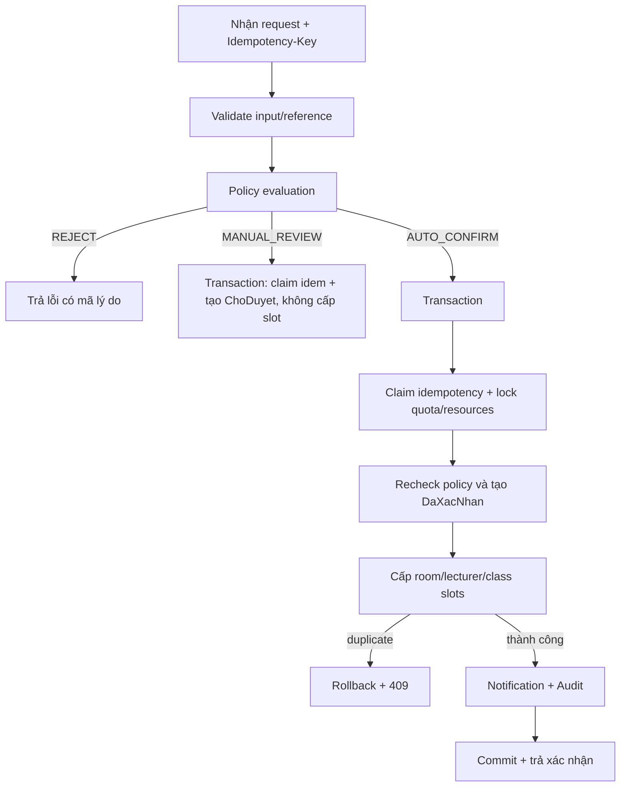

# HỆ THỐNG ĐĂNG KÝ VÀ QUẢN LÝ SỬ DỤNG PHÒNG HỌC

## ĐẶC TẢ THIẾT KẾ CHI TIẾT — v0.2

> Tài liệu này hiện thực hóa các quyết định nghiệp vụ trong `DESCRIPTION_ROOM_BOOKING_DRAFT.md`.
>
> Stack MVP dự kiến: PHP 8.2+, MySQL 8+/InnoDB, Apache; XAMPP chỉ dùng local/demo.
>
> Kiến trúc: Modular Monolith theo feature, giao dịch CSDL là ranh giới bảo vệ tính nhất quán.

# 1. QUYẾT ĐỊNH KIẾN TRÚC

## 1.1. Các quyết định đã chốt

| Mã | Quyết định | Hệ quả thiết kế |
|---|---|---|
| ADR-01 | Đặt phòng theo mô hình lai | `PolicyService` phân loại `TuDong` hoặc `NgoaiLe`; không còn luồng mọi phiếu đều chờ duyệt |
| ADR-02 | Một tiết là đơn vị chiếm dụng | Mọi nguồn phải tạo các room/lecturer/class ledger áp dụng |
| ADR-03 | CSDL là lớp phân xử xung đột cuối cùng | PK các ledger theo `(ResourceID, Ngay, SoTiet)`; duplicate key làm rollback toàn giao dịch |
| ADR-04 | Lịch chính thức phát hành theo batch | Upload → staging → preview → publish all-or-nothing; không import nửa file |
| ADR-05 | Giảng viên không tự phát hành lịch chính thức | Dữ liệu cá nhân chỉ có thể là đề xuất/nhu cầu ở giai đoạn sau |
| ADR-06 | Pilot chỉ cam kết phòng có dữ liệu bao phủ đầy đủ | Phòng thiếu busy-slot của đơn vị ngoài phạm vi không được coi là trống |
| ADR-07 | Không lưu `HoanThanh` trong MVP | “Đang diễn ra/đã qua giờ” được suy ra; chưa có check-in để chứng minh sử dụng thực tế |
| ADR-08 | Không hard-delete lịch sử nghiệp vụ | Dùng trạng thái, batch thay thế/rollback và audit |

## 1.2. Bất biến hệ thống

1. Tại một `(PhongID/GiangVienID/LopHocPhanID, Ngay, SoTiet)` chỉ có tối đa một nguồn chiếm dụng hoạt động trong ledger tương ứng.
2. Booking chỉ ở `DaXacNhan` khi có đủ room/lecturer/class slots áp dụng cho toàn khoảng tiết.
3. Booking `ChoDuyet` không có resource slot và không giữ chỗ.
4. `SlotPhong` luôn chỉ tới đúng một nguồn và loại nguồn phải khớp khóa ngoại đó.
5. Không trả phòng là “trống” nếu không có `BaoPhuLichPhong=DayDu` bao phủ đúng ngày được hỏi.
6. Không mở đặt phát sinh cho một phạm vi ngày trước khi lịch nền tương ứng được phát hành.
7. Thay đổi lịch/khóa phòng/booking và các slot liên quan phải cùng transaction.
8. Không dùng ID tiết để suy ra thứ tự; luôn dùng `KhungTiet.ThuTu` trong cùng phiên bản lịch chuông.

## 1.3. Sơ đồ tổng thể

```text
Browser
  │ HTTPS + Session + CSRF
  ▼
Route → Middleware(role + scope) → Controller
  │
  ▼
Application Services
  ├─ Policy / Classification
  ├─ Availability / Allocation
  ├─ Booking / Exception Queue
  ├─ Schedule Import / Publish
  ├─ Official-occurrence Change
  ├─ Room Closure / Incident
  └─ Notification / Audit / Report
  │
  ▼
Repositories → MySQL 8 / InnoDB
                ├─ transaction
                ├─ PK/UNIQUE/FK/CHECK
                └─ Resource-slot ledgers
```

## 1.4. Module

| Module | Trách nhiệm | Không được làm |
|---|---|---|
| Identity & Organization | tài khoản, role, đơn vị, scope | tự quyết quyền chỉ ở giao diện |
| Facilities | tòa, phòng, thiết bị, quyền dùng phòng | suy đoán phòng con từ mã tòa |
| Academic Reference | học kỳ, khóa, đối tượng/chương trình đào tạo, lớp học phần | coi PDF CTĐT là thời khóa biểu |
| Time & Calendar | lịch chuông, ngày nghỉ, cửa sổ mở đặt | hard-code K65 = năm 4 |
| Schedule Import | staging, validate, diff, publish, replace | ghi trực tiếp từng dòng vào lịch hoạt động |
| Booking | search, classify, auto-confirm, manual exception | check-then-insert ngoài transaction |
| Room Incident | khóa có kế hoạch, sự cố, bố trí lại | âm thầm xóa booking/lịch |
| Notification & Audit | inbox và dấu vết bất biến | nhận audit trực tiếp từ client |
| Reports | số liệu theo kế hoạch, SLA | gọi là sử dụng thực tế khi chưa check-in |

## 1.5. Cấu trúc dự án dự kiến

```text
project/
├── public/
├── src/
│   ├── config/
│   ├── middleware/
│   ├── modules/
│   │   ├── identity/
│   │   ├── organization/
│   │   ├── facilities/
│   │   ├── academic/
│   │   ├── schedules/
│   │   ├── bookings/
│   │   ├── incidents/
│   │   ├── notifications/
│   │   └── reports/
│   └── shared/
├── database/
├── tests/
├── DESCRIPTION_ROOM_BOOKING_DRAFT.md
└── DESIGN_ROOM_BOOKING_DRAFT.md
```

# 2. THIẾT KẾ DỮ LIỆU

## 2.1. Nhóm thực thể

| Nhóm | Bảng chính |
|---|---|
| Danh tính/tổ chức | `Role`, `DonVi`, `User`, `UserRole`, `PhamViQuanLy` |
| Cơ sở vật chất | `ToaNha`, `Phong`, `LichSuTrangThaiPhong`, `BaoPhuLichPhong`, `BaoPhuLichCanCu`, `QuyenSuDungPhong`, `ThietBi`, `PhongThietBi`, `HoSoYeuCauPhong` |
| Thời gian | `PhienBanLichChuong`, `KhungTiet`, `NamHocHocKy`, `LichNgay`, `NgayKhongHoatDong` |
| Đào tạo | `KhoaHoc`, `DoiTuongDaoTao`, `ChuongTrinhDaoTao`, `ChuongTrinhApDung`, `HocPhan`, `ChuongTrinhHocPhan`, `LopHocPhan`, `LopHocPhanDoiTuong`, `PhanCongGiangDay` |
| Import/lịch | `NguonLich`, `NguonLichSteward`, `SnapshotLichHienHanh`, `DotImportLich`, `TacVuPhatHanhLich`, `DongImportLich`, `LichChinhThuc`, `YeuCauGiaiPhongLich` |
| Booking | `MucDichDatPhong`, `ChinhSachDatPhong`, `PhieuDatPhong`, `YeuCauThietBi`, `SlotPhong`, `SlotGiangVien`, `SlotLopHocPhan` |
| Sự cố | `PhongBiKhoa`, `AnhHuongSuCo` |
| Hệ thống | `ThongBao`, `NhatKyHeThong`, `IdempotencyRequest`, `PhienBanDanhMuc` |

## 2.2. Quan hệ lõi

```mermaid
erDiagram
    DonVi ||--o{ User : belongs
    Role ||--o{ UserRole : grants
    User ||--o{ UserRole : has
    User ||--o{ PhamViQuanLy : has
    DonVi ||--o{ Phong : manages
    ToaNha ||--o{ Phong : contains
    Phong ||--o{ LichSuTrangThaiPhong : state_history
    Phong ||--o{ BaoPhuLichPhong : covered
    NamHocHocKy ||--o{ BaoPhuLichPhong : scopes
    Phong ||--o{ QuyenSuDungPhong : governed
    DonVi ||--o{ QuyenSuDungPhong : accesses
    Phong ||--o{ PhongThietBi : contains
    ThietBi ||--o{ PhongThietBi : typed

    PhienBanLichChuong ||--o{ KhungTiet : defines
    NamHocHocKy }o--|| PhienBanLichChuong : uses
    NamHocHocKy ||--o{ LichNgay : contains
    DonVi ||--o{ DoiTuongDaoTao : owns
    DoiTuongDaoTao ||--o{ ChuongTrinhDaoTao : versions
    KhoaHoc ||--o{ ChuongTrinhApDung : cohort
    ChuongTrinhDaoTao ||--o{ ChuongTrinhApDung : applies_to
    HocPhan ||--o{ ChuongTrinhHocPhan : included
    ChuongTrinhDaoTao ||--o{ ChuongTrinhHocPhan : contains
    HocPhan ||--o{ LopHocPhan : opened_as
    NamHocHocKy ||--o{ LopHocPhan : offered_in
    LopHocPhan ||--o{ LopHocPhanDoiTuong : targets
    DoiTuongDaoTao ||--o{ LopHocPhanDoiTuong : target
    KhoaHoc ||--o{ LopHocPhanDoiTuong : cohort
    LopHocPhan ||--o{ PhanCongGiangDay : assigned
    User ||--o{ PhanCongGiangDay : teaches

    NguonLich ||--o{ DotImportLich : provides
    NguonLich ||--o{ NguonLichSteward : authorizes
    User ||--o{ NguonLichSteward : assigned
    NamHocHocKy ||--o{ SnapshotLichHienHanh : scopes
    NguonLich ||--o{ SnapshotLichHienHanh : current
    DotImportLich ||--o{ DongImportLich : stages
    DotImportLich ||--o{ TacVuPhatHanhLich : queued_as
    DotImportLich ||--o{ LichChinhThuc : publishes
    Phong ||--o{ LichChinhThuc : scheduled
    LichChinhThuc ||--o{ YeuCauGiaiPhongLich : change_request

    User ||--o{ PhieuDatPhong : creates
    MucDichDatPhong ||--o{ PhieuDatPhong : classifies
    Phong ||--o{ PhieuDatPhong : requested
    PhieuDatPhong ||--o{ YeuCauThietBi : needs
    Phong ||--o{ PhongBiKhoa : blocked

    Phong ||--o{ SlotPhong : occupied
    KhungTiet ||--o{ SlotPhong : period
    LichChinhThuc o|--o{ SlotPhong : source
    PhieuDatPhong o|--o{ SlotPhong : source
    PhongBiKhoa o|--o{ SlotPhong : source
    User ||--o{ SlotGiangVien : occupied
    LopHocPhan ||--o{ SlotLopHocPhan : occupied
```



## 2.3. Danh tính và phạm vi

### `Role`

Catalog MVP gồm `GiangVien`, `QuanLyPhongLich`, `Admin`. Role chỉ cấp nhóm capability; quyền trên entity cụ thể vẫn cần ownership, `PhamViQuanLy` hoặc `NguonLichSteward`. Không dùng một cột role duy nhất trên `User`.

### `DonVi`

| Cột | Kiểu/ràng buộc | Ý nghĩa |
|---|---|---|
| `DonViID` | INT PK | định danh |
| `MaDonVi` | VARCHAR(30) UNIQUE NOT NULL | mã chính thức; chưa tự đặt khi chưa có nguồn |
| `TenDonVi` | VARCHAR(150) NOT NULL | tên hiển thị |
| `LoaiDonVi` | VARCHAR(30) CHECK | `Khoa`, `PhongBan`, `Khac` |
| `TrangThai` | VARCHAR(20) CHECK | `HoatDong`, `TamNgung`, `NgungHoatDong` |

Hai khoa thí điểm là hai dòng `DonVi`; không lưu dưới dạng chuỗi tự do trong `User`.

### `User`

Các cột lõi: `UserID`, `MaNguoiDung`, `Username`, `PasswordHash`, `FullName`, `Email`, `DonViID`, `TrangThai`, `FailedLoginCount`, `LockedUntil`, `CreatedAt`, `UpdatedAt`.

- `Username`, `MaNguoiDung` là unique.
- `LockedUntil` dùng cho khóa tạm do đăng nhập sai; `TrangThai=DaKhoa` là khóa hành chính.
- Không lưu mật khẩu, token hoặc password hash vào audit before/after.

### `UserRole`

Khóa `(UserID, RoleID)`, có `HieuLucTu`, `HieuLucDen`, người gán và trạng thái. Một tài khoản có thể đồng thời là giảng viên và người quản lý; permission là hợp role nhưng action quản lý vẫn phải qua `PhamViQuanLy`.

### `PhamViQuanLy`

Gán một người quản lý cho `DonViID`, `ToaNhaID` hoặc `PhongID`; **đúng một** trong ba scope FK khác `NULL` trên mỗi dòng. Nhiều dòng của cùng user được hợp theo phép OR. Middleware chỉ cho thao tác đối tượng nằm trong hợp scope đó.

## 2.4. Cơ sở vật chất

### `ToaNha`

`ToaNhaID`, `MaToa`, `TenToa`, `DiaDiem`, `TrangThai`. Không seed `G1`–`G8` vào bảng này cho đến khi xác nhận đó là mã tòa thay vì mã phòng.

### `Phong`

| Cột | Kiểu/ràng buộc | Ý nghĩa |
|---|---|---|
| `PhongID` | INT PK AUTO_INCREMENT | |
| `ToaNhaID` | INT FK NULL | null nếu mô hình thực tế là phòng độc lập |
| `MaPhong` | VARCHAR(30) UNIQUE NOT NULL | mã tài nguyên dùng trong CSV |
| `TenPhong` | VARCHAR(100) | |
| `DonViQuanLyID` | INT FK NOT NULL | không nhất thiết là khoa dùng phòng |
| `LoaiKhongGian` | VARCHAR(30) | `PhongThuong`, `PhongMay`, `NgoaiNgu`, `ChuyenDung`, `VanPhong`... |
| `SucChua` | INT NULL | nếu `ChoPhepDat=true` thì bắt buộc > 0; không gian không đặt được có thể null |
| `ChoPhepDat` | BOOLEAN NOT NULL | văn phòng mặc định false |
| `MucQuyenMacDinh` | VARCHAR(20) | `CanDuyet` hoặc `Cam`; mặc định an toàn là `CanDuyet` |
| `TrangThai` | VARCHAR(20) CHECK | `HoatDong`, `TamNgung`, `NgungSuDung` |
| `Version` | BIGINT NOT NULL | tăng sau mỗi thay đổi để chống ghi đè và khôi phục trạng thái cũ sai |
| `CreatedAt`, `UpdatedAt` | DATETIME | |

Nếu mã phòng chỉ duy nhất trong một tòa thì thay unique toàn cục bằng `UNIQUE(ToaNhaID, MaPhongNoiBo)` và tạo `MaPhong` canonical để dùng trong CSV.

Chuyển `NgungSuDung|TamNgung → HoatDong` không tự mở booking: cùng transaction phải tăng `Version`, invalidate coverage liên quan về `CanXacNhanLai` và yêu cầu xác nhận lại inventory/nguồn lịch trước khi phòng xuất hiện trong availability.

### `LichSuTrangThaiPhong`

Lưu các khoảng không chồng nhau `(PhongID, TrangThai, HieuLucTu, HieuLucDen, LyDo, ActorID, PhongBiKhoaID?)`. `Phong.TrangThai` là cache trạng thái hiện tại; mọi mutation phải đóng khoảng cũ, mở khoảng mới và tăng `Phong.Version` trong cùng transaction. Báo cáo lịch sử dùng bảng này hợp với `PhongBiKhoa`, không suy diễn trạng thái quá khứ từ giá trị current hoặc audit text.

### `BaoPhuLichPhong`

Xác nhận hệ thống có đủ occupancy để kết luận phòng trống trong một khoảng thời gian: `BaoPhuID`, `PhongID`, `HocKyID`, `TuNgay`, `DenNgay`, `TrangThai` (`DayDu`, `ChuaDayDu`, `CanXacNhanLai`), `Version`, `XacNhanBy`, `XacNhanAt`. `TuNgay/DenNgay` bắt buộc nằm trong học kỳ và `TuNgay <= DenNgay`; các khoảng `DayDu` của cùng phòng không được có metadata nguồn mâu thuẫn. `BaoPhuLichCanCu` liên kết coverage với từng snapshot lịch làm căn cứ. Xác nhận coverage lock/recheck các current pointer và tập nguồn bắt buộc; mọi publish/replace/rollback làm đổi căn cứ, thay đổi `NguonLich.BatBuocChoLichNen`/status/scope, hoặc kích hoạt lại phòng đều chuyển coverage liên quan sang `CanXacNhanLai` trong cùng transaction. Availability yêu cầu coverage `DayDu` bao phủ đúng ngày được hỏi.

### `QuyenSuDungPhong`

Có `QuyenID` PK, `PhongID`, `DonViID`, `MucQuyen` (`TuDong`, `CanDuyet`, `Cam`), `HieuLucTu`, `HieuLucDen`, người ban hành. `UNIQUE(PhongID, DonViID, HieuLucTu)`; service cấm hai version hiệu lực chồng nhau. Không có version hiệu lực thì dùng `Phong.MucQuyenMacDinh`. `Cam` bị loại, `CanDuyet` chỉ cho tạo ngoại lệ, `TuDong` mới được đi tiếp tới các rule auto-confirm khác.

### `ThietBi`

Tối thiểu có `ThietBiID`, `MaThietBi` unique, `TenThietBi`, đơn vị tính và trạng thái.

### `PhongThietBi`

Khóa `(PhongID, ThietBiID)`, gồm `SoLuongTong >= 0`, `SoLuongKhaDung` nằm trong `[0, SoLuongTong]`, `GhiChuTinhTrang`, `UpdatedAt`. Tìm phòng, booking và publish dùng số lượng khả dụng tại lúc kiểm tra lại trong transaction, không dùng số lượng tổng.

### `HoSoYeuCauPhong`

Profile tái sử dụng cho loại buổi: `HoSoID`, `MaHoSo` unique, `LoaiBuoi`, tập loại phòng được chấp nhận, sức chứa tối thiểu nếu có và trạng thái. Bảng con `HoSoYeuCauThietBi(HoSoID, ThietBiID, SoLuongToiThieu)` mô tả thiết bị bắt buộc. `MaHoSoPhong` trong CSV resolve vào đây; nếu để trống, chỉ áp rule mặc định của `LoaiBuoi`.

## 2.5. Thời gian và học kỳ

### `PhienBanLichChuong`

`PhienBanID`, `MaPhienBan`, `Ten`, `HieuLucTu`, `HieuLucDen`, `TrangThai`, `NguonDuLieu`. Không được chuyển profile sang `DaPhatHanh` hoặc gắn vào học kỳ mở đặt nếu còn bất kỳ `KhungTiet.DaXacMinh=false`.

### `KhungTiet`

| Cột | Kiểu/ràng buộc |
|---|---|
| `KhungTietID` | INT PK |
| `PhienBanID` | FK NOT NULL |
| `SoTiet` | SMALLINT NOT NULL |
| `ThuTu` | SMALLINT NOT NULL |
| `Buoi` | `Sang`, `Chieu`, `Toi` |
| `GioBatDau` | TIME NOT NULL |
| `GioKetThuc` | TIME NOT NULL |
| `DaXacMinh` | BOOLEAN NOT NULL DEFAULT FALSE |

Ràng buộc: `UNIQUE(PhienBanID, SoTiet)`, `UNIQUE(PhienBanID, ThuTu)`, `GioBatDau < GioKetThuc`. Khoảng đặt hợp lệ được lấy bằng `ThuTu BETWEEN`, đồng thời tất cả tiết phải cùng `PhienBanID` và cùng `Buoi`.

### `NamHocHocKy`

Gồm `HocKyID`, `NamHoc`, `HocKy`, `NgayBatDau`, `NgayKetThuc`, `PhienBanLichChuongID`, `TrangThaiLichNen` (`ChuaDayDu`, `DaPhatHanh`, `CanXacNhanLai`), `MoDatPhongTu`, `DongDatPhongLuc`. MVP giả định một học kỳ dùng đúng một phiên bản lịch chuông và không đổi giữa kỳ; các khoảng học kỳ active không được chồng ngày. `TrangThaiLichNen=DaPhatHanh` chỉ được đặt khi mọi `NguonLich` nội bộ được cấu hình là bắt buộc đã có current snapshot; thay đổi tập/trạng thái/scope nguồn bắt buộc hạ trạng thái này và coverage liên quan trong cùng transaction. Đây vẫn chỉ là điều kiện cần, còn coverage phòng/ngày là guard cuối cho auto-confirm.

Sau khi học kỳ có current snapshot, booking hoặc closure, cấm đổi `PhienBanLichChuongID`, ngày bắt đầu/kết thúc theo generic update. Muốn đổi phải dùng migration/calendar-change workflow có preview toàn bộ ảnh hưởng; workflow đó ngoài MVP. Các trường metadata không ảnh hưởng allocation vẫn dùng optimistic version.

### `LichNgay`

Ánh xạ canonical `Ngay` → `HocKyID`, `TrangThai` (`HoatDong`, `Nghi`) cho pilot một cơ sở. Phiên bản lịch chuông **chỉ** được suy ra từ `NamHocHocKy.PhienBanLichChuongID`, không lưu lặp trên `LichNgay`. `Ngay` là unique trong phạm vi pilot, vì vậy mọi allocation cùng ngày resolve cùng một học kỳ và profile. Nếu sau này nhiều cơ sở hoặc thay lịch chuông giữa kỳ thì phải version lại key/mô hình, không thêm cột trùng nguồn sự thật một cách ngầm định.

Đổi `HoatDong↔Nghi` là action có preview và lock calendar. Nếu ngày còn occurrence, booking hoặc closure, mutation bị chặn; phải xử lý các source qua đúng workflow trước. Không được đổi calendar để vô hiệu hóa ngầm một lịch đã xác nhận.

### `NgayKhongHoatDong`

Chỉ lưu ngày/khung tiết đóng cục bộ theo tòa **hoặc** phòng; đúng một scope FK khác `NULL`. Ngày nghỉ toàn trường dùng nguồn chuẩn `LichNgay.TrangThai=Nghi`, không ghi lặp ở đây. Cả ngày nghỉ toàn trường lẫn đóng cục bộ đều là hard reject đối với booking; muốn mở lại phải qua action quản trị lịch/cơ sở vật chất có preview, quyền riêng và audit, không phải “duyệt ngoại lệ” của một phiếu đặt phòng.

Đóng cục bộ có kế hoạch bị chặn nếu giao source đã xác nhận; phải dời/hủy source trước. Tình huống khẩn cấp dùng workflow sự cố để tạo impact/notification, không insert trực tiếp `NgayKhongHoatDong` nhằm né ledger.

## 2.6. Dữ liệu đào tạo

- `KhoaHoc`: `MaKhoaHoc` (`K65`–`K68`), năm tuyển sinh nếu đã xác minh.
- `DoiTuongDaoTao`: tên trung lập cho CNTT/KHMT/HTTTQL/NNA, thuộc `DonVi` và có `LoaiDoiTuong` (`Nganh`, `ChuyenNganh`, `ChuongTrinh`). Chỉ chốt loại và mã sau khi đọc metadata chính thức.
- `ChuongTrinhDaoTao`: version theo đối tượng đào tạo, ngày hiệu lực và tệp nguồn.
- `ChuongTrinhApDung`: many-to-many chương trình–khóa, có `ApDungTu/Den`; dùng khi một PDF/version áp dụng nhiều cohort thay vì nhân bản chương trình.
- `HocPhan`: mã, tên, số tín chỉ/thuộc tính chỉ nhập khi đọc được nguồn thật.
- `ChuongTrinhHocPhan`: liên kết chương trình–học phần và học kỳ gợi ý.
- `LopHocPhan`: bắt buộc tham chiếu `HocPhanID` và `HocKyID`, có mã lớp, sĩ số kế hoạch và trạng thái.
- `LopHocPhanDoiTuong`: khóa `(LopHocPhanID, DoiTuongDaoTaoID, KhoaHocID)`, cho phép một lớp ghép nhiều đối tượng/khóa; một dòng có thể được đánh dấu đối tượng chính để báo cáo.
- `PhanCongGiangDay`: many-to-many lớp học phần–giảng viên, có vai trò chính/phụ.

Không tạo dữ liệu học phần từ tên file PDF. Bốn PDF phải được cung cấp và trích dẫn nguồn trước khi seed.

## 2.7. Import và lịch chính thức

### `NguonLich`

Định danh feed/đầu mối cung cấp: `NguonLichID`, `MaNguonLich` unique, tên, scope quản lý, `BatBuocChoLichNen` và trạng thái. Steward nằm ở assignment riêng, không phải một chuỗi/cột quyền đơn. Một feed có thể tổng hợp nhiều `MaDonVi`; đơn vị sở hữu từng occurrence nằm trên dòng dữ liệu, không dùng feed thay cho đơn vị. Mutation `BatBuocChoLichNen`, scope hoặc trạng thái là action có impact preview; transaction phải tăng `PhienBanDanhMuc`, hạ `TrangThaiLichNen` và invalidate mọi coverage lấy tập nguồn cũ làm căn cứ.

### `NguonLichSteward`

Assignment many-to-many `(NguonLichID, UserID)`, có `HieuLucTu/HieuLucDen`, trạng thái và các quyền typed `ChoKiemTra`, `ChoPhatHanh`, `ChoRollback`, `ChoXuLySuCoNgoaiPhamVi`. “Steward” không phải role toàn cục thứ tư: backend yêu cầu đồng thời role quản lý phù hợp **và** assignment nguồn còn hiệu lực. Admin kỹ thuật không mặc nhiên có quyền publish.

### `SnapshotLichHienHanh`

Khóa `(HocKyID, NguonLichID)`, có `CurrentDotImportID` nullable, `Version`, `UpdatedAt`. Dòng được tạo sẵn khi bật nguồn cho học kỳ, kể cả chưa có snapshot, để hai lần publish đầu tiên vẫn lock cùng một mutex. Đây là con trỏ duy nhất xác định full snapshot đang hiệu lực và phải lock khi preview cuối/publish/replace/rollback.

### `DotImportLich`

| Cột | Ý nghĩa |
|---|---|
| `DotImportID` | PK |
| `HocKyID`, `NguonLichID` | scope full snapshot |
| `TenTepGoc`, `KichThuocByte`, `FileSha256`, `CanonicalHash` | integrity và so sánh nội dung |
| `SchemaVersion` | hiện là `1` |
| `CheDo` | `Moi`, `ThayThe` |
| `DotBiThayTheID` | đúng snapshot current tại lúc tạo preview |
| `ReferenceVersion` | fingerprint catalog dùng cho preview |
| `TrangThai` | `DangTai`, `CoLoi`, `CanKiemTraLai`, `SanSang`, `ChoPhatHanh`, `DangPhatHanh`, `DaPhatHanh`, `KhongThayDoi`, `BiThayThe`, `DaRollback` |
| `ResolvedToDotImportID` | FK NULL; batch current mà một publish no-op được quy về |
| `TongDong`, `SoHopLe`, `SoLoi`, `SoCanhBao` | thống kê |
| `NguoiTaiID`, `NguoiPhatHanhID`, timestamps | trách nhiệm |

Hash không unique trên mọi batch: cùng file phải được phép upload lại sau batch lỗi/rollback. Khi publish, nếu `CanonicalHash` bằng snapshot current thì trả no-op/idempotent tới batch hiện tại. `CheDo=Moi` chỉ hợp lệ khi scope chưa có current; mọi sửa đổi sau đó là full replacement, không phải delta.

Các FK lặp scope phải được bảo vệ ở CSDL, không chỉ ở service: `UNIQUE(DotImportID, HocKyID, NguonLichID)` trên batch; composite FK tương ứng từ `LichChinhThuc` và `SnapshotLichHienHanh.CurrentDotImportID`. `DotBiThayTheID` và `ResolvedToDotImportID` cũng phải cùng `HocKyID/NguonLichID` (composite FK hoặc constraint tương đương). Không thể trỏ snapshot của nguồn/học kỳ A sang batch B.

Publish batch không tự tạo coverage `DayDu`. Sau khi các snapshot cần thiết đã phát hành, người quản lý xác nhận coverage cho phòng/khoảng ngày. `BaoPhuLichCanCu(BaoPhuID, DotImportID)` lưu chính xác các batch làm căn cứ. Mọi publish/replace/rollback làm đổi một căn cứ đều vô hiệu hóa coverage liên quan trong cùng transaction; phải xác nhận lại trước khi availability mở.

### `TacVuPhatHanhLich`

Job bền vững cho publish bất đồng bộ: `TacVuID`, `DotImportID`, `IdempotencyRequestID`, trạng thái `ChoChay|DangChay|ThanhCong|ThatBai`, `AttemptCount`, `LeaseUntil`, lỗi cuối và timestamps. Generated key/partial-key tương đương bảo đảm mỗi batch chỉ có tối đa một job active (`ChoChay|DangChay`). Endpoint publish hoàn tất idempotency ở mức **enqueue** và trả cùng `TacVuID` khi retry; worker không claim lại idempotency HTTP. Lease hết hạn cho phép reconciliation đưa job về hàng đợi an toàn.

### `DongImportLich`

Lưu staging: `DotImportID`, `SoDong`, các trường CSV v1 đã parse, `DuLieuGocJSON`, `TrangThaiKiemTra`, `DanhSachLoiJSON`. Bảng này không tham gia availability. `UNIQUE(DotImportID, MaDongNguon)` chỉ ngăn lặp trong một file.

### `LichChinhThuc`

| Cột | Kiểu/ràng buộc |
|---|---|
| `LichChinhThucID` | BIGINT PK |
| `DotImportID`, `NguonLichID` | FK NOT NULL |
| `LichChinhThucTruocID` | self-FK NULL; lineage cùng source key qua replacement |
| `MaDongNguon` | VARCHAR(100) NOT NULL; identity ổn định trong nguồn/học kỳ |
| `HocKyID`, `DonViID` | FK NOT NULL |
| `DoiTuongDaoTaoID`, `KhoaHocID` | FK NULL; giữ giá trị chính từ CSV khi không thể suy ra duy nhất từ lớp |
| `HocPhanID`, `LopHocPhanID` | FK NULL theo loại hoạt động |
| `GiangVienPhuTrachID` | FK NULL; bắt buộc cho lịch học nội bộ |
| `PhongID`, `Ngay` | FK/DATE NOT NULL |
| `TietBatDauID`, `TietKetThucID` | FK NOT NULL |
| `PhamViNguon` | `NoiBo`, `NgoaiPhamVi` |
| `LoaiHoatDong` | `LichHoc`, `LichThi`, `SuKien`, `KhongRo` |
| `LoaiBuoi`, `HoSoYeuCauPhongID` | yêu cầu phòng/thiết bị |
| `TenHoatDong`, `SiSo`, `GhiChu` | nội dung |
| `TrangThaiNghiepVu` | `HoatDong`, `DaGiaiPhong`, `CanBoTriLai`, `DaHuy` |
| `ReleasedBy`, `ReleasedAt`, `LyDoThayDoi` | lịch sử giải phóng |

`UNIQUE(DotImportID, MaDongNguon)`. Hiệu lực phiên bản không nằm trong `TrangThaiNghiepVu`: một occurrence chỉ là current khi batch của nó đúng bằng `SnapshotLichHienHanh.CurrentDotImportID`. Occurrence có room/lecturer/class slot khi và chỉ khi nó current và trạng thái nghiệp vụ yêu cầu giữ tài nguyên.

Replacement diff theo `MaDongNguon` và đánh giá world-state sau khi loại slot của chính `DotBiThayTheID`; dòng giữ nguyên không tự conflict với batch cũ. Fingerprint nghiệp vụ gồm ngày/tiết/phòng, đơn vị, đối tượng/khóa, học phần/lớp, giảng viên phụ trách, loại hoạt động/buổi, sĩ số, hồ sơ phòng và tên hoạt động đã chuẩn hóa (không gồm ghi chú thuần túy). State vận hành chỉ được carry-forward khi cả source key **và fingerprint** không đổi. Key `DaGiaiPhong`/`DaHuy` đổi fingerprint hoặc key đang `CanBoTriLai`/có sự cố buộc preview yêu cầu quyết định rõ; không tự hồi sinh hay tự carry. Không san phẳng state occurrence thành `BiThayThe`.

### `YeuCauGiaiPhongLich`

Liên kết một `LichChinhThucID` current với người gửi, lý do, minh chứng tùy chọn, trạng thái `ChoXacNhan|DaXacNhan|TuChoi|DaHuy`, người xử lý và timestamps. Generated column `ActiveOccurrenceID = IF(TrangThai='ChoXacNhan', LichChinhThucID, NULL)` có UNIQUE để mỗi occurrence tối đa một yêu cầu active. Chỉ `GiangVienPhuTrachID` hoặc quản lý đúng scope được tạo; nguồn `NgoaiPhamVi` không đi qua workflow này và chỉ steward của `NguonLich` được replace/invalidate.

## 2.8. Booking và chính sách

### `MucDichDatPhong`

Danh mục có mã, tên, `ChoPhepTuDong`, `MucDoUuTien`, `BatBuocLopHocPhan`, trạng thái. Nội dung tự do chỉ là phần giải thích, không dùng thay cho mã mục đích.

### `ChinhSachDatPhong`

Chính sách có kiểu rõ ràng và version: phạm vi toàn hệ thống/đơn vị/phòng, `MinLeadMinutes`, `MaxAdvanceDays`, `MaxPeriodsPerRequest`, `MaxActiveBookingsPerUser`, `MaxPendingRequestsPerUser`, `ChoPhepQuanLyVuotQuota`, ngày hiệu lực và trạng thái. Precedence cố định: phòng > đơn vị > global. Kết quả merge được đóng thành `BoChinhSachVersion` immutable có hash và đầy đủ các giá trị trên; phiếu tham chiếu snapshot này. MVP luôn cấm một phiếu cắt qua hai buổi; không tạo cờ cấu hình không thể thực thi. Không dùng bảng key-value không kiểu.

### `PhieuDatPhong`

| Cột | Kiểu/ràng buộc | Ý nghĩa |
|---|---|---|
| `PhieuDatPhongID` | BIGINT PK | |
| `MaDatPhong` | VARCHAR(30) UNIQUE | mã hiển thị |
| `GiangVienID`, `DonViSnapshotID` | FK NOT NULL | người tạo + đơn vị tại lúc tạo |
| `PhongID`, `NgaySuDung` | FK/DATE NOT NULL | |
| `TietBatDauID`, `TietKetThucID` | FK NOT NULL | |
| `MucDichID`, `MoTaMucDich` | FK/text | |
| `LopHocPhanID` | FK NULL | tham chiếu nếu có |
| `SoNguoi` | INT CHECK > 0 | |
| `KieuXuLy` | `TuDong`, `NgoaiLe` | kết quả phân loại |
| `PolicyAtSubmitID` | FK NOT NULL | policy snapshot khi gửi |
| `PolicyAtDecisionID` | FK NULL | snapshot khi quyết định ngoại lệ |
| `LyDoPhanLoaiJSON` | JSON | mảng mã lý do có cấu trúc |
| `MucDoUuTien` | SMALLINT | số lớn hơn được xếp trước; snapshot từ policy/mục đích |
| `TrangThai` | xem state machine | |
| `NguonXacNhan` | `HeThong`, `NguoiQuanLy`, NULL | chỉ có khi xác nhận |
| `NguoiXuLyID`, `LyDoQuyetDinh`, `LyDoTuChoi`, `LyDoHuy` | nullable | lưu được giải thích duyệt/khác thứ tự, không chỉ nằm trong request |
| `QuotaOverride`, `PolicyChangeAcknowledged` | BOOLEAN NOT NULL DEFAULT FALSE | bằng chứng quyết định explicit; chỉ service được đặt |
| `HanXuLyLuc` | DATETIME NULL | ngoại lệ bắt buộc có deadline trước/đúng giờ bắt đầu; tự động bắt buộc `NULL` bằng `CHECK` theo `KieuXuLy` |
| timestamps | tạo/xác nhận/hủy/hết hạn | |

Trạng thái hợp lệ: `ChoDuyet`, `DaXacNhan`, `TuChoi`, `DaHuy`, `HetHan`, `CanBoTriLai`.

Index tối thiểu: `(TrangThai, HanXuLyLuc)` cho expiry queue, `(GiangVienID, TrangThai, NgaySuDung)` cho quota/lịch cá nhân, `(PhongID, NgaySuDung)` cho impact query.

`MaxActiveBookingsPerUser` đếm các phiếu `DaXacNhan|CanBoTriLai` chưa qua thời điểm kết thúc; `ChoDuyet` dùng hạn mức riêng `MaxPendingRequestsPerUser`. Tạo/rút/expire/duyệt/hủy và mọi transition làm đổi một trong hai tập đều khóa cùng dòng `User` trước khi đếm lại. Vượt active quota chỉ được duyệt nếu policy cho phép override và người quản lý gửi cờ + lý do rõ; các lần duyệt đồng thời được serialize nên mỗi người thấy số đếm sau quyết định trước.

### `YeuCauThietBi`

Khóa `(PhieuDatPhongID, ThietBiID)`, `SoLuongToiThieu > 0`. Trong MVP mọi thiết bị được chọn đều là bắt buộc, không có khái niệm “ưu tiên có”.

## 2.9. Resource-slot ledgers

### `SlotPhong`

| Cột | Ràng buộc |
|---|---|
| `PhongID` | PK(1), FK |
| `Ngay` | PK(2) |
| `SoTiet` | PK(3); snapshot số tiết canonical của ngày |
| `KhungTietID` | FK NOT NULL; truy vết profile/giờ |
| `LoaiNguon` | CHECK `LichChinhThuc`, `DatPhong`, `KhoaPhong` |
| `LichChinhThucID` | FK NULL |
| `PhieuDatPhongID` | FK NULL |
| `PhongBiKhoaID` | FK NULL |
| `CreatedAt` | NOT NULL |

CSDL phải có `CHECK` bảo đảm đúng một trong ba FK nguồn khác `NULL` và khớp `LoaiNguon`. Lịch `PhamViNguon=NgoaiPhamVi` vẫn dùng source slot `LichChinhThuc`. `LichNgay` + service bảo đảm `KhungTietID` thuộc profile canonical của `Ngay` và có đúng `SoTiet`; PK dùng `SoTiet` để một profile sai ID cũng không tạo được hai occupancy cùng số tiết.

### `SlotGiangVien`

PK `(GiangVienID, Ngay, SoTiet)`, có `KhungTietID`, `LoaiNguon` (`LichChinhThuc|DatPhong`) và đúng một FK nguồn tương ứng. Mọi lịch/booking có giảng viên phụ trách phải cấp ledger này trong cùng transaction với room slot.

### `SlotLopHocPhan`

PK `(LopHocPhanID, Ngay, SoTiet)`, có `KhungTietID`, `LoaiNguon` và source FK như trên. Chỉ tạo khi occurrence/booking gắn lớp học phần. Bảng này bảo vệ lớp khỏi hai hoạt động đồng thời, kể cả ở hai phòng khác nhau.

Hai ledger này cũng có `CHECK` đúng một source FK, `LoaiNguon` khớp và FK `RESTRICT`; không cascade âm thầm.

Invariant theo trạng thái:

- booking `DaXacNhan`: đủ room + lecturer + class slots tương ứng;
- booking `CanBoTriLai`: không có room slot nhưng giữ lecturer/class slots;
- booking `ChoDuyet`, `TuChoi`, `DaHuy`, `HetHan`: không có slot nào;
- occurrence current `HoatDong`: đủ các slot áp dụng; `CanBoTriLai` giữ lecturer/class nhưng không giữ room; `DaGiaiPhong`/`DaHuy` không có slot;
- state và toàn bộ ledger liên quan luôn đổi trong một transaction.

Chính sách xóa FK là `RESTRICT`; service phải giải phóng slot trong transaction trước khi chuyển trạng thái nguồn. Không cascade âm thầm.

## 2.10. Khóa phòng và ảnh hưởng sự cố

### `PhongBiKhoa`

Gồm phòng, `TuNgay/DenNgayDuKien`, tiết, loại `KeHoach|KhanCap`, lý do, mức độ, `TrangThai` (`Nhap`, `HoatDong`, `DaKetThuc`, `DaHuy`), `TrangThaiPhongTruoc`, `PhongVersionSauKhiTamNgung`, người tạo/kết thúc/hủy và timestamps. Một bản ghi có nhiều room slot sau khi kích hoạt. MVP không cho hai closure active chồng cùng phòng/ngày/tiết; thao tác mở rộng/thu hẹp closure hiện có phải preview lại tác động và cập nhật slot nguyên tử. MVP bắt buộc mốc kết thúc dự kiến; sự cố chưa biết thời hạn thực đồng thời chuyển `Phong.TrangThai=TamNgung` để chặn booking mới và phải được gia hạn/đánh giá lại trước mốc dự kiến. Khi kết thúc chỉ khôi phục `TrangThaiPhongTruoc` nếu phòng vẫn `TamNgung` và `Phong.Version` đúng bằng version lưu sau lúc closure đổi trạng thái; mọi thay đổi quản trị xen giữa làm mất quyền tự khôi phục.

### `AnhHuongSuCo`

Lưu `PhongBiKhoaID` bắt buộc và từng `LichChinhThucID` hoặc `PhieuDatPhongID` bị ảnh hưởng, phòng cũ, trạng thái trước sự cố, kết quả `ChoBoTriLai|DaChuyen|DaHuy|ChoNguonNgoaiXuLy`, phòng mới và người xử lý. Đúng một FK đối tượng phải khác `NULL`; unique theo `(PhongBiKhoaID, loại đối tượng, ID đối tượng)`. Với lịch ngoài phạm vi, emergency role chỉ được đặt local operational override vì an toàn vật lý; nội dung, bố trí lại và hủy vẫn chỉ do steward nguồn xử lý.

## 2.11. Thông báo, audit và idempotency

- `ThongBao`: người nhận, loại sự kiện, tiêu đề, nội dung, đối tượng liên quan, `CreatedAt`, `ReadAt`.
- `NhatKyHeThong`: actor, action, entity, entity ID, `CorrelationID`, `BatchID`, before/after JSON đã lọc bí mật, IP, user-agent, timestamp. Không có API sửa/xóa.
- `IdempotencyRequest`: `UNIQUE(UserID, ActionKey, IdempotencyKey)`, `RequestHash`, `TrangThai` (`Processing`, `Completed`), `ResourceType`, `ResourceID`, canonical result tối thiểu, `ExpiresAt`. `ActionKey` là tên action server-side ổn định, không dùng raw URL. Cùng key nhưng khác hash bị từ chối; kết quả completed được replay. Với lệnh bất đồng bộ, `Completed` nghĩa là đã tạo/nhận diện đúng một job và canonical result chứa job ID, không có nghĩa nghiệp vụ nền đã thành công.
- `PhienBanDanhMuc`: singleton/version mutex tăng trong cùng transaction với mọi thay đổi phòng, thiết bị, calendar, academic reference, phân công hoặc profile có thể làm kết quả import khác đi. Preview lưu version này; publish thấy khác phải trả `PREVIEW_STALE` và yêu cầu preview lại, ngoài việc vẫn revalidate world-state động.

Không cleanup idempotency row ở `Processing`. `Completed` được giữ ít nhất lâu hơn cửa sổ retry tối đa đã công bố và không ngắn hơn vòng đời mutation có thể bị client gửi lại; giá trị cụ thể phải chốt bằng runbook/retention trước triển khai. Sau expiry, server không âm thầm coi cùng key là request mới: trả `IDEMPOTENCY_KEY_EXPIRED`, buộc client tạo key mới. Resource tạo mới cũng lưu `ClientRequestID`/liên kết idempotency để đối soát lâu dài.

# 3. POLICY ENGINE VÀ AVAILABILITY

## 3.1. Phân loại kết quả kiểm tra

| Nhóm | Ví dụ | Kết quả |
|---|---|---|
| Input không hợp lệ | ngày quá khứ, tiết ngược, số người ≤ 0 | hard reject `400` |
| Bất khả thi/an toàn | phòng ngừng dùng, thiếu coverage ngày, quá sức chứa, thiết bị không đủ, ngày đóng trường | hard reject `409/422` |
| Xung đột occupancy | đã có room/lecturer/class slot tương ứng | hard reject `409` với mã conflict cụ thể |
| Ngoài chính sách có thể xem xét | phòng hạn chế, liên khoa, sát giờ, ngoài khung tự động nhưng vẫn là `KhungTiet` hợp lệ, vượt quota | route `ChoDuyet` |
| Đạt toàn bộ chính sách | phòng thường, đúng quyền/hạn mức, đủ dữ liệu | auto-confirm |

Không chuyển dữ liệu sai hoặc điều kiện an toàn thành ngoại lệ để người quản lý “duyệt vượt”.

## 3.2. Kết quả đánh giá chính sách

`PolicyService` trả một cấu trúc gồm:

- `Decision`: `AUTO_CONFIRM`, `MANUAL_REVIEW`, `REJECT`;
- `PolicySnapshotID` (`BoChinhSachVersion` immutable);
- danh sách mã lý do có thứ tự;
- `PrioritySnapshot`;
- các điều kiện cần recheck trong transaction.

Cùng một request và cùng snapshot dữ liệu phải cho kết quả phân loại xác định. Nội dung lý do hiển thị lấy từ catalog, không hard-code rải rác.

## 3.3. Tra cứu phòng trống

1. Validate ngày, học kỳ, phiên bản lịch chuông và khoảng tiết.
2. Chọn phòng hoạt động, `ChoPhepDat=true`, có `BaoPhuLichPhong=DayDu` bao phủ đúng ngày yêu cầu.
3. Lọc sức chứa và `SoLuongKhaDung` của thiết bị.
4. Áp `QuyenSuDungPhong`: loại `Cam`; giữ `CanDuyet` để gắn nhãn ngoại lệ; chỉ `TuDong` có thể tiếp tục auto-confirm.
5. Recheck người yêu cầu và lớp được chọn (nếu có) không có `SlotGiangVien/SlotLopHocPhan`; nếu trùng, trả hard conflict thay vì gợi ý một phòng không thể đặt.
6. Loại phòng có bất kỳ `SlotPhong.SoTiet` trong tập tiết đã resolve từ `LichNgay`/`ThuTu`.
7. Với từng phòng còn lại, chạy policy để gắn nhãn `TuDong` hoặc `CanDuyet`.

Kết quả tra cứu chỉ là ảnh chụp tại thời điểm đọc. Tạo phiếu luôn recheck; không coi kết quả search là khóa giữ phòng.

# 4. GIAO DỊCH VÀ LUỒNG NGHIỆP VỤ

## 4.1. Primitive cấp/giải phóng resource slot

Mọi luồng booking, lịch chính thức và sự cố gọi cùng `AllocationService`:

```text
ALLOCATE(source, room, lecturer?, class?, date, startPeriod, endPeriod, mode):
  calendar <- resolve exactly one LichNgay(date)
  term <- resolve calendar.HocKyID
  periods <- resolve by term.PhienBanLichChuongID + ThuTu
  assert periods are contiguous and in one session
  for each resource type in [LECTURER, CLASS, ROOM] allowed by mode:
    for each period ordered by ThuTu ascending:
      INSERT corresponding ledger(resourceId, date, SoTiet, KhungTietID, source)
  if any INSERT raises duplicate key:
      abort and rollback the whole transaction

RELEASE(source, mode):
  delete exactly the ledgers owned by source and allowed by mode
```

`FULL` cấp/giải phóng lecturer + class (nếu có) + room. `ROOM_ONLY` dùng khi sự cố làm mất phòng nhưng giảng viên/lớp vẫn bận trong lúc chờ bố trí lại.

Các nguyên tắc bắt buộc:

- Không có luồng nào được viết lịch/booking/khóa phòng mà bỏ qua service ledger tương ứng.
- Chèn theo cùng thứ tự loại tài nguyên, resource ID và `ThuTu` để giảm deadlock.
- Duplicate key được ánh xạ thành `ROOM_CONFLICT`, `LECTURER_CONFLICT` hoặc `CLASS_CONFLICT` và rollback toàn mutation.
- Deadlock InnoDB có thể retry hữu hạn toàn transaction; mỗi lần retry chạy lại mọi validation nhạy cảm.
- `SELECT ... FOR UPDATE` khóa entity/state/quota; PK ledger mới là lớp phân xử cuối giữa các entity khác nhau.
- `ALLOCATE/RELEASE` giả định caller đã lấy mutex tài nguyên và source theo protocol dưới đây; primitive không được tự lấy lock theo thứ tự khác.

**Thứ tự khóa quy ước**: idempotency command (nếu có) → `LichNgay/NamHocHocKy` → `SnapshotLichHienHanh` (publish/rollback) → user/giảng viên → lớp → phòng → coverage/quyền/thiết bị/reference hiệu lực → nguồn nghiệp vụ → ledger. Trong mỗi tầng, khóa theo khóa chính tăng dần; không được quay lại tầng trước. Policy snapshot là immutable.

Với action trên source đã tồn tại, service được đọc không khóa để khám phá ID tài nguyên, sau đó lấy mutex tài nguyên theo thứ tự trên, rồi mới `SELECT ... FOR UPDATE` source và kiểm tra lại state, version cùng toàn bộ ID. Nếu khác snapshot khám phá thì abort/retry từ đầu. Mọi luồng approve/cancel/release/incident tuân protocol này; không được khóa phiếu/occurrence trước rồi mới chờ room ledger. Emergency sau khi giữ room mutex đọc danh sách source ID, khóa source theo ID tăng dần, rồi mới locking-read/recheck ledger; vì mọi mutation phòng đều phải giữ cùng room mutex, affected set không thể bị chen ngang.

## 4.2. Tạo booking



Chi tiết:

1. Tính `RequestHash`, bắt đầu transaction và **claim** `IdempotencyRequest` bằng `INSERT` vào unique key.
2. Nếu key trùng: lock dòng; hash khác → `409 IDEMPOTENCY_KEY_REUSED`; `Completed` → replay resource/result; `Processing` → chờ hữu hạn hoặc trả `425/409`.
3. Resolve ngày qua `LichNgay`; lock user để serialize cả active/pending quota, rồi lock lớp/phòng/reference theo thứ tự chuẩn.
4. Chạy lại hard validation và `PolicyService` bằng dữ liệu hiện tại.
5. Nếu ngoại lệ, trong chính transaction tạo `ChoDuyet` + `HanXuLyLuc` + audit/notification; không cấp resource slot.
6. Nếu tự động, tạo `DaXacNhan`, cấp tất cả ledger, audit/notification.
7. Cập nhật idempotency `Completed` với resource ID/canonical result rồi commit.
8. Nếu một resource vừa bị giao dịch khác chiếm, rollback mutation và trả lỗi đúng loại; gợi ý phòng chỉ được tính lại sau đó.

HTTP đề xuất: `201 Created` cho `DaXacNhan`, `202 Accepted` cho `ChoDuyet`, `409` khi mất slot tại thời điểm commit.

## 4.3. Duyệt ngoại lệ

Trong một transaction:

1. đọc không khóa phiếu để khám phá ngày, giảng viên, lớp và phòng;
2. lock calendar/học kỳ, user quota, lớp, phòng và reference theo thứ tự chuẩn;
3. lock `PhieuDatPhong FOR UPDATE`, rồi xác nhận version/ID không đổi, người xử lý đúng scope và phiếu còn `ChoDuyet`; nếu snapshot đổi thì abort/retry;
4. nếu `NOW >= HanXuLyLuc` thì chuyển `HetHan`, cập nhật pending quota và không cho duyệt muộn;
5. đếm lại quota, chạy mọi hard constraint bằng dữ liệu hiện tại; so `PolicyAtSubmit` với policy hiện hành, lưu `PolicyAtDecision`; nếu đổi đáng kể, gắn `POLICY_CHANGED` để người xử lý xác nhận rõ;
6. nếu vượt quota mà policy cho override, yêu cầu cờ + lý do riêng; quyết định đã được serialize trên user lock;
7. cấp đủ room/lecturer/class slots;
8. cập nhật `DaXacNhan`, `NguonXacNhan=NguoiQuanLy`, người/lý do quyết định;
9. ghi notification + audit và commit.

Quản lý không được override điều kiện an toàn như coverage, sức chứa, phòng ngừng dùng hoặc thiết bị bắt buộc không khả dụng. Nếu phòng đã mất, hệ thống từ chối phiếu kèm gợi ý để giảng viên tạo phiếu mới; không dùng action `bo-tri-lai` cho `ChoDuyet`.

Từ chối/rút cũng lock user quota trước phiếu, bắt buộc lý do khi actor là quản lý, và chỉ chuyển từ `ChoDuyet` sang trạng thái kết thúc tương ứng.

## 4.4. Hủy và hết hạn

- Hủy `ChoDuyet`: chủ phiếu hoặc quản lý đúng scope khóa user quota rồi phiếu, chuyển `DaHuy`, ghi lý do/audit; không có ledger.
- Hủy `DaXacNhan`: trước giờ bắt đầu, đọc source để khám phá tài nguyên, khóa calendar → user → lớp → phòng → source, recheck rồi giải phóng `FULL` và đổi state trong cùng transaction.
- Hủy `CanBoTriLai`: quản lý khóa user/lớp rồi source theo protocol, giải phóng lecturer/class ledgers còn giữ và ghi lý do.
- Sau giờ bắt đầu: API hủy thông thường từ chối; chỉ workflow sự cố đã đặc tả được phép can thiệp.
- Scheduled job xử lý `ChoDuyet` có `HanXuLyLuc <= NOW`, khóa user quota trước từng phiếu; action duyệt luôn fallback-check deadline trong transaction. GET không âm thầm mutation.
- Phiếu `TuChoi`/`DaHuy` không được mở lại. Người dùng có thể tạo phiếu mới.

## 4.5. Import và phát hành lịch

### Bước 1 — Upload/staging

1. kiểm tra MIME thực tế, phần mở rộng, kích thước;
2. tính SHA-256;
3. tạo `DotImportLich` và parse CSV streaming;
4. lưu dòng staging cùng số dòng và dữ liệu gốc đã chuẩn hóa;
5. không tạo `LichChinhThuc` hoặc bất kỳ resource ledger active nào.

### Bước 2 — Validate/preview

Các lớp kiểm tra:

- file/header/schema/encoding;
- kiểu, độ dài, enum, ngày/tiết;
- mã đơn vị, phòng, học phần, lớp, giảng viên;
- phân công giảng dạy;
- ngày trong học kỳ, ngày nghỉ, cùng buổi;
- sức chứa/loại phòng/thiết bị;
- trùng `MaDongNguon` trong file; với replacement, source key được diff với snapshot cũ thay vì coi là duplicate;
- trùng phòng, giảng viên, lớp học phần trong file và lịch active;
- xung đột với booking/khóa phòng.

Preview là immutable snapshot gắn với hash, current snapshot ID và `ReferenceVersion`. Nếu catalog/reference đổi, batch bị hạ khỏi `SanSang`; publish trả `409 PREVIEW_STALE` và buộc tạo preview mới. Publish vẫn chạy lại toàn bộ validation có thể thay đổi (không chỉ conflict), nhưng không âm thầm phát hành một kết quả khác preview người dùng đã xác nhận.

### Bước 3 — Publish

Validator tính trước tổng số row của cả ba ledger và từ chối nếu vượt `MaxLedgerRowsPerPublish` đã benchmark. Giới hạn upload 50.000 dòng không phải lời hứa rằng một transaction lớn như vậy được hỗ trợ.

**Transaction enqueue của API:**

1. claim `IdempotencyRequest`, lock batch và xác nhận quyền steward + trạng thái `SanSang`;
2. tạo đúng một `TacVuPhatHanhLich=ChoChay`, chuyển batch sang `ChoPhatHanh` trong cùng transaction;
3. hoàn tất idempotency với canonical result `{TacVuID, DotImportID, statusUrl}` rồi commit và trả `202 Accepted`;
4. retry cùng key/hash luôn trả cùng job; key khác cho batch đã có job active trả `409 PUBLISH_ALREADY_QUEUED` cùng ID job hiện có.

Worker **không claim lại idempotency HTTP**. Một transaction ngắn claim lease: lock job/batch, chuyển `ChoChay→DangChay` và `ChoPhatHanh→DangPhatHanh`, lưu worker token/`LeaseUntil`, rồi commit. Core publish dùng transaction mới và token đó:

1. lock `NamHocHocKy`, rồi `SnapshotLichHienHanh(HocKyID,NguonLichID)`; đọc current batch;
2. nếu `candidate.CanonicalHash == current.CanonicalHash`, lock candidate/job, xác nhận worker token còn sở hữu lease rồi xử lý no-op **trước** stale check: batch ứng viên → `KhongThayDoi`, `ResolvedToDotImportID=current`, job → `ThanhCong`; commit mà không đổi pointer/coverage/ledger;
3. nếu khác hash mà current pointer khác `DotBiThayTheID`, lock candidate/job theo token, chuyển batch → `CanKiemTraLai`, job `DangChay→ThatBai` với `PREVIEW_STALE` rồi commit; có thể đọc nhanh version danh mục để fast-fail nhưng chưa được coi là recheck cuối;
4. từ dữ liệu immutable của candidate/current, khám phá toàn bộ user/lớp/phòng; lock các resource theo thứ tự chuẩn, rồi lock `PhienBanDanhMuc` trước các coverage/reference khác và **recheck dưới lock** `Version == ReferenceVersion`; nếu lệch, đưa batch về `CanKiemTraLai`. Sau đó mới lock batch + occurrence nguồn và cuối cùng ledger;
5. chạy lại mọi validation mutable trên world-state giả định đã loại ledger của snapshot bị thay; booking/closure đang chiếm chỗ làm publish bị chặn, không bị xóa vì “lịch chính thức ưu tiên”;
6. với replacement, diff theo `MaDongNguon`; occurrence đã bắt đầu phải còn cùng key, fingerprint và trạng thái nghiệp vụ, nếu bị xóa/đổi thì reject `PAST_OCCURRENCE_IMMUTABLE` và yêu cầu workflow hiệu chỉnh lịch sử riêng. Dòng kế thừa lưu `LichChinhThucTruocID`;
7. carry-forward `DaGiaiPhong` và `DaHuy` chỉ khi key + fingerprint không đổi; fingerprint đổi bắt buộc quyết định explicit; bất kỳ key `CanBoTriLai`/incident chưa xử lý đều chặn publish;
8. invalid coverage lấy batch cũ làm căn cứ; release ledger của occurrence current và cấp ledger cho occurrence mới theo state đã xác định;
9. atomically đổi current pointer, batch cũ `DaPhatHanh→BiThayThe`, candidate → `DaPhatHanh`, job → `ThanhCong`, ghi audit/notification rồi commit.

Mọi mutation resource nằm trong core transaction nên lỗi giữa chừng rollback toàn bộ và current pointer/batch cũ vẫn nguyên. Sau rollback, transaction điều khiển riêng dùng worker token chuyển job `DangChay→ThatBai`, ghi lỗi nghiệp vụ và chuyển batch `CoLoi` hoặc `CanKiemTraLai`; lỗi nghiệp vụ/stale là terminal cho job đó, không được reconciliation requeue. Chỉ lỗi hạ tầng retryable mới giữ/tái lập `ChoChay|ChoPhatHanh` theo số lần hữu hạn. Worker chết làm transaction lõi rollback; khi lease hết, reconciliation chuyển `DangChay→ChoChay` và `DangPhatHanh→ChoPhatHanh`. Không được tồn tại batch treo vô hạn.

### Rollback batch

Rollback chỉ được thực hiện khi có preview tác động, quyền steward và một snapshot trước đó có thể khôi phục. Nếu snapshot current đã phát sinh giải phóng, sự cố, bố trí lại hoặc thay đổi vận hành sau publish, preview phải map từng thay đổi theo source key + fingerprint và chặn khi còn trường hợp chưa quyết định. Occurrence đã bắt đầu phải giữ nguyên fingerprint/state; rollback không phải đường sửa lịch sử.

Transaction rollback tuân `HocKy → Snapshot pointer → resources → coverage/reference → sources → ledgers`: release ledger của current, validate/cấp lại ledger cho snapshot trước với state đã map, đổi pointer, current batch `DaPhatHanh→DaRollback`, prior batch `BiThayThe|DaRollback→DaPhatHanh`, invalidate coverage và ghi audit. Current truth luôn lấy từ pointer; batch status là lifecycle mirror được đổi cùng transaction. Không đổi hàng loạt `TrangThaiNghiepVu`. Nếu resource đã bị nguồn khác chiếm, rollback bị chặn. Nếu không có snapshot trước và booking đã từng được mở, không cho rollback về rỗng; phải publish replacement hợp lệ.

## 4.6. Báo không sử dụng lịch chính thức

Khi tạo yêu cầu:

- occurrence phải current, `PhamViNguon=NoiBo`, `TrangThaiNghiepVu=HoatDong` và chưa bắt đầu;
- người gửi phải đúng `GiangVienPhuTrachID` hoặc có quyền quản lý;
- một occurrence chỉ có tối đa một yêu cầu đang chờ.

Khi xác nhận, claim idempotency trước; đọc không khóa để khám phá tài nguyên; sau đó lock calendar → giảng viên → lớp → phòng → occurrence/request, recheck occurrence chưa bắt đầu và không đổi, release `FULL`, chuyển `TrangThaiNghiepVu=DaGiaiPhong`, lưu actor/lý do/thời gian, notification/audit, hoàn tất idempotency và commit cùng transaction.

Khôi phục occurrence là action riêng: chỉ thành công nếu `ALLOCATE FULL` thành công. Không tự động thu hồi booking đã nhận phòng sau khi giải phóng. Giảng viên có endpoint rút yêu cầu còn `ChoXacNhan`; nguồn ngoài phạm vi không dùng workflow này.

## 4.7. Khóa phòng có kế hoạch

1. validate phạm vi ngày/tiết và quyền quản lý;
2. trong transaction lock calendar rồi room mutex;
3. nếu có closure active giao cùng room/ngày/tiết, trả `ACTIVE_CLOSURE_OVERLAP`; phải sửa/kết thúc closure hiện có qua preview riêng;
4. nếu có slot lịch/booking, trả danh sách đối tượng xung đột và không tạo khóa; lịch chính thức phải được thay bằng batch mới và booking phải được hủy hợp lệ trước;
5. nếu không, tạo `PhongBiKhoa` và toàn bộ slot;
6. khóa chưa bắt đầu có thể hủy và xóa toàn bộ slot; khóa đã bắt đầu chỉ được **kết thúc sớm**, lock room → closure → ledger, xóa slot chưa bắt đầu và giữ slot quá khứ làm bằng chứng không khả dụng; không hard-delete.

## 4.8. Đóng phòng khẩn cấp

Luồng khẩn cấp có quyền riêng và bắt buộc lý do:

1. tạo preview tư vấn danh sách occurrence/booking bị ảnh hưởng;
2. người quản lý xác nhận phạm vi;
3. claim idempotency, lock calendar rồi exclusive room mutex; nếu đã có closure active giao cùng room/ngày/tiết, dừng với `ACTIVE_CLOSURE_OVERLAP` và yêu cầu nâng cấp/sửa closure hiện có, không xóa slot của closure cũ;
4. sau room lock, đọc affected source ID không khóa; lock toàn bộ booking/occurrence theo loại + ID tăng dần, rồi locking-read `SlotPhong` và recheck tập thực tế; preview cũ không được dùng làm tập cuối;
5. tạo `AnhHuongSuCo` snapshot cho tập vừa recheck;
6. release `ROOM_ONLY` cho toàn bộ khoảng của mỗi source **chưa bắt đầu**, vẫn giữ lecturer/class ledgers; chuyển booking/lịch nội bộ sang `CanBoTriLai`;
7. với nguồn `NgoaiPhamVi`, emergency role được đặt local operational state `CanBoTriLai` và giải phóng room ledger vì an toàn vật lý, nhưng không được đổi nội dung/gán phòng/hủy; impact chuyển `ChoNguonNgoaiXuLy` và steward nhận thông báo;
8. tạo room slots `KhoaPhong`, chuyển phòng `TamNgung` nếu sự cố chưa biết thời hạn thực;
9. tạo notification/audit, hoàn tất idempotency và commit.

MVP không viết lại source đã bắt đầu. Nếu sự cố xảy ra giữa một buổi đang diễn ra, hệ thống ghi incident/notify ngay và đặt `Phong=TamNgung`, nhưng mốc chiếm slot của closure bắt đầu tại ranh giới sau khi các source đang chạy kết thúc; xử lý sơ tán tức thời là quy trình vận hành ngoài hệ thống. Nhờ đó không release/gán lại các tiết lịch sử bằng mô hình một-phòng-cho-một-occurrence hiện tại.

Nếu lỗi giữa chừng, toàn bộ rollback; không tồn tại trạng thái “đã xóa booking nhưng chưa khóa phòng”.

Bố trí lại một đối tượng bị ảnh hưởng là transaction mới: khóa resource đích rồi source theo protocol, recheck phòng thay thế, `ALLOCATE ROOM_ONLY`, cập nhật `PhongID` của nguồn, chuyển về `DaXacNhan/HoatDong`, cập nhật `AnhHuongSuCo=DaChuyen`. Lịch ngoài phạm vi chỉ steward xử lý. Nếu không thể bố trí, người có quyền hủy qua action impact riêng, ghi lý do và release các lecturer/class ledgers còn giữ. Kết thúc sự cố lock room → closure → ledger, xóa room slots khóa còn tương lai và chỉ khôi phục trạng thái phòng theo version guard; không tự khôi phục lịch cũ.

## 4.9. Ma trận chuyển trạng thái booking

| Từ | Hành động | Đến | Actor | Điều kiện chính |
|---|---|---|---|---|
| — | tạo chuẩn | `DaXacNhan` | Hệ thống | policy đạt + allocate thành công |
| — | tạo ngoại lệ | `ChoDuyet` | Giảng viên/Hệ thống | có lý do cần duyệt |
| `ChoDuyet` | duyệt | `DaXacNhan` | Quản lý đúng scope | chưa bắt đầu + allocate thành công |
| `ChoDuyet` | từ chối | `TuChoi` | Quản lý đúng scope | có lý do |
| `ChoDuyet` | rút/hủy hành chính | `DaHuy` | Chủ phiếu hoặc QL scope | chưa xử lý; QL bắt buộc lý do |
| `ChoDuyet` | expire | `HetHan` | Hệ thống | `HanXuLyLuc <= NOW` |
| `DaXacNhan` | hủy | `DaHuy` | Chủ phiếu hoặc QL scope | trước giờ bắt đầu + có lý do/notify |
| `DaXacNhan` | gián đoạn | `CanBoTriLai` | Quản lý sự cố | sự cố/điều chỉnh có audit |
| `CanBoTriLai` | gán phòng | `DaXacNhan` | Quản lý | allocate phòng mới thành công |
| `CanBoTriLai` | hủy | `DaHuy` | Quản lý | không bố trí được + có lý do |

Ma trận occurrence current:

| Từ | Hành động | Đến | Điều kiện ledger |
|---|---|---|---|
| `HoatDong` | xác nhận giải phóng | `DaGiaiPhong` | release `FULL` |
| `DaGiaiPhong` | khôi phục | `HoatDong` | allocate `FULL` thành công |
| `HoatDong` | sự cố | `CanBoTriLai` | release `ROOM_ONLY`, giữ GV/lớp |
| `CanBoTriLai` | gán phòng | `HoatDong` | allocate `ROOM_ONLY` |
| `CanBoTriLai` | hủy | `DaHuy` | release ledger còn lại |

# 5. HỢP ĐỒNG IMPORT KỸ THUẬT

## 5.1. Schema CSV

Nguồn chuẩn duy nhất là Mục 7 của `DESCRIPTION_ROOM_BOOKING_DRAFT.md`. Header v1:

```text
SchemaVersion,MaDongNguon,NamHoc,HocKy,Ngay,MaPhong,TietBatDau,TietKetThuc,PhamViNguon,LoaiHoatDong,MaDonVi,MaDoiTuongDaoTao,MaKhoaHoc,MaHocPhan,TenHoatDong,MaLopHocPhan,MaGiangVienPhuTrach,SiSo,LoaiBuoi,MaHoSoPhong,GhiChu
```

Parser phải hỗ trợ UTF-8 có/không BOM, comma delimiter và RFC 4180 quoting; không tự đoán delimiter. Mỗi dòng là một ngày cụ thể. `NamHoc/HocKy` của mọi dòng phải khớp học kỳ metadata upload; `NguonLich` được chọn ở cấp batch, còn `MaDonVi` từng dòng có thể khác nếu feed là nguồn tổng hợp. Import chỉ cần phòng tồn tại/hoạt động/được feed sử dụng, không đòi coverage đã có. Không dùng chung parser ngữ nghĩa với template lịch lặp hoặc nhu cầu chưa có phòng.

Với `MaLopHocPhan`, catalog lớp là authoritative cho `MaHocPhan` và tập ngành/khóa; dữ liệu dư thừa không khớp là lỗi chặn. `MaGiangVienPhuTrach` phải thuộc phân công. Capacity/loại phòng/thiết bị chỉ được hard-validate khi các trường bắt buộc và `MaHoSoPhong`/catalog yêu cầu đã đủ; nguồn ngoài phạm vi thiếu chi tiết chỉ tạo opaque busy-slot, không giả vờ đã kiểm tra các constraint đó.

## 5.2. Mã kết quả/lỗi import tối thiểu

| Mã | Ý nghĩa |
|---|---|
| `CSV_INVALID_ENCODING` | không đọc được UTF-8 |
| `CSV_HEADER_MISMATCH` | thiếu/thừa/sai thứ tự header |
| `CSV_TOO_LARGE` | vượt giới hạn file/dòng |
| `FIELD_REQUIRED` | thiếu trường bắt buộc/điều kiện |
| `FIELD_FORMAT` | sai date/int/enum/độ dài |
| `REFERENCE_NOT_FOUND` | mã tham chiếu không tồn tại |
| `SOURCE_ROW_DUPLICATE` | lặp `MaDongNguon` trong cùng file |
| `SOURCE_SCOPE_CONFLICT` | mode/snapshot không đúng scope nguồn+học kỳ |
| `PERIOD_INVALID` | tiết không thuộc lịch chuông/cắt qua buổi |
| `ROOM_CONFLICT` | trùng occupancy phòng |
| `LECTURER_CONFLICT` | trùng giảng viên |
| `CLASS_CONFLICT` | trùng lớp học phần |
| `CAPACITY_EXCEEDED` | sĩ số vượt sức chứa |
| `ROOM_PROFILE_MISMATCH` | loại phòng/thiết bị không đạt hồ sơ yêu cầu |
| `REDUNDANT_FIELD_MISMATCH` | học phần/ngành/khóa trong dòng không khớp lớp authoritative |
| `ASSIGNMENT_MISMATCH` | giảng viên không khớp phân công |
| `IMPORT_NO_CHANGE` | canonical hash giống snapshot current; trả no-op |
| `PREVIEW_STALE` | current pointer/reference catalog đổi sau preview |

Mọi lỗi trả `SoDong`, `TenCot`, `MaLoi`, `GiaTri` đã giới hạn độ dài và thông điệp tiếng Việt. Không trả stack trace/SQL.

## 5.3. Bảo mật tệp

- Không tin filename/MIME từ client.
- Lưu tệp ngoài web root hoặc chỉ lưu hash + staging cần thiết theo chính sách retention.
- Không thực thi nội dung upload.
- Giới hạn kích thước, số dòng, độ dài cell và thời gian parse.
- Khi xuất báo cáo CSV, escape giá trị bắt đầu bằng `=`, `+`, `-`, `@` để tránh CSV formula injection.

# 6. THIẾT KẾ API

## 6.1. Quy ước

- Prefix `/api/v1`.
- PHP Session; request thay đổi dữ liệu cần CSRF.
- `Idempotency-Key` bắt buộc cho tạo booking, publish import, xác nhận giải phóng và đóng phòng khẩn.
- Backend kiểm tra role + scope + ownership trên mọi endpoint.
- Mã thời gian trong payload dùng ngày local ISO; thời điểm sự kiện trả ISO 8601 có offset.

Response lỗi chuẩn:

```json
{
  "success": false,
  "error": {
    "code": "ROOM_CONFLICT",
    "message": "Phòng vừa được sử dụng ở một hoặc nhiều tiết đã chọn.",
    "details": []
  },
  "correlationId": "..."
}
```

Mã HTTP: `200/201/202`, `400`, `401`, `403`, `404`, `409`, `413`, `422`, `425`, `429`, `500`.

## 6.2. Identity, organization và facilities

| Method | Endpoint | Quyền | Ý nghĩa |
|---|---|---|---|
| POST | `/auth/login` | Public | đăng nhập, rotate session ID |
| POST | `/auth/logout` | Authenticated | đăng xuất |
| GET | `/auth/me` | Authenticated | user + roles + scopes |
| GET/POST/PUT | `/users` | Admin | tài khoản; không gộp role vào một cột |
| PUT | `/users/{id}/roles` | Admin | gán nhiều role |
| PUT | `/users/{id}/pham-vi` | Admin | scope quản lý |
| GET/POST/PUT | `/don-vi` | Admin | danh mục đơn vị |
| GET/POST/PUT | `/toa-nha` | Admin | tòa/khu vực |
| GET/POST/PUT | `/phong` | theo quyền | danh mục phòng |
| PATCH | `/phong/{id}/trang-thai` | Admin | ngừng/kích hoạt, có impact check |
| PUT | `/phong/{id}/thiet-bi` | Admin | số lượng tổng/khả dụng |
| GET/POST/PUT | `/thiet-bi` | Admin | catalog loại thiết bị |
| PUT | `/phong/{id}/quyen-su-dung` | Admin/QL scope | quyền theo đơn vị |
| POST | `/bao-phu-lich/preview` | QL scope | kiểm tra nguồn và khoảng chưa đủ |
| POST | `/bao-phu-lich/xac-nhan` | QL scope | tạo/version coverage `DayDu` |
| GET | `/khung-tiet` | Authenticated | lịch chuông đã phát hành theo ngày/học kỳ |
| GET/POST/PUT | `/phien-ban-lich-chuong` | Admin/QL lịch | tạo/sửa profile chưa phát hành |
| PUT | `/phien-ban-lich-chuong/{id}/khung-tiet` | Admin/QL lịch | thay tập tiết của draft, có optimistic version |
| POST | `/phien-ban-lich-chuong/{id}/phat-hanh` | Admin/QL lịch | verify + publish; cấm nếu còn tiết chưa xác minh |
| GET/POST/PUT | `/hoc-ky` | Admin/QL được giao | metadata; cấm đổi profile/range sau khi có source |
| GET/POST | `/lich-ngay` | Admin/QL được giao | đọc/tạo calendar trước khi có occupancy |
| POST | `/lich-ngay/{ngay}/preview-trang-thai` | Admin/QL được giao | impact trước đổi hoạt động/nghỉ |
| POST | `/lich-ngay/{ngay}/trang-thai` | Admin/QL được giao | đổi sau preview; block nếu còn source |
| POST | `/ngay-khong-hoat-dong/preview` | Admin/QL facility | preview đóng cục bộ tòa/phòng |
| POST | `/ngay-khong-hoat-dong` | Admin/QL facility | tạo đóng cục bộ sau preview |
| POST | `/ngay-khong-hoat-dong/{id}/huy` | Admin/QL facility | hủy có impact check/audit |
| GET/POST/PUT | `/muc-dich-dat-phong` | Admin/QL được giao | catalog mục đích |
| GET/POST/PUT | `/chinh-sach-dat-phong` | Admin/QL được giao | version policy có hiệu lực |
| GET/POST/PUT | `/ho-so-yeu-cau-phong` | Admin/QL được giao | loại buổi/thiết bị bắt buộc |
| GET/POST/PUT | `/khoa-hoc`, `/doi-tuong-dao-tao` | QL dữ liệu đào tạo | cohort và đối tượng đào tạo |
| GET/POST/PUT | `/chuong-trinh-dao-tao`, `/chuong-trinh-ap-dung` | QL dữ liệu đào tạo | version chương trình và cohort áp dụng |
| GET/POST/PUT | `/hoc-phan`, `/lop-hoc-phan`, `/lop-hoc-phan-doi-tuong`, `/phan-cong` | QL dữ liệu đào tạo | reference tối thiểu cho validate |
| GET/POST/PUT | `/nguon-lich` | QL có thẩm quyền | feed/steward và scope publish |
| PUT | `/nguon-lich/{id}/stewards` | QL được ủy quyền | assignment/capability theo nguồn, có hiệu lực thời gian |

## 6.3. Availability và booking

| Method | Endpoint | Quyền | Ý nghĩa |
|---|---|---|---|
| GET | `/availability/phong-trong` | Authenticated | search + nhãn auto/manual |
| GET | `/lich-phong` | theo privacy scope | lịch tổng hợp |
| POST | `/dat-phong` | GiangVien | cùng endpoint cho auto/ngoại lệ |
| GET | `/dat-phong` | ownership/scope | danh sách |
| GET | `/dat-phong/{id}` | ownership/scope | chi tiết + audit nghiệp vụ phù hợp |
| POST | `/dat-phong/{id}/huy` | chủ phiếu/QL | hủy có lý do |
| POST | `/dat-phong/{id}/duyet` | QL scope | duyệt ngoại lệ |
| POST | `/dat-phong/{id}/tu-choi` | QL scope | từ chối có lý do |

`POST /dat-phong` không nhận trường `KieuXuLy`, `TrangThai`, `MucDoUuTien` hoặc `NguonXacNhan` từ client; server tự tính.

## 6.4. Import và lịch chính thức

| Method | Endpoint | Quyền | Ý nghĩa |
|---|---|---|---|
| POST | `/dot-import-lich` | Steward/QL nguồn | upload và tạo staging |
| POST | `/dot-import-lich/{id}/kiem-tra` | Steward/QL nguồn | validate + tạo preview |
| GET | `/dot-import-lich/{id}` | Theo source scope | trạng thái/thống kê |
| GET | `/dot-import-lich/{id}/loi` | Theo source scope | lỗi phân trang/tải báo cáo |
| GET | `/dot-import-lich/{id}/diff` | Theo source scope | thay đổi và đối tượng bị ảnh hưởng |
| POST | `/dot-import-lich/{id}/phat-hanh` | Steward/QL nguồn | publish full snapshot nguyên tử |
| GET | `/tac-vu-phat-hanh/{id}` | Theo source scope | kết quả job async; retry trả cùng job |
| POST | `/dot-import-lich/{id}/rollback-preview` | Steward/QL nguồn | tạo preview/token tác động rollback |
| POST | `/dot-import-lich/{id}/rollback` | Steward/QL nguồn | rollback có preview và prior snapshot |
| GET | `/lich-chinh-thuc` | Theo privacy/source scope | lịch current/lịch sử |
| POST | `/lich-chinh-thuc/{id}/yeu-cau-giai-phong` | GV phụ trách/QL scope | báo không dùng lịch nội bộ |
| GET | `/yeu-cau-giai-phong` | GV ownership/QL scope | danh sách/hàng chờ |
| POST | `/yeu-cau-giai-phong/{id}/rut` | Chủ yêu cầu | rút khi còn chờ |
| POST | `/yeu-cau-giai-phong/{id}/xac-nhan` | QL scope | xác nhận sau recheck |
| POST | `/yeu-cau-giai-phong/{id}/tu-choi` | QL scope | từ chối |
| POST | `/lich-chinh-thuc/{id}/khoi-phuc` | QL scope | reallocate `FULL` nếu còn trống |

Không có `DELETE /lich-chinh-thuc/{id}`.

## 6.5. Khóa phòng/sự cố

| Method | Endpoint | Quyền | Ý nghĩa |
|---|---|---|---|
| POST | `/khoa-phong/preview` | QL room scope | xem xung đột/tác động |
| POST | `/khoa-phong` | QL room scope | tạo khóa có kế hoạch |
| POST | `/khoa-phong/{id}/preview-thay-doi` | QL room scope | preview mở rộng/thu hẹp khóa active |
| POST | `/khoa-phong/{id}/thay-doi` | QL room scope | đổi phạm vi nguyên tử, cấm overlap |
| POST | `/khoa-phong/{id}/huy` | QL room scope | mở khóa |
| POST | `/su-co-phong/preview` | QL emergency scope | preview tư vấn |
| POST | `/su-co-phong` | QL emergency scope | requery + đóng khẩn cấp |
| GET | `/su-co-phong/{id}/anh-huong` | QL/source scope | hàng chờ bố trí lại |
| POST | `/su-co-phong/{id}/anh-huong/{impactId}/bo-tri-lai` | QL/source scope | move booking/occurrence, cập nhật nguồn |
| POST | `/su-co-phong/{id}/anh-huong/{impactId}/huy` | QL/source steward | hủy có lý do, release ledger còn giữ |
| POST | `/su-co-phong/{id}/ket-thuc` | QL emergency scope | kết thúc; không tự khôi phục lịch |

## 6.6. Thông báo, audit, báo cáo

| Method | Endpoint | Quyền |
|---|---|---|
| GET | `/thong-bao` | chủ tài khoản |
| PATCH | `/thong-bao/{id}/da-doc` | chủ thông báo |
| GET | `/nhat-ky` | Admin/QL theo scope |
| GET | `/bao-cao/chiem-dung-phong` | QL/Admin |
| GET | `/bao-cao/dat-phong` | QL/Admin |
| GET | `/bao-cao/sla-ngoai-le` | QL/Admin |

# 7. THIẾT KẾ GIAO DIỆN

## 7.1. Giảng viên

- Dashboard: lịch chính thức, booking đã xác nhận, yêu cầu chờ và thông báo.
- Tìm phòng: chỉ chọn tiết; mỗi kết quả có nhãn `Xác nhận ngay` hoặc `Cần duyệt` cùng lý do.
- Form đặt: mục đích dạng select, tham chiếu lớp học phần khi cần, thiết bị bắt buộc.
- Chi tiết phiếu: trạng thái, nguồn xác nhận, phiên bản policy, timeline xử lý; không lộ metadata nội bộ không cần thiết.
- Lịch của tôi: action “Báo không sử dụng phòng” trên occurrence hợp lệ.

## 7.2. Người quản lý

- Calendar ngày/tuần: phân biệt nguồn bằng màu + nhãn/icon.
- Hàng chờ ngoại lệ: sort mặc định ưu tiên → thời gian; hiển thị phòng còn trống theo thời gian thực.
- Import wizard: upload → preview lỗi/diff → publish; nút publish bị vô hiệu khi có lỗi chặn.
- Quản lý `NguonLich`, snapshot current và màn preview/xác nhận coverage kèm các batch làm căn cứ.
- Reference đào tạo: học kỳ/ngày hoạt động, học phần, lớp, phân công; mỗi thay đổi làm preview liên quan stale.
- Hàng chờ giải phóng lịch và hàng chờ bố trí lại sau sự cố.
- Preview khóa/sự cố phải hiển thị đầy đủ đối tượng bị ảnh hưởng trước nút xác nhận.

## 7.3. Admin

- Danh mục đơn vị, tòa, phòng, thiết bị và quyền dùng phòng.
- Cấu hình lịch chuông có version; profile chưa xác minh phải có banner cảnh báo.
- Chính sách đặt phòng có ngày hiệu lực và màn xem phiên bản; sửa tạo version mới thay vì thay đổi lịch sử.
- Catalog mục đích, hồ sơ yêu cầu phòng/thiết bị và role/scope nhiều-nhiều.
- Audit viewer có bộ lọc correlation/batch/entity/actor.

## 7.4. Quy tắc UX quan trọng

- Không hứa “đã giữ phòng” cho `ChoDuyet`.
- Nếu auto-confirm thua race, thông báo “phòng vừa được người khác xác nhận” và refresh gợi ý.
- Không dùng từ “đã sử dụng” cho lịch chỉ mới qua giờ; dùng “đã kết thúc theo kế hoạch”.
- Dữ liệu giả lập, lịch chuông chưa xác minh và phòng thiếu bao phủ đều phải có nhãn nhìn thấy được.

# 8. BẢO MẬT, VẬN HÀNH VÀ QUAN SÁT

## 8.1. Xác thực và phiên

- Dùng `password_hash()`/`password_verify()` với thuật toán an toàn do PHP hỗ trợ; cho phép rehash khi cấu hình đổi.
- Rotate session ID sau login và thay đổi quyền; logout hủy session server-side.
- Cookie `HttpOnly`, `SameSite=Lax/Strict`; `Secure` khi HTTPS.
- Idle timeout có cấu hình; thao tác nhạy cảm có thể yêu cầu xác thực lại.
- Rate limit theo tài khoản + IP. Sai nhiều lần dùng `LockedUntil` tạm thời để tránh cho kẻ khác cố tình khóa vĩnh viễn tài khoản nạn nhân.

## 8.2. Phân quyền

- Middleware role chỉ là lớp đầu; service luôn kiểm tra ownership/scope trên entity thật.
- Admin kỹ thuật không mặc nhiên được phát hành lịch hoặc quyết định ngoại lệ nếu không có scope nghiệp vụ.
- Query danh sách phải áp scope ngay trong truy vấn, không lấy toàn bộ rồi lọc ở UI.
- Người không có quyền chi tiết chỉ được thấy phòng “bận”, không thấy tên lớp/giảng viên/mục đích.

## 8.3. An toàn ứng dụng

- CSRF token cho mọi request thay đổi state.
- PDO prepared statements; không nối input vào SQL, sort hoặc tên cột nếu chưa whitelist.
- Escape output theo context để chống XSS; CSP phù hợp khi triển khai.
- Validate server-side; giới hạn kích thước chuỗi, mảng thiết bị, date range và pagination.
- Upload CSV theo Mục 5.3; không lưu ở public web root.
- Thông điệp client không lộ stack trace, query, path hệ thống hoặc dữ liệu của entity ngoài scope.

## 8.4. Audit và log

Audit nghiệp vụ được tạo trong cùng transaction với thay đổi. Log kỹ thuật có `CorrelationID` để nối request với audit nhưng không ghi password, session, CSRF token hay toàn bộ file chứa dữ liệu nhạy cảm.

Các action bắt buộc audit: login nhạy cảm/khóa tài khoản, thay đổi role/scope, thay đổi phòng/thiết bị/policy, tạo và xử lý booking, import/publish/replace/rollback, giải phóng lịch, khóa phòng, sự cố và bố trí lại.

## 8.5. Múi giờ

- `Ngay` + `KhungTietID` là dữ liệu nghiệp vụ local theo `Asia/Ho_Chi_Minh`.
- Instant như `CreatedAt`/audit lưu UTC ở DB; API trả ISO 8601 có offset và UI hiển thị theo `Asia/Ho_Chi_Minh`.
- Không dùng timezone mặc định không kiểm soát của host/XAMPP.

## 8.6. Triển khai

Development/demo:

```text
Windows + XAMPP
  Apache + PHP 8.2+ + MySQL/MariaDB tương thích được kiểm thử
```

Production dự kiến:

```text
Browser --HTTPS--> Apache/Nginx + PHP-FPM --> MySQL 8/InnoDB
                                      ├── centralized logs
                                      ├── scheduled jobs
                                      └── backup + restore test
```

Production không dùng cấu hình XAMPP mặc định. `.env` nằm ngoài public root; DB user tối thiểu quyền; tắt `display_errors`; theo dõi dung lượng, lỗi job, import thất bại, deadlock và backup.

## 8.7. Backup và phục hồi

- Backup DB theo lịch của môi trường triển khai và lưu ngoài máy chủ ứng dụng.
- Có retention và mã hóa phù hợp.
- Kiểm thử restore định kỳ; “có file backup” chưa được coi là phục hồi được.
- Tài liệu runbook phải nêu RPO/RTO khi có yêu cầu triển khai thật; không tự đặt cam kết uptime/RPO/RTO trong đồ án khi chưa có hạ tầng.

# 9. BÁO CÁO VÀ ĐỊNH NGHĨA CHỈ SỐ

## 9.1. Slot có thể vận hành

Với một phòng và khoảng ngày:

```text
TongSlotCoTheVanHanh
= các tiết thuộc lịch chuông trong ngày hoạt động
- ngày/tiết trường đóng cửa
- khoảng phòng ngừng sử dụng hoặc khóa
```

Các tập bị trừ được hợp theo room-slot trước khi đếm để `TamNgung` và closure cùng thời điểm không bị trừ hai lần. Khoảng trạng thái hành chính lấy từ `LichSuTrangThaiPhong`; khóa/bảo trì lấy từ `PhongBiKhoa`, không dùng riêng `Phong.TrangThai` hiện tại để dựng báo cáo quá khứ.

Cuối tuần không tự động loại trừ; phải dựa vào `NgayKhongHoatDong`/lịch vận hành được cấu hình.

## 9.2. Tỷ lệ chiếm dụng theo kế hoạch

```text
TyLeChiemDung
= Slot của lịch chính thức + lịch ngoài phạm vi + booking DaXacNhan
 / TongSlotCoTheVanHanh
```

Đây là view mặc định. View công suất gộp, nếu triển khai, dùng toàn bộ slot lịch chuông làm mẫu số và hiển thị `TyLeKhongKhaDung` do khóa phòng riêng; khóa phòng không được tính là sử dụng. Không trộn hai mẫu số trong cùng biểu đồ.

## 9.3. Chỉ số booking

- số phiếu tự xác nhận, ngoại lệ, từ chối, hết hạn, hủy;
- tỷ lệ auto-confirm;
- thời gian xử lý ngoại lệ từ tạo tới quyết định;
- số conflict ở commit và số lần người dùng chọn phòng thay thế;
- số booking/lịch bị sự cố và thời gian bố trí lại.

Không báo cáo “no-show” hoặc “sử dụng thực tế” trong MVP.

# 10. CHIẾN LƯỢC KIỂM THỬ VÀ TEST GATES

## 10.1. Unit test

- policy: mỗi rule hard reject/manual/auto và tổ hợp nhiều lý do;
- resolve tiết theo `ThuTu`, không dựa vào ID;
- cấm cắt qua buổi, sai phiên bản lịch chuông;
- quyền theo role + scope + ownership;
- parser CSV: BOM, quoted comma/newline, Unicode, header sai, cell quá dài;
- ma trận cột bắt buộc theo `PhamViNguon × LoaiHoatDong`;
- state transition matrix; mọi transition không liệt kê phải bị từ chối;
- công thức báo cáo và ngày không hoạt động.

## 10.2. Integration/transaction test

1. Hai hoặc nhiều auto-booking đồng bộ bằng barrier vào cùng slot: đúng một giao dịch commit; không có phiếu xác nhận thiếu slot.
2. Cùng giảng viên đặt đồng thời hai phòng khác nhau cùng tiết: đúng một giao dịch commit; tương tự cho cùng lớp học phần.
3. Hai request tranh hạn mức active cuối cùng của một user: user/quota lock chỉ cho kết quả hợp lệ theo policy.
4. Hai quản lý duyệt cùng một phiếu: đúng một transition thành công; hai phiếu khác nhau tranh cùng resource cũng chỉ một phiếu xác nhận.
5. Hai request cùng `Idempotency-Key` chạy bằng barrier: một mutation; request cùng key khác payload bị `IDEMPOTENCY_KEY_REUSED`.
6. Lỗi ở ledger giữa khoảng nhiều tiết: rollback phiếu và mọi room/lecturer/class slot đã chèn.
7. Hủy cạnh tranh với duyệt/sự cố: trạng thái cuối hợp lệ, không có slot mồ côi.
8. Publish batch có một conflict: không occurrence nào của batch được phát hành.
9. Replacement chứa dòng không đổi không tự conflict với snapshot cũ; source key đổi fingerprint bắt buộc quyết định state.
10. Cùng file upload lại sau batch `CoLoi/DaRollback` được phép; canonical hash giống current trả no-op.
11. Replace thất bại giữa chừng: current pointer và batch cũ vẫn hoạt động đầy đủ.
12. Rollback không làm mất `DaGiaiPhong`/sự cố phát sinh sau publish và bị chặn nếu mapping chưa giải quyết.
13. Hai yêu cầu giải phóng cùng occurrence: chỉ một yêu cầu active; khôi phục thất bại nếu resource đã được nguồn khác nhận.
14. Khóa kế hoạch gặp lịch: bị chặn và trả đúng danh sách ảnh hưởng.
15. Auto-booking chạy đồng thời đóng phòng khẩn: nếu booking thắng lock thì nằm trong affected set; nếu sự cố thắng thì booking thất bại.
16. `CanBoTriLai` mất room slot nhưng vẫn giữ lecturer/class slots; bố trí lại chỉ cấp `ROOM_ONLY` và cập nhật `PhongID`.
17. Phòng không có coverage `DayDu` cho ngày yêu cầu: không xuất hiện là phòng trống dù không có slot.
18. Rollback/thay nguồn làm coverage mất hiệu lực: phòng bị loại khỏi availability tới khi xác nhận mới.
19. Hai `KhungTietID` khác profile nhưng cùng ngày/`SoTiet` vẫn bị PK ledger chặn; service từ chối profile không canonical.
20. Duyệt đúng ranh giới `HanXuLyLuc`; policy đổi lưu cả submit/decision snapshot.
21. Giảng viên/QL ngoài scope và QL nội bộ đối với nguồn ngoài phạm vi không đọc/sửa quá quyền.
22. Release occurrence chạy đồng thời emergency không tạo vòng chờ source–ledger; mọi nhánh tuân resource → source → ledger.
23. Hai quản lý duyệt hai phiếu của cùng user tại ranh active quota được serialize; override nào cũng thấy số đếm mới nhất và có lý do riêng.
24. Hai candidate cùng canonical hash preview từ một snapshot rồi publish nối tiếp: candidate thứ hai thành `KhongThayDoi`, không lỗi stale và không nhân đôi occurrence.
25. Worker chết sau khi claim lease hoặc giữa core transaction: pointer không đổi một nửa; reconciliation trả đúng job về hàng đợi và retry chỉ publish một lần.
26. Khóa kế hoạch/emergency chồng closure active bị `ACTIVE_CLOSURE_OVERLAP`; không closure nào active mà thiếu slot.
27. Emergency tác động `NgoaiPhamVi` chỉ tạo local override + hàng chờ steward; quản lý nội bộ không thể bố trí/hủy nội dung nguồn.
28. Replacement/rollback cố xóa hoặc đổi occurrence đã bắt đầu bị `PAST_OCCURRENCE_IMMUTABLE`.
29. Composite FK từ chối occurrence/current pointer/batch predecessor khác nguồn hoặc học kỳ.
30. Retry cùng idempotency key sau expiry bị `IDEMPOTENCY_KEY_EXPIRED`, không tạo mutation thứ hai.
31. Sửa reference làm tăng `PhienBanDanhMuc`; candidate đã preview chuyển `CanKiemTraLai`.
32. Ngày `LichNgay=Nghi` hoặc đóng cục bộ đều hard reject; booking exception không override được.

## 10.3. Database constraint test

- PK của cả ba resource ledger chặn duplicate ở DB, kể cả bypass service trong test fixture;
- `CHECK` đúng một source FK và loại nguồn khớp;
- FK `RESTRICT` chặn xóa nguồn còn slot;
- trạng thái/enum/date/capacity/quantity constraints;
- unique mã người dùng/phòng/batch/source row;
- composite FK giữ `DotImportID/HocKyID/NguonLichID` cùng scope và self-lineage cùng source;
- `CHECK` deadline theo `KieuXuLy`, quantity thiết bị và enum trạng thái phòng/batch;
- migration chạy được trên đúng phiên bản MySQL mục tiêu, không chỉ trên MariaDB bundled khác hành vi.

## 10.4. Security test

- CSRF, session fixation, broken ownership/scope, SQL injection, stored/reflected XSS;
- upload giả MIME, CSV quá lớn, malformed quoting, formula injection khi export;
- brute force/rate limit và hành vi lock tạm;
- lỗi 403/404 không làm lộ entity ngoài scope;
- audit không chứa bí mật.

## 10.5. Acceptance gates trước demo

Demo chỉ đạt khi:

- chứng minh được race test thật, không phải hai thao tác tuần tự;
- một request chuẩn được xác nhận không cần quản lý;
- một request ngoại lệ vào hàng chờ và không giữ slot;
- import có preview lỗi và publish all-or-nothing;
- sự cố khẩn hiển thị tác động và tạo hàng chờ bố trí lại;
- trạng thái/lịch/audit/notification nhất quán sau các luồng trên;
- dữ liệu giả lập và dữ kiện chưa xác minh được gắn nhãn rõ.

# 11. DỮ LIỆU SEED, MIGRATION VÀ CÁC ĐIỂM CHƯA XÁC MINH

## 11.1. Seed được phép trước khi có dữ liệu thật

- ba role MVP và catalog trạng thái/mã lỗi;
- hai đơn vị và bốn đối tượng đào tạo dự kiến chỉ khi có mã nội bộ + `LoaiDoiTuong` rõ là `DuLieuGiaLap`; không mặc định tất cả là ngành;
- `K65`–`K68` như cohort, không seed cột năm học thứ cố định;
- một profile lịch chuông demo 13 tiết từ bảng người dùng với `DaXacMinh=false`, tên cho thấy là tạm thời;
- phòng/thiết bị/tài khoản demo có prefix/flag `DuLieuGiaLap`.

Không seed ví dụ `G2.201` như dữ liệu thật. Không suy ra phòng con, sức chứa hoặc thiết bị chỉ từ chuỗi `G1`–`G8`.

## 11.2. Dữ kiện chặn production-like seed

1. 13 hay 14 tiết, giờ dạy thực và thời lượng nghỉ.
2. `G1`–`G8` là tòa hay phòng.
3. Inventory phòng của tám giảng đường và tòa thực hành/Anh văn: mã, sức chứa, loại, thiết bị, đơn vị quản lý.
4. Chủ thể có quyền phát hành lịch và scope cụ thể.
5. Bốn PDF CTĐT chưa có trong workspace; chưa thể trích mã/tên/tín chỉ/học kỳ/phạm vi cohort áp dụng, và bốn file chưa chắc đủ mọi version K65–K68.
6. CNTT/KHMT/HTTTQL là ngành, chuyên ngành hay chương trình/track và mã chính thức là gì.
7. Nếu dùng phòng toàn trường: busy-slot tối thiểu của các đơn vị ngoài hai khoa cùng `NguonLich`/steward có thẩm quyền.

## 11.3. Migration

- Migration được đánh số, chạy tiến một chiều và có checksum.
- Thay đổi enum/check/policy phải có migration dữ liệu và test tương thích.
- Không dùng `git reset`/xóa schema để “nâng cấp” dữ liệu demo đã có; tạo migration rõ ràng.
- Seed demo tách khỏi seed catalog bắt buộc để production không vô tình nhận dữ liệu giả.

# 12. THIẾT KẾ SƠ BỘ CHO XẾP PHÒNG HÀNG LOẠT — NGOÀI MVP

## 12.1. Ranh giới bài toán

Giai đoạn đầu chỉ nên giải bài toán **room assignment**: mỗi nhu cầu đã có ngày, tiết, giảng viên, lớp, sĩ số và yêu cầu; hệ thống chọn phòng. Nếu hệ thống còn phải chọn cả ngày/tiết thì đó là course timetabling đầy đủ, cần đặc tả riêng.

## 12.2. Thực thể dự kiến

- `NhuCauGiangDay`: input chưa chiếm phòng;
- `DotXepPhong`: snapshot dữ liệu, version thuật toán, seed, trạng thái;
- `PhanPhongDeXuat`: nhu cầu → phòng, score và giải thích;
- `NhuCauChuaXepDuoc`: hard constraints gây thất bại;
- `UuTienGiangVien`: preference, không phải lịch chính thức;
- `PhienBanLichCongBo`: output chỉ có hiệu lực sau review/publish.

State run: `Nhap → DaChotDuLieu → DangXep → CanReview → DaCongBo` hoặc `ThatBai`.

## 12.3. Ràng buộc

Hard constraints:

- không trùng phòng, giảng viên, lớp;
- đủ sức chứa, đúng loại phòng và thiết bị;
- đúng quyền đơn vị, lịch vận hành, ngày nghỉ;
- giữ nguyên các slot đã khóa/công bố nếu run không được quyền thay đổi.

Vì room assignment không thể sửa ngày/tiết, input đã trùng giảng viên hoặc lớp phải fail validation trước khi solver chạy.

Soft objectives:

- giảm đổi tòa và khoảng trống;
- giảm số lần đổi phòng của cùng lớp;
- cân bằng sử dụng phòng;
- hạn chế dùng phòng có năng lực hiếm cho nhu cầu không cần năng lực đó;
- đáp ứng preference hợp lệ và công bằng giữa đơn vị.

FCFS theo thời gian gửi chỉ được dùng làm tie-break cuối sau priority/score. Không dùng greedy “ai gửi trước lấy phòng trước” làm thuật toán chính vì có thể tạo kết quả không xếp được dù tồn tại nghiệm.

## 12.4. Publish

Solver chỉ tạo bản nháp. Người có thẩm quyền xem metric, danh sách chưa xếp được và thay đổi so với lịch đang công bố. Publish dùng lại pipeline batch/resource ledgers, validation và transaction của lịch chính thức; không có đường ghi thẳng từ solver vào occupancy active.

# 13. GHI CHÚ VỀ PHẢN BIỆN KỸ THUẬT BAN ĐẦU

- Không cần trigger chỉ vì MySQL không có PostgreSQL exclusion constraint. Mô hình discrete slot + PK composite + transaction đã là invariant CSDL phù hợp; trigger có thể làm logic khó quan sát hơn.
- `FOR UPDATE` trên một phiếu chỉ chặn xử lý lặp cùng phiếu; nó không giải quyết hai phiếu khác nhau. PK slot mới là lớp phân xử cuối.
- Không áp dụng “pending giữ chỗ 48 giờ” vì con số không có căn cứ và đi ngược mục tiêu giảm tắc nghẽn. Chỉ booking xác nhận giữ chỗ.
- Không thêm `deleted_at` cho mọi bảng. Dữ liệu nghiệp vụ dùng state machine; phòng/user dùng trạng thái vô hiệu hóa và FK giữ lịch sử.
- Không đặt các cam kết production như uptime, throughput hay retention cụ thể nếu chưa có quy mô/hạ tầng và phương án đo. Tài liệu chỉ giữ mục tiêu có thể kiểm chứng trong môi trường thí điểm.
