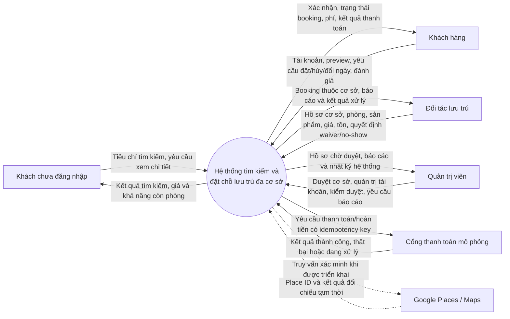
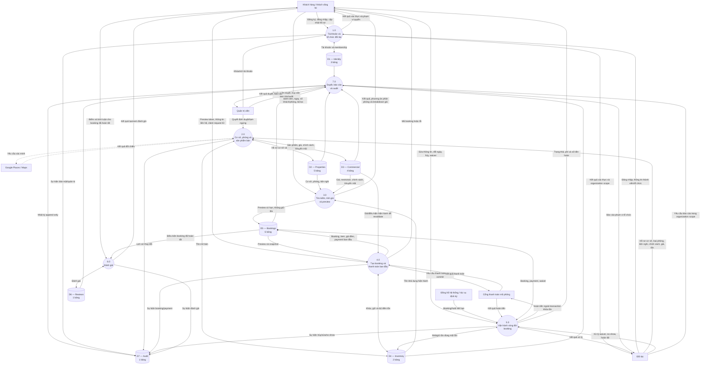
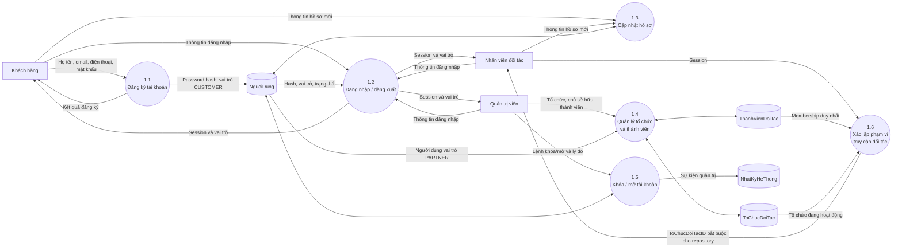
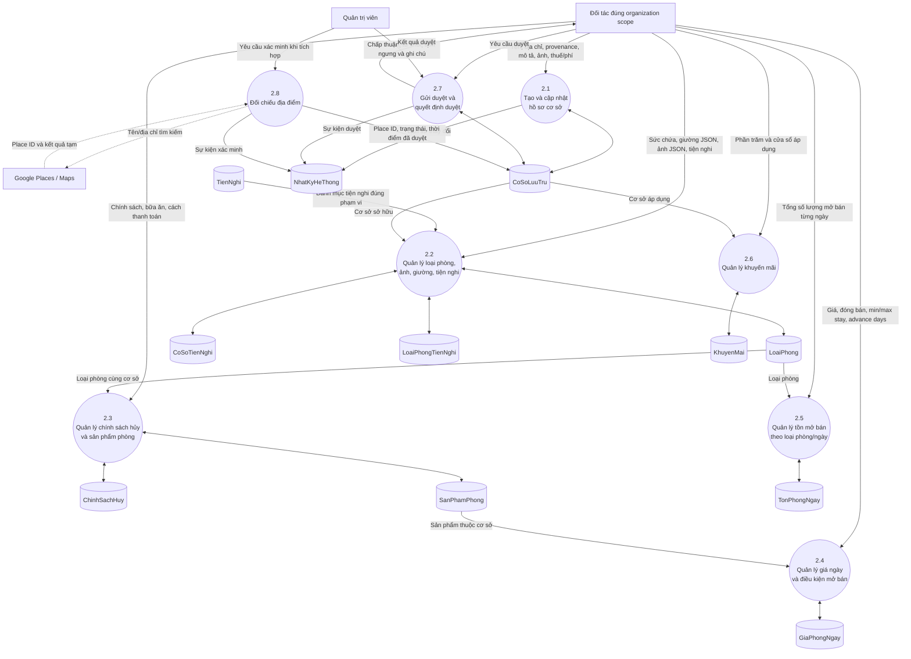
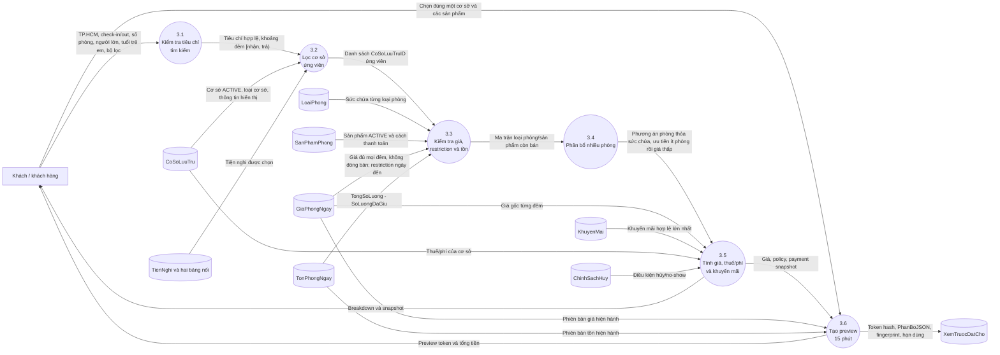
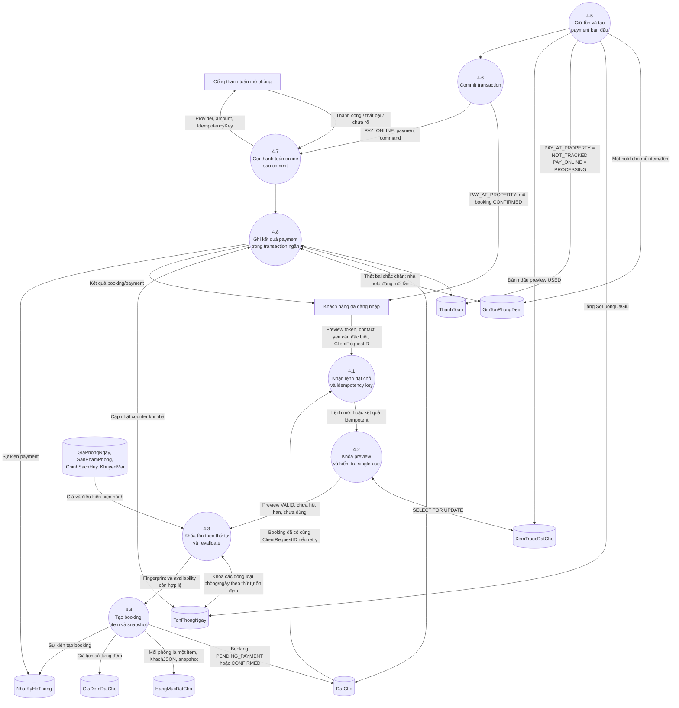
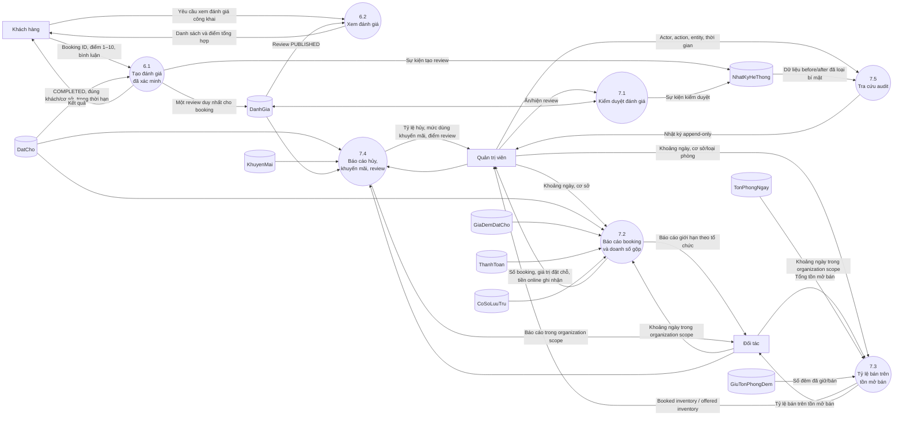

# SƠ ĐỒ LUỒNG DỮ LIỆU (DFD) — HỆ THỐNG ĐẶT CHỖ LƯU TRÚ

**Phiên bản:** 1.0  
**Phạm vi:** mini OTA nhiều cơ sở lưu trú tại Thành phố Hồ Chí Minh  
**Tài liệu nguồn:** `DESCRIPTION_HOTEL_BOOKING_DRAFT.md`, `DESIGN_HOTEL_BOOKING_DRAFT.md`  
**Schema:** 22 bảng

## 1. Quy ước

Mermaid chưa có ký pháp DFD riêng, vì vậy tài liệu dùng `flowchart` với quy ước:

| Ký hiệu | Ý nghĩa |
|---|---|
| Hình chữ nhật | Tác nhân/hệ thống bên ngoài |
| Hình tròn | Tiến trình xử lý |
| Hình trụ | Kho dữ liệu |
| Mũi tên | Dữ liệu được truyền, không biểu thị quyền truy cập trực tiếp |

Tác nhân không đọc hoặc ghi thẳng kho dữ liệu. Mọi dữ liệu đều đi qua tiến trình có kiểm tra quyền, validation và transaction tương ứng.

## 2. DFD mức ngữ cảnh

Google Places/Maps chỉ là nguồn enrichment. Dữ liệu Google không được dùng làm master data thay thế tên và provenance nguồn; cache runtime không nằm trong schema MVP.

## 3. DFD mức 0 — toàn hệ thống

## 4. DFD mức 1 — tài khoản và tổ chức đối tác

## 5. DFD mức 1 — cơ sở, sản phẩm, giá và tồn

Quản lý tồn ở đây chỉ thay đổi `TongSoLuong`. `SoLuongDaGiu` chỉ được thay đổi bởi transaction booking/lifecycle cùng ledger, không phải từ màn hình chỉnh tồn thông thường.

## 6. DFD mức 1 — tìm kiếm, availability, giá và preview

Các quy tắc quan trọng:

- search và preview chỉ đọc tồn, không tạo `GiuTonPhongDem` và không tăng `SoLuongDaGiu`;
- cache tìm kiếm, nếu có sau này, chỉ dùng chọn ứng viên; availability cuối luôn đọc dữ liệu hiện hành;
- một preview và một booking chỉ thuộc một `CoSoLuuTru`;
- mọi sản phẩm được chọn phải có đủ giá cho từng đêm và cùng cơ sở.

## 7. DFD mức 1 — tạo booking và thanh toán ban đầu

Không có lời gọi provider trong lúc transaction đang giữ khóa preview hoặc tồn. Nếu hai request tranh đơn vị tồn cuối, transaction khóa trước thắng; request còn lại rollback và không tạo booking dở dang.

## 8. DFD mức 1 — hủy, waiver, đổi ngày, no-show và hoàn tất

```mermaid
flowchart TB
    KH["Khách hàng"]
    DT["Đối tác đúng organization scope"]
    CLOCK["Đồng hồ hệ thống / tác vụ hết hạn"]
    PG["Cổng thanh toán mô phỏng"]

    P51(("5.1<br/>Sửa thông tin khách"))
    P52(("5.2<br/>Preview đổi ngày"))
    P53(("5.3<br/>Áp dụng đổi ngày<br/>nguyên tử"))
    P54(("5.4<br/>Tính và xác nhận hủy"))
    P55(("5.5<br/>Hủy và nhả tồn<br/>đúng một lần"))
    P56(("5.6<br/>Yêu cầu miễn phí hủy"))
    P57(("5.7<br/>Đánh dấu no-show"))
    P58(("5.8<br/>Hoàn tất lưu trú"))
    P59(("5.9<br/>Xử lý booking/payment<br/>hết hạn"))
    P510(("5.10<br/>Hoàn tiền sau commit"))

    B[("DatCho")]
    I[("HangMucDatCho")]
    N[("GiaDemDatCho")]
    T[("TonPhongNgay")]
    H[("GiuTonPhongDem")]
    R[("GiaPhongNgay và dữ liệu tính giá")]
    P[("ThanhToan")]
    W[("YeuCauHuyMienPhi")]
    A[("NhatKyHeThong")]

    KH -->|"Thông tin khách mới, RequestID"| P51
    P51 <--> B
    P51 <--> I
    P51 -->|"Before/after và idempotency"| A

    KH -->|"Ngày mới"| P52
    B -->|"Booking hiện tại đủ điều kiện"| P52
    R -->|"Giá/restriction ngày mới"| P52
    T -->|"Tồn ngày mới"| P52
    P52 -->|"Chênh lệch giá và phương án mới; chưa đổi booking"| KH

    KH -->|"Xác nhận phương án đổi ngày"| P53
    P53 <-->|"Khóa booking và tồn cũ/mới theo thứ tự"| T
    P53 <-->|"Hold cũ và hold mới"| H
    P53 <--> B
    P53 <--> I
    P53 <--> N
    P53 -->|"Before/after"| A
    P53 -->|"Thành công hoặc rollback giữ nguyên booking cũ"| KH

    KH -->|"Yêu cầu xem phí hủy"| P54
    B -->|"Trạng thái và tổng tiền"| P54
    I -->|"Snapshot chính sách tại lúc đặt"| P54
    P54 -->|"Phí hủy, số hoàn, calculation snapshot"| KH

    KH -->|"Xác nhận hủy và HuyIdempotencyKey"| P55
    P55 <--> B
    P55 <-->|"Release ACTIVE → RELEASED"| H
    P55 <-->|"Giảm counter cùng transaction"| T
    P55 -->|"Phí, refund linkage"| P
    P55 -->|"Sự kiện hủy"| A
    P55 -->|"Refund command sau commit nếu cần"| P510

    KH -->|"Lý do xin miễn phí"| P56
    P56 <--> W
    DT -->|"APPROVED / REJECTED"| P56
    P56 -->|"Kết quả waiver"| KH
    P56 -->|"Nếu duyệt và hủy: lệnh hủy"| P55
    P56 -->|"Sự kiện xử lý"| A

    DT -->|"Booking CONFIRMED và bằng chứng vận hành"| P57
    P57 <--> B
    P57 <-->|"Nhả mọi hold ACTIVE"| H
    P57 <-->|"Giảm counter"| T
    P57 -->|"Phí no-show và snapshot"| B
    P57 -->|"Sự kiện no-show"| A

    DT -->|"Xác nhận kết thúc lưu trú"| P58
    P58 <--> B
    P58 <-->|"Nhả hold còn lại"| H
    P58 <--> T
    P58 -->|"Sự kiện hoàn tất"| A

    CLOCK -->|"Hết hạn thanh toán/hold"| P59
    P59 <--> B
    P59 <--> P
    P59 <--> H
    P59 <--> T
    P59 -->|"PAYMENT_FAILED và audit"| A

    P510 -->|"Refund IdempotencyKey và số tiền"| PG
    PG -->|"Kết quả refund"| P510
    P510 -->|"Trạng thái hoàn, số đã hoàn, provider reference"| P
    P510 -->|"Sự kiện hoàn tiền"| A
    P510 -->|"Kết quả cuối"| KH
```

Các bất biến của luồng:

- thất bại khi lấy tồn ngày mới không được thay đổi booking cũ;
- hủy, no-show, hoàn tất và hết hạn chỉ release một hold một lần;
- `NO_SHOW` không còn hold `ACTIVE`; phí no-show không đồng nghĩa với tiếp tục khóa phòng;
- `PAY_AT_PROPERTY` không ghi nhận tiền mặt thực thu và luôn có payment `NOT_TRACKED`;
- refund provider được gọi ngoài transaction đang khóa tồn.

## 9. DFD mức 1 — đánh giá, quản trị, báo cáo và audit

“Tỷ lệ bán trên tồn mở bán” chỉ phản ánh capacity mà đối tác đã mở trên nền tảng, không phải công suất vật lý toàn khách sạn.

## 10. Danh mục kho dữ liệu

| Mã | Module | Bảng |
|---|---|---|
| D1.1 | Identity | `NguoiDung` |
| D1.2 | Identity | `ToChucDoiTac` |
| D1.3 | Identity | `ThanhVienDoiTac` |
| D2.1 | Properties | `TienNghi` |
| D2.2 | Properties | `CoSoLuuTru` |
| D2.3 | Properties | `LoaiPhong` |
| D2.4 | Properties | `CoSoTienNghi` |
| D2.5 | Properties | `LoaiPhongTienNghi` |
| D3.1 | Commercial | `ChinhSachHuy` |
| D3.2 | Commercial | `SanPhamPhong` |
| D3.3 | Commercial | `GiaPhongNgay` |
| D3.4 | Commercial | `KhuyenMai` |
| D4.1 | Inventory | `TonPhongNgay` |
| D4.2 | Inventory | `GiuTonPhongDem` |
| D5.1 | Bookings | `XemTruocDatCho` |
| D5.2 | Bookings | `DatCho` |
| D5.3 | Bookings | `HangMucDatCho` |
| D5.4 | Bookings | `GiaDemDatCho` |
| D5.5 | Bookings | `ThanhToan` |
| D5.6 | Bookings | `YeuCauHuyMienPhi` |
| D6.1 | Reviews | `DanhGia` |
| D7.1 | Admin | `NhatKyHeThong` |

## 11. Ma trận chức năng và tiến trình DFD

| Chức năng | Tiến trình |
|---|---|
| Đăng ký, đăng nhập, hồ sơ | 1.1–1.3 |
| Tổ chức và phân quyền đối tác | 1.4–1.6 |
| Tạo/cập nhật/duyệt cơ sở | 2.1, 2.7 |
| Quản lý loại phòng, ảnh, giường, tiện nghi | 2.2 |
| Quản lý policy và sản phẩm phòng | 2.3 |
| Giá ngày, restriction, đóng bán | 2.4 |
| Tồn mở bán | 2.5 |
| Khuyến mãi | 2.6 |
| Google enrichment/verification | 2.8 |
| Search và availability | 3.1–3.3 |
| Phân bổ nhiều phòng | 3.4 |
| Tính giá | 3.5 |
| Preview không giữ tồn | 3.6 |
| Booking trả tại cơ sở | 4.1–4.6 |
| Booking thanh toán online mô phỏng | 4.1–4.8 |
| Sửa thông tin khách | 5.1 |
| Đổi ngày an toàn | 5.2–5.3 |
| Hủy trực tiếp | 5.4–5.5 |
| Yêu cầu miễn phí hủy | 5.6 |
| No-show | 5.7 |
| Hoàn tất lưu trú | 5.8 |
| Hết hạn thanh toán/hold | 5.9 |
| Hoàn tiền | 5.10 |
| Tạo/xem/kiểm duyệt đánh giá | 6.1, 6.2, 7.1 |
| Báo cáo và audit | 7.2–7.5 |

Không có tiến trình notification center trong MVP. Kết quả thao tác được trả trực tiếp cho giao diện để hiển thị thông báo phiên; email, SMS, push và hộp thư ứng dụng thuộc giai đoạn sau.
