# SƠ ĐỒ TUẦN TỰ — HỆ THỐNG ĐẶT CHỖ LƯU TRÚ

**Phiên bản:** 1.0  
**Phạm vi:** mini OTA nhiều cơ sở lưu trú tại Thành phố Hồ Chí Minh  
**Tài liệu nguồn:** `DESCRIPTION_HOTEL_BOOKING_DRAFT.md`, `DESIGN_HOTEL_BOOKING_DRAFT.md`, `DFD_HOTEL_BOOKING.md`  
**Schema:** 22 bảng

## 1. Quy ước

Các sơ đồ dùng những thành phần logic sau:

- `UI`: giao diện web hoặc HTTP client;
- `Controller`: nhận request, xác thực đầu vào cơ bản và chuyển sang application service;
- `Service`: thực thi use case, kiểm tra quyền và điều phối transaction;
- `Repository`: truy cập dữ liệu bằng PDO;
- `DB`: MySQL/MariaDB;
- `Audit`: ghi `NhatKyHeThong` sau hoặc trong transaction thích hợp;
- `Provider`: cổng thanh toán mô phỏng hoặc Google Places/Maps.

Các repository cùng xuất hiện trong một transaction dùng chung một PDO connection. Mũi tên trả về lỗi bao hàm việc chuyển lỗi domain thành HTTP status phù hợp.

## 2. Đăng nhập và xác lập phạm vi đối tác

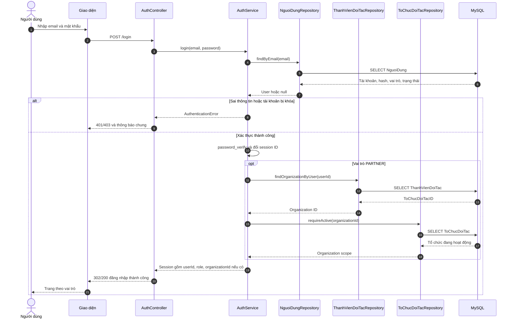
```mermaid
sequenceDiagram
    autonumber
    actor U as Người dùng
    participant UI as Giao diện
    participant C as AuthController
    participant S as AuthService
    participant UR as NguoiDungRepository
    participant MR as ThanhVienDoiTacRepository
    participant OR as ToChucDoiTacRepository
    participant DB as MySQL

    U->>UI: Nhập email và mật khẩu
    UI->>C: POST /login
    C->>S: login(email, password)
    S->>UR: findByEmail(email)
    UR->>DB: SELECT NguoiDung
    DB-->>UR: Tài khoản, hash, vai trò, trạng thái
    UR-->>S: User hoặc null

    alt Sai thông tin hoặc tài khoản bị khóa
        S-->>C: AuthenticationError
        C-->>UI: 401/403 và thông báo chung
    else Xác thực thành công
        S->>S: password_verify và đổi session ID
        opt Vai trò PARTNER
            S->>MR: findOrganizationByUser(userId)
            MR->>DB: SELECT ThanhVienDoiTac
            DB-->>MR: ToChucDoiTacID
            MR-->>S: Organization ID
            S->>OR: requireActive(organizationId)
            OR->>DB: SELECT ToChucDoiTac
            DB-->>OR: Tổ chức đang hoạt động
            OR-->>S: Organization scope
        end
        S-->>C: Session gồm userId, role, organizationId nếu có
        C-->>UI: 302/200 đăng nhập thành công
        UI-->>U: Trang theo vai trò
    end
```

`ToChucDoiTacID` phải được lấy từ membership trong database, không nhận từ form hoặc URL làm nguồn tin cậy.

## 3. Đối tác đăng ký cơ sở và quản trị viên duyệt

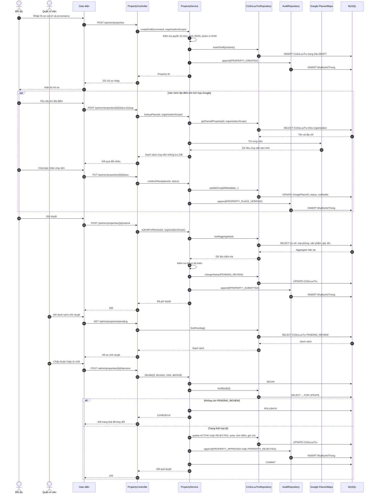
```mermaid
sequenceDiagram
    autonumber
    actor P as Đối tác
    actor A as Quản trị viên
    participant UI as Giao diện
    participant PC as PropertyController
    participant PS as PropertyService
    participant PR as CoSoLuuTruRepository
    participant AR as AuditRepository
    participant GP as Google Places/Maps
    participant DB as MySQL

    P->>UI: Nhập hồ sơ cơ sở và provenance
    UI->>PC: POST /partner/properties
    PC->>PS: createDraft(command, organizationScope)
    PS->>PS: Kiểm tra quyền tổ chức, ảnh JSON, phạm vi HCM
    PS->>PR: insertDraft(property)
    PR->>DB: INSERT CoSoLuuTru trạng thái DRAFT
    PS->>AR: append(PROPERTY_CREATED)
    AR->>DB: INSERT NhatKyHeThong
    PS-->>PC: Property ID
    PC-->>UI: 201 hồ sơ nháp
    UI-->>P: Hiển thị hồ sơ

    opt Xác minh địa điểm khi tích hợp Google
        P->>UI: Yêu cầu tìm địa điểm
        UI->>PC: POST /partner/properties/{id}/place-lookup
        PC->>PS: lookupPlace(id, organizationScope)
        PS->>PR: getOwnedProperty(id, organizationScope)
        PR->>DB: SELECT CoSoLuuTru theo organization
        DB-->>PR: Tên và địa chỉ
        PS->>GP: Tìm ứng viên
        GP-->>PS: Dữ liệu ứng viên tạm thời
        PS-->>PC: Danh sách ứng viên không lưu DB
        PC-->>UI: Kết quả đối chiếu
        P->>UI: Chọn/xác nhận ứng viên
        UI->>PC: PUT /partner/properties/{id}/place
        PC->>PS: confirmPlace(placeId, status)
        PS->>PR: updateGoogleMetadata(...)
        PR->>DB: UPDATE GooglePlaceID, status, verifiedAt
        PS->>AR: append(PROPERTY_PLACE_VERIFIED)
        AR->>DB: INSERT NhatKyHeThong
    end

    P->>UI: Gửi duyệt
    UI->>PC: POST /partner/properties/{id}/submit
    PC->>PS: submitForReview(id, organizationScope)
    PS->>PR: loadAggregate(id)
    PR->>DB: SELECT cơ sở, loại phòng, sản phẩm, giá, tồn
    DB-->>PR: Aggregate hiện tại
    PR-->>PS: Dữ liệu kiểm tra
    PS->>PS: Kiểm tra hồ sơ tối thiểu
    PS->>PR: changeStatus(PENDING_REVIEW)
    PR->>DB: UPDATE CoSoLuuTru
    PS->>AR: append(PROPERTY_SUBMITTED)
    AR->>DB: INSERT NhatKyHeThong
    PS-->>PC: Đã gửi duyệt
    PC-->>UI: 200

    A->>UI: Mở danh sách chờ duyệt
    UI->>PC: GET /admin/properties/pending
    PC->>PR: findPending()
    PR->>DB: SELECT CoSoLuuTru PENDING_REVIEW
    DB-->>PR: Danh sách
    PR-->>PC: Danh sách
    PC-->>UI: Hồ sơ chờ duyệt

    A->>UI: Chấp thuận hoặc từ chối
    UI->>PC: POST /admin/properties/{id}/decision
    PC->>PS: decide(id, decision, note, adminId)
    PS->>DB: BEGIN
    PS->>PR: lockById(id)
    PR->>DB: SELECT ... FOR UPDATE
    alt Không còn PENDING_REVIEW
        PS->>DB: ROLLBACK
        PS-->>PC: ConflictError
        PC-->>UI: 409 trạng thái đã thay đổi
    else Trạng thái hợp lệ
        PS->>PR: update ACTIVE hoặc REJECTED, actor, thời điểm, ghi chú
        PR->>DB: UPDATE CoSoLuuTru
        PS->>AR: append(PROPERTY_APPROVED hoặc PROPERTY_REJECTED)
        AR->>DB: INSERT NhatKyHeThong
        PS->>DB: COMMIT
        PS-->>PC: Kết quả duyệt
        PC-->>UI: 200
    end
```

## 4. Đối tác quản lý phòng, sản phẩm, giá và tồn mở bán

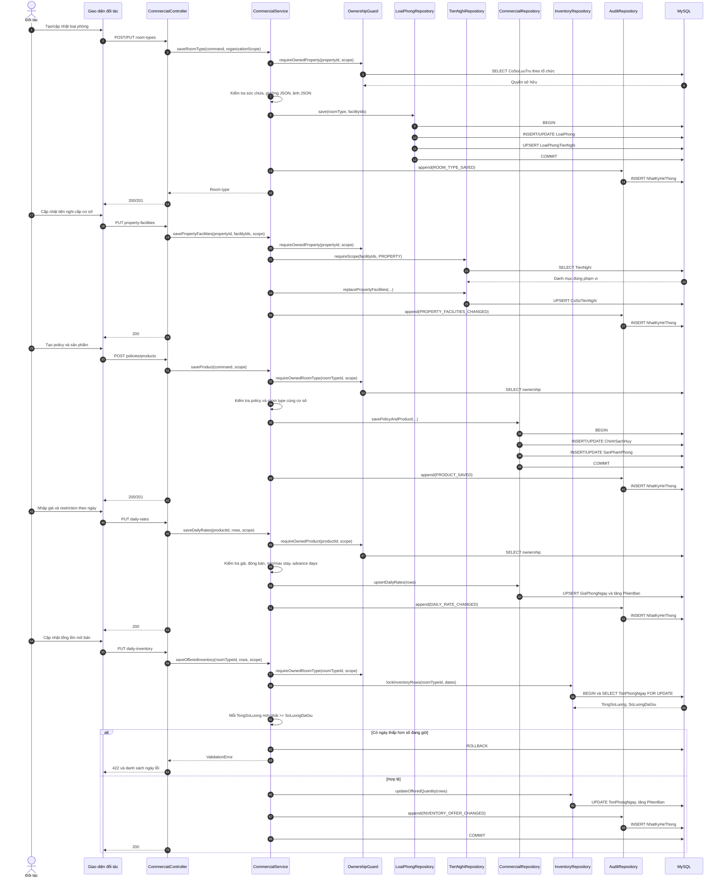
```mermaid
sequenceDiagram
    autonumber
    actor P as Đối tác
    participant UI as Giao diện đối tác
    participant C as CommercialController
    participant S as CommercialService
    participant Own as OwnershipGuard
    participant RR as LoaiPhongRepository
    participant FR as TienNghiRepository
    participant CR as CommercialRepository
    participant IR as InventoryRepository
    participant AR as AuditRepository
    participant DB as MySQL

    P->>UI: Tạo/cập nhật loại phòng
    UI->>C: POST/PUT room-types
    C->>S: saveRoomType(command, organizationScope)
    S->>Own: requireOwnedProperty(propertyId, scope)
    Own->>DB: SELECT CoSoLuuTru theo tổ chức
    DB-->>Own: Quyền sở hữu
    S->>S: Kiểm tra sức chứa, giường JSON, ảnh JSON
    S->>RR: save(roomType, facilityIds)
    RR->>DB: BEGIN
    RR->>DB: INSERT/UPDATE LoaiPhong
    RR->>DB: UPSERT LoaiPhongTienNghi
    RR->>DB: COMMIT
    S->>AR: append(ROOM_TYPE_SAVED)
    AR->>DB: INSERT NhatKyHeThong
    S-->>C: Room type
    C-->>UI: 200/201

    P->>UI: Cập nhật tiện nghi cấp cơ sở
    UI->>C: PUT property-facilities
    C->>S: savePropertyFacilities(propertyId, facilityIds, scope)
    S->>Own: requireOwnedProperty(propertyId, scope)
    S->>FR: requireScope(facilityIds, PROPERTY)
    FR->>DB: SELECT TienNghi
    DB-->>FR: Danh mục đúng phạm vi
    S->>FR: replacePropertyFacilities(...)
    FR->>DB: UPSERT CoSoTienNghi
    S->>AR: append(PROPERTY_FACILITIES_CHANGED)
    AR->>DB: INSERT NhatKyHeThong
    C-->>UI: 200

    P->>UI: Tạo policy và sản phẩm
    UI->>C: POST policies/products
    C->>S: saveProduct(command, scope)
    S->>Own: requireOwnedRoomType(roomTypeId, scope)
    Own->>DB: SELECT ownership
    S->>S: Kiểm tra policy và room type cùng cơ sở
    S->>CR: savePolicyAndProduct(...)
    CR->>DB: BEGIN
    CR->>DB: INSERT/UPDATE ChinhSachHuy
    CR->>DB: INSERT/UPDATE SanPhamPhong
    CR->>DB: COMMIT
    S->>AR: append(PRODUCT_SAVED)
    AR->>DB: INSERT NhatKyHeThong
    C-->>UI: 200/201

    P->>UI: Nhập giá và restriction theo ngày
    UI->>C: PUT daily-rates
    C->>S: saveDailyRates(productId, rows, scope)
    S->>Own: requireOwnedProduct(productId, scope)
    Own->>DB: SELECT ownership
    S->>S: Kiểm tra giá, đóng bán, min/max stay, advance days
    S->>CR: upsertDailyRates(rows)
    CR->>DB: UPSERT GiaPhongNgay và tăng PhienBan
    S->>AR: append(DAILY_RATE_CHANGED)
    AR->>DB: INSERT NhatKyHeThong
    C-->>UI: 200

    P->>UI: Cập nhật tổng tồn mở bán
    UI->>C: PUT daily-inventory
    C->>S: saveOfferedInventory(roomTypeId, rows, scope)
    S->>Own: requireOwnedRoomType(roomTypeId, scope)
    S->>IR: lockInventoryRows(roomTypeId, dates)
    IR->>DB: BEGIN và SELECT TonPhongNgay FOR UPDATE
    DB-->>IR: TongSoLuong, SoLuongDaGiu
    S->>S: Mỗi TongSoLuong mới phải >= SoLuongDaGiu
    alt Có ngày thấp hơn số đang giữ
        S->>DB: ROLLBACK
        S-->>C: ValidationError
        C-->>UI: 422 và danh sách ngày lỗi
    else Hợp lệ
        S->>IR: updateOfferedQuantity(rows)
        IR->>DB: UPDATE TonPhongNgay, tăng PhienBan
        S->>AR: append(INVENTORY_OFFER_CHANGED)
        AR->>DB: INSERT NhatKyHeThong
        S->>DB: COMMIT
        C-->>UI: 200
    end
```

Đối tác chỉ sửa `TongSoLuong`; `SoLuongDaGiu` do Booking/Inventory service quản lý cùng ledger.

## 5. Tìm kiếm và kiểm tra availability

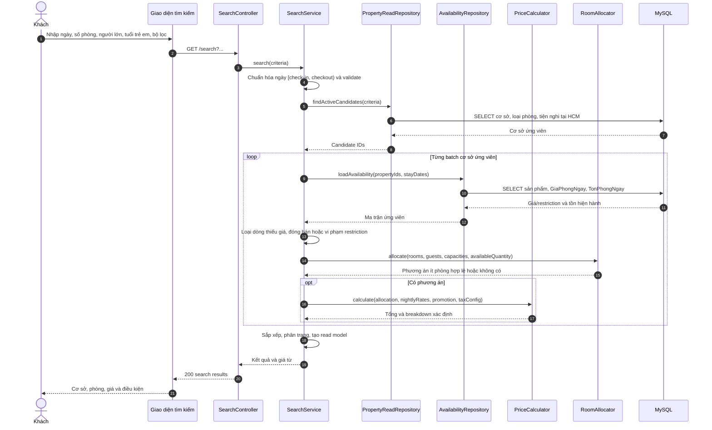
```mermaid
sequenceDiagram
    autonumber
    actor G as Khách
    participant UI as Giao diện tìm kiếm
    participant C as SearchController
    participant S as SearchService
    participant PR as PropertyReadRepository
    participant AR as AvailabilityRepository
    participant PC as PriceCalculator
    participant AL as RoomAllocator
    participant DB as MySQL

    G->>UI: Nhập ngày, số phòng, người lớn, tuổi trẻ em, bộ lọc
    UI->>C: GET /search?... 
    C->>S: search(criteria)
    S->>S: Chuẩn hóa ngày [check-in, checkout) và validate
    S->>PR: findActiveCandidates(criteria)
    PR->>DB: SELECT cơ sở, loại phòng, tiện nghi tại HCM
    DB-->>PR: Cơ sở ứng viên
    PR-->>S: Candidate IDs

    loop Từng batch cơ sở ứng viên
        S->>AR: loadAvailability(propertyIds, stayDates)
        AR->>DB: SELECT sản phẩm, GiaPhongNgay, TonPhongNgay
        DB-->>AR: Giá/restriction và tồn hiện hành
        AR-->>S: Ma trận ứng viên
        S->>S: Loại dòng thiếu giá, đóng bán hoặc vi phạm restriction
        S->>AL: allocate(rooms, guests, capacities, availableQuantity)
        AL-->>S: Phương án ít phòng hợp lệ hoặc không có
        opt Có phương án
            S->>PC: calculate(allocation, nightlyRates, promotion, taxConfig)
            PC-->>S: Tổng và breakdown xác định
        end
    end

    S->>S: Sắp xếp, phân trang, tạo read model
    S-->>C: Kết quả và giá từ
    C-->>UI: 200 search results
    UI-->>G: Cơ sở, phòng, giá và điều kiện
```

Search không khóa và không giữ tồn. Kết quả search không phải cam kết bán cuối cùng.

## 6. Tạo preview

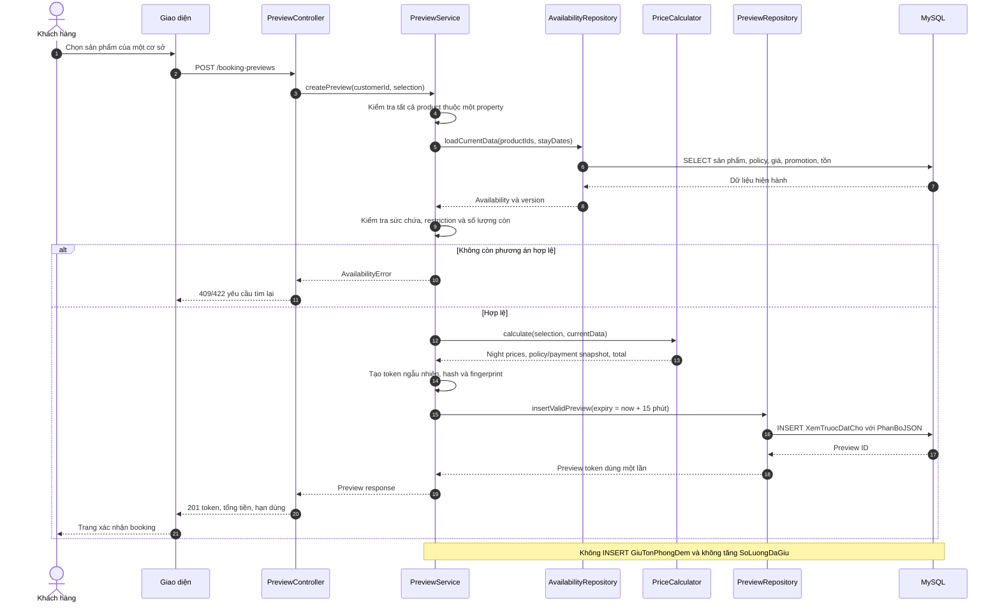
```mermaid
sequenceDiagram
    autonumber
    actor G as Khách hàng
    participant UI as Giao diện
    participant C as PreviewController
    participant S as PreviewService
    participant AR as AvailabilityRepository
    participant PC as PriceCalculator
    participant PR as PreviewRepository
    participant DB as MySQL

    G->>UI: Chọn sản phẩm của một cơ sở
    UI->>C: POST /booking-previews
    C->>S: createPreview(customerId, selection)
    S->>S: Kiểm tra tất cả product thuộc một property
    S->>AR: loadCurrentData(productIds, stayDates)
    AR->>DB: SELECT sản phẩm, policy, giá, promotion, tồn
    DB-->>AR: Dữ liệu hiện hành
    AR-->>S: Availability và version
    S->>S: Kiểm tra sức chứa, restriction và số lượng còn

    alt Không còn phương án hợp lệ
        S-->>C: AvailabilityError
        C-->>UI: 409/422 yêu cầu tìm lại
    else Hợp lệ
        S->>PC: calculate(selection, currentData)
        PC-->>S: Night prices, policy/payment snapshot, total
        S->>S: Tạo token ngẫu nhiên, hash và fingerprint
        S->>PR: insertValidPreview(expiry = now + 15 phút)
        PR->>DB: INSERT XemTruocDatCho với PhanBoJSON
        DB-->>PR: Preview ID
        PR-->>S: Preview token dùng một lần
        S-->>C: Preview response
        C-->>UI: 201 token, tổng tiền, hạn dùng
        UI-->>G: Trang xác nhận booking
    end

    Note over S,DB: Không INSERT GiuTonPhongDem và không tăng SoLuongDaGiu
```

## 7. Tạo booking trả tại cơ sở

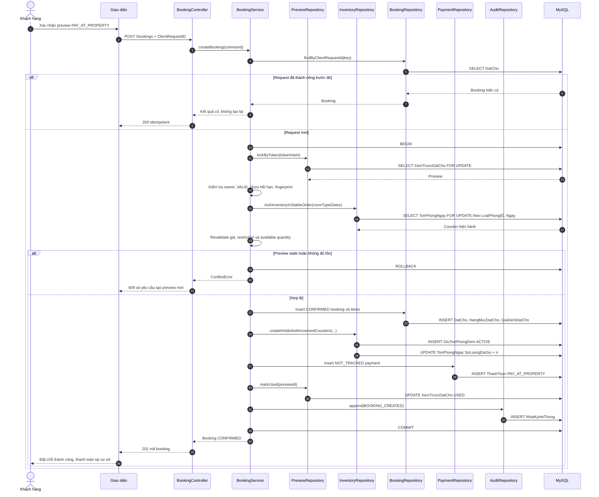
```mermaid
sequenceDiagram
    autonumber
    actor G as Khách hàng
    participant UI as Giao diện
    participant C as BookingController
    participant S as BookingService
    participant PR as PreviewRepository
    participant IR as InventoryRepository
    participant BR as BookingRepository
    participant PAY as PaymentRepository
    participant AUD as AuditRepository
    participant DB as MySQL

    G->>UI: Xác nhận preview PAY_AT_PROPERTY
    UI->>C: POST /bookings + ClientRequestID
    C->>S: createBooking(command)
    S->>BR: findByClientRequestId(key)
    BR->>DB: SELECT DatCho

    alt Request đã thành công trước đó
        DB-->>BR: Booking hiện có
        BR-->>S: Booking
        S-->>C: Kết quả cũ, không tạo lại
        C-->>UI: 200 idempotent
    else Request mới
        S->>DB: BEGIN
        S->>PR: lockByToken(tokenHash)
        PR->>DB: SELECT XemTruocDatCho FOR UPDATE
        DB-->>PR: Preview
        S->>S: Kiểm tra owner, VALID, chưa hết hạn, fingerprint
        S->>IR: lockInventoryInStableOrder(roomTypeDates)
        IR->>DB: SELECT TonPhongNgay FOR UPDATE theo LoaiPhongID, Ngay
        DB-->>IR: Counter hiện hành
        S->>S: Revalidate giá, restriction và available quantity

        alt Preview stale hoặc không đủ tồn
            S->>DB: ROLLBACK
            S-->>C: ConflictError
            C-->>UI: 409 và yêu cầu tạo preview mới
        else Hợp lệ
            S->>BR: insert CONFIRMED booking và items
            BR->>DB: INSERT DatCho, HangMucDatCho, GiaDemDatCho
            S->>IR: createHoldsAndIncrementCounters(...)
            IR->>DB: INSERT GiuTonPhongDem ACTIVE
            IR->>DB: UPDATE TonPhongNgay SoLuongDaGiu + n
            S->>PAY: insert NOT_TRACKED payment
            PAY->>DB: INSERT ThanhToan PAY_AT_PROPERTY
            S->>PR: markUsed(previewId)
            PR->>DB: UPDATE XemTruocDatCho USED
            S->>AUD: append(BOOKING_CREATED)
            AUD->>DB: INSERT NhatKyHeThong
            S->>DB: COMMIT
            S-->>C: Booking CONFIRMED
            C-->>UI: 201 mã booking
            UI-->>G: Đặt chỗ thành công, thanh toán tại cơ sở
        end
    end
```

## 8. Tạo booking và thanh toán online mô phỏng

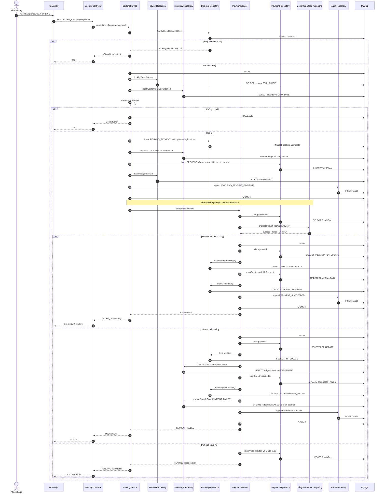
```mermaid
sequenceDiagram
    autonumber
    actor G as Khách hàng
    participant UI as Giao diện
    participant BC as BookingController
    participant BS as BookingService
    participant PR as PreviewRepository
    participant IR as InventoryRepository
    participant BR as BookingRepository
    participant PAY as PaymentService
    participant PRepo as PaymentRepository
    participant GW as Cổng thanh toán mô phỏng
    participant AUD as AuditRepository
    participant DB as MySQL

    G->>UI: Xác nhận preview PAY_ONLINE
    UI->>BC: POST /bookings + ClientRequestID
    BC->>BS: createOnlineBooking(command)
    BS->>BR: findByClientRequestId(key)
    BR->>DB: SELECT DatCho

    alt Request đã tồn tại
        BR-->>BS: Booking/payment hiện có
        BS-->>BC: Kết quả idempotent
        BC-->>UI: 200
    else Request mới
        BS->>DB: BEGIN
        BS->>PR: lockByToken(token)
        PR->>DB: SELECT preview FOR UPDATE
        BS->>IR: lockInventoryInStableOrder(...)
        IR->>DB: SELECT inventory FOR UPDATE
        BS->>BS: Revalidate toàn bộ
        alt Không hợp lệ
            BS->>DB: ROLLBACK
            BS-->>BC: ConflictError
            BC-->>UI: 409
        else Hợp lệ
            BS->>BR: insert PENDING_PAYMENT booking/items/night prices
            BR->>DB: INSERT booking aggregate
            BS->>IR: create ACTIVE holds có HetHanLuc
            IR->>DB: INSERT ledger và tăng counter
            BS->>PRepo: insert PROCESSING với payment idempotency key
            PRepo->>DB: INSERT ThanhToan
            BS->>PR: markUsed(previewId)
            PR->>DB: UPDATE preview USED
            BS->>AUD: append(BOOKING_PENDING_PAYMENT)
            AUD->>DB: INSERT audit
            BS->>DB: COMMIT

            Note over BS,GW: Từ đây không còn giữ row lock inventory
            BS->>PAY: charge(paymentId)
            PAY->>PRepo: load(paymentId)
            PRepo->>DB: SELECT ThanhToan
            PAY->>GW: charge(amount, IdempotencyKey)
            GW-->>PAY: success / failed / unknown

            alt Thanh toán thành công
                PAY->>DB: BEGIN
                PAY->>PRepo: lock(paymentId)
                PRepo->>DB: SELECT ThanhToan FOR UPDATE
                PAY->>BR: lockBooking(bookingId)
                BR->>DB: SELECT DatCho FOR UPDATE
                PAY->>PRepo: markPaid(providerReference)
                PRepo->>DB: UPDATE ThanhToan PAID
                PAY->>BR: markConfirmed()
                BR->>DB: UPDATE DatCho CONFIRMED
                PAY->>AUD: append(PAYMENT_SUCCEEDED)
                AUD->>DB: INSERT audit
                PAY->>DB: COMMIT
                PAY-->>BS: CONFIRMED
                BS-->>BC: Booking thành công
                BC-->>UI: 201/200 mã booking
            else Thất bại chắc chắn
                PAY->>DB: BEGIN
                PAY->>PRepo: lock payment
                PRepo->>DB: SELECT FOR UPDATE
                PAY->>BR: lock booking
                BR->>DB: SELECT FOR UPDATE
                PAY->>IR: lock ACTIVE holds và inventory
                IR->>DB: SELECT ledger/inventory FOR UPDATE
                PAY->>PRepo: markFailed(errorCode)
                PRepo->>DB: UPDATE ThanhToan FAILED
                PAY->>BR: markPaymentFailed()
                BR->>DB: UPDATE DatCho PAYMENT_FAILED
                PAY->>IR: releaseExactlyOnce(PAYMENT_FAILED)
                IR->>DB: UPDATE ledger RELEASED và giảm counter
                PAY->>AUD: append(PAYMENT_FAILED)
                AUD->>DB: INSERT audit
                PAY->>DB: COMMIT
                PAY-->>BS: PAYMENT_FAILED
                BS-->>BC: PaymentError
                BC-->>UI: 402/409
            else Kết quả chưa rõ
                PAY->>PRepo: Giữ PROCESSING và lưu lỗi cuối
                PRepo->>DB: UPDATE ThanhToan
                PAY-->>BS: PENDING reconciliation
                BS-->>BC: PENDING_PAYMENT
                BC-->>UI: 202 đang xử lý
            end
        end
    end
```

Retry thanh toán dùng lại `ThanhToan.IdempotencyKey` và cùng booking; không tạo booking hoặc payment thứ hai.

## 9. Hủy trực tiếp và hoàn tiền

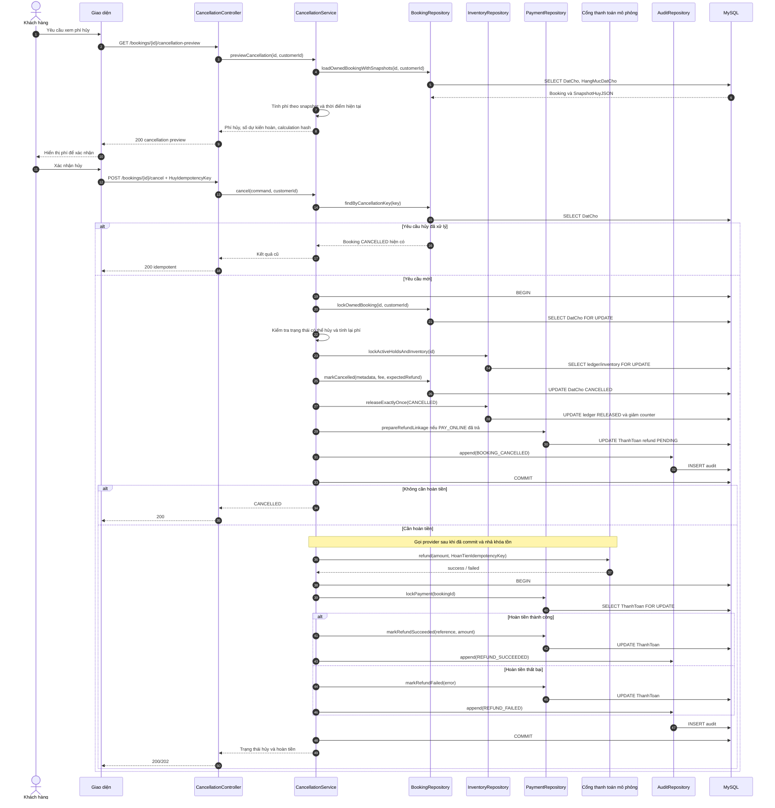
```mermaid
sequenceDiagram
    autonumber
    actor G as Khách hàng
    participant UI as Giao diện
    participant C as CancellationController
    participant S as CancellationService
    participant BR as BookingRepository
    participant IR as InventoryRepository
    participant PR as PaymentRepository
    participant GW as Cổng thanh toán mô phỏng
    participant AUD as AuditRepository
    participant DB as MySQL

    G->>UI: Yêu cầu xem phí hủy
    UI->>C: GET /bookings/{id}/cancellation-preview
    C->>S: previewCancellation(id, customerId)
    S->>BR: loadOwnedBookingWithSnapshots(id, customerId)
    BR->>DB: SELECT DatCho, HangMucDatCho
    DB-->>BR: Booking và SnapshotHuyJSON
    S->>S: Tính phí theo snapshot và thời điểm hiện tại
    S-->>C: Phí hủy, số dự kiến hoàn, calculation hash
    C-->>UI: 200 cancellation preview
    UI-->>G: Hiển thị phí để xác nhận

    G->>UI: Xác nhận hủy
    UI->>C: POST /bookings/{id}/cancel + HuyIdempotencyKey
    C->>S: cancel(command, customerId)
    S->>BR: findByCancellationKey(key)
    BR->>DB: SELECT DatCho

    alt Yêu cầu hủy đã xử lý
        BR-->>S: Booking CANCELLED hiện có
        S-->>C: Kết quả cũ
        C-->>UI: 200 idempotent
    else Yêu cầu mới
        S->>DB: BEGIN
        S->>BR: lockOwnedBooking(id, customerId)
        BR->>DB: SELECT DatCho FOR UPDATE
        S->>S: Kiểm tra trạng thái có thể hủy và tính lại phí
        S->>IR: lockActiveHoldsAndInventory(id)
        IR->>DB: SELECT ledger/inventory FOR UPDATE
        S->>BR: markCancelled(metadata, fee, expectedRefund)
        BR->>DB: UPDATE DatCho CANCELLED
        S->>IR: releaseExactlyOnce(CANCELLED)
        IR->>DB: UPDATE ledger RELEASED và giảm counter
        S->>PR: prepareRefundLinkage nếu PAY_ONLINE đã trả
        PR->>DB: UPDATE ThanhToan refund PENDING
        S->>AUD: append(BOOKING_CANCELLED)
        AUD->>DB: INSERT audit
        S->>DB: COMMIT

        alt Không cần hoàn tiền
            S-->>C: CANCELLED
            C-->>UI: 200
        else Cần hoàn tiền
            Note over S,GW: Gọi provider sau khi đã commit và nhả khóa tồn
            S->>GW: refund(amount, HoanTienIdempotencyKey)
            GW-->>S: success / failed
            S->>DB: BEGIN
            S->>PR: lockPayment(bookingId)
            PR->>DB: SELECT ThanhToan FOR UPDATE
            alt Hoàn tiền thành công
                S->>PR: markRefundSucceeded(reference, amount)
                PR->>DB: UPDATE ThanhToan
                S->>AUD: append(REFUND_SUCCEEDED)
            else Hoàn tiền thất bại
                S->>PR: markRefundFailed(error)
                PR->>DB: UPDATE ThanhToan
                S->>AUD: append(REFUND_FAILED)
            end
            AUD->>DB: INSERT audit
            S->>DB: COMMIT
            S-->>C: Trạng thái hủy và hoàn tiền
            C-->>UI: 200/202
        end
    end
```

Booking đã `CANCELLED` không lấy lại inventory nếu refund thất bại. Refund và quyền bán lại inventory là hai vấn đề độc lập.

## 10. Yêu cầu miễn phí hủy

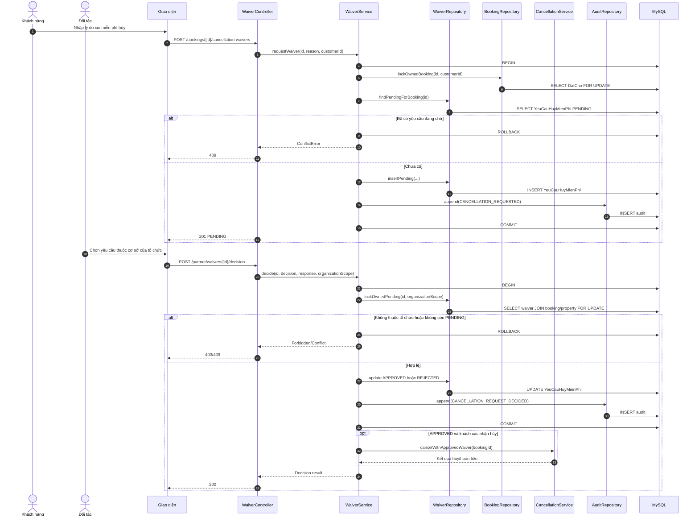
```mermaid
sequenceDiagram
    autonumber
    actor G as Khách hàng
    actor P as Đối tác
    participant UI as Giao diện
    participant C as WaiverController
    participant S as WaiverService
    participant WR as WaiverRepository
    participant BR as BookingRepository
    participant CS as CancellationService
    participant AUD as AuditRepository
    participant DB as MySQL

    G->>UI: Nhập lý do xin miễn phí hủy
    UI->>C: POST /bookings/{id}/cancellation-waivers
    C->>S: requestWaiver(id, reason, customerId)
    S->>DB: BEGIN
    S->>BR: lockOwnedBooking(id, customerId)
    BR->>DB: SELECT DatCho FOR UPDATE
    S->>WR: findPendingForBooking(id)
    WR->>DB: SELECT YeuCauHuyMienPhi PENDING
    alt Đã có yêu cầu đang chờ
        S->>DB: ROLLBACK
        S-->>C: ConflictError
        C-->>UI: 409
    else Chưa có
        S->>WR: insertPending(...)
        WR->>DB: INSERT YeuCauHuyMienPhi
        S->>AUD: append(CANCELLATION_REQUESTED)
        AUD->>DB: INSERT audit
        S->>DB: COMMIT
        C-->>UI: 201 PENDING
    end

    P->>UI: Chọn yêu cầu thuộc cơ sở của tổ chức
    UI->>C: POST /partner/waivers/{id}/decision
    C->>S: decide(id, decision, response, organizationScope)
    S->>DB: BEGIN
    S->>WR: lockOwnedPending(id, organizationScope)
    WR->>DB: SELECT waiver JOIN booking/property FOR UPDATE
    alt Không thuộc tổ chức hoặc không còn PENDING
        S->>DB: ROLLBACK
        S-->>C: Forbidden/Conflict
        C-->>UI: 403/409
    else Hợp lệ
        S->>WR: update APPROVED hoặc REJECTED
        WR->>DB: UPDATE YeuCauHuyMienPhi
        S->>AUD: append(CANCELLATION_REQUEST_DECIDED)
        AUD->>DB: INSERT audit
        S->>DB: COMMIT
        opt APPROVED và khách xác nhận hủy
            S->>CS: cancelWithApprovedWaiver(bookingId)
            CS-->>S: Kết quả hủy/hoàn tiền
        end
        S-->>C: Decision result
        C-->>UI: 200
    end
```

Việc duyệt waiver không tự ý hủy booking nếu UX yêu cầu khách xác nhận bước cuối; nếu cấu hình use case duyệt đồng thời là xác nhận hủy thì lời gọi `CancellationService` được thực hiện ngay sau quyết định.

## 11. Sửa thông tin khách lưu trú

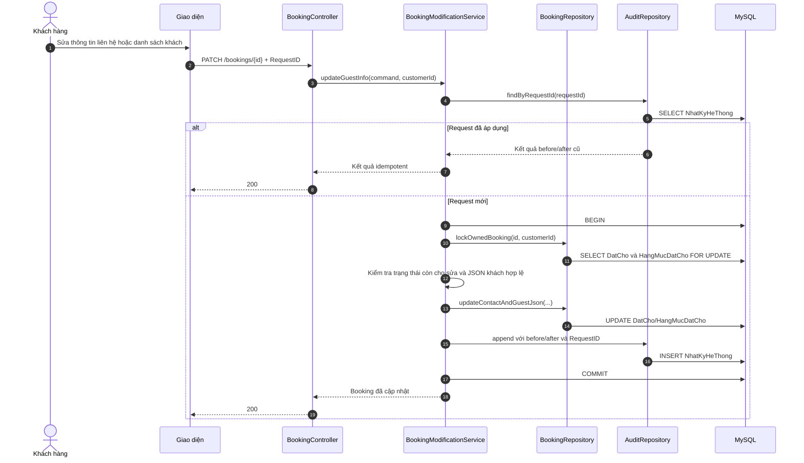
```mermaid
sequenceDiagram
    autonumber
    actor G as Khách hàng
    participant UI as Giao diện
    participant C as BookingController
    participant S as BookingModificationService
    participant BR as BookingRepository
    participant AUD as AuditRepository
    participant DB as MySQL

    G->>UI: Sửa thông tin liên hệ hoặc danh sách khách
    UI->>C: PATCH /bookings/{id} + RequestID
    C->>S: updateGuestInfo(command, customerId)
    S->>AUD: findByRequestId(requestId)
    AUD->>DB: SELECT NhatKyHeThong

    alt Request đã áp dụng
        AUD-->>S: Kết quả before/after cũ
        S-->>C: Kết quả idempotent
        C-->>UI: 200
    else Request mới
        S->>DB: BEGIN
        S->>BR: lockOwnedBooking(id, customerId)
        BR->>DB: SELECT DatCho và HangMucDatCho FOR UPDATE
        S->>S: Kiểm tra trạng thái còn cho sửa và JSON khách hợp lệ
        S->>BR: updateContactAndGuestJson(...)
        BR->>DB: UPDATE DatCho/HangMucDatCho
        S->>AUD: append với before/after và RequestID
        AUD->>DB: INSERT NhatKyHeThong
        S->>DB: COMMIT
        S-->>C: Booking đã cập nhật
        C-->>UI: 200
    end
```

## 12. Đổi ngày an toàn

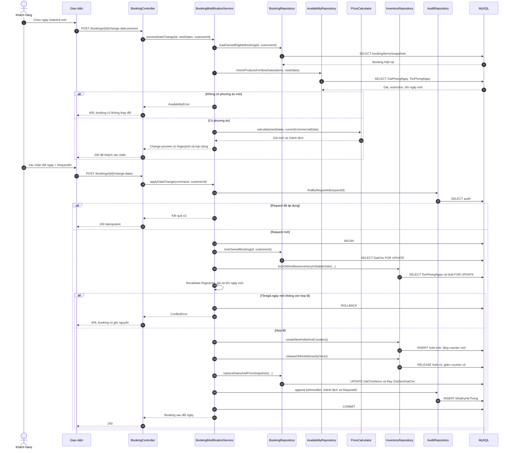
```mermaid
sequenceDiagram
    autonumber
    actor G as Khách hàng
    participant UI as Giao diện
    participant C as BookingController
    participant S as BookingModificationService
    participant BR as BookingRepository
    participant AV as AvailabilityRepository
    participant PC as PriceCalculator
    participant IR as InventoryRepository
    participant AUD as AuditRepository
    participant DB as MySQL

    G->>UI: Chọn ngày nhận/trả mới
    UI->>C: POST /bookings/{id}/change-date-preview
    C->>S: previewDateChange(id, newDates, customerId)
    S->>BR: loadOwnedEligibleBooking(id, customerId)
    BR->>DB: SELECT booking/items/snapshots
    DB-->>BR: Booking hiện tại
    S->>AV: checkProductsForNewDates(items, newDates)
    AV->>DB: SELECT GiaPhongNgay, TonPhongNgay
    DB-->>AV: Giá, restriction, tồn ngày mới
    alt Không có phương án mới
        S-->>C: AvailabilityError
        C-->>UI: 409, booking cũ không thay đổi
    else Có phương án
        S->>PC: calculate(newDates, currentCommercialData)
        PC-->>S: Giá mới và chênh lệch
        S-->>C: Change preview có fingerprint và hạn dùng
        C-->>UI: 200 để khách xác nhận
    end

    G->>UI: Xác nhận đổi ngày + RequestID
    UI->>C: POST /bookings/{id}/change-dates
    C->>S: applyDateChange(command, customerId)
    S->>AUD: findByRequestId(requestId)
    AUD->>DB: SELECT audit
    alt Request đã áp dụng
        S-->>C: Kết quả cũ
        C-->>UI: 200 idempotent
    else Request mới
        S->>DB: BEGIN
        S->>BR: lockOwnedBooking(id, customerId)
        BR->>DB: SELECT DatCho FOR UPDATE
        S->>IR: lockOldAndNewInventoryInStableOrder(...)
        IR->>DB: SELECT TonPhongNgay và hold FOR UPDATE
        S->>S: Revalidate fingerprint, giá và tồn ngày mới
        alt Tồn/giá ngày mới không còn hợp lệ
            S->>DB: ROLLBACK
            S-->>C: ConflictError
            C-->>UI: 409, booking cũ giữ nguyên
        else Hợp lệ
            S->>IR: createNewHoldsAndCounters()
            IR->>DB: INSERT hold mới, tăng counter mới
            S->>IR: releaseOldHoldsExactlyOnce()
            IR->>DB: RELEASE hold cũ, giảm counter cũ
            S->>BR: replaceDatesAndPriceSnapshots(...)
            BR->>DB: UPDATE DatCho/items và thay GiaDemDatCho
            S->>AUD: append before/after, chênh lệch và RequestID
            AUD->>DB: INSERT NhatKyHeThong
            S->>DB: COMMIT
            S-->>C: Booking sau đổi ngày
            C-->>UI: 200
        end
    end
```

Mọi thay đổi ngày nằm trong một transaction. Không release booking cũ trước khi đã khóa và xác nhận có thể cấp tồn mới.

## 13. No-show

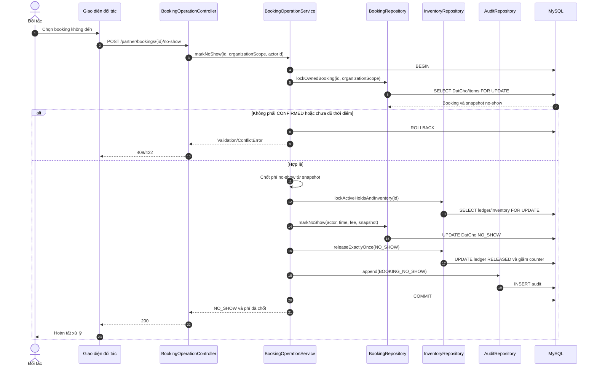
```mermaid
sequenceDiagram
    autonumber
    actor P as Đối tác
    participant UI as Giao diện đối tác
    participant C as BookingOperationController
    participant S as BookingOperationService
    participant BR as BookingRepository
    participant IR as InventoryRepository
    participant AUD as AuditRepository
    participant DB as MySQL

    P->>UI: Chọn booking không đến
    UI->>C: POST /partner/bookings/{id}/no-show
    C->>S: markNoShow(id, organizationScope, actorId)
    S->>DB: BEGIN
    S->>BR: lockOwnedBooking(id, organizationScope)
    BR->>DB: SELECT DatCho/items FOR UPDATE
    DB-->>BR: Booking và snapshot no-show

    alt Không phải CONFIRMED hoặc chưa đủ thời điểm
        S->>DB: ROLLBACK
        S-->>C: Validation/ConflictError
        C-->>UI: 409/422
    else Hợp lệ
        S->>S: Chốt phí no-show từ snapshot
        S->>IR: lockActiveHoldsAndInventory(id)
        IR->>DB: SELECT ledger/inventory FOR UPDATE
        S->>BR: markNoShow(actor, time, fee, snapshot)
        BR->>DB: UPDATE DatCho NO_SHOW
        S->>IR: releaseExactlyOnce(NO_SHOW)
        IR->>DB: UPDATE ledger RELEASED và giảm counter
        S->>AUD: append(BOOKING_NO_SHOW)
        AUD->>DB: INSERT audit
        S->>DB: COMMIT
        S-->>C: NO_SHOW và phí đã chốt
        C-->>UI: 200
        UI-->>P: Hoàn tất xử lý
    end
```

Sau `COMMIT`, booking `NO_SHOW` không còn ledger `ACTIVE`, kể cả khi phí no-show chưa được thu ngoài nền tảng.

## 14. Hoàn tất lưu trú và hết hạn thanh toán

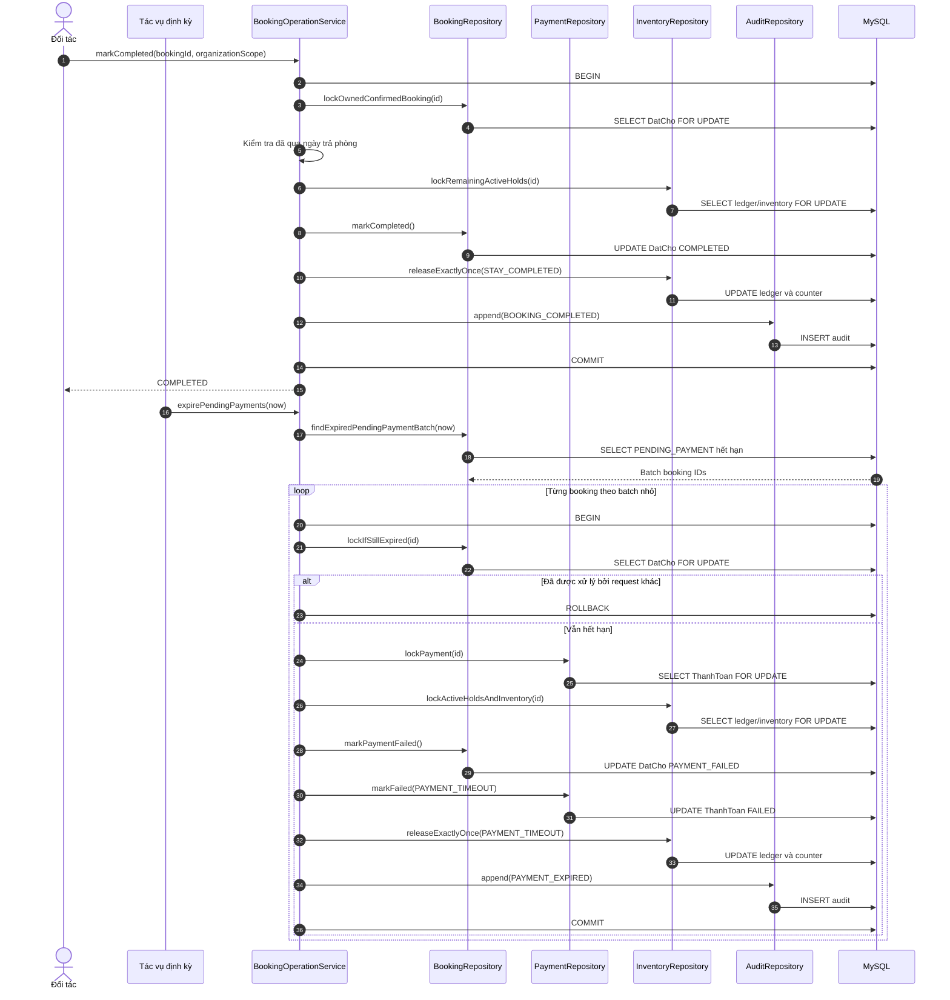
```mermaid
sequenceDiagram
    autonumber
    actor P as Đối tác
    participant JOB as Tác vụ định kỳ
    participant S as BookingOperationService
    participant BR as BookingRepository
    participant PR as PaymentRepository
    participant IR as InventoryRepository
    participant AUD as AuditRepository
    participant DB as MySQL

    P->>S: markCompleted(bookingId, organizationScope)
    S->>DB: BEGIN
    S->>BR: lockOwnedConfirmedBooking(id)
    BR->>DB: SELECT DatCho FOR UPDATE
    S->>S: Kiểm tra đã qua ngày trả phòng
    S->>IR: lockRemainingActiveHolds(id)
    IR->>DB: SELECT ledger/inventory FOR UPDATE
    S->>BR: markCompleted()
    BR->>DB: UPDATE DatCho COMPLETED
    S->>IR: releaseExactlyOnce(STAY_COMPLETED)
    IR->>DB: UPDATE ledger và counter
    S->>AUD: append(BOOKING_COMPLETED)
    AUD->>DB: INSERT audit
    S->>DB: COMMIT
    S-->>P: COMPLETED

    JOB->>S: expirePendingPayments(now)
    S->>BR: findExpiredPendingPaymentBatch(now)
    BR->>DB: SELECT PENDING_PAYMENT hết hạn
    DB-->>BR: Batch booking IDs

    loop Từng booking theo batch nhỏ
        S->>DB: BEGIN
        S->>BR: lockIfStillExpired(id)
        BR->>DB: SELECT DatCho FOR UPDATE
        alt Đã được xử lý bởi request khác
            S->>DB: ROLLBACK
        else Vẫn hết hạn
            S->>PR: lockPayment(id)
            PR->>DB: SELECT ThanhToan FOR UPDATE
            S->>IR: lockActiveHoldsAndInventory(id)
            IR->>DB: SELECT ledger/inventory FOR UPDATE
            S->>BR: markPaymentFailed()
            BR->>DB: UPDATE DatCho PAYMENT_FAILED
            S->>PR: markFailed(PAYMENT_TIMEOUT)
            PR->>DB: UPDATE ThanhToan FAILED
            S->>IR: releaseExactlyOnce(PAYMENT_TIMEOUT)
            IR->>DB: UPDATE ledger và counter
            S->>AUD: append(PAYMENT_EXPIRED)
            AUD->>DB: INSERT audit
            S->>DB: COMMIT
        end
    end
```

Tác vụ hết hạn có thể được gọi bằng cron PHP/MySQL event thủ công trong môi trường phát triển; MVP không cần queue riêng.

## 15. Tạo và kiểm duyệt đánh giá

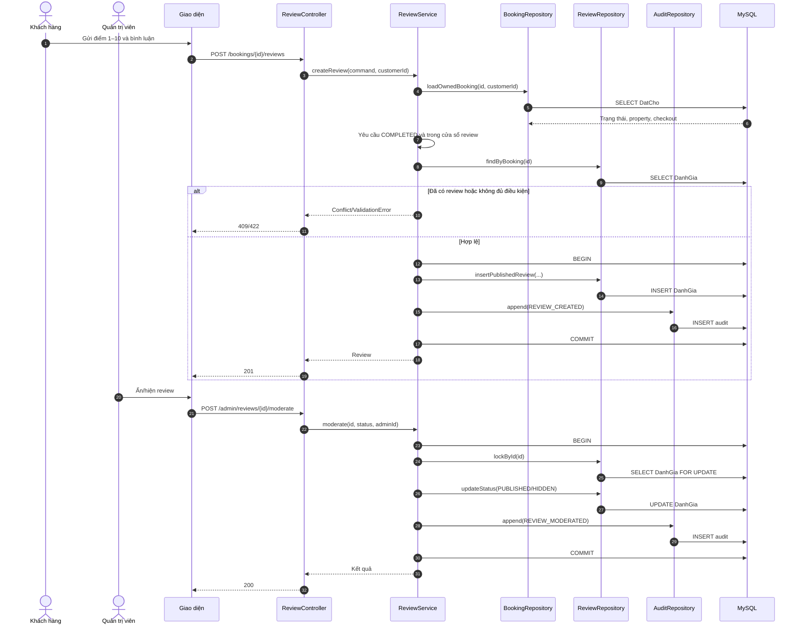
```mermaid
sequenceDiagram
    autonumber
    actor G as Khách hàng
    actor A as Quản trị viên
    participant UI as Giao diện
    participant C as ReviewController
    participant S as ReviewService
    participant BR as BookingRepository
    participant RR as ReviewRepository
    participant AUD as AuditRepository
    participant DB as MySQL

    G->>UI: Gửi điểm 1–10 và bình luận
    UI->>C: POST /bookings/{id}/reviews
    C->>S: createReview(command, customerId)
    S->>BR: loadOwnedBooking(id, customerId)
    BR->>DB: SELECT DatCho
    DB-->>BR: Trạng thái, property, checkout
    S->>S: Yêu cầu COMPLETED và trong cửa sổ review
    S->>RR: findByBooking(id)
    RR->>DB: SELECT DanhGia

    alt Đã có review hoặc không đủ điều kiện
        S-->>C: Conflict/ValidationError
        C-->>UI: 409/422
    else Hợp lệ
        S->>DB: BEGIN
        S->>RR: insertPublishedReview(...)
        RR->>DB: INSERT DanhGia
        S->>AUD: append(REVIEW_CREATED)
        AUD->>DB: INSERT audit
        S->>DB: COMMIT
        S-->>C: Review
        C-->>UI: 201
    end

    A->>UI: Ẩn/hiện review
    UI->>C: POST /admin/reviews/{id}/moderate
    C->>S: moderate(id, status, adminId)
    S->>DB: BEGIN
    S->>RR: lockById(id)
    RR->>DB: SELECT DanhGia FOR UPDATE
    S->>RR: updateStatus(PUBLISHED/HIDDEN)
    RR->>DB: UPDATE DanhGia
    S->>AUD: append(REVIEW_MODERATED)
    AUD->>DB: INSERT audit
    S->>DB: COMMIT
    S-->>C: Kết quả
    C-->>UI: 200
```

## 16. Báo cáo và tra cứu audit

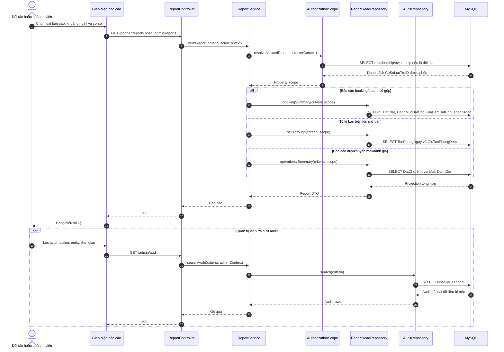
```mermaid
sequenceDiagram
    autonumber
    actor U as Đối tác hoặc quản trị viên
    participant UI as Giao diện báo cáo
    participant C as ReportController
    participant S as ReportService
    participant Scope as AuthorizationScope
    participant RR as ReportReadRepository
    participant AR as AuditRepository
    participant DB as MySQL

    U->>UI: Chọn loại báo cáo, khoảng ngày và cơ sở
    UI->>C: GET /partner/reports hoặc /admin/reports
    C->>S: buildReport(criteria, actorContext)
    S->>Scope: resolveAllowedProperties(actorContext)
    Scope->>DB: SELECT membership/ownership nếu là đối tác
    DB-->>Scope: Danh sách CoSoLuuTruID được phép
    Scope-->>S: Property scope

    alt Báo cáo booking/doanh số gộp
        S->>RR: bookingSummary(criteria, scope)
        RR->>DB: SELECT DatCho, HangMucDatCho, GiaDemDatCho, ThanhToan
    else Tỷ lệ bán trên tồn mở bán
        S->>RR: sellThrough(criteria, scope)
        RR->>DB: SELECT TonPhongNgay và GiuTonPhongDem
    else Báo cáo hủy/khuyến mãi/đánh giá
        S->>RR: operationalSummary(criteria, scope)
        RR->>DB: SELECT DatCho, KhuyenMai, DanhGia
    end
    DB-->>RR: Projection tổng hợp
    RR-->>S: Report DTO
    S-->>C: Báo cáo
    C-->>UI: 200
    UI-->>U: Bảng/biểu số liệu

    opt Quản trị viên tra cứu audit
        U->>UI: Lọc actor, action, entity, thời gian
        UI->>C: GET /admin/audit
        C->>S: searchAudit(criteria, adminContext)
        S->>AR: search(criteria)
        AR->>DB: SELECT NhatKyHeThong
        DB-->>AR: Audit đã loại dữ liệu bí mật
        AR-->>S: Audit rows
        S-->>C: Kết quả
        C-->>UI: 200
    end
```

Đối tác luôn bị giới hạn theo organization scope. Chỉ quản trị viên được đọc audit toàn hệ thống. Báo cáo tồn mang nghĩa “tỷ lệ bán trên tồn mở bán”, không phải công suất vật lý toàn khách sạn.

## 17. Ma trận use case và sequence diagram

| Use case | Mục |
|---|---:|
| Đăng nhập và phân quyền tổ chức | 2 |
| Tạo, đối chiếu và duyệt cơ sở | 3 |
| Quản lý loại phòng, sản phẩm, giá, tồn | 4 |
| Search và availability | 5 |
| Preview không giữ tồn | 6 |
| Booking trả tại cơ sở | 7 |
| Booking/thanh toán online, retry và lỗi | 8 |
| Hủy trực tiếp và hoàn tiền | 9 |
| Yêu cầu miễn phí hủy | 10 |
| Sửa thông tin khách | 11 |
| Đổi ngày và rollback an toàn | 12 |
| No-show và release inventory | 13 |
| Hoàn tất và hết hạn thanh toán | 14 |
| Đánh giá và kiểm duyệt | 15 |
| Báo cáo, organization scope và audit | 16 |

## 18. Các bất biến thể hiện trong sequence

1. Preview không ghi `TonPhongNgay` hoặc `GiuTonPhongDem`.
2. Booking lock preview trước, sau đó lock tồn theo thứ tự ổn định.
3. Chỉ `PENDING_PAYMENT` và `CONFIRMED` được có ledger `ACTIVE`.
4. Counter `SoLuongDaGiu` và ledger được cập nhật trong cùng transaction.
5. Provider thanh toán/hoàn tiền không được gọi khi đang giữ khóa inventory.
6. `ClientRequestID`, payment idempotency key, cancellation key và audit `RequestID` chặn retry tạo bản ghi trùng.
7. Hủy/no-show/completion/payment timeout release tồn đúng một lần.
8. `NO_SHOW` chốt phí nhưng không tiếp tục giữ inventory.
9. Đổi ngày thất bại phải rollback, giữ nguyên booking cũ và hold cũ.
10. Giá/policy lịch sử đọc từ snapshot booking, không tính lại bằng cấu hình hiện tại.
11. `PAY_AT_PROPERTY` tạo payment `NOT_TRACKED` và không theo dõi tiền mặt thực tế.
12. Mọi thao tác đối tác đều kiểm tra `ToChucDoiTacID` từ session/membership.
